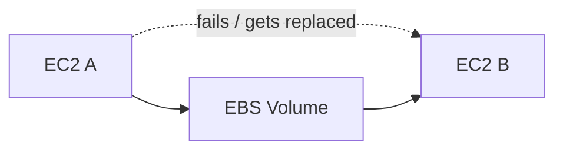
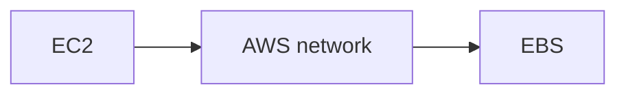
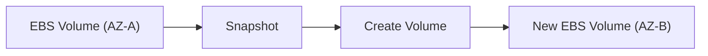
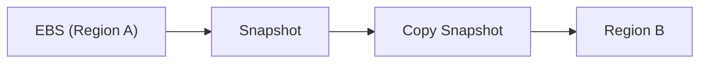
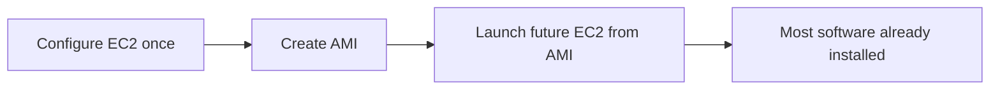
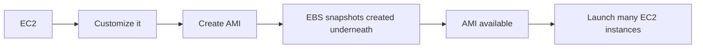
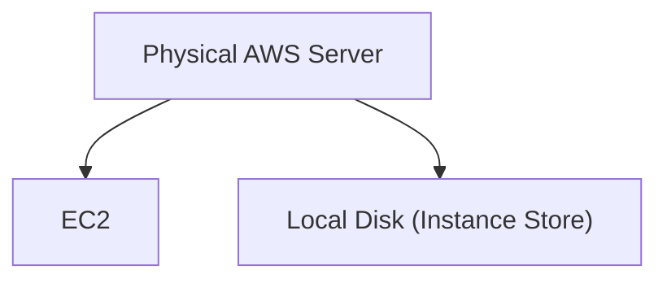
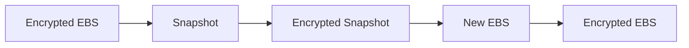
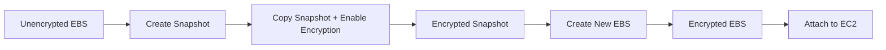
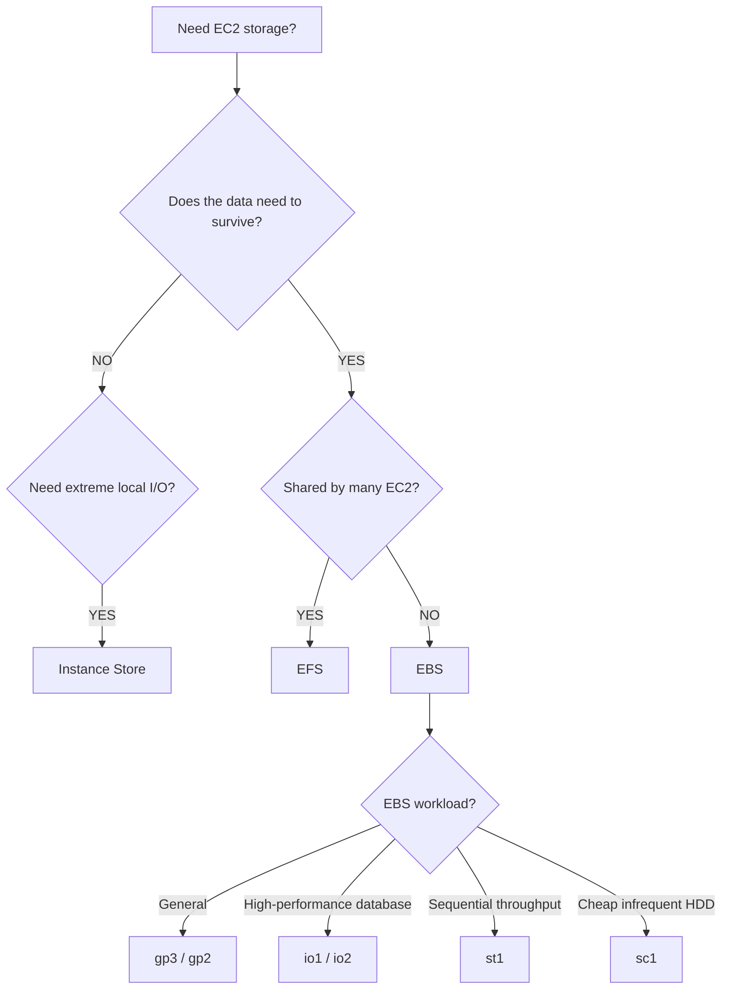

# EBS

This chapter becomes much easier once you separate EC2's three storage choices before getting into details. Use this as your revision sheet for EBS volume types, snapshots, encryption, Multi-Attach, and the EBS vs Instance Store vs EFS decision framework.

## EC2 Storage — Big Picture

- **EBS**
    - Persistent network BLOCK storage
    - Usually one EC2, one AZ
- **EFS**
    - Shared network FILE system
    - Many EC2, multiple AZs — see [EFS & FSx](../storage/storage-efs-fsx.md)
- **Instance Store**
    - Local physical storage
    - Extremely fast but EPHEMERAL

**The biggest exam question is usually: do I need persistent block storage, shared files, or extremely fast temporary storage?**

This page focuses on EBS itself, plus the comparison points against Instance Store and EFS that the exam loves to test. For compute/instance fundamentals see [EC2](ec2.md); for the shared-filesystem side see [EFS & FSx](../storage/storage-efs-fsx.md).

## What Is EBS

EBS is **persistent block storage attached to EC2 over the network.** Think of it as a network-attached hard drive / network USB stick.


Because it's separate from the EC2 compute host, the data can survive the instance being stopped or replaced.

## Why EBS Exists

Imagine your application stores `/database`, `/uploads`, `/configuration`. If the EC2 instance disappears, you don't necessarily want all that data to disappear too.



Your data can still exist even after EC2 A fails or gets replaced.

!!! tip "Memory"
    EC2 = compute. EBS = persistent disk.

## EBS Is Network Storage

EBS is not physically inside the EC2 machine — traffic goes over the network:



Therefore EBS gives you persistence, flexibility, and detachable storage — but it is different from local physical disk. That distinction becomes important when comparing against [Instance Store](#ec2-instance-store) below.

## EBS Is AZ-Bound

Very important: **an EBS volume belongs to one Availability Zone.**

Example: in `us-east-1a`, `EC2 A ─── EBS A` works fine. But an EC2 instance in `us-east-1b` cannot directly attach an EBS volume that lives in `us-east-1a`. You cannot directly attach an EBS volume from another AZ.

!!! warning "Exam Trigger"
    "Attach existing EBS volume in AZ-A to instance in AZ-B." Directly? No. Instead:

    ```mermaid
    flowchart LR
        A[EBS in AZ-A] --> B[Snapshot] --> C[Create new EBS volume in AZ-B]
    ```

## EBS Attachment

Normal EBS model: one EC2 instance can have multiple EBS volumes attached (`EC2 A` → `EBS 1`, `EBS 2`, ...). An EBS volume can also exist unattached — state "Available", no EC2 attached — and you can attach it later.

### One EBS → One EC2, Normally

Normal architecture: `EC2 A ─── EBS A`, `EC2 B ─── EBS B`. A single EBS volume shared directly between `EC2 A` and `EC2 B` at the same time is **not** the standard attachment model — that's an important exception covered later under [EBS Multi-Attach](#ebs-multi-attach).

## EBS Capacity Is Provisioned

With EBS you choose volume size, volume type, IOPS, and throughput. Example: `100 GiB gp3`, `3,000 IOPS`, `125 MB/s`. You provision storage capacity rather than simply letting it expand indefinitely on its own — capacity can later be increased.

## Delete on Termination

Very important EC2/EBS behavior for when an EC2 instance is terminated.

#### Root EBS Volume

Default behavior: `DeleteOnTermination = YES`. So terminating the EC2 instance deletes the root EBS volume.

#### Additional EBS Volumes

Typical default: `DeleteOnTermination = NO`. So terminating the EC2 instance leaves additional EBS volumes intact. You can modify this behavior for either the root or additional volumes.

**Exam scenario:** EC2 may be terminated, but its root volume must survive → set `DeleteOnTermination = false`.

!!! tip "Memory"
    Root EBS — default → deleted with EC2. Extra EBS — default → retained.

## EBS Snapshots

A snapshot is a point-in-time backup of an EBS volume (`EBS Volume` → snapshot → `EBS Snapshot`). Snapshots are extremely important because they let you:

- back up EBS
- recreate EBS
- move data between AZs
- copy backups to another Region
- support disaster recovery
- create AMIs

### Moving EBS Across AZs

Remember: EBS itself is AZ-bound, but a snapshot lets you recreate it somewhere else.



!!! warning "Exam Trigger"
    "Move an EBS volume from one AZ to another." → Snapshot → create new volume in target AZ.

### Cross-Region EBS Backup

For [disaster recovery](../resilience/disaster-recovery.md):



!!! warning "Trigger"
    "Protect EBS data against an entire Region failure." → Copy snapshot to another Region.

### Snapshot Archive

For snapshots you rarely need: `Standard Snapshot` → `Snapshot Archive`.

- Benefit: much cheaper storage
- Trade-off: slow restore — roughly **24–72 hours**

!!! warning "Trigger"
    "Very old EBS backups, rarely restored, minimize storage cost." → Snapshot Archive.

### EBS Snapshot Recycle Bin

Protects against accidental deletion. Normally: `Delete Snapshot` → gone. With Recycle Bin: `Delete Snapshot` → `Recycle Bin` → `Recover`. Retention can be configured.

!!! warning "Exam Trigger"
    "Recover accidentally deleted EBS snapshots." → Recycle Bin.

### Fast Snapshot Restore (FSR)

Normally, volumes restored from snapshots can experience initialization behavior on first access. Fast Snapshot Restore prepares the snapshot so restored volumes provide full performance immediately.


Trade-off: costs extra.

!!! warning "Trigger"
    "Large snapshot must produce EBS volumes that perform immediately without first-access latency." → Fast Snapshot Restore.

## AMI and EBS

**AMI = Amazon Machine Image = reusable [EC2](ec2.md) template.** AMI is related to EBS storage because an AMI packages the state used to launch EC2 instances, and creating one relies on EBS snapshots underneath. An AMI can contain: operating system, installed software, configuration, monitoring agents, application prerequisites.

### Why Create Your Own AMI?

Suppose every new server needs: boot → install Apache → install security agent → install dependencies → configure application → ready. That can take several minutes per server. Instead:



Result: much faster provisioning.

### AMI Creation Flow



The course recommends stopping the instance before creating the AMI for data consistency.

### AMIs Are Regional


!!! warning "Trigger"
    "Launch identical customized EC2 servers in another Region." → Copy the AMI.

#### AWS/Public AMI

Example: Amazon Linux. Provided by AWS.

#### Custom AMI

Created and maintained by you. Good for preconfigured applications, faster launches, standard company server images.

#### Marketplace AMI

Created by vendors/third parties. May include commercial software, appliances, preconfigured solutions.

### EBS vs AMI

Don't confuse them:

- **EBS** = actual persistent BLOCK storage
- **AMI** = template used to LAUNCH EC2

An AMI may depend on EBS snapshots underneath.

## EC2 Instance Store

The opposite of EBS. Instance Store is **physical/local storage attached to the underlying EC2 host.**



Because the disk is physically local → extremely high performance.

### Instance Store Advantage

The main advantage is **very high I/O performance** — good when you need extremely fast reads, writes, temporary processing, or scratch space.

### Instance Store Disadvantage

It is **ephemeral** — the data is not meant to be durable. If the instance is stopped/terminated, or the underlying host is lost, Instance Store data is **lost**. Therefore don't store the only copy of important data there.

### Instance Store Use Cases

**Good:** cache, buffer, temporary files, scratch data, temporary processing, replicated data.

**Bad:** critical database with no replication ❌, only copy of business data ❌, long-term backup ❌.

!!! warning "Exam Trigger"
    "Need extremely high disk I/O and data can be recreated." → Instance Store.

## EBS vs Instance Store

| Feature | EBS | Instance Store |
|---|---|---|
| Location | Network attached | Physical/local |
| Persistent | ✅ | ❌ |
| Survives normal stop | ✅ | ❌ |
| Detachable | ✅ | ❌ |
| Very high local I/O | Good | Excellent |
| Best for durable data | ✅ | ❌ |
| Temporary cache/scratch | Possible | Excellent |

!!! tip "Memory"
    EBS = durable network disk. Instance Store = ultra-fast temporary local disk.

## EBS Volume Types

The course groups EBS into four categories:

- **General Purpose SSD**
    - gp2
    - gp3
- **Provisioned IOPS SSD**
    - io1
    - io2 / Block Express
- **Throughput HDD**
    - st1
- **Cold HDD**
    - sc1

For SAA, don't memorize every numeric limit — understand what workload each is designed for.

### gp2 / gp3 — General Purpose SSD

Use for most normal workloads: boot volumes, application servers, dev/test, virtual desktops, moderate database workloads. Think: good performance + reasonable cost.

#### gp3 — Newer General Purpose Model

Key concept: **size, IOPS, and throughput can be adjusted more independently.** Example: storage size = 100 GiB, IOPS increased separately, throughput increased separately. This makes gp3 flexible and cost efficient.

#### gp2 — Performance Tied to Size

Key distinction: for gp2, volume size ↑ → IOPS ↑. So if you need more gp2 performance, increasing storage size can increase IOPS.

!!! tip "Most Important Comparison"
    gp2 = size and performance linked. gp3 = size and performance more independent.

!!! warning "SAA Trigger"
    "Increase IOPS without increasing disk size." → gp3.

### Provisioned IOPS — io1 / io2

For **mission-critical workloads requiring consistently high storage IOPS and low latency.** Typical exam example: databases — especially high-performance databases, latency-sensitive databases, workloads requiring consistent IOPS, and workloads exceeding normal general-purpose SSD performance.

#### io1 / io2 Main Idea

You explicitly provision IOPS: storage size + provisioned IOPS. Performance isn't simply tied to disk size the way gp2 works.

!!! warning "Trigger"
    "Critical database requires predictable sustained high IOPS." → Provisioned IOPS SSD — io1/io2.

#### io2 Block Express

Extremely high IOPS, very low latency, large capacity, mission-critical workloads. Don't spend much study time memorizing exact maximum numbers.

!!! tip "Memory"
    io2 / Block Express = highest-end EBS SSD performance.

### st1 — Throughput Optimized HDD

Designed for large, sequential, throughput-heavy workloads: big data, log processing, data warehouses. Think: need lots of MB/s, not massive random IOPS → st1.

!!! info "Important"
    Cannot be used as a boot/root volume.

### sc1 — Cold HDD

Lowest-cost HDD option in this group. For infrequently accessed data, lowest-cost disk storage, colder workloads. Think: cheap + rare access → sc1. Also not a boot volume.

### SSD vs HDD — What Is the Question Really Asking?

#### IOPS

Think: lots of small random read/write operations. Common example: Database → SSD / Provisioned IOPS.

#### Throughput

Think: large amounts of sequential data transferred. Common examples: Big Data, Logs, Data Warehouse → `st1`.

!!! tip "Memory"
    Database + lots of random I/O → IOPS. Big sequential files → Throughput.

### EBS Volume Exam Decision

| Requirement | Choice |
|---|---|
| Normal workload | gp3 / gp2 |
| High-performance critical DB | io1 / io2 |
| Large sequential throughput | st1 |
| Very cheap infrequent HDD | sc1 |

## EBS Multi-Attach

Normally: one EBS → one EC2. But Multi-Attach allows the **same io1/io2 EBS volume attached to several EC2 instances simultaneously** (e.g. `EC2 A`, `EC2 B`, `EC2 C`).

### Multi-Attach Requirements

- **only io1/io2**
- **instances must be in the same AZ**
- all attached instances can read/write
- **up to 16 EC2 instances**
- application/file system must understand concurrent access

#### Why Cluster-Aware File System?

Imagine `EC2 A` writes a block and `EC2 B` writes the same block. If ordinary filesystem coordination isn't designed for this → corruption. Therefore, use a cluster-aware application/file system.

### Multi-Attach Use Case

Examples: clustered applications, applications needing shared block storage, higher-availability architectures requiring concurrent block-device access.

!!! warning "Trigger"
    "Multiple EC2 instances in the same AZ must concurrently access the SAME block volume." → EBS Multi-Attach using io1/io2.

## EBS Encryption

When an EBS volume is encrypted, this covers:

- volume data at rest ✅
- data between EC2 and EBS ✅
- snapshots ✅
- volumes created from encrypted snapshots ✅

Encryption/decryption is handled transparently, using [AWS KMS](../security/security.md).

### Encryption Propagation



!!! info "Important"
    An encrypted snapshot creates encrypted volumes.

### Encrypting an Existing Unencrypted EBS Volume

Classic exam workflow:



!!! tip "Memory"
    Snapshot → Copy + Encrypt → Restore.

!!! warning "SAA Trigger"
    "Existing EBS volume is unencrypted. Encrypt it." → snapshot-based conversion workflow.

## EBS vs EFS — Most Important Comparison

[EFS](../storage/storage-efs-fsx.md) is a managed shared network file system (NFS), unlike EBS's block-device model — see the [EFS & FSx](../storage/storage-efs-fsx.md) page for the full EFS deep dive. The comparison itself is essential EBS exam material:

| Feature | EBS | EFS |
|---|---|---|
| Storage Type | Block | File |
| Connection | EC2 disk | Shared NFS |
| Typical Attachment | One EC2 | Many EC2 |
| AZ | One AZ | Multi-AZ possible |
| Capacity | Provisioned | Automatic |
| Linux | ✅ | ✅ |
| Windows | EBS usable | Course: EFS Linux only |
| Shared files | Not normal design | ✅ |
| Cost | Usually cheaper | Usually higher |
| Use case | Boot/database/application disk | Shared content |

This is the table to memorize — EBS vs EFS vs Instance Store, side by side:

| Requirement | Storage |
|---|---|
| Persistent disk for one EC2 | EBS |
| Boot/root disk | EBS |
| Database block storage | EBS |
| Shared filesystem across EC2 | EFS |
| Multiple AZs sharing files | EFS |
| Linux NFS shared storage | EFS |
| Extremely fast temporary disk | Instance Store |
| Cache/scratch/buffer | Instance Store |

### Think in Two Questions

When an exam question mentions storage, ask:

**Question 1 — BLOCK or FILE?** Application sees a disk/device → BLOCK → EBS. Application sees folders/files shared by many servers → FILE → EFS.

**Question 2 — Persistent or Temporary?** Must survive instance loss → EBS / EFS. Can be recreated + needs extreme local speed → Instance Store.

This alone solves a huge number of questions.

## EBS Snapshot vs AMI

Another common confusion.

### Snapshot

Backup of an EBS Volume. Use for: backup, restore, copy volume across AZ, disaster recovery.

### AMI

Template for an EC2 Instance. Use for: launch identical EC2, preinstall software, faster deployment, standardize machines.

!!! tip "Memory"
    Snapshot = DISK backup. AMI = SERVER template.

## Highest-Value EBS Exam Traps

!!! danger "Trap 1 — EBS Across AZ"
    EC2 in AZ-A and EC2 in AZ-B both need the same EBS volume? Normal EBS ❌ — even Multi-Attach is still within the same AZ. Need a shared cross-AZ filesystem → [EFS](../storage/storage-efs-fsx.md).

!!! danger "Trap 2 — Multi-Attach Is Not an EFS Replacement"
    Multi-Attach: io1/io2, same AZ, shared BLOCK device, special clustered application. EFS: multi-AZ, shared FILE system, many Linux clients. They solve different problems.

!!! danger "Trap 3 — Instance Store for a Durable Database"
    ❌. Hardware loss / instance loss can destroy local data. Only use Instance Store if the application replicates externally, the data can be regenerated, or the storage is genuinely temporary.

!!! danger "Trap 4 — Bigger gp3 Needed for More IOPS"
    Not necessarily. gp2: size ↔ IOPS linked. gp3: IOPS/throughput can be changed independently.

!!! danger "Trap 5 — st1 for a High-IOPS Database"
    Usually wrong. st1 is HDD optimized for throughput-heavy sequential workloads. A database asking for high IOPS/low latency → io1/io2.

!!! danger "Trap 6 — EFS Is a Block Device"
    ❌. EFS = File Storage. EBS = Block Storage.

!!! danger "Trap 7 — EFS Needs Provisioned Capacity"
    No — EFS automatically grows and you pay for what you use.

!!! danger "Trap 8 — EFS Doesn't Need Security Groups"
    It does. Mount targets need network access: NFS uses TCP 2049. Clean architecture: EFS-SG inbound 2049, source = EC2/App Security Group.

!!! danger "Trap 9 — Copy EBS Directly to Another AZ"
    The pattern is EBS → Snapshot → new EBS in target AZ. Don't try to directly attach the old volume across AZs.

!!! danger "Trap 10 — Deleting EC2 Always Deletes Every EBS Volume"
    No. Depends on `DeleteOnTermination`. Root volume default → delete. Other attached EBS → commonly retained. Both can be customized.

!!! danger "Trap 11 — EBS Encryption Must Be Done by the Application"
    No — AWS handles encryption/decryption transparently, using KMS.

!!! danger "Trap 12 — Existing Unencrypted Volume Can Simply Be Flipped to Encrypted"
    The workflow is Snapshot → Copy/Encrypt → create encrypted volume. Remember that pattern.

## SAA Storage Decision Tree



## Complete Revision Memory Map

- **EC2 Storage**
    - **EBS**
        - Network BLOCK storage
        - Persistent
        - AZ-bound
        - Usually one EC2
        - DeleteOnTermination
            - root → usually YES
            - extra → usually NO
        - Snapshots
            - Backup
            - Restore in other AZ
            - Copy to other Region
            - Archive
            - Recycle Bin
            - Fast Snapshot Restore
        - Volume Types
            - gp2 → general, size/IOPS linked
            - gp3 → general, independent tuning
            - io1/io2 → high IOPS DB
            - st1 → throughput HDD
            - sc1 → cold HDD
        - Multi-Attach
            - io1/io2
            - same AZ
            - clustered filesystem/app
        - Encryption
            - KMS
    - **AMI**
        - EC2 template
        - Preinstalled software
        - Faster launch
        - Uses EBS snapshots
    - **Instance Store**
        - Local physical disk
        - Extremely high performance
        - Ephemeral
        - Cache / buffer / scratch
    - **EFS** (see [EFS & FSx](../storage/storage-efs-fsx.md) for the full picture)
        - Managed NFS
        - FILE storage
        - Linux
        - Many EC2
        - Multiple AZ
        - NFS TCP 2049
        - Auto scales capacity
        - Regional / One Zone
        - Standard / IA / Archive
        - Lifecycle Management
        - Throughput: Bursting / Provisioned / Elastic

!!! tip "One-Minute Recall"
    EBS = persistent network BLOCK disk, one AZ. Move EBS across AZ = snapshot → restore. Snapshot = EBS backup. AMI = EC2 template.

    gp2 = size + IOPS linked. gp3 = independently tune IOPS/throughput. io1/io2 = critical high-IOPS DB. st1 = throughput HDD. sc1 = cheapest cold HDD.

    Multi-Attach = io1/io2 = same AZ = multiple EC2. EBS encryption = KMS. Unencrypted → encrypted = snapshot → copy/encrypt → new volume.

    Instance Store = FAST local = TEMPORARY.

    EFS = shared FILE storage = NFS = Linux = many EC2 = multi-AZ = TCP 2049. EFS Regional = production HA. EFS One Zone = cheaper. EFS Lifecycle = Standard → IA → Archive.

    The three lines to lock into memory first: EBS = ONE server-style BLOCK disk, persistent, one AZ. EFS = MANY servers sharing FILES, multi-AZ. Instance Store = VERY FAST but data can disappear. Once those three are clear, almost every SAA storage question becomes a smaller decision instead of a giant storage chapter.
