# EC2

This batch connects several ideas that appear everywhere in AWS architecture — compute, boot/OS, networking, access, placement, and lifecycle. Use this as your revision sheet for EC2 launch choices, purchasing options, placement groups, and networking.

## EC2 — Big Picture

- **Compute**
    - Instance Type
    - Purchasing Option
- **Boot / OS**
    - AMI
    - User Data
- **Network**
    - Private IP
    - Public IP / Elastic IP
    - ENI
    - Security Group
- **Access**
    - SSH / Instance Connect
    - IAM Role
- **Placement**
    - Cluster
    - Spread
    - Partition
- **Lifecycle**
    - Stop
    - Terminate
    - Hibernate

## Billing & AWS Budgets

Low SAA priority, but useful operationally. AWS Billing lets you inspect:

- current/previous bills
- charges by AWS service
- usage
- forecasts
- Free Tier usage
- AWS Budgets

#### AWS Budgets

You can create:

- zero-spend budget
- monthly cost budget
- actual-spend alerts
- forecasted-spend alerts

Example: Monthly Budget = $100 → actual cost reaches 85% → email alert.

!!! info "Important"
    A basic budget alert **warns you; it does not automatically stop EC2 instances.**

## EC2 — Elastic Compute Cloud

EC2 provides virtual servers in AWS. Think: **EC2 = rent compute instead of buying physical servers.**

When launching EC2, you choose:

- OS / AMI
- CPU
- RAM
- Storage
- Network
- Security Group
- Key Pair / access method
- IAM Role
- User Data

**EC2 is Infrastructure as a Service — IaaS.**

## AMI

**AMI = Amazon Machine Image.** It provides the starting image for the instance, including things such as:

- operating system
- preinstalled software
- configuration

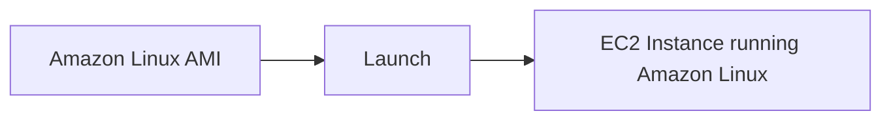

You can use:

- AWS-provided AMIs
- Marketplace AMIs
- your own AMIs

## EC2 User Data

**User Data is used to bootstrap an instance.** Bootstrapping means: automatically run initialization commands when the machine starts for the first time. Common tasks:

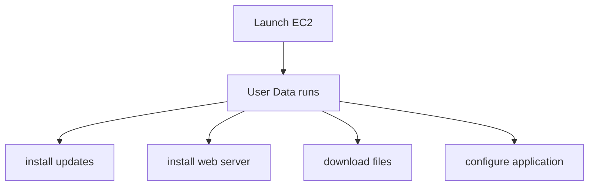

**For normal Linux EC2 behavior, user-data scripts are run on the first boot by default.** They run with elevated/root privileges.

!!! example "Example"
    ```mermaid
    flowchart LR
        A[EC2 launches] --> B[User Data installs Apache] --> C[Creates index.html] --> D[Web server ready automatically]
    ```

!!! warning "Exam Trigger"
    "Automatically configure EC2 when launched." → **EC2 User Data**

## EC2 Lifecycle — Start, Stop, Terminate

### Stop

Instance compute stops. For an [EBS](ebs.md)-backed instance:

- EBS data remains
- instance can be started again
- you stop paying instance compute charges while stopped
- attached storage and other billable resources may still cost money

### Stop → Start

Important networking behavior:

| State | Public IPv4 | Private IPv4 |
|---|---|---|
| Before stop | A | X |
| After stop → start | potentially B (changed) | X (unchanged) |

Normal auto-assigned public IPv4 can change. Primary private IPv4 normally stays.

### Terminate

Terminates the instance permanently. Root EBS volume commonly has `DeleteOnTermination = true`, so it is deleted with the instance. Other volumes may be preserved depending on their configuration.

## EC2 Instance Types

Different instance families are optimized for different workloads. Instance naming example: `m5.2xlarge`

| Part | Meaning |
|---|---|
| `m` | instance family/class |
| `5` | generation |
| `2xlarge` | size |

So: `m5` → fifth generation of M family. `2xlarge` → size within that family. Increasing size generally gives more:

- vCPU
- RAM
- networking capacity

### General Purpose

Balanced: CPU + Memory + Networking. Examples from the course:

- T family
- M family

Use cases:

- web servers
- application servers
- development environments
- code repositories
- mixed workloads

!!! warning "Exam Trigger"
    "Balanced CPU and memory." → **General Purpose**

### Compute Optimized

**Typically associated with C family.** Optimized for CPU-intensive workloads. Examples:

- batch processing
- media transcoding
- high-performance web servers
- HPC
- compute-heavy processing
- gaming servers

!!! warning "Exam Trigger"
    "CPU-intensive." → **Compute Optimized**

### Memory Optimized

Designed for large in-memory datasets. Course examples include:

- R family
- X family
- High Memory instances

Use cases:

- in-memory databases
- large databases
- distributed caches
- real-time big-data processing

!!! warning "Exam Trigger"
    "Needs huge RAM / data must stay in memory." → **Memory Optimized**

### Storage Optimized

Optimized for workloads requiring high-performance local storage access. Use cases:

- high-frequency OLTP
- databases
- NoSQL
- data warehouses
- distributed file systems

#### Easy Decision

| Workload | Choice |
|---|---|
| Balanced workload | General Purpose |
| Heavy CPU | Compute Optimized |
| Heavy RAM | Memory Optimized |
| Heavy local disk I/O | Storage Optimized |

## Security Groups

[Security Group](../networking/vpc.md#security-groups) = virtual firewall associated with AWS network interfaces/resources such as EC2. Controls:

- **Inbound** — Outside → EC2
- **Outbound** — EC2 → Outside

Security Groups contain **ALLOW rules only.** They do not contain explicit deny rules.

### Security Group Defaults

A newly created SG generally starts with:

- **Inbound** → nothing allowed
- **Outbound** → all allowed

#### Stateful

Security Groups are also **stateful**: if a connection is permitted in one direction, its response traffic is automatically permitted.

### Security Group Rule Example

| Type | Protocol | Port | Source |
|---|---|---|---|
| SSH | TCP | 22 | `203.0.113.10/32` |
| HTTP | TCP | 80 | `0.0.0.0/0` |
| HTTPS | TCP | 443 | `0.0.0.0/0` |

- `0.0.0.0/0` means every IPv4 address.
- `203.0.113.10/32` means one specific IPv4 address.

### Security Group Relationships

One SG can protect many instances. One instance can use multiple SGs.

- **SG-Web**
    - EC2 A
    - EC2 B
    - EC2 C
- **EC2 A**
    - SG-Web
    - SG-Admin

Rules from attached SGs effectively combine.

### Referencing Another Security Group

Very important AWS architecture pattern. Instead of allowing `10.0.1.20`, `10.0.1.21`, `10.0.1.22` individually, you can say: **Backend SG → Inbound TCP 80 → Source = ALB-SG**.

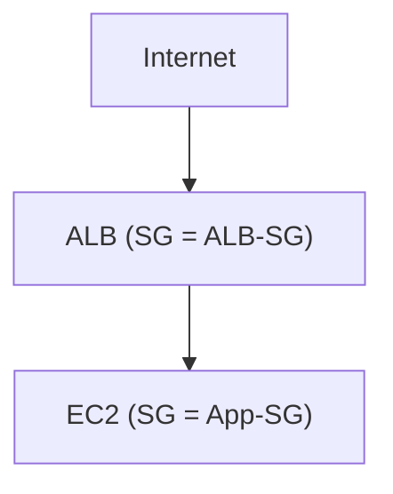

App-SG: allow port 80 from ALB-SG. Now EC2 instances can change IPs without rewriting the rule.

!!! warning "Exam Trigger"
    "Allow backend EC2 traffic only from the [load balancer](load-balancing-asg.md)." → **Reference ALB Security Group as source**

## Ports to Know

| Protocol | Port | Use |
|---|---|---|
| SSH | 22 | Linux remote shell |
| SFTP | 22 | Secure file transfer |
| FTP | 21 | File transfer |
| HTTP | 80 | Web |
| HTTPS | 443 | Secure web |
| RDP | 3389 | Windows remote desktop |

These are worth memorizing.

## Timeout vs Connection Refused

Useful troubleshooting distinction.

#### Timeout

Often means the network path is blocked. Check:

- Security Group
- [NACL](../networking/vpc.md#network-acl-nacl)
- route table
- public/private connectivity
- firewall

**So don't treat every timeout as 100% Security Group.**

#### Connection Refused

Usually means traffic reached the host, but nothing is accepting the connection. Examples:

- service not running
- wrong port
- application misconfiguration

## SSH

SSH provides remote command-line access to Linux instances. Typical path:


Traditional command: `ssh -i key.pem ec2-user@PUBLIC_IP`. Private key permissions may need restriction: `chmod 400 key.pem`.

!!! tip "Memory"
    Low hands-on importance. Know: Linux remote admin → SSH 22

## EC2 Instance Connect

Provides browser-based SSH access. Conceptually:

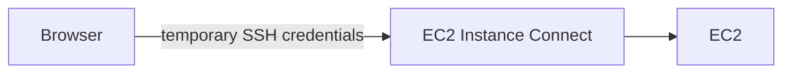

It still ultimately depends on the necessary network/SSH connectivity for the configuration being used.

!!! tip "Memory"
    Exam priority: low.

## IAM Role for EC2

This is extremely important. Suppose EC2 needs to read S3.

**Bad:**

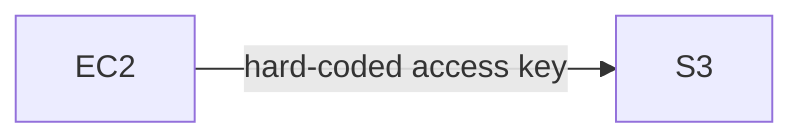

Credentials could be stolen from the instance.

**Good:**

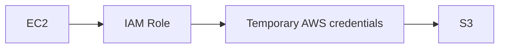

Attach an [IAM role](../security/iam.md) with the required policy. Example: EC2 Role → Policy: `s3:GetObject`. Then software running on EC2 can call AWS APIs without storing permanent access keys.

!!! warning "Exam Trigger"
    "EC2 application needs access to [S3](../storage/s3.md) securely." → **IAM Role for EC2**

!!! tip "Memory"
    Never store an IAM user's long-term access keys on EC2 when a role can be used.

## EC2 Purchasing Options — Big Picture

This is important SAA material.

- On-Demand
- Reserved Instances
- Savings Plans
- Spot
- Dedicated Host
- Dedicated Instance
- Capacity Reservation

On-Demand is for short/unpredictable workloads, Reserved Instances and Savings Plans are for longer commitments, Spot is for interruptible workloads, Dedicated options are for isolated hardware, and Capacity Reservations are for guaranteed AZ capacity.

## On-Demand

Use EC2 when needed with:

- no long-term commitment
- no upfront commitment
- predictable usage pricing
- highest flexibility

Good for:

- short workloads
- unpredictable workloads
- applications that cannot tolerate interruption but do not justify a long commitment

On-Demand is the highest-cost flexible option with no long-term commitment.

!!! warning "Exam Trigger"
    "Short-term, unpredictable workload." → **On-Demand**

## Reserved Instances (RI)

Designed for steady workloads where you can make a long-term commitment. Typical terms: **1 year or 3 years.** Payment choices may include:

- no upfront
- partial upfront
- all upfront

Greater commitment generally means greater discount. RIs are associated with predictable, steady-state workloads such as databases.

!!! example "Example"
    ```mermaid
    flowchart LR
        A["Production database — runs continuously for years"] --> B[Reserved Instance]
    ```

### Standard vs Convertible RI

**Standard RI** — better discount but less flexibility.

**Convertible RI** — allows more changes to the reservation characteristics (instance family/type and other attributes), at the cost of a smaller discount.

!!! warning "Exam Trigger"
    "Long-term usage but instance requirements may change." → **Convertible RI**

## Savings Plans

Instead of primarily reserving one exact instance configuration, you make a usage-spend commitment. Concept: commit `$X` of compute usage per hour for 1 or 3 years, and eligible usage then receives discounted pricing. Savings Plans are long-term usage commitments that emphasize flexibility within the committed scope.

!!! info "Important"
    One source sentence says "1, 2, 3 years," but elsewhere the same source says 1 or 3 years. For your SAA memory, keep: **Savings Plans → 1-year or 3-year commitment.**

## Reserved Instances vs Savings Plans

Easy mental distinction:

- **Reserved Instance** → commitment around EC2 reservation characteristics
- **Savings Plan** → commitment to amount of compute spend/usage

!!! tip "Memory"
    For modern flexible compute discount questions → **Savings Plans are often attractive.** For questions specifically about RI properties/capacity scope → **evaluate Reserved Instances.**

## Spot Instances

Spot uses spare EC2 capacity at a large discount. The major trade-off: **AWS can interrupt the instance.** Discounts run up to roughly 90%; recommended for failure-tolerant workloads such as batch processing, analytics, and distributed workloads — not critical databases.

#### Good Uses

- Batch processing
- Data analysis
- Image processing
- Distributed workloads
- Flexible jobs

#### Bad Uses

- Critical database ❌
- Single critical application server ❌
- Workload that cannot restart ❌

!!! warning "Exam Trigger"
    "Cheapest possible compute and workload can tolerate interruption." → **Spot**

### Spot Interruption

You should design the application to handle interruptions:


The main SAA lesson is not the historical Spot bidding model. It is: **Spot capacity is interruptible, so the workload must be resilient.**

### Spot Requests — One-Time vs Persistent

#### One-Time

Launch requested Spot capacity once.

#### Persistent

Attempts to maintain the requested Spot capacity while the request remains valid. Historical exam/course detail — if shutting down a persistent Spot setup permanently:

1. Cancel persistent request
2. Terminate Spot instances

Otherwise the request may try to replace them. This is lower priority than understanding Spot interruption tolerance.

### Spot Fleet

Spot Fleet lets AWS choose from multiple capacity pools. You can give it:

- multiple instance types
- multiple AZs
- target capacity
- pricing/capacity constraints

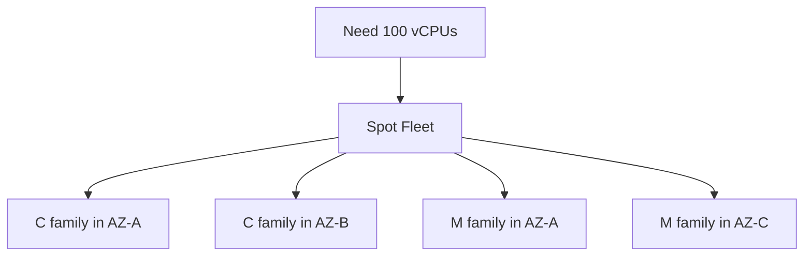

AWS chooses combinations that meet the target.

### Spot Fleet Allocation Strategies

#### Lowest Price

Choose cheapest pools. Good for very cost-focused short workloads.

#### Diversified

Spread capacity across pools. Benefit: less dependence on one pool.

#### Capacity Optimized

Choose pools with more available Spot capacity. → lowers interruption risk.

#### Price-Capacity Optimized

Balances available capacity and price. Described as a strong choice for most workloads.

!!! tip "Memory"
    Want minimum interruption risk → **Capacity-aware strategy.** Want price + capacity balance → **Price-Capacity Optimized.**

## Dedicated Host

You reserve an entire physical EC2 host — a physical server dedicated to your organization. Benefits:

- hardware visibility/control
- instance placement control
- compliance
- server-bound licensing / BYOL scenarios

Dedicated Hosts are specifically associated with compliance and licenses tied to physical sockets/cores/VMs.

!!! warning "Exam Trigger"
    "License requires visibility/control of physical server sockets or cores." → **Dedicated Host**

## Dedicated Instance

Instances run on hardware dedicated to your account. But you don't get the same physical-host visibility/placement control as a Dedicated Host.

!!! tip "Memory"
    **Dedicated Instance** = isolated hardware. **Dedicated Host** = entire physical host + hardware visibility/control.

## Capacity Reservation

Reserves EC2 capacity in a specific AZ.

!!! example "Example"
    `us-east-1a` — reserve 4 × `m5.2xlarge`. AWS ensures this capacity is available.

Important:

- specific AZ
- no long commitment required
- capacity guarantee
- no inherent discount
- you pay for reserved capacity even if unused

Its purpose is capacity, not pricing discount.

!!! warning "Exam Trigger"
    "We absolutely must be able to launch 20 instances in AZ-A during an event." → **On-Demand Capacity Reservation**

## Purchasing Option Decision Table

| Requirement | Choice |
|---|---|
| Short/unpredictable | On-Demand |
| Long steady workload | Reserved Instance |
| Long-term spend commitment + flexibility | Savings Plan |
| Failure-tolerant / cheapest compute | Spot |
| Physical server + BYOL/compliance | Dedicated Host |
| Dedicated hardware without host control | Dedicated Instance |
| Guarantee capacity in one AZ | Capacity Reservation |

These are different trade-offs between flexibility, commitment, interruption risk, physical isolation, and capacity guarantees.

## Public vs Private IPv4

Every EC2 networking question starts here.

### Private IP

Used inside a private network/[VPC](../networking/vpc.md).

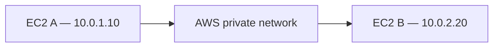

Private IP only needs to be unique within its network. Different organizations can reuse the same private ranges.

### Public IP

Internet-routable IPv4. Must be globally unique while allocated. Used when the resource must communicate directly through the public internet.

## EC2 Public IP Behavior

Typical EC2 has:

- Private IPv4
- Auto-assigned Public IPv4

After Stop → Start, typically:

- **Private IP** → unchanged
- **Auto-assigned Public IP** → may change

This is why you shouldn't build applications around temporary EC2 public IPs.

## Elastic IP (EIP)

Elastic IP provides a static public IPv4 you control.

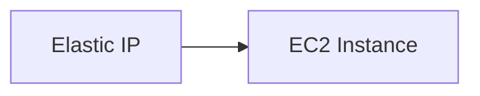

It remains yours until you release it. Can be reassociated to another compatible resource/instance.

!!! info "Important"
    AWS generally encourages architectures using [DNS](../networking/route53.md) or [Load Balancers](load-balancing-asg.md) instead of putting permanent public IPs directly on application instances.

!!! warning "Exam Trigger"
    "EC2 needs a fixed public IPv4." → **Elastic IP** — but always consider whether an ALB/NLB/DNS architecture is more appropriate.

## Placement Groups

**Placement Groups influence how EC2 instances are physically placed.** This is important SAA material. Three strategies:

- Cluster
- Spread
- Partition

## Cluster Placement Group

**Places instances physically close together in a single AZ.**

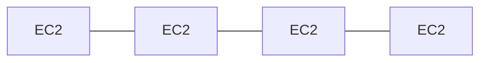

One AZ, very close together. Benefit:

- low latency
- high network throughput

Risk:

- correlated failure
- one AZ problem can affect everything

#### Use Cases

- HPC
- tightly coupled applications
- high-throughput computation

!!! warning "Exam Trigger"
    "Extremely low network latency between EC2 instances." → **Cluster Placement Group**

!!! tip "Memory"
    Cluster = CLOSE = FAST = one AZ

## Spread Placement Group

Places instances on distinct underlying hardware.

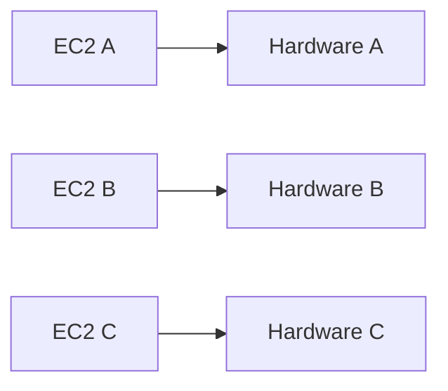

Goal: minimize simultaneous failure. Can span multiple AZs. Course limit to remember: **up to 7 instances per AZ per spread placement group** for the standard rack-level model.

!!! warning "Exam Trigger"
    "Small number of critical EC2 instances must avoid correlated hardware failure." → **Spread Placement Group**

!!! tip "Memory"
    Spread = SEPARATE = critical instances

## Partition Placement Group

Divides instances into logical partitions backed by separate groups of racks.

- **AZ-A**
    - **Partition 1**
        - EC2
        - EC2
        - EC2
    - **Partition 2**
        - EC2
        - EC2
        - EC2

Failure of one partition's underlying rack group should not affect other partitions. Can scale to many instances. Typical applications:

- Hadoop/HDFS
- Cassandra
- Kafka
- distributed big-data systems

!!! warning "Exam Trigger"
    "Hundreds of distributed EC2 nodes should be isolated across rack groups." → **Partition Placement Group**

## Placement Group Comparison

| Strategy | Goal | Scale | Key Risk/Benefit |
|---|---|---|---|
| Cluster | Performance | Many | Very fast, correlated failure |
| Spread | Maximum instance isolation | Small | Separate hardware |
| Partition | Rack-level isolation at scale | Large | Distributed systems |

!!! tip "Memory"
    Cluster → performance. Spread → maximum isolation. Partition → scalable isolation.

## ENI — Elastic Network Interface

ENI = virtual network card inside a [VPC](../networking/vpc.md).

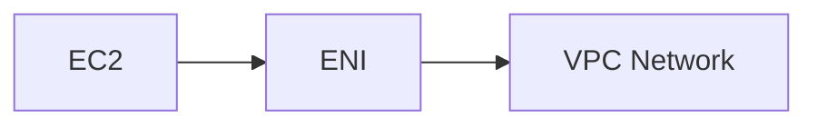

ENI provides network identity/connectivity.

### ENI Can Contain

Important attributes:

- primary private IPv4
- secondary private IPv4 addresses
- public IPv4 association where applicable
- Elastic IP associations
- Security Groups
- MAC address

Example:

- **EC2**
    - `eth0` → Primary ENI — `10.0.1.10`
    - `eth1` → Secondary ENI — `10.0.1.20`

### ENI Is AZ-Bound

Very important: ENI belongs to a particular subnet, therefore a particular AZ. So an ENI in AZ-A cannot simply be attached to an EC2 instance in AZ-B ❌.

### ENI Failover Pattern

A secondary ENI can be moved between compatible instances in the same AZ.

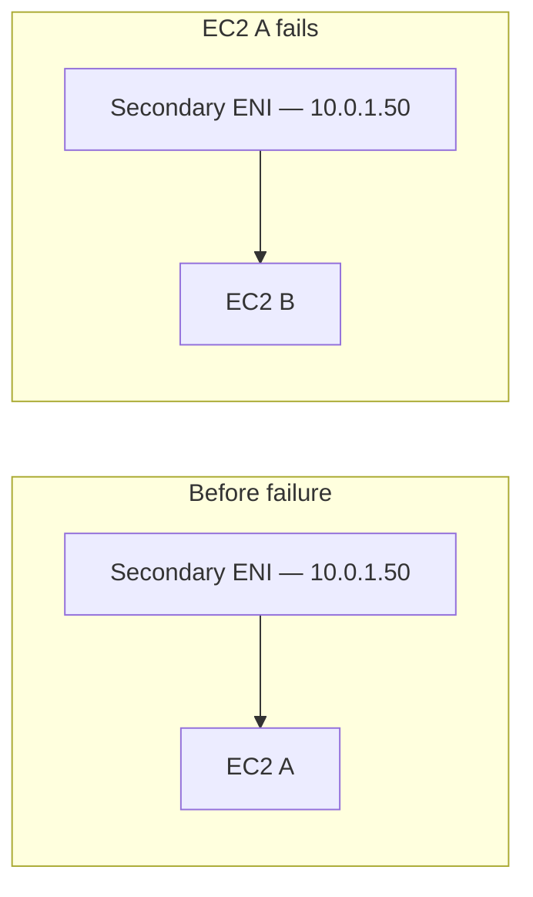

The private network identity moves with the ENI.

!!! warning "Exam Trigger"
    "Move a fixed private IP between EC2 instances." → **Secondary ENI**

### Primary vs Secondary ENI

The **primary ENI (`eth0`)** is fundamental to the instance and isn't treated like an ordinary detachable secondary ENI. For movable failover patterns, **think secondary ENI.**

## EC2 Hibernate

Normal stop loses RAM contents:

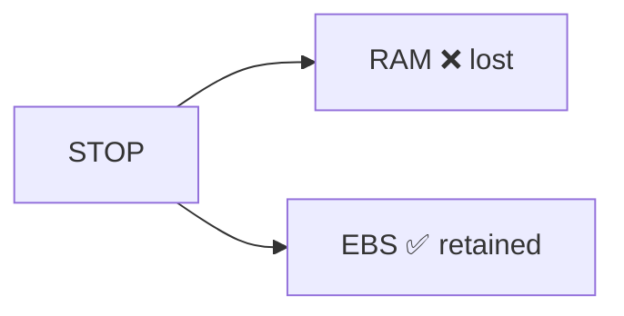

Hibernate saves RAM state:


When restarted:

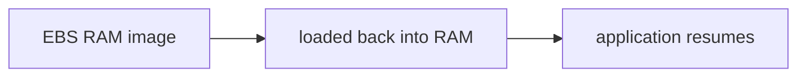

### Why Hibernate?

Without hibernation:


With hibernation:

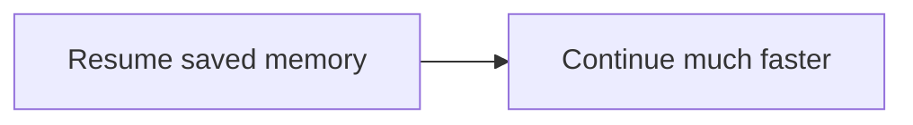

Good for:

- long-running processes
- applications with slow initialization
- workloads with expensive cache warm-up
- preserving in-memory state

### Hibernate Requirements

Important concepts:

- supported instance/OS combinations
- root volume must be [EBS](ebs.md)
- root EBS must be encrypted
- root volume must have enough capacity for saved RAM

Why encryption? Because RAM contents → written to disk, and may contain sensitive data.

!!! warning "Exam Trigger"
    "EC2 must resume quickly with its in-memory application state preserved." → **Hibernate**

### Stop vs Hibernate vs Terminate

| Action | RAM | EBS | Instance Can Resume? |
|---|---|---|---|
| Stop | Lost | Preserved | Yes, cold boot |
| Hibernate | Saved to EBS | Preserved | Yes, memory restored |
| Terminate | Lost | Depends on DeleteOnTermination | No |

!!! tip "Memory"
    STOP = keep DISK. HIBERNATE = keep DISK + MEMORY STATE. TERMINATE = destroy INSTANCE.

## Highest-Value SAA Traps

!!! danger "Trap 1 — Put access keys on EC2"
    ❌ Use an **IAM Role** instead.

!!! danger "Trap 2 — Security Groups support Deny"
    ❌ Security Groups: **Allow only.** [NACLs](../networking/vpc.md#network-acl-nacl) support allow + deny.

!!! danger "Trap 3 — SG return traffic needs an explicit rule"
    ❌ Security Groups are **stateful** — response traffic is automatically permitted.

!!! danger "Trap 4 — EC2 public IP always stays the same"
    ❌ Auto-assigned public IPv4 can change after stop/start. Need a static public IPv4? → **Elastic IP**

!!! danger "Trap 5 — Private IP changes after every stop/start"
    Normally ❌ — the primary private IPv4 stays.

!!! danger "Trap 6 — Spot for production database"
    Usually ❌. Spot → interruptible workloads.

!!! danger "Trap 7 — Reserved Instance guarantees capacity everywhere"
    Not automatically — capacity reservation behavior depends on scope/design. If the question specifically says "guarantee capacity in a particular AZ," think: **On-Demand Capacity Reservation.**

!!! danger "Trap 8 — Capacity Reservation provides a discount"
    ❌ Its primary purpose is **guaranteed capacity.** Combine with eligible discount mechanisms when appropriate.

!!! danger "Trap 9 — Dedicated Instance = Dedicated Host"
    ❌ **Dedicated Instance** → dedicated hardware isolation. **Dedicated Host** → physical host visibility/control.

!!! danger "Trap 10 — Cluster Placement Group is for HA"
    Opposite. Cluster prioritizes **performance.** Spread prioritizes **failure isolation.**

!!! danger "Trap 11 — Spread and Partition are the same"
    No. **Spread** → few critical instances, separate hardware. **Partition** → many distributed instances, rack-group isolation.

!!! danger "Trap 12 — Stop preserves RAM"
    ❌ Hibernate preserves RAM state; Stop does not.

## One-Minute Recall

!!! tip "One-Minute Recall"
    EC2 = virtual server · AMI = starting machine image · User Data = bootstrap on first launch by default · General Purpose = balanced · Compute Optimized = CPU · Memory Optimized = RAM · Storage Optimized = local storage I/O

    Security Group = stateful allow-only firewall · SSH = 22 · HTTP = 80 · HTTPS = 443 · RDP = 3389 · EC2 → AWS API = IAM Role

    On-Demand = short / unpredictable · Reserved = long steady workload · Savings Plan = long-term usage commitment · Spot = cheap + interruptible · Dedicated Host = whole physical server · Capacity Reservation = guarantee capacity in AZ

    Private IP = internal network · Public IP = internet-routable · Elastic IP = static public IPv4

    Cluster Placement = performance · Spread Placement = isolate individual instances · Partition Placement = isolate distributed groups/racks · ENI = virtual network card · Secondary ENI = movable private network identity

    Stop = disk retained, RAM lost · Hibernate = RAM saved to encrypted EBS · Terminate = instance gone

## Fast SAA Decision Chain

```mermaid
flowchart TD
    A[Need EC2?] --> B{What workload?}
    B -->|Balanced| C[General Purpose]
    B -->|CPU-heavy| D[Compute Optimized]
    B -->|RAM-heavy| E[Memory Optimized]
    B -->|Storage-heavy| F[Storage Optimized]

    A --> G{How long / how reliable?}
    G -->|Unpredictable| H[On-Demand]
    G -->|Long steady| I[RI / Savings Plan]
    G -->|Interruptible| J[Spot]
    G -->|Capacity absolutely required| K[Capacity Reservation]

    A --> L{Other needs?}
    L -->|Need AWS API access| M[IAM Role]
    L -->|Need fastest EC2-to-EC2 networking| N[Cluster Placement Group]
    L -->|Need failure isolation| O[Spread / Partition Placement Group]
    L -->|Need fixed public IPv4| P[Elastic IP]
    L -->|Need fixed movable private network identity| Q[ENI]
    L -->|Need RAM to survive shutdown| R[Hibernate]
```
