# Load Balancer, ELB, ASG Summary

**High Availability + Scalability + ELB + ASG — SAA-C03 Complete Revision Memory Map**

This is the chapter-level revision sheet. For the exam, the core skill is recognizing:

**Do I need Layer 7 routing, extreme Layer 4 performance/static IP, security-appliance insertion, or automatic EC2 scaling?**

## Big Picture — Start Here

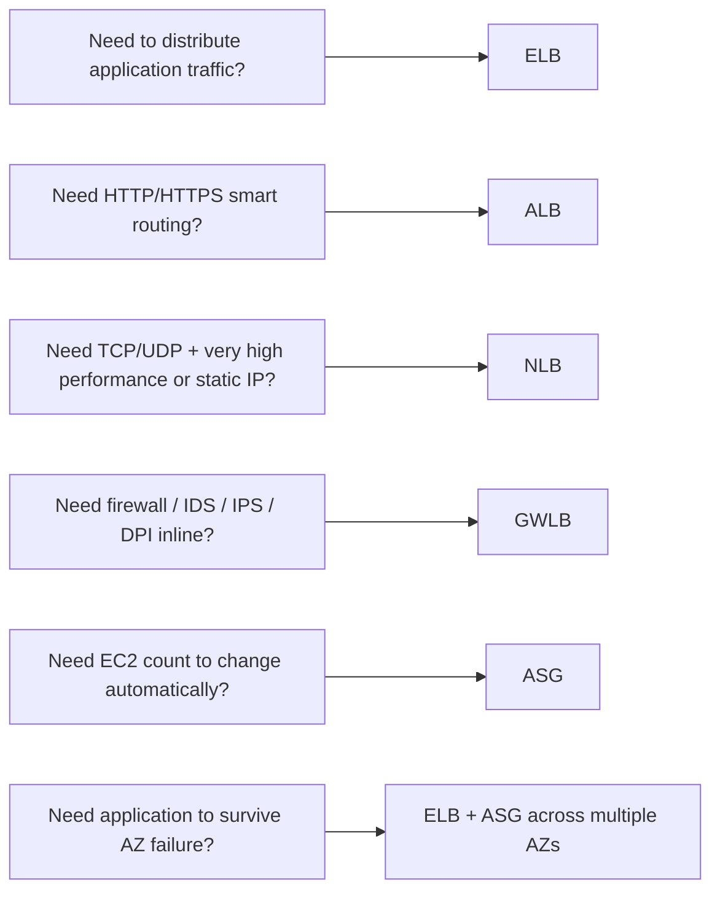

!!! tip "Main Memory Anchors"
    ALB = Layer 7 / HTTP intelligence

    NLB = Layer 4 / performance / static IP

    GWLB = security appliances

    ASG = automatic EC2 capacity

## Scalability vs High Availability

These are related but different.

### Scalability

Ability to handle increased workload. Two types:

#### Vertical Scaling

Increase size of one machine. Example: `t3.medium → m7i.large`. Memory: **Scale Up / Down**

#### Horizontal Scaling

Increase number of machines. Example: 1 EC2 → `EC2 EC2 EC2 EC2` (four instances behind the fleet). Memory: **Scale Out / In**

ASG mainly provides horizontal scaling.

### High Availability

High Availability means designing the application so a failure does not cause the whole service to become unavailable.

Typical AWS architecture:

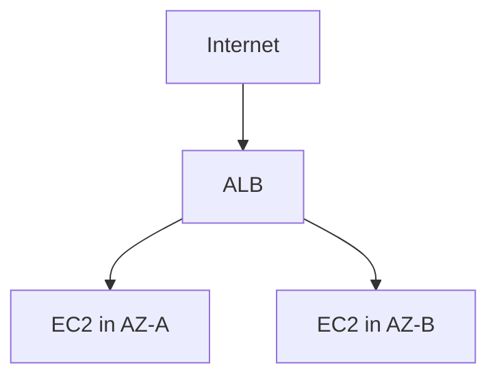

If one AZ fails → traffic continues through resources in another AZ.

!!! tip "Exam Memory"
    Multiple AZs = High Availability

## Elastic Load Balancing — Core Idea

ELB distributes incoming traffic across multiple backend resources.

Typical architecture:

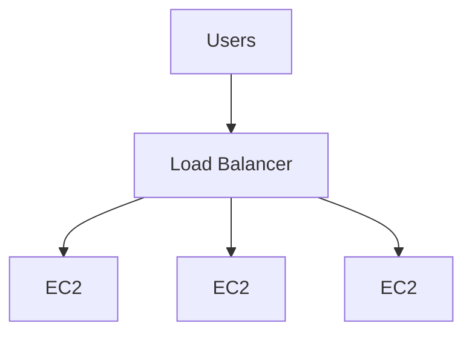

Benefits:

- distribute traffic
- improve availability
- expose one application endpoint
- health-check targets
- integrate with Auto Scaling
- hide individual backend instances from clients

## Load Balancer Decision Map

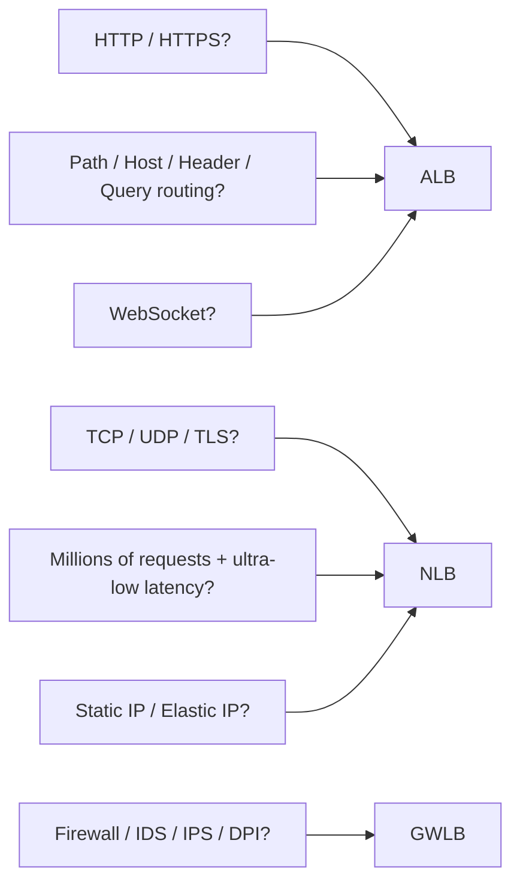

## Application Load Balancer (ALB)

ALB operates at: **Layer 7 — Application Layer**

Protocols: HTTP, HTTPS.

Best for modern web applications and APIs.

### Target Groups

ALB routes traffic to: **Target Groups**

Possible target types include:

- EC2 instances
- IP addresses
- Lambda functions

Typical flow:

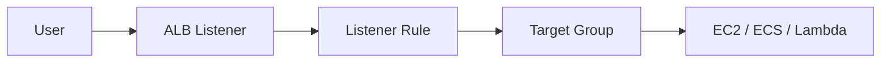

### Listener

A listener waits for client connections. Typical ports: `HTTP → 80`, `HTTPS → 443`.

Example:

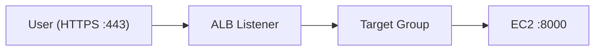

The backend application does not need to use the same port as the public listener.

### Path-Based Routing

ALB can route based on URL path.

Example:

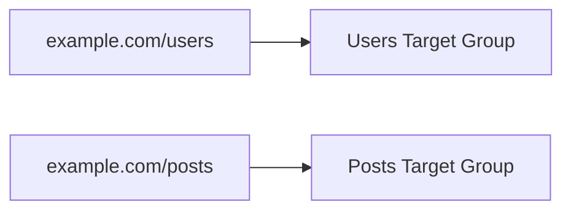

!!! warning "Exam Trigger"
    `/users and /posts must go to different backend services.` → **ALB**

### Host-Based Routing

Route based on hostname.

Example:

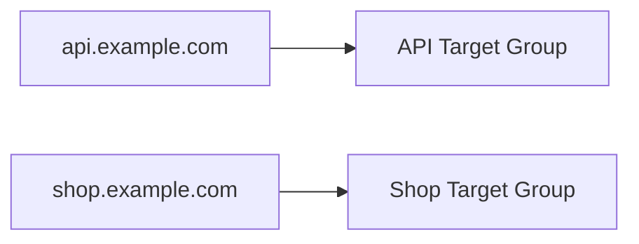

!!! warning "Exam Trigger"
    Several domains/subdomains must use the same load balancer. → **ALB host-based routing**

### Advanced Routing Rules

ALB rules can inspect things such as:

- hostname
- path
- HTTP method
- source IP
- query string
- HTTP headers

Example:

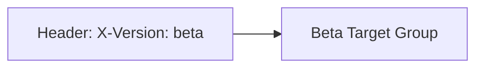

This is why ALB is considered an application-aware Layer 7 load balancer.

### Listener Rule Priority

Rules have priorities. Lower priority number → evaluated earlier. When a rule matches → its action is executed. There is also a default rule.

### Rule Actions

Common actions include:

#### Forward

`/users → Users Target Group`

#### Redirect

`HTTP :80 → HTTPS :443`

#### Fixed Response

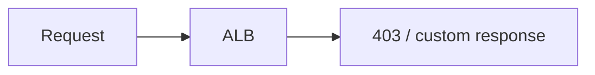

### HTTP → HTTPS Redirect

Very common exam scenario. Instead of configuring every backend server:

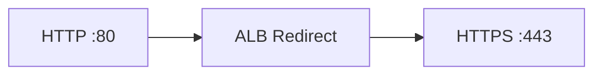

!!! warning "Exam Trigger"
    Redirect all HTTP traffic to HTTPS centrally. → **configure redirect on ALB**

### WebSockets

ALB supports: **WebSockets**

So a WebSocket-based web application **can use an ALB.**

### HTTP/2

ALB supports modern HTTP capabilities including: **HTTP/2**

Again, this belongs to ALB's Layer 7 behavior.

### Client IP Information

Because ALB sits between the client and backend, backend instances see the ALB connection. ALB forwards client information using headers such as: **X-Forwarded-For**

Example:

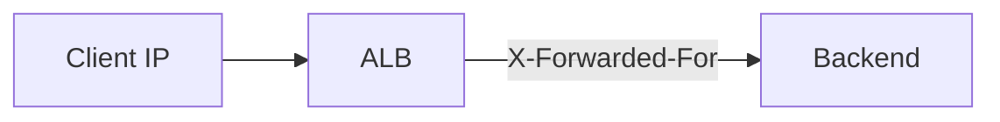

!!! warning "Exam Trigger"
    Backend application needs original client IP. → **inspect X-Forwarded-For**

### Security Group Pattern

This is an important architecture pattern.

#### ALB Security Group

Inbound:

| Protocol | Port | Source |
|---|---|---|
| HTTP | 80 | 0.0.0.0/0 if public |
| HTTPS | 443 | 0.0.0.0/0 if public |

#### EC2 Security Group

Inbound:

| Protocol | Port | Source |
|---|---|---|
| HTTP/App | 80 / app port | ALB Security Group |

Architecture:

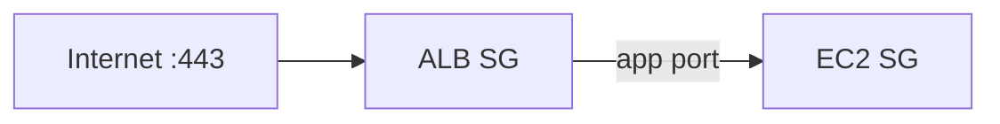

This is the standard [security group](../networking/vpc.md#security-groups) chaining pattern: the ALB's security group is public, and the EC2 security group only allows the ALB's security group as a source.

!!! tip "Best Practice Memory"
    Do not expose backend instances publicly if only the ALB should access them.

## Network Load Balancer (NLB)

NLB operates primarily at: **Layer 4 — Transport Layer**

Supports: TCP, UDP, TLS.

Designed for:

- extremely high performance
- very low latency
- huge connection/request volume

### Exam Triggers

| Question says... | Think... |
|---|---|
| UDP | NLB |
| TCP | often NLB |
| Millions of requests per second | NLB |
| Ultra-low latency | NLB |
| Static IP | NLB |
| Elastic IP | NLB |

### Static IP

NLB can provide a: **static IP per Availability Zone**

It can also use: **Elastic IP addresses**

This is extremely useful when clients/firewalls require fixed IP allowlists.

!!! example "Example"
    Customer firewall only allows: `203.0.113.10`. Application needs AWS load balancing. → **NLB + Elastic IP**

### ALB vs NLB — Critical Comparison

| Requirement | ALB | NLB |
|---|---|---|
| Layer | 7 | 4 |
| HTTP/HTTPS | ✅ | Transport-level support |
| TCP | ❌ direct L4 use | ✅ |
| UDP | ❌ | ✅ |
| Path routing | ✅ | ❌ |
| Host routing | ✅ | ❌ |
| Header/query routing | ✅ | ❌ |
| Static IP | ❌ typical ALB | ✅ |
| Elastic IP | ❌ | ✅ |
| WebSocket | ✅ | Not main exam reason |
| Extreme performance | Good | Best fit |

!!! tip "Memory"
    HTTP intelligence → ALB

    Network performance → NLB

### NLB Can Target an ALB

A useful architecture:

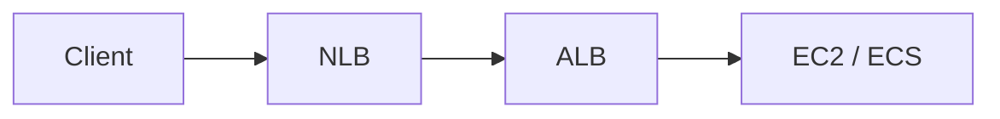

Why? You may need NLB static IP / network behavior plus ALB Layer 7 routing.

!!! warning "Exam Pattern"
    Need static IP but also HTTP path-based routing. Think: **NLB → ALB** when architecture requires both capabilities.

### Health Checks

NLB supports health checking of targets. Health-check protocols can include: TCP, HTTP, HTTPS.

So NLB can verify target health even while forwarding Layer 4 traffic.

### Security Groups

!!! info "Important"
    **Modern NLBs support Security Groups.** This is an important newer AWS behavior. Do not use old exam knowledge saying "NLB never supports security groups." That is outdated.

## Gateway Load Balancer (GWLB)

GWLB is designed for: **third-party virtual network appliances**

Examples: firewalls, IDS, IPS, deep packet inspection, security appliances.

### Main Architecture

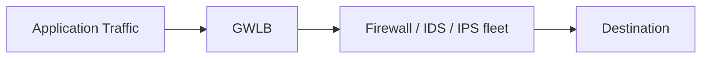

GWLB combines:

- transparent traffic insertion
- load balancing across appliances

### Protocol

Important number: **GENEVE**

UDP port: **6081**

!!! tip "Memory"
    GWLB → GENEVE → UDP 6081. This is one of the few numbers worth remembering.

### Exam Triggers

| Question says... | Think... |
|---|---|
| Centralized firewall inspection | GWLB |
| IDS/IPS appliances | GWLB |
| Deep packet inspection | GWLB |
| Transparently insert third-party security appliances | GWLB |

## ALB vs NLB vs GWLB

| Load Balancer | Main Purpose |
|---|---|
| ALB | HTTP/HTTPS application routing |
| NLB | TCP/UDP, performance, static IP |
| GWLB | Network/security appliances |

!!! tip "Ultra-Memory"
    ALB → WEB

    NLB → NETWORK

    GWLB → FIREWALL

## Sticky Sessions — Session Affinity

**Sticky sessions keep a client connected to the same backend target.**

Example:

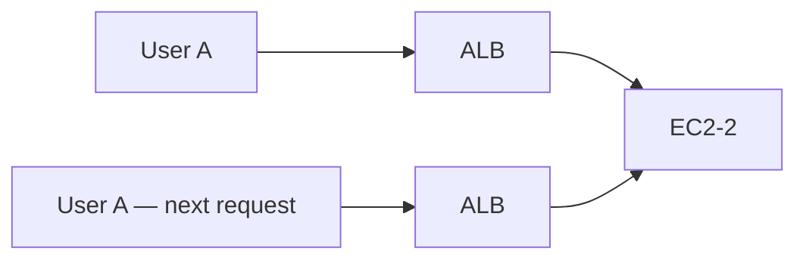

Also called: **Session Affinity**

### Why Sticky Sessions?

Useful when application session state is stored locally on an instance.

Example: user logs in → EC2-A stores session. The next request should return to EC2-A — sticky sessions can help maintain that behavior.

### Sticky Session Risk

Sticky sessions can create: **uneven load**

Example: `EC2-A → 800 users`, `EC2-B → 200 users`, because clients remain attached to specific targets.

#### Architecture Preference

For scalable architectures, storing session state externally, such as in [ElastiCache](../databases/database-dynamodb.md), can allow application servers to remain stateless.

!!! tip "Memory"
    Sticky Session → same client → same backend. Exam phrase "session affinity" → sticky sessions.

## Cross-Zone Load Balancing

### Without Cross-Zone Load Balancing

Each load balancer node mainly distributes traffic to targets in its own AZ.

| AZ | Traffic Share | Targets |
|---|---|---|
| AZ-A | 50% traffic | 2 EC2 |
| AZ-B | 50% traffic | 8 EC2 |

Without cross-zone, each AZ still gets roughly half the load, creating uneven per-instance traffic.

### With Cross-Zone Load Balancing

Load can be distributed across targets in all enabled AZs.

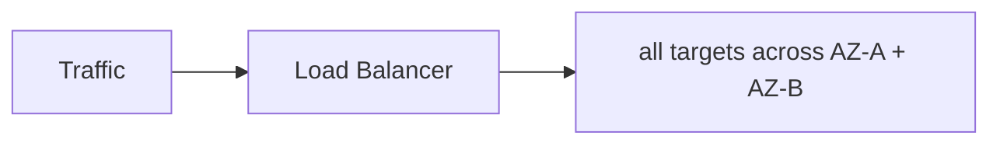

This improves distribution when target counts differ between AZs.

### Cross-Zone Defaults

Exam-level memory from this section:

| Load Balancer | Cross-Zone Default |
|---|---|
| ALB | Enabled by default |
| NLB | Disabled by default |
| GWLB | Disabled by default |

Cross-AZ data-transfer cost considerations can matter for NLB/GWLB.

## SSL/TLS, SNI & Certificates

### SSL/TLS Certificates

For HTTPS:

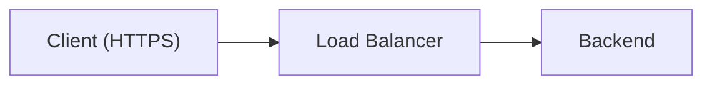

The load balancer can terminate TLS. Certificates can come from **AWS Certificate Manager — ACM**, or be imported.

### TLS Termination

Example:

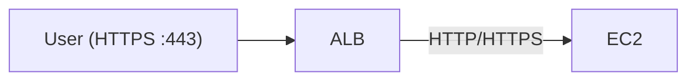

The ALB handles the public TLS certificate. This centralizes certificate management rather than managing certificates independently on every EC2 instance.

### SNI — Server Name Indication

SNI allows a load balancer to host **multiple TLS certificates** for different hostnames.

Example:

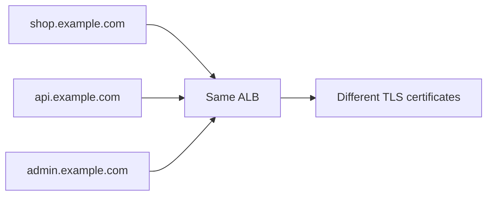

!!! warning "Exam Trigger"
    Multiple HTTPS websites/certificates on one load balancer. → **SNI**

### ALB and Certificates

ALB supports:

- HTTPS listener
- multiple certificates
- SNI
- ACM integration

Typical public port: **443**

### NLB and TLS

NLB also supports TLS listeners and TLS termination when needed. But choose NLB because of Layer 4/network requirements, not because HTTPS alone requires NLB.

## Deregistration Delay & Connection Draining

When a target is removed or becomes unavailable for new traffic, you usually do not want active requests terminated immediately. Deregistration delay allows existing/in-flight requests to finish while stopping new requests from going to that target.

Example:

```mermaid
flowchart TD
    A["EC2-A currently processing request"] --> B["ASG wants to terminate EC2-A"]
    B --> C["Load Balancer stops NEW requests"]
    C --> D["Existing request finishes"]
    D --> E["Target removed"]
```

This is important during:

- deployments
- scale-in
- instance replacement

Typical default: **300 seconds**. It can be adjusted. Setting it to 0 effectively disables the waiting behavior.

!!! warning "Exam Trigger"
    Existing requests should finish before backend is removed. → **Deregistration Delay**

### Connection Draining

Older terminology: **Connection Draining**

Modern ALB/NLB target-group terminology: **Deregistration Delay**

Both describe the same architectural goal: do not kill active connections immediately.

## Auto Scaling Group (ASG)

ASG automatically manages a fleet of EC2 instances.

Core values: **Minimum capacity**, **Desired capacity**, **Maximum capacity**

Example:

| Min | Desired | Max |
|---|---|---|
| 2 | 4 | 10 |

ASG tries to maintain the desired number of healthy instances within these limits.

### Min / Desired / Max

#### Minimum

Lowest allowed number of EC2 instances.

#### Desired

Number ASG currently tries to maintain.

#### Maximum

Highest number allowed.

In the example above, ASG currently wants **4 instances** but can scale between **2 and 10**.

### Launch Template

ASG needs a definition for how to launch EC2 instances. Use: **Launch Template**

Can define things such as:

- AMI
- instance type
- security groups
- [IAM instance profile](../security/iam.md)
- user data
- storage

Architecture:

```mermaid
flowchart LR
    LT[Launch Template] --> ASG[Auto Scaling Group] --> E1[EC2] & E2[EC2] & E3[EC2]
```

### ASG + Multiple AZs

For high availability:

```mermaid
flowchart LR
    ASG --> A["AZ-A → EC2"]
    ASG --> B["AZ-B → EC2"]
    ASG --> C["AZ-C → EC2"]
```

If one AZ has a failure → instances remain available in other AZs.

!!! tip "Exam Memory"
    ELB + Multi-AZ ASG = common highly available web architecture

### ASG + Load Balancer

Typical architecture:

```mermaid
flowchart TD
    I[Internet] --> A[ALB] --> T[Target Group] --> S[ASG]
    S --> E1[EC2] & E2[EC2] & E3[EC2]
```

When ASG launches a new instance → it can be automatically registered with the target group. When ASG terminates one → it is deregistered.

### ASG Health Checks

ASG can use:

#### EC2 Health Checks

Checks instance-level health.

#### ELB Health Checks

Uses load balancer target health. This is stronger for application availability.

### Why ELB Health Check Matters

Imagine: the EC2 instance's OS is running ✅, but the application has crashed ❌.

EC2-level health might still say **healthy**. But ALB health check might say **unhealthy**. If ASG uses ELB health information → it can replace the broken application instance.

!!! warning "Exam Trigger"
    Replace instances whose application is not responding even though EC2 is running. → **ELB health checks integrated with ASG**

### ASG Replacement

```mermaid
flowchart LR
    U["Unhealthy EC2"] --> T[ASG terminates it] --> L[ASG launches replacement]
```

This helps maintain: **Desired Capacity**

### Target Group Health Checks

Load balancers continuously check backend targets.

Example:

```mermaid
flowchart LR
    A[ALB] -->|GET /health| E[EC2]
```

If health check repeatedly fails → target marked unhealthy → ALB stops sending new traffic to it.

#### Common Design

Application exposes `/health` for load balancer health checking.

## Auto Scaling Policies

### Scaling Policies — Master Map

```mermaid
flowchart LR
    R1[Need to maintain metric target?] --> P1(Target Tracking)
    R2["Need different scaling amounts for different metric thresholds?"] --> P2(Step Scaling)
    R3["Need one threshold → one action?"] --> P3(Simple Scaling)
    R4[Know traffic schedule ahead of time?] --> P4(Scheduled Scaling)
    R5[Want AWS to predict future demand?] --> P5(Predictive Scaling)
```

### Target Tracking Scaling

Most intuitive policy. Example: keep average ASG CPU around 50%.

```mermaid
flowchart LR
    A["CPU > target"] --> B[Scale Out]
    C["CPU < target"] --> D[Scale In]
```

!!! warning "Exam Trigger"
    Maintain average CPU at 50%. → **Target Tracking**

Possible targets may be based on metrics such as average CPU utilization, request count per target, or other appropriate metrics — the concept matters more than memorizing the full metric list.

!!! tip "Memory"
    Target Tracking = thermostat. Like "keep room at 22°C," ASG says "keep CPU around 50%."

### Simple Scaling

Basic model:

```mermaid
flowchart LR
    A[Alarm triggered] --> B[Perform scaling action] --> C[Wait for cooldown]
```

Example: `CPU > 70% → add 2 EC2 instances.` Simple Scaling is easy but less flexible than newer scaling approaches.

### Step Scaling

Different metric ranges trigger different scaling amounts.

| CPU Range | Action |
|---|---|
| CPU 60–70% | +1 EC2 |
| CPU 70–85% | +2 EC2 |
| CPU >85% | +4 EC2 |

!!! warning "Exam Trigger"
    Scale more aggressively as load increases. → **Step Scaling**

### Scheduled Scaling

Use when workload pattern is known ahead of time. Example: traffic always increases **Monday 09:00**. Configure: before 09:00 → increase Desired Capacity.

!!! warning "Exam Trigger"
    Every weekday at 8 AM traffic predictably increases. → **Scheduled Scaling**

### Predictive Scaling

AWS analyzes historical usage and predicts future demand. Then capacity can be prepared ahead of expected load.

!!! warning "Exam Trigger"
    Recurring traffic patterns should be automatically forecast and capacity prepared in advance. → **Predictive Scaling**

### Scheduled vs Predictive Scaling

#### Scheduled

**You know the schedule.** Example: Black Friday sale starts at 09:00.

#### Predictive

**AWS learns historical patterns** and predicts future capacity requirements.

!!! tip "Memory"
    I KNOW WHEN → Scheduled

    AWS PREDICTS WHEN → Predictive

### Scale Out vs Scale In

#### Scale Out

Add EC2 instances. `2 EC2 → 6 EC2`

#### Scale In

Remove EC2 instances. `6 EC2 → 2 EC2`

!!! tip "Memory"
    Out = more

    In = fewer

### Scaling Cooldown

After a scaling activity, ASG may wait for the system to stabilize before another scaling action. Typical default cooldown discussed: **300 seconds**

#### Why?

Suppose CPU is high → add EC2. A new instance needs time to:

- boot
- initialize
- register
- start serving traffic

Without appropriate stabilization/cooldown, ASG might scale repeatedly before seeing the impact.

### ASG + CloudWatch

Scaling policies commonly depend on: **CloudWatch metrics and alarms**

```mermaid
flowchart LR
    M["CloudWatch CPU Metric"] --> P[Scaling Policy] --> A[ASG] --> E["Add / remove EC2"]
```

## Architecture Patterns

### High Availability Architecture — Classic Exam Design

```mermaid
flowchart TD
    R["Route 53"] --> A["ALB across multiple AZs"]
    A --> T[Target Group]
    T --> S[ASG]
    S --> E1["EC2 in AZ-A"]
    S --> E2["EC2 in AZ-B"]
    S --> E3["optionally EC2 in AZ-C"]
```

This gives:

- load distribution
- instance replacement
- horizontal scaling
- AZ resilience

For DNS-level routing on top of this stack, see [Route 53](../networking/route53.md).

### Scaling Architecture with RDS

Common exam architecture:

```mermaid
flowchart TD
    U[Users] --> A[ALB] --> S[ASG]
    S --> E1[EC2] & E2[EC2] & E3[EC2]
    E1 --> R["RDS Multi-AZ"]
    E2 --> R
    E3 --> R
```

Responsibilities:

#### ALB

Traffic distribution.

#### ASG

Application compute scaling.

#### RDS Multi-AZ

Database availability. See [RDS & Aurora](../databases/rds-aurora.md) for the database-HA side of this.

Do not confuse their jobs.

### ALB + ASG Responsibilities

ALB → **WHERE should the request go?**

ASG → **HOW MANY EC2 instances should exist?**

Very useful mental distinction.

### Load Balancer Health Check vs ASG Scaling

Health checks answer: is this target functioning? Scaling answers: do I need more/fewer instances? They work together but solve different problems.

### Sticky Session vs Stateless Architecture

#### Sticky Sessions

User A → always EC2-A. Can solve local session affinity.

#### Stateless Application

User A → any EC2 → session stored externally. Usually easier to horizontally scale. Common external session store: **ElastiCache**

### ALB vs Route 53

Important cross-chapter distinction.

#### Route 53

DNS-level routing.

```mermaid
flowchart LR
    U[User] -->|DNS query| R[Route 53] -->|returns endpoint| U2[User connects directly]
```

#### ALB

Actually receives application requests:

```mermaid
flowchart LR
    U[User] -->|HTTP request| A[ALB] --> E[EC2]
```

!!! tip "Exam Memory"
    Route 53 chooses DNS answer. ALB handles live application traffic.

### ALB vs Multi-Value Route 53

#### Multi-Value Route 53

Returns several healthy IPs. Client chooses.

#### ALB

Receives every request and load balances it.

Therefore: **Multi-Value Route 53 is NOT a replacement for ELB**

### NLB vs Route 53 Alias

An NLB may have static IPs, but users commonly access the load balancer through DNS. Route 53 can create an **Alias record → NLB**.

Example:

```mermaid
flowchart LR
    A["api.example.com"] --> R["Route 53 Alias"] --> N[NLB]
```

## Quick-Reference Numbers & Ports

### Important Ports

Keep these in memory:

| Purpose | Port |
|---|---|
| HTTP | 80 |
| HTTPS | 443 |
| GWLB GENEVE | UDP 6081 |

Application/backend ports can vary.

### Important Numbers

#### ASG

Typical default cooldown: **300 seconds**

#### Deregistration Delay

Typical default: **300 seconds**

!!! danger "Trap — Same Default, Different Concepts"
    Myth: since ASG cooldown and Deregistration Delay share the common 300-second default, they must be the same mechanism. Reality: do not confuse the two concepts just because their common defaults are the same. Cooldown governs when ASG evaluates further scaling activity; Deregistration Delay governs how long an in-flight request is allowed to finish before a target is removed.

## Most Important SAA Trigger Words

| Question says... | Think... |
|---|---|
| Path-based routing | ALB |
| Host-based routing | ALB |
| HTTP header routing | ALB |
| WebSockets | ALB |
| HTTP → HTTPS redirect | ALB |
| TCP/UDP | NLB |
| Static IP | NLB |
| Elastic IP | NLB |
| Millions of requests | NLB |
| Very low latency network traffic | NLB |
| Firewall / IDS / IPS | GWLB |
| GENEVE 6081 | GWLB |
| Same backend for same client | Sticky Session |
| Unequal targets across AZs | Cross-Zone LB |
| Multiple HTTPS certificates | SNI |
| Finish active requests before removal | Deregistration Delay |
| Automatically add/remove EC2 | ASG |
| Maintain CPU around 50% | Target Tracking |
| Different scaling amounts by threshold | Step Scaling |
| Known future traffic spike | Scheduled Scaling |
| Forecast future load | Predictive Scaling |

## Most Dangerous Exam Traps

!!! danger "Trap 1 — Path routing with NLB"
    ❌ Wrong. Path-based routing requires Layer 7. → **ALB**

!!! danger "Trap 2 — UDP with ALB"
    ❌ Wrong. → **NLB**

!!! danger "Trap 3 — Need fixed public IP → ALB"
    Usually not the best answer. → **NLB**

!!! danger "Trap 4 — Security appliance → NLB"
    If the requirement is inline firewall, IDS, IPS, or DPI → **GWLB**

!!! danger "Trap 5 — ELB automatically adds EC2 instances"
    No. ELB distributes traffic. **ASG changes EC2 capacity.**

!!! danger "Trap 6 — ASG itself distributes HTTP traffic"
    No. ASG manages EC2 capacity. **ALB/NLB distributes traffic.**

!!! danger "Trap 7 — EC2 health is enough for application health"
    Not always. Instance may be running while application is broken. Use: **ELB health checks + ASG**

!!! danger "Trap 8 — Sticky sessions improve perfect load distribution"
    No. **They can create load imbalance because users remain tied to particular targets.**

!!! danger "Trap 9 — Cross-zone means multi-AZ deployment"
    Not exactly. Multi-AZ determines where resources exist. Cross-zone determines whether load-balancer nodes distribute traffic across targets in other AZs.

!!! danger "Trap 10 — SNI means one certificate only"
    Opposite. SNI allows **multiple certificates/domains on one listener/load balancer**

!!! danger "Trap 11 — Deregistration delay keeps sending new traffic"
    No. **It stops new traffic to the deregistering target while allowing existing/in-flight requests to complete.**

!!! danger "Trap 12 — Scheduled and predictive scaling are identical"
    No. Scheduled = you specify when. Predictive = AWS forecasts.

## Ultra-Fast Comparison Tables

### ALB / NLB / GWLB Ultra-Fast Comparison

| Feature | ALB | NLB | GWLB |
|---|---|---|---|
| Layer | 7 | 4 | Network appliance insertion |
| HTTP routing | ✅ | ❌ L7 rules | ❌ |
| TCP | ❌ direct L4 use | ✅ | Appliance traffic |
| UDP | ❌ | ✅ | GENEVE UDP 6081 |
| Path routing | ✅ | ❌ | ❌ |
| Static IP | Not main feature | ✅ | Not main decision factor |
| Elastic IP | ❌ | ✅ | — |
| Very high performance | Good | ✅ Best | Specialized |
| Firewall/IDS/IPS | ❌ | ❌ primary use | ✅ |
| WebSockets | ✅ | — | ❌ |

### ASG Scaling Policy Ultra-Fast Comparison

| Requirement | Policy |
|---|---|
| Keep CPU around 50% | Target Tracking |
| CPU 70% → +2, CPU 90% → +5 | Step Scaling |
| One alarm, one scaling action | Simple Scaling |
| Every Monday at 8 AM | Scheduled Scaling |
| Forecast recurring future demand | Predictive Scaling |

## Full Exam Decision Maps

### High Availability vs Scalability Exam Map

```mermaid
flowchart LR
    Q1[Need survive EC2 failure?] --> A1["ASG replacement"]
    Q2[Need survive AZ failure?] --> A2["Multi-AZ ASG + ELB"]
    Q3[Need more application capacity?] --> A3["ASG Scale Out"]
    Q4[Need fewer instances after load drops?] --> A4["ASG Scale In"]
    Q5[Need database AZ HA?] --> A5["RDS Multi-AZ"]
    Q6[Need global DNS failover?] --> A6["Route 53"]
```

### Full Web Tier Architecture

```mermaid
flowchart TD
    A["Route 53"] --> B["ALB / NLB"]
    B --> C[Target Group]
    C --> D[ASG]
    D --> E1["EC2 — AZ-A"]
    D --> E2["EC2 — AZ-B"]
    D --> E3["EC2 — AZ-C"]
    E1 --> F["RDS / Aurora"]
    E2 --> F
    E3 --> F
    F --> G[ElastiCache]
```

Each component has a specific job:

- Route 53 → DNS routing
- ALB/NLB → traffic distribution
- ASG → compute capacity
- RDS Multi-AZ → database HA
- Read Replicas → DB read scaling
- ElastiCache → reduce repeated DB reads/session store

### Final Decision Tree

| Question | Answer |
|---|---|
| HTTP / HTTPS smart routing? | ALB |
| Path / Host / Header / Query? | ALB |
| TCP / UDP? | NLB |
| Static IP / EIP? | NLB |
| Very high network performance? | NLB |
| Firewall / IDS / IPS / DPI? | GWLB |
| Same client → same backend? | Sticky Sessions |
| Multiple TLS certificates? | SNI |
| Finish existing requests before removing target? | Deregistration Delay |
| Automatically add/remove EC2? | ASG |
| Maintain metric target? | Target Tracking |
| Scale differently by threshold? | Step Scaling |
| Known traffic schedule? | Scheduled Scaling |
| Predict recurring demand? | Predictive Scaling |

## One-Minute Pre-Exam Recall

!!! tip "Memorize This Block"
    ALB = Layer 7 · NLB = Layer 4 · GWLB = firewall / IDS / IPS

    ALB = HTTP/HTTPS · NLB = TCP/UDP/TLS

    ALB = path + host + header + query routing · NLB = static IP + Elastic IP + extreme performance

    GWLB = GENEVE UDP 6081

    Target Group = backend resources · Listener = incoming port/protocol

    ALB SG public 80/443 → EC2 SG only from ALB SG

    Sticky Session = same client → same target · Cross-Zone = distribute across targets in different AZs

    SNI = multiple TLS certificates · ACM = manage certificates

    Deregistration Delay = finish in-flight requests

    ASG = Min / Desired / Max · Launch Template = how EC2 instances are created

    ASG + multiple AZs = high availability · ELB Health Check + ASG = replace broken application instances

    Target Tracking = maintain target metric · Step Scaling = different threshold → different scaling amount

    Scheduled = I know when · Predictive = AWS predicts when

    Scale Out = add EC2 · Scale In = remove EC2

And the most important five-way decision:

```mermaid
flowchart LR
    A1["HTTP intelligence?"] --> B1[ALB]
    A2["TCP / UDP / Static IP?"] --> B2[NLB]
    A3["Security appliance?"] --> B3[GWLB]
    A4["Need more/fewer EC2?"] --> B4[ASG]
    A5["Need AZ-resilient web tier?"] --> B5["ELB + ASG across multiple AZs"]
```

That is the High Availability + Scalability + ELB + ASG SAA memory map I would use before practice exams.
