# AWS Containers — Docker, ECS, Fargate, ECR & EKS

*ECS, EKS & Kubernetes — SAA-C03 Learning Notes*

This section is really about one question: **"I have a containerized application. How should I run it on AWS?"**

The main services fit together like this:

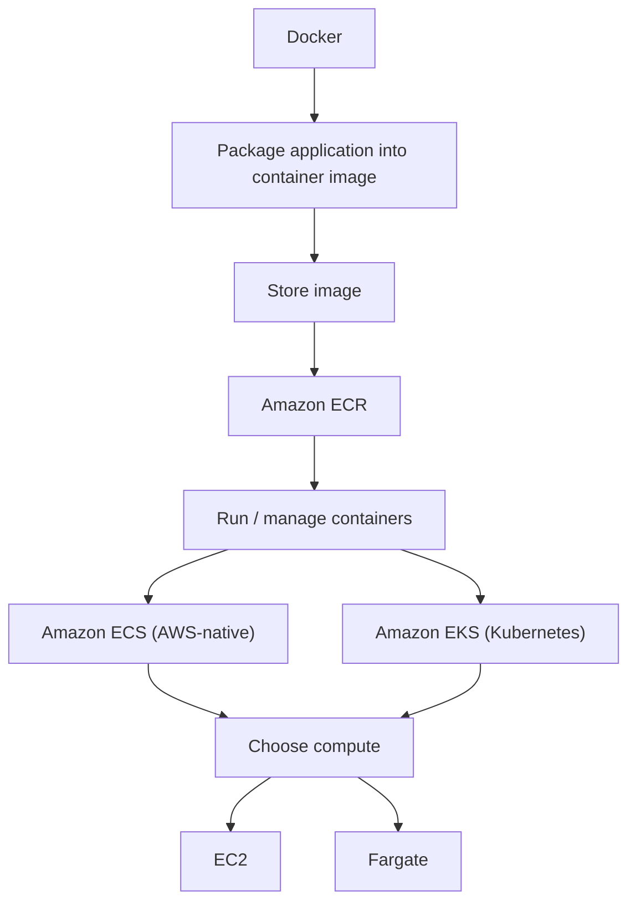

## What Is Docker?

Docker is a platform for packaging applications into **containers**. A container packages the application together with the things it needs to run — this helps make application deployment predictable. Instead of saying "It works on my laptop but not on the server," we package the application into a container.

### Basic Idea

You could have one server running several containers:

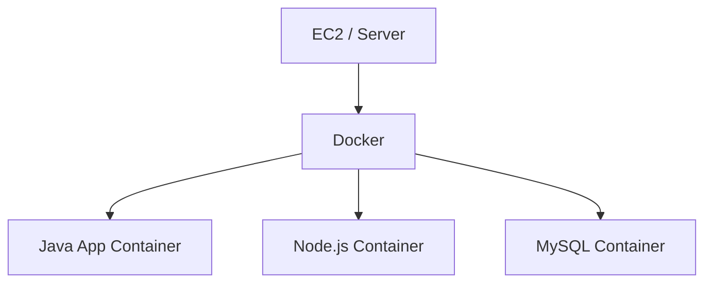

You can also run several copies of the same application:

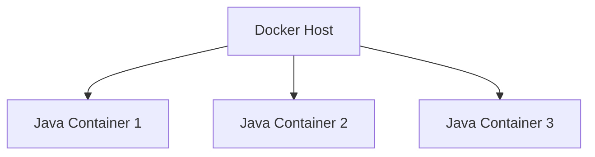

This is very useful for:

- microservices
- scalable applications
- consistent deployments
- moving applications from on-premises to AWS

!!! warning "Exam Trigger"
    "Containerized application" / "microservices" → start thinking **Docker + ECS/EKS**

## Docker Image vs Docker Container

This distinction is important.

#### Docker Image

The packaged application/template. Think: **Blueprint**.

#### Docker Container

A running instance of that image. Think: **Running application**.

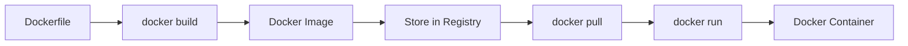

!!! tip "Memory"
    IMAGE = package · CONTAINER = running image

## Dockerfile

**A Dockerfile describes how the image should be created.** Conceptually:

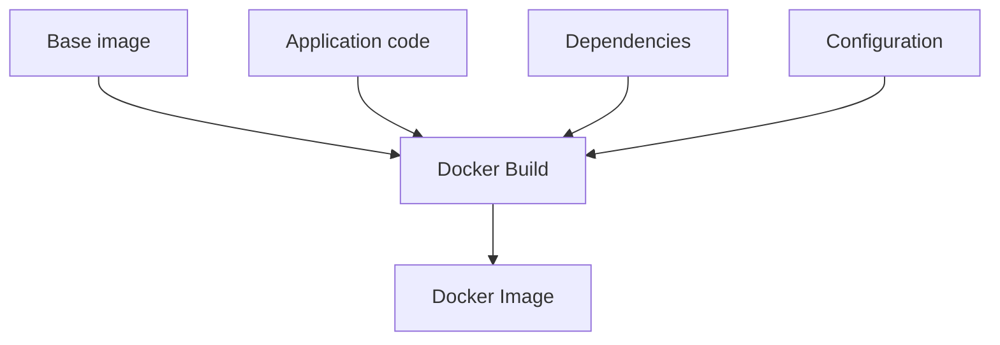

Then the image can be pushed to a container registry.

## Container Registries

Docker images need somewhere to live. Two important options from this lecture:

#### Docker Hub

Popular public container registry. Examples: Ubuntu, MySQL, NGINX, Node.js images.

#### Amazon ECR

AWS container image registry.

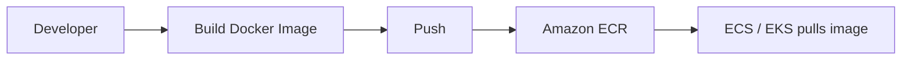

We'll return to ECR later.

## Containers vs Virtual Machines

This is useful conceptually.

### Virtual Machine

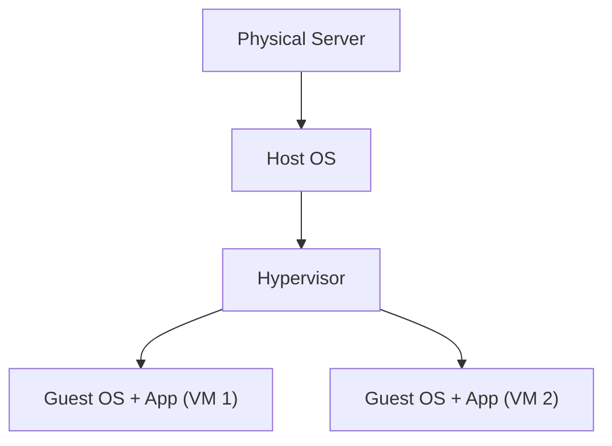

Each VM has its own operating-system environment.

### Containers

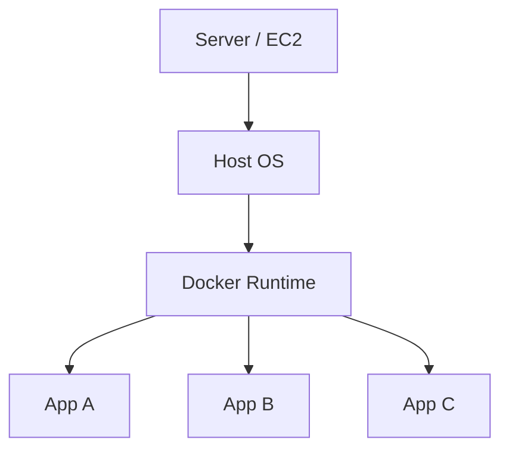

Containers are lighter weight. Therefore you can normally run more containers on the same underlying machine than full VMs.

For the SAA exam, don't overthink Docker internals. Remember:

- **EC2 = virtual machine**
- **Container = lightweight packaged application**

## Container Services on AWS

Four names matter most:

| Service | Purpose |
|---|---|
| ECS | AWS-native container orchestration |
| EKS | Managed Kubernetes |
| Fargate | Serverless compute for containers |
| ECR | Store container images |

The biggest exam decision is usually:

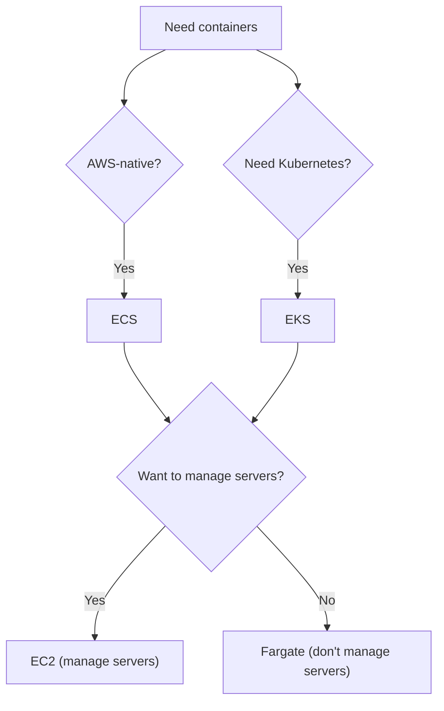

## Amazon ECS

**ECS = Elastic Container Service.** ECS is AWS's native service for running and managing containers.

Docker containers → Amazon ECS manages them.

## ECS Cluster

An ECS cluster is a logical place where your ECS workloads run. The cluster needs computing capacity. The lecture shows several infrastructure choices, including:

- Fargate
- AWS-managed instance capacity
- self-managed EC2 capacity

For the exam, the fundamental distinction remains:

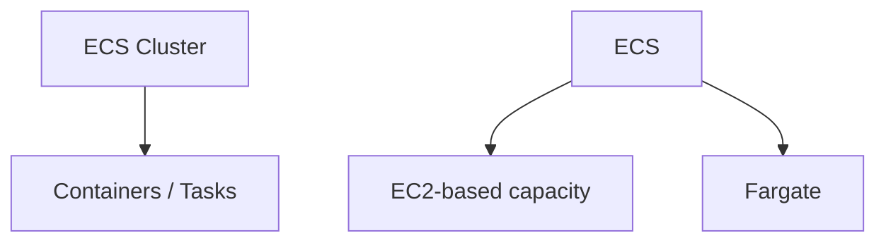

## ECS on EC2

With EC2-based ECS:

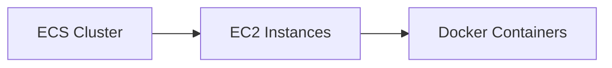

These [EC2](../compute/ec2.md) instances are often called **Container Instances**. The EC2 instances provide:

- CPU
- memory
- networking
- container runtime capacity

### Responsibility

With EC2, AWS manages ECS. **But you still have EC2 capacity to think about.** That includes things such as:

- instance sizing
- scaling
- patching/management depending on model
- available CPU/RAM

## ECS with Fargate

Fargate removes the server-management layer.

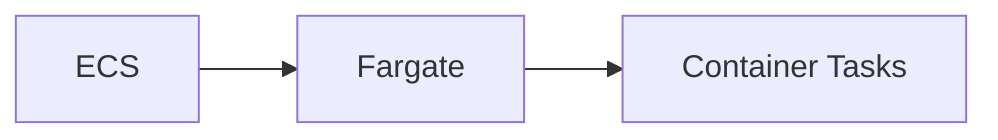

You don't provision EC2 instances yourself. Instead, you say something like: "My task needs `0.5 vCPU` / `1 GB RAM`" — AWS provides the compute.

!!! tip "Memory"
    ECS + EC2 → you have servers · ECS + Fargate → serverless containers

## Why Fargate Is Important

Suppose you need 20 containers.

With EC2, you must ask: How many EC2 instances? What instance type? Enough CPU? Enough RAM? Auto Scaling Group? Cluster capacity?

With Fargate: run 20 tasks → AWS provides the required compute. Therefore Fargate removes much of the infrastructure-management work.

!!! warning "Exam Trigger"
    "Run containers without managing servers" → **AWS Fargate**

## ECS Task Definition

Before ECS can run a container, ECS needs to know: **"What should I run?"** That configuration is called a **Task Definition** — think of it as the blueprint for running your application. It can define things such as:

- container image
- CPU
- memory
- ports
- environment variables
- logging
- [IAM roles](../security/iam.md)
- storage

Example:

| Field | Value |
|---|---|
| Image | `nginx` |
| CPU | 0.5 vCPU |
| Memory | 1 GB |
| Port | 80 |

Then ECS launches containers based on this definition.

!!! tip "Memory"
    Docker Image = packaged app · Task Definition = instructions for how ECS should run it

## ECS Task

**A task is a running instance of a task definition.**

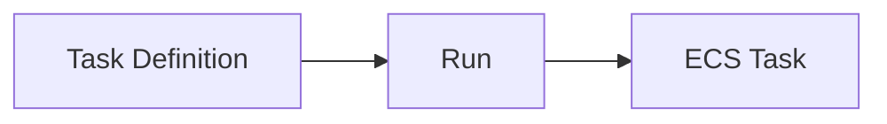

Example: Task Definition `web-app:v1` → Task 1, Task 2, Task 3. Those three tasks can represent three running copies of your application.

## ECS Service

**An ECS Service maintains a desired number of tasks.**

Example: Desired Tasks = 3. ECS tries to keep Task 1, Task 2, Task 3 running. If one fails:

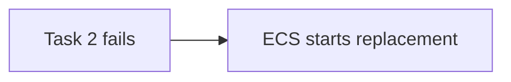

This is similar conceptually to how an [Auto Scaling Group](../compute/load-balancing-asg.md) maintains EC2 instances.

## Task Definition vs Task vs Service

Very important distinction:

| Term | Meaning |
|---|---|
| Task Definition | Blueprint |
| Task | Running container workload |
| Service | Keeps specified number of tasks running |

!!! tip "Memory"
    Task Definition → "How should it run?" · Task → "It's running." · Service → "Keep X copies running."

## ECS + Application Load Balancer

A common production architecture:

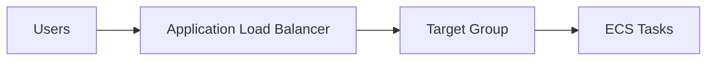

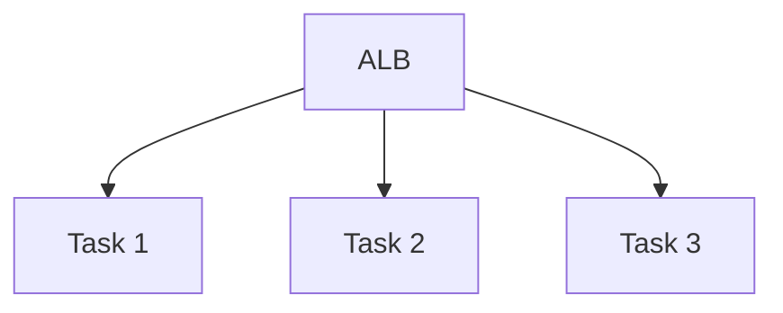

The [load balancer](../compute/load-balancing-asg.md) distributes requests across the container tasks. This gives:

- scalability
- high availability
- traffic distribution

### With Fargate

A task can receive its own networking configuration/private IP. This means an ENI, a private IP, and its own security groups — see [VPC](../networking/vpc.md). The target group can register the running task targets. Conceptually:

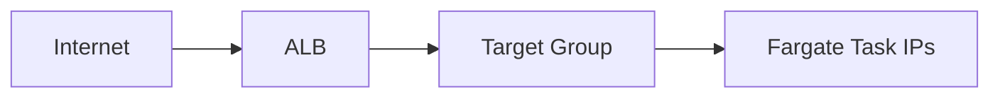

## ECS Service Scaling

Suppose Desired Tasks = 1 and traffic increases. You can increase Desired Tasks = 3. Now:


With Fargate, AWS provisions the underlying compute.

## ECS Service Auto Scaling

You don't need to change the task count manually. ECS integrates with **AWS Application Auto Scaling**. The lecture highlights three important metrics:

- ECS Service CPU utilization
- ECS Service memory utilization
- ALB request count per target

### Example

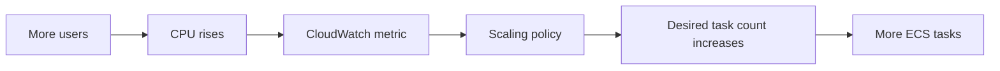

## ECS Scaling Policies

The lecture covers:

#### Target Tracking

Maintain a target metric. Example: keep average CPU around 50%.

#### Step Scaling

Different scaling actions based on thresholds. Example:

- CPU > 60% → +1 task
- CPU > 80% → +3 tasks

#### Scheduled Scaling

Scale in advance based on predictable demand. Example: every weekday at 9 AM → increase task count.

## Important: Task Scaling ≠ EC2 Scaling

This can create exam traps. Suppose your ECS service runs on EC2. You might need MORE TASKS, but there may not be enough space on your EC2 instances.

Example: EC2 Cluster Capacity is `[FULL] [FULL]`. ECS wants a new task, but there's no CPU/RAM available — you need another EC2 instance.

So there are actually two different scaling layers:

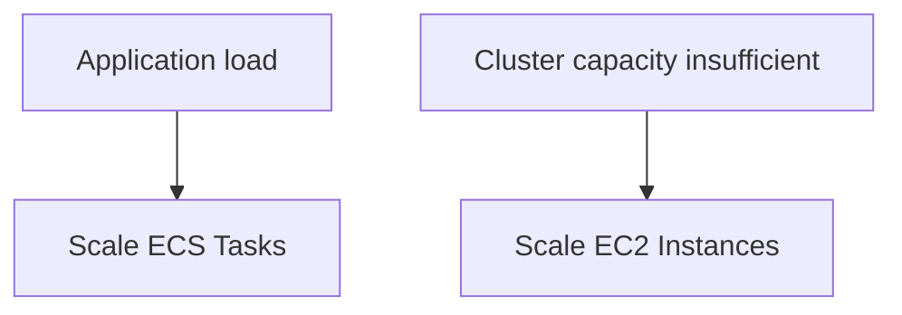

## ECS Capacity Provider

The lecture recommends ECS Capacity Providers as the smarter way to manage EC2-backed cluster capacity. Conceptually:

```mermaid
flowchart LR
    A[ECS wants more tasks] --> B[Not enough EC2 capacity] --> C[Capacity Provider] --> D["Auto Scaling Group"] --> E[Launch more EC2] --> F[Tasks can run]
```

This connects ECS demand → EC2 Auto Scaling.

!!! tip "Exam Mental Model"
    ECS Service Auto Scaling → scales TASKS · ECS Capacity Provider → helps scale EC2 CAPACITY

## Why Fargate Makes Scaling Easier

With Fargate:

```mermaid
flowchart LR
    A[Need more tasks] --> B[Launch more tasks] --> C[AWS finds the compute]
```

You don't have to separately manage an EC2 fleet. That's one of Fargate's biggest architectural benefits.

## ECS Task IAM Role

This is very important. Suppose your container needs access to:

- [S3](../storage/s3.md)
- [DynamoDB](../databases/database-dynamodb.md)
- [SQS](../messaging/decoupling-sqs-sns.md)
- [Secrets Manager](../security/security.md)

**Do not put AWS access keys inside the container.** Instead, **assign an ECS Task Role.** Example:

```mermaid
flowchart LR
    A[ECS Task] -->|IAM Task Role| B[Amazon S3]
```

The role might allow `s3:GetObject`. Then application code running inside the task can access S3.

## Task Role vs Task Execution Role

These two names look similar but solve different problems.

### Task Role

Used by **your application inside the container**. Example:

```mermaid
flowchart LR
    A[Container application] --> B["S3 / DynamoDB / SQS"]
```

Therefore: TASK ROLE = permissions for the application.

### Task Execution Role

Used by ECS/Fargate to perform actions needed to launch/manage the task. Conceptually, ECS may need to:

- pull image
- write container logs
- perform ECS startup operations

!!! tip "Memory"
    Task Role → YOUR CODE accessing AWS · Execution Role → ECS starting/running the task

!!! danger "Exam Trap"
    Container needs permission to read S3. Answer: **Task Role** — not simply the task execution role.

## ECS Architecture: S3 + EventBridge + Fargate

The lecture gives an important architecture. Suppose users upload files:

```mermaid
flowchart LR
    A[User] --> B[S3] --> C["EventBridge"] --> D[ECS Task on Fargate] --> E[Process file] --> F[DynamoDB]
```

The task gets an IAM task role:

- Read S3
- Write DynamoDB

This becomes serverless from a server-management perspective.

## Why Use This Architecture?

Imagine a large file-processing application. User uploads an image:

```mermaid
flowchart LR
    A[S3 Object Created] --> B[EventBridge Rule] --> C[Run Fargate ECS Task] --> D[Process Image] --> E[Store result]
```

You don't need a server permanently running waiting for files.

!!! warning "Exam Trigger"
    "Run a container when an event happens" → think **[EventBridge](../containers-serverless/serverless.md) → ECS/Fargate Task**

## ECS Scheduled Tasks

EventBridge can also run tasks on a schedule. Example:

```mermaid
flowchart LR
    A["Every 1 hour"] --> B[EventBridge Schedule] --> C[Fargate Task] --> D["Process files in S3"]
```

Great for:

- batch processing
- cleanup jobs
- scheduled reports
- periodic data processing

!!! warning "Exam Trigger"
    "Run containerized batch job every hour/day" → **EventBridge scheduled rule + ECS/Fargate task**

## ECS + SQS

Another important architecture:

```mermaid
flowchart LR
    A[Producer] --> B[SQS] --> C[ECS Service] --> D[Tasks process messages]
```

Example:

```mermaid
flowchart LR
    A[Orders] --> B[SQS Queue] --> C[Container Workers]
```

As queue size increases, the worker service can scale. Conceptually:

```mermaid
flowchart LR
    A[SQS queue grows] --> B[Scale ECS tasks] --> C[More workers] --> D[Queue processed faster]
```

This is the same [decoupling](../messaging/decoupling-sqs-sns.md) pattern we learned previously, but the consumers are containers instead of normal EC2 applications.

## ECS + EventBridge State Changes

EventBridge can also receive ECS events. For example:

```mermaid
flowchart LR
    A[ECS Task] --> B[Task stops unexpectedly] --> C[EventBridge] --> D[SNS] --> E[Email administrator]
```

So EventBridge can help react to container lifecycle changes. Example event: `ECS task changed state to STOPPED.`

## Amazon ECR

**ECR = Elastic Container Registry.** Purpose: **store and manage container images on AWS.** Think: ECR = Docker image storage.

## ECR Architecture

```mermaid
flowchart LR
    A[Developer] --> B[Build Image] --> C[Push to ECR] --> D[ECS / EKS] --> E[Pull Image] --> F[Run Container]
```

ECR can contain multiple versions/images. Example: `my-app:v1`, `my-app:v2`, `my-app:v3`.

## Private vs Public ECR

The lecture identifies two models:

#### Private ECR

Used inside your account/authorized accounts.

#### ECR Public Gallery

Images can be publicly available.

## ECR Security

ECR access is protected using **IAM**. Example:

```mermaid
flowchart LR
    A[ECS] --> B[IAM permissions] --> C[ECR] --> D[Pull image]
```

If ECS can't pull an image from ECR, permissions are one place to investigate.

## ECR Useful Features

The lecture highlights:

- image vulnerability scanning
- image tags
- versioning
- lifecycle management

!!! warning "Exam Trigger"
    "Private Docker/container image repository in AWS" → **Amazon ECR**

## Amazon EKS

**EKS = Elastic Kubernetes Service.** EKS is AWS's managed **Kubernetes service**. Kubernetes is an open-source container orchestration platform. It handles things such as:

- container deployment
- scaling
- management

## ECS vs EKS

Both can run containers. But their ecosystems are different.

```mermaid
flowchart LR
    A[Container] --> B["ECS - AWS-native"]
    A --> C[Kubernetes] --> D["Amazon EKS - managed Kubernetes"]
```

!!! warning "Exam Trigger"
    "Company already uses Kubernetes." → **Amazon EKS**

## Why Choose EKS?

Typical scenario: a company runs Kubernetes on-premises and migrates to AWS. Instead of rewriting everything for ECS:

```mermaid
flowchart LR
    A["On-Prem Kubernetes"] --> B[Amazon EKS]
```

They continue using Kubernetes concepts/APIs.

## Kubernetes Is Cloud-Agnostic

The lecture emphasizes that Kubernetes is open-source and available across multiple environments/clouds. Therefore EKS is especially attractive if:

- you already use Kubernetes
- you want Kubernetes tooling/APIs
- you want more portability across environments

!!! warning "Exam Trigger"
    "Migrate existing Kubernetes workload to AWS" → **EKS**

## EKS Terminology

This is important because ECS and EKS use different words.

| ECS | EKS / Kubernetes |
|---|---|
| Task | Pod |

Simple mental equivalence: ECS Task ≈ workload/container execution unit; EKS Pod ≈ Kubernetes workload unit. Don't treat them as technically identical, but this is enough for basic SAA recognition.

## EKS Architecture

Typical EC2-backed EKS architecture:

```mermaid
flowchart TD
    A[EKS Cluster] --> B["Node (EC2)"]
    A --> C["Node (EC2)"]
    A --> D["Node (EC2)"]
    B --> E[Pods]
    C --> F[Pods]
    D --> G[Pods]
```

The nodes provide compute. Pods run on nodes.

## EKS Node Types

The lecture gives three important approaches.

### 1. Managed Node Groups

AWS helps create/manage the EC2 nodes.

```mermaid
flowchart LR
    A[EKS] --> B[Managed Node Group] --> C["EC2 Auto Scaling Group"] --> D["EC2 worker nodes"]
```

Supports:

- On-Demand
- Spot

This reduces management compared with completely self-managed nodes.

## Self-Managed EKS Nodes

You create/manage the worker nodes yourself.

```mermaid
flowchart LR
    A[You] --> B["EC2 + ASG"] --> C[Register with EKS]
```

You can use EKS Optimized AMIs or create custom AMIs. Use this when more customization/control is required.

## EKS on Fargate

EKS can also use Fargate.

```mermaid
flowchart LR
    A[EKS] --> B[Fargate] --> C[Pods]
```

No EC2 worker nodes for you to manage. Therefore:

!!! tip "Memory"
    ECS + Fargate → serverless ECS containers · EKS + Fargate → serverless Kubernetes pods

## EKS Auto Mode

The lecture also introduces newer **EKS Auto Mode**. Conceptually, if pods cannot fit onto existing infrastructure:

```mermaid
flowchart LR
    A[New Pod] --> B[Not enough capacity] --> C[EKS Auto Mode] --> D["AWS provisions/manages required node capacity"]
```

For your SAA understanding, don't let this distract you from the core choice: EKS compute has three options —

- EC2 nodes
- managed/self-managed node approaches
- Fargate

## EKS + Load Balancer

Just like ECS applications, Kubernetes workloads can be exposed through load balancing. Conceptually:

```mermaid
flowchart LR
    A[Internet] --> B["Load Balancer"] --> C[Kubernetes Service] --> D[EKS Pods]
```

A load balancer may be:

- internet-facing
- internal/private

depending on the application requirement.

## EKS Storage

Containers often need persistent storage. EKS uses **CSI — Container Storage Interface**. The lecture highlights support for:

- [Amazon EBS](../compute/ebs.md)
- [Amazon EFS](../storage/storage-efs-fsx.md)
- FSx for Lustre
- FSx for NetApp ONTAP

Conceptually:

```mermaid
flowchart LR
    A[EKS Pod] --> B[CSI Driver] --> C[AWS Storage]
```

## EBS CSI

If Kubernetes pods need [EBS](../compute/ebs.md) storage:

```mermaid
flowchart LR
    A[EKS Pod] --> B[EBS CSI Driver] --> C[EBS Volume]
```

Remember from your storage section: EBS is AZ-bound block storage. That same underlying storage behavior still matters.

## EFS CSI

For shared file storage:

```mermaid
flowchart LR
    A[Pod A] --> D[EFS]
    B[Pod B] --> D
    C[Pod C] --> D
```

This connects directly with what we learned before: [EFS](../storage/storage-efs-fsx.md) supports shared network filesystem access. The lecture specifically emphasizes EFS for the Fargate storage case.

## Connecting This Section to Previous Sections

This is where your architecture knowledge starts joining together.

### ECS Web Application

```mermaid
flowchart LR
    A[Users] --> B["Route 53"] --> C[ALB] --> D[ECS Service] --> E[Fargate Tasks] --> F["RDS / Aurora"]
```

Container images:

```mermaid
flowchart LR
    A[ECR] --> B[Fargate Tasks]
```

Permissions:

```mermaid
flowchart LR
    A[Task Role] --> B["S3 / DynamoDB / SQS / Secrets Manager"]
```

This is already combining:

- [Route 53](../networking/route53.md)
- ALB
- ECS
- Fargate
- IAM
- ECR
- [databases](../databases/rds-aurora.md)

## ECS Worker Architecture

Combine the previous messaging section:

```mermaid
flowchart LR
    A[Frontend] --> B[SQS] --> C["ECS Worker Service"] --> D[Fargate Tasks]
```

Traffic spike:

```mermaid
flowchart LR
    A["SQS messages ↑"] --> B["ECS tasks ↑"]
```

This is a very strong SAA architecture.

## Event-Driven Container Architecture

Combine S3 + EventBridge + ECS:

```mermaid
flowchart LR
    A[S3 upload] --> B[EventBridge] --> C[Fargate ECS Task] --> D[Process file] --> E["DynamoDB / S3"]
```

The task receives AWS permissions through **ECS Task Role**.

## Docker vs ECS vs ECR vs Fargate

Don't confuse these four.

| Service/Technology | Job |
|---|---|
| Docker | Package application |
| ECR | Store image |
| ECS | Orchestrate/run containers |
| Fargate | Provide serverless compute |

Example:

- Docker: "I packaged my application."
- ECR: "I stored the image."
- ECS: "I decided which containers should run."
- Fargate: "I supplied the compute without you managing EC2."

## ECS vs EKS vs Fargate

Another critical comparison.

| Requirement | Answer |
|---|---|
| AWS-native container orchestration | ECS |
| Kubernetes | EKS |
| Don't manage container servers | Fargate |
| Existing Kubernetes migration | EKS |
| Simple AWS-native container architecture | ECS |
| Serverless ECS | ECS + Fargate |
| Serverless Kubernetes | EKS + Fargate |

## ECS EC2 vs Fargate

|  | ECS on EC2 | ECS on Fargate |
|---|---|---|
| EC2 instances | Yes | Hidden from you |
| Server management | More | Less |
| Choose instance type | Yes | No EC2 sizing directly |
| Capacity management | Needed | Managed |
| Pay conceptually for | EC2 capacity | Task resources |
| Scaling complexity | Tasks + EC2 | Mostly tasks |
| Best trigger | More control | Serverless containers |

!!! tip "Memory"
    EC2 → manage machines · Fargate → manage tasks

## ECS vs EKS — Feature Comparison

|  | ECS | EKS |
|---|---|---|
| Platform | AWS-native | Kubernetes |
| Open-source Kubernetes API | ❌ | ✅ |
| AWS-specific | More | Kubernetes-standardized |
| Existing Kubernetes workload | Not ideal trigger | ✅ |
| Fargate support | ✅ | ✅ |
| EC2 support | ✅ | ✅ |

!!! warning "Exam Rule"
    If nothing says Kubernetes and AWS simplicity is desired, ECS is a natural option. If the question explicitly says Kubernetes / existing K8s / Kubernetes APIs or tooling, then: **EKS**.

## High-Value IAM Comparison

This tiny table can save you a question.

| Requirement | Role |
|---|---|
| Application inside ECS task calls S3 | Task Role |
| ECS needs permissions to launch/pull/log task | Task Execution Role |
| EC2 container instance needs AWS permissions | EC2/IAM instance role |

!!! tip "Memory"
    APP permissions → Task Role · ECS ENGINE permissions → Execution Role

## High-Value Exam Scenarios

| Scenario | Answer |
|---|---|
| Company has Docker containers and doesn't want to manage servers. | ECS + Fargate |
| Company currently runs Kubernetes on-premises and wants to migrate to AWS with minimal architectural changes. | Amazon EKS |
| Company needs a private registry for container images. | Amazon ECR |
| ECS container needs access to S3. | Attach permissions using an ECS Task Role |
| Containerized workers should scale when application traffic increases. | ECS Service Auto Scaling |
| ECS tasks run on EC2 and there isn't enough CPU/RAM in the ECS cluster. | ECS Capacity Provider / EC2 capacity scaling |
| An object uploaded to S3 should trigger a containerized processing job. | S3 → EventBridge → ECS Task on Fargate |
| Run a containerized batch process every hour without managing servers. | EventBridge Schedule → ECS + Fargate |
| Queue-based container workers need to absorb sudden workload spikes. | Producer → SQS → ECS Service → Fargate Tasks |

## What NOT to Over-Memorize

For SAA, don't waste too much time memorizing:

- every ECS console field
- exact Fargate CPU/RAM combinations
- exact ephemeral storage defaults
- every Kubernetes object type
- every EKS add-on
- specific EC2 instance used in the demo
- every IAM policy name from the hands-on
- CloudFormation resources automatically created by the console

Focus on **architecture decisions and service responsibilities.**

## Complete Containers Memory Map

```mermaid
flowchart TD
    A[Application needs containers] --> B[Docker] --> C[Build Image] --> D["ECR - store Docker image"]
    D --> E[How to orchestrate?]
    E --> F["ECS - AWS-native"]
    E --> G["EKS - Kubernetes"]
    F --> H[How to provide compute?]
    G --> H
    H --> I["EC2 - servers"]
    H --> J["Fargate - serverless"]
    F --> K[Task Definition] --> L[Task] --> M[Service] --> N[ALB] --> O[Users]
    M --> P[ECS Service load increases] --> Q[Application Auto Scaling] --> R[More Tasks]
    I --> S[Not enough cluster capacity] --> T[Capacity Provider] --> U["Auto Scaling Group"] --> V[More EC2]
```

## EKS Memory Map

```mermaid
flowchart TD
    A[Need Kubernetes] --> B[EKS] --> C[Where should Pods run?]
    C --> D[Managed Node Group]
    C --> E[Self-managed EC2 Nodes]
    C --> F["Fargate - no nodes"]
    D --> G["EC2 + ASG"]
    E --> G
    H[EKS Pod] --> I[CSI Driver] --> J["EBS / EFS / FSx"]
```

## Final Exam Decision Tree

When the exam gives you a container question:

1. Need to **STORE** container images? → ECR
2. Need to **RUN** containers? → Does the company require Kubernetes?
    - YES → EKS
    - NO → ECS
3. Don't want to manage servers? → Fargate
4. Want EC2 control? → EC2-backed ECS/EKS
5. Application inside ECS task needs AWS API access? → ECS Task Role
6. Need more/less running containers automatically? → ECS Service Auto Scaling
7. EC2-backed ECS lacks cluster CPU/RAM? → Capacity Provider / EC2 scaling
8. Event should launch container? → EventBridge → ECS/Fargate
9. Scheduled container job? → EventBridge Schedule → ECS/Fargate
10. SQS messages processed by containers? → SQS → ECS workers

## Ultra-Short Exam Triggers

| Concept | One-liner |
|---|---|
| Docker | package application |
| ECR | store container images |
| ECS | AWS-native container orchestration |
| EKS | Kubernetes on AWS |
| Fargate | serverless containers |
| Task Definition | blueprint/configuration |
| Task | running workload |
| ECS Service | maintain desired number of tasks |
| Task Role | application accesses AWS |
| Task Execution Role | ECS launches/manages task |
| ECS Service Auto Scaling | scale number of tasks |
| Capacity Provider | scale EC2-backed ECS capacity |
| ALB + ECS | distribute traffic across tasks |
| EventBridge + Fargate | event/schedule launches container |
| SQS + ECS | scalable container workers |
| EBS/EFS CSI | persistent storage for EKS |

!!! tip "The One Chain to Remember"
    The highest-value part to master from this section is not Kubernetes internals. It is this chain:

    **Docker packages → ECR stores → ECS/EKS orchestrates → EC2/Fargate provides compute → Task/Pod runs → ALB exposes → IAM role gives AWS access → Auto Scaling changes capacity.**
