# Serverless

This section looks large, but the architecture is actually built around a small number of ideas. The central serverless story is:

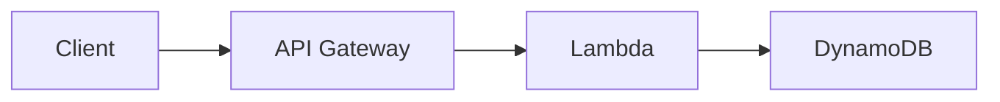

And then AWS adds supporting pieces around that core chain:

- `EventBridge → trigger Lambda`
- `S3 → trigger Lambda`
- `SQS/SNS → trigger Lambda`
- `Step Functions → orchestrate multiple steps`
- `Cognito → authenticate users / give temporary AWS credentials`
- `CloudFront Functions / Lambda@Edge → run logic near users`
- `RDS Proxy → safely connect many Lambdas to RDS`

**This section is an SAA-level overview, not Developer-exam depth — don't over-study syntax.** Focus on architecture choices, integrations, and exam triggers.

## What "Serverless" Means

**Serverless does not mean servers do not exist.** It means AWS manages the underlying servers for you. Typical characteristics:

- no server provisioning
- automatic scaling
- pay based on usage
- focus on application/code instead of machines

Examples of serverless AWS services: AWS Lambda, DynamoDB, API Gateway, Kinesis Data Firehose, Aurora Serverless, Step Functions, and Fargate.

## EC2 vs Lambda

This is the easiest way to understand Lambda.

### EC2

You provision CPU, RAM, and instance count. EC2 keeps running even when nothing happens. You may scale using [Auto Scaling Groups](../compute/load-balancing-asg.md).

### Lambda

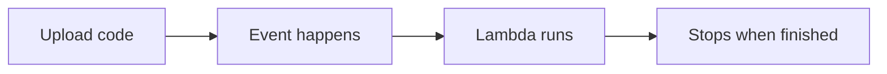

No [EC2](../compute/ec2.md) instance management.

#### Key Difference

| EC2 | Lambda |
|---|---|
| Virtual server | Function |
| Runs continuously | Runs on demand |
| You manage capacity | AWS scales automatically |
| Long-running workloads | Short-lived execution |
| Server-based | Serverless |

## AWS Lambda

### Lambda Execution Model

AWS Lambda lets you **run code without managing servers.** The function runs only when invoked.

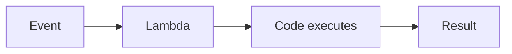

### Execution Duration Limit

A Lambda execution is limited to **15 minutes maximum**. This is one of the few Lambda limits worth remembering.

!!! warning "Exam Trigger"
    "Job runs for 45 minutes" → Lambda is not suitable. Think instead about another compute service such as containers/EC2 depending on the question.

### Automatic Scaling

Suppose one request arrives: `Request → Lambda execution`. Many requests arrive: `Request 1 → Lambda`, `Request 2 → Lambda`, `Request 3 → Lambda`, `Request 4 → Lambda`. AWS automatically creates concurrent executions — you do not manually launch servers.

### Pricing Model

You pay mainly for:

- number of invocations
- execution duration/resources

There is a free tier, but for SAA the important concept is: **you pay when Lambda runs rather than paying for an always-running server.** Don't memorize old prices.

### Memory and CPU

Lambda lets you configure memory. Important relationship:

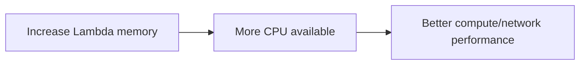

So memory affects more than just RAM. Lambda memory goes up to **10 GB**.

### Supported Languages

The lecture mentions support for Python, Node.js, Java, C#, PowerShell, Ruby, and custom runtimes. **You do not need to memorize all of them.** For the exam, just understand: Lambda supports multiple programming languages.

### Lambda vs Container Images

Lambda can run functions packaged as container images. However, there's an important exam distinction:

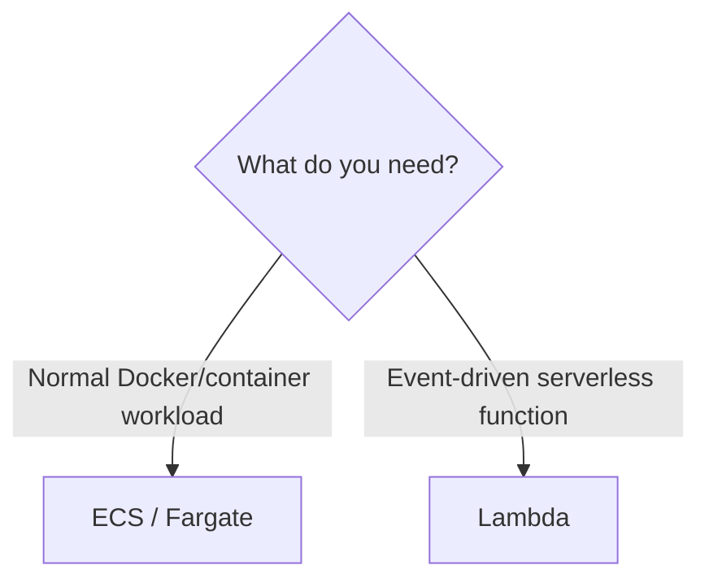

!!! tip "Memory"
    Containers as the architecture → [ECS/Fargate](../containers-serverless/ecs-eks-k8s.md). Functions as the architecture → Lambda.

### Major Lambda Integrations

This is much more important than Lambda syntax. Lambda can be triggered by or connected to:

- `API Gateway → Lambda`
- `S3 → Lambda`
- `SNS → Lambda`
- `SQS → Lambda`
- `EventBridge → Lambda`
- `DynamoDB → Lambda`
- `Kinesis → Lambda`
- `CloudFront → Lambda@Edge`
- `Cognito → Lambda`
- `CloudWatch Logs → Lambda`

SNS/SQS triggers are covered in depth on the [SQS/SNS decoupling](../messaging/decoupling-sqs-sns.md) page; Kinesis triggers are covered on the [data analytics](../data-analytics/data-analytics.md) page.

The exam often asks: "An event happens. Automatically execute code." Think: **Lambda**.

### S3 → Lambda Architecture

A classic serverless architecture: a user uploads an image to [S3](../storage/s3.md) and a thumbnail must automatically be generated.

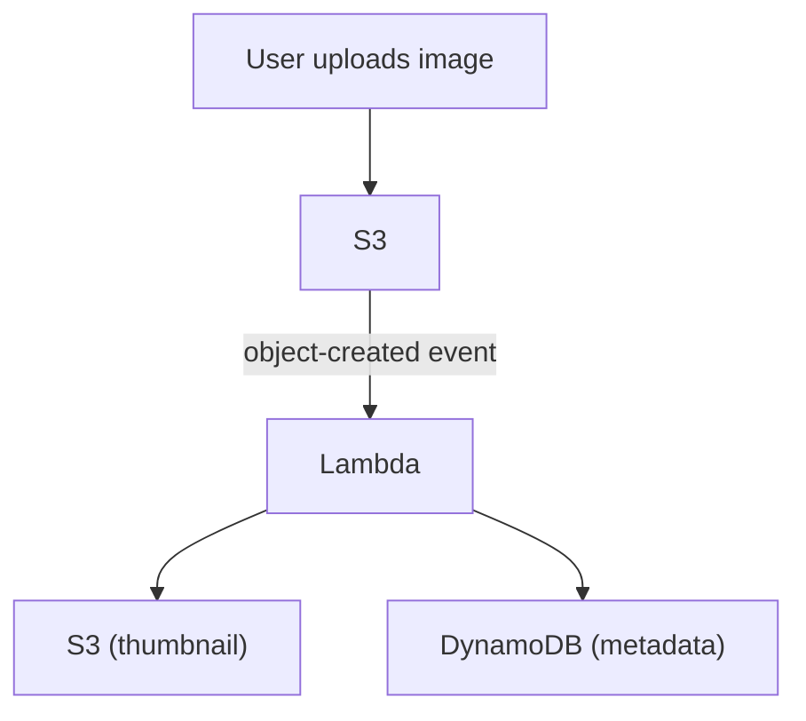

!!! warning "Exam Trigger"
    "Automatically process a file when uploaded to S3" → **S3 Event + Lambda**

### EventBridge — Serverless Scheduled Jobs

Traditional approach: an EC2 instance runs `cron`, and a job runs every hour. Problem: EC2 must exist even when the job isn't running.

Serverless version:

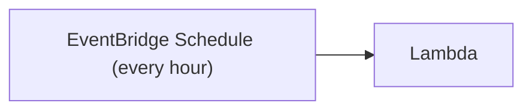

!!! warning "Exam Trigger"
    "Run small code every hour without managing servers" → **EventBridge + Lambda**

### Lambda Execution Role

Lambda needs permissions when accessing AWS services — for example, Lambda needs to read S3. Permissions are attached through the **Lambda Execution Role**, an [IAM role](../security/iam.md):

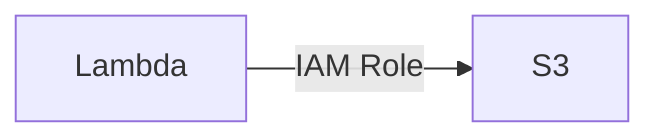

Same fundamental IAM principle you've already learned: never hard-code AWS credentials inside the application.

### Lambda + CloudWatch

Lambda integrates naturally with CloudWatch, used for Lambda metrics, execution monitoring, logs, and troubleshooting.

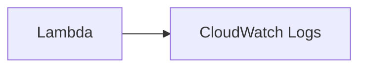

If Lambda prints/logs information, CloudWatch Logs is where you normally inspect it.

### Lambda Important Limits

The ones worth remembering for SAA:

- Maximum execution → **15 minutes**
- Memory → **up to 10 GB**
- `/tmp` temporary storage → **up to 10 GB**
- Default regional concurrency → **around 1,000**

Package and environment-variable limits are also mentioned, but those are lower priority.

!!! tip "Exam Shortcut"
    30-minute execution → NOT Lambda. Very large persistent local storage requirement → Lambda probably not appropriate.

### Lambda /tmp Storage

Lambda has temporary disk storage at `/tmp`. Use it for temporary downloaded files, temporary processing, and intermediate data. It is not your permanent database/storage solution.

### Lambda Concurrency, Throttling & Scaling

Concurrency means: how many Lambda executions are running at the same time? Example: 100 simultaneous requests → potentially many Lambda executions.

#### Reserved Concurrency

You can put a limit on a specific Lambda function. Example: reserved concurrency = 50 means this function can run at most 50 concurrent executions. Why? Because one Lambda function could otherwise consume too much account concurrency.

#### Account-Wide Concurrency Problem

Example: account concurrency = 1000. If Function A suddenly consumes all 1000 concurrent executions, Function B and Function C get throttled — one noisy function can starve every other function in the account.

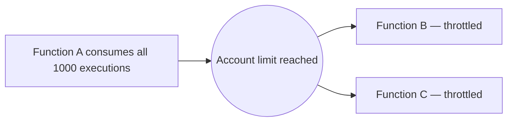

Reserved concurrency helps isolate capacity so this can't happen.

#### Lambda Throttling

If Lambda cannot accept more executions, the invocation is throttled. The behavior depends on invocation type.

##### Synchronous Invocation

The caller receives a throttling error — **HTTP 429**.

##### Asynchronous Invocation

Lambda can retry the event internally:

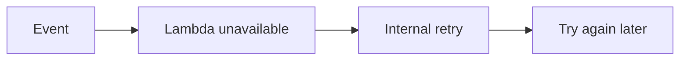

### Cold Starts & Provisioned Concurrency

**Reserved Concurrency** and **Provisioned Concurrency** sound similar but do different things.

#### Reserved vs Provisioned Concurrency

- Reserved Concurrency controls the maximum concurrency capacity available to the function — think **LIMIT / GUARANTEE CAPACITY**.
- Provisioned Concurrency keeps Lambda execution environments ready before requests arrive, to reduce cold-start latency — think **PRE-WARMED Lambda**.

!!! tip "Memory Trick"
    Reserved → reserve capacity. Provisioned → pre-provision warm environments.

#### Lambda Cold Start

When AWS creates a new Lambda execution environment:

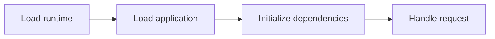

This initialization takes extra time — that initial extra latency is called **Cold Start**. Later requests using the already-initialized environment can be faster.

#### Reducing Cold Starts with Provisioned Concurrency

For latency-sensitive applications:

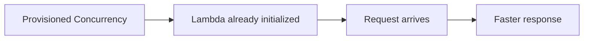

Tradeoff: provisioned concurrency costs money because capacity is kept ready.

#### Lambda SnapStart

**Lambda SnapStart** reduces initialization time. Basic idea:

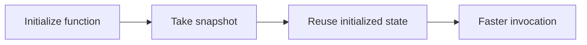

Java, Python, and .NET support are specifically mentioned. For the SAA exam, remember the concept — cold-start/initialization optimization → **Lambda SnapStart**. Do not over-study its internals.

### Lambda Networking & VPC Access

#### Default Networking Behavior

By default, Lambda runs outside your VPC in AWS-managed networking. Therefore it can normally reach public AWS/public endpoints — `Lambda → DynamoDB` works because DynamoDB is exposed as an AWS service endpoint. But `Lambda → Private RDS` does not automatically work.

#### Lambda Inside a VPC

If Lambda must access private resources, configure Lambda with a [VPC](../networking/vpc.md), subnets, and security groups. Then Lambda gets network connectivity into your VPC:

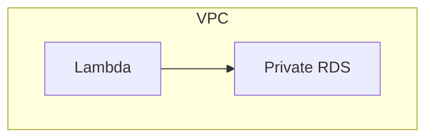

Now `Lambda → private RDS` can work.

!!! warning "Exam Trigger"
    "Lambda must access database in private subnet" → Configure Lambda for the VPC.

#### Lambda + RDS Connection Problem

Suppose traffic grows — many concurrent Lambda executions all connecting to RDS. Hundreds/thousands of Lambda executions may create many database connections, which can overload RDS.

#### Lambda + RDS Proxy

Solution: **Amazon RDS Proxy**.

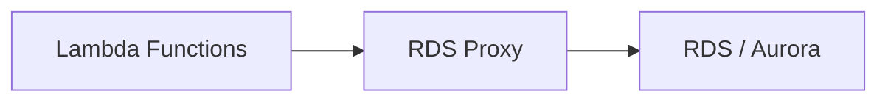

RDS Proxy pools database connections, shares/reuses connections, reduces connection pressure, improves scalability, and improves failover behavior. See [RDS & Aurora](../databases/rds-aurora.md) for more on RDS itself.

!!! warning "Exam Trigger"
    "Thousands of Lambda functions opening too many RDS connections" → **RDS Proxy**. This is a high-value exam pattern.

#### Lambda + RDS Proxy Networking

RDS Proxy is not publicly accessible. Therefore `Lambda → RDS Proxy` requires appropriate VPC connectivity:

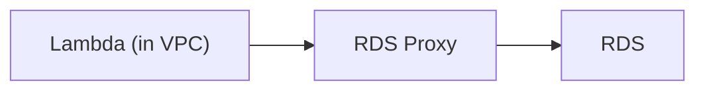

#### RDS Can Invoke Lambda

Supported database engines can also drive database-triggered Lambda invocation:

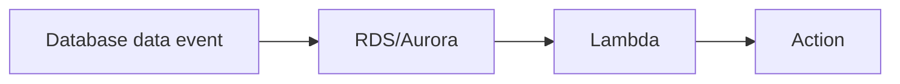

Example: `New user inserted → Lambda → Send welcome email`. Permissions/networking must allow the database to invoke Lambda.

#### RDS Event Notifications ≠ Database Row Events

!!! danger "Important Trap"
    RDS Event Notifications tell you about instance state, snapshots, parameter groups, security groups, proxies, and engine-related events. **They do not tell you** "a row was inserted into this table." Memory: RDS event notification → infrastructure/database-service event, NOT a table-row event.

## Edge Functions — CloudFront Functions vs Lambda@Edge

Sometimes you want code to run close to users:

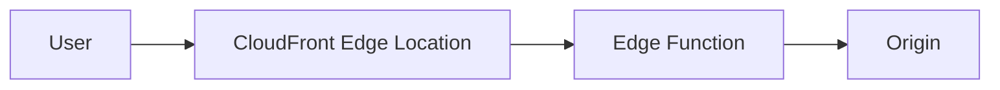

[CloudFront](../networking/cloudfront-global-accelerator.md) offers two approaches here: CloudFront Functions and Lambda@Edge.

### CloudFront Functions

CloudFront Functions are lightweight, JavaScript, very fast, designed for very high scale, and handle viewer request/response logic:

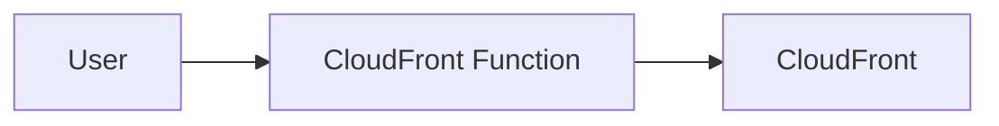

Typical use cases: URL rewrite, redirects, header modification, cache-key normalization, lightweight authorization, JWT validation.

### Lambda@Edge

Lambda@Edge provides more powerful logic. It can operate at Viewer Request, Origin Request, Origin Response, and Viewer Response. It supports more complex processing than CloudFront Functions — external calls, larger logic, more processing time, request-body access, libraries/SDKs.

### CloudFront Functions vs Lambda@Edge

| | CloudFront Functions | Lambda@Edge |
|---|---|---|
| Main purpose | Lightweight edge logic | More complex edge logic |
| Runtime | JavaScript | Node.js / Python |
| Scale | Extremely high | Lower than CF Functions |
| Execution | Very short | Longer |
| Viewer request | ✅ | ✅ |
| Viewer response | ✅ | ✅ |
| Origin request | ❌ | ✅ |
| Origin response | ❌ | ✅ |
| Complex integrations | Limited | Better |

!!! tip "Exam Shortcut"
    Simple, ultra-fast request/header/URL logic → CloudFront Functions. More complex code at the edge → Lambda@Edge.

## DynamoDB + Lambda

[DynamoDB](../databases/database-dynamodb.md) is AWS's fully managed NoSQL database — see that page for the full reference (capacity modes, primary keys, DAX, Global Tables, TTL, backups). The piece most relevant to serverless architectures is **DynamoDB Streams as a Lambda trigger**:

```mermaid
flowchart LR
    A[New user] --> B[DynamoDB] --> C["DynamoDB Stream"] --> D[Lambda] --> E["Send welcome email"]
```

This is a classic event-driven architecture: table changes (INSERT/UPDATE/DELETE) captured by a Stream invoke a Lambda function to react to them. DynamoDB can also send change data into [Kinesis Data Streams](../data-analytics/data-analytics.md) instead, when longer retention, more consumers, or richer stream-processing is needed.

## API Gateway

API Gateway provides managed/serverless APIs. Classic architecture: `Client → API Gateway → Lambda → DynamoDB` — a complete serverless application.

### Why Not Call Lambda Directly?

Clients could invoke Lambda directly, but then they would need appropriate AWS permissions. API Gateway gives you a proper HTTP/API layer:

```mermaid
flowchart LR
    A["Internet Client"] --> B["API Gateway"] --> C[Lambda]
```

And API Gateway adds many API-specific features.

### API Gateway Features

REST APIs, WebSocket APIs, authentication, authorization, throttling, API keys, caching, API versions, stages, request/response transformations, request validation, SDK generation, and OpenAPI/Swagger import/export. For SAA, you don't need implementation details.

### API Gateway Stages

You can create environments such as `/dev`, `/test`, `/prod` — for example `api.example.com/dev` vs `api.example.com/prod`. Stages help deploy different versions/environments of your API.

### API Gateway Integrations

Three important integration categories:

#### Lambda

`Client → API Gateway → Lambda` — the most common serverless API pattern.

#### HTTP Backend

`Client → API Gateway → HTTP endpoint / ALB / on-prem API`. Why add API Gateway in front? For authentication, throttling, caching, API keys, and API management.

#### AWS Service

API Gateway can call AWS APIs directly, which can sometimes eliminate Lambda entirely:

- `Client → API Gateway → SQS`
- `Client → API Gateway → Step Functions`
- `Client → API Gateway → Kinesis Data Streams`

### API Gateway → Kinesis Example

```mermaid
flowchart LR
    A[Clients] --> B["API Gateway"] --> C["Kinesis Data Streams"] --> D["Data Firehose"] --> E[S3]
```

No server management — a nice example of how AWS services can be connected directly.

### API Gateway Endpoint Types

Three important endpoint types: Edge-Optimized, Regional, and Private.

#### Edge-Optimized API Gateway

Best for globally distributed clients — requests benefit from CloudFront edge locations:

```mermaid
flowchart LR
    A["Global User"] --> B["CloudFront Edge"] --> C["API Gateway Region"]
```

#### Regional API Gateway

Best when clients are primarily near the API's AWS Region. You can put your own CloudFront distribution in front if desired.

#### Private API Gateway

Accessible only privately from within your VPC setup, via [Interface VPC Endpoints](../networking/vpc.md):

```mermaid
flowchart LR
    A[VPC] --> B["Interface Endpoint"] --> C["Private API Gateway"]
```

!!! warning "Exam Trigger"
    "API must not be accessible from the public internet" → **Private API Gateway**

### API Gateway Authentication Options

Three major choices:

#### IAM

Good for AWS/internal applications, e.g. `EC2 with IAM role → API Gateway`. See [IAM](../security/iam.md).

#### Cognito

Good for web/mobile users.

#### Lambda Authorizer

Good when custom authentication/authorization logic is required.

### API Gateway Custom Domain

To expose `api.example.com`, use API Gateway, an [ACM](../security/security.md) certificate, and [Route 53](../networking/route53.md):

```mermaid
flowchart LR
    A["Route 53"] --> B["API Gateway custom domain"] --> C["ACM certificate"]
```

Certificate-region details differ between edge-optimized and regional APIs, but the SAA-level idea is: **ACM secures the custom domain.**

### API Gateway Timeout

The API Gateway integration timeout defaults to around **29 seconds**. This creates an important architectural concept: a Lambda function can run much longer than an API Gateway request waits. So very long synchronous HTTP processing is usually not a great fit — asynchronous architectures may be better.

## Step Functions

AWS Step Functions provides **serverless workflow orchestration.** Instead of manually writing complex code like "run A, if success run B, if failure run C, retry B, wait, run D and E in parallel," you define a workflow.

### Step Functions Mental Model

```mermaid
flowchart TD
    A[Start] --> B["Step A"] --> C{Decision}
    C -->|Branch| D[B]
    C -->|Branch| E[C]
    D --> F[Finish]
    E --> F
```

Step Functions handles sequencing, branching, parallel execution, retries, errors, timeouts, and conditions.

### Step Functions Integrations

Step Functions can orchestrate more than Lambda — examples include Lambda, [ECS tasks](../containers-serverless/ecs-eks-k8s.md), EC2, API Gateway, SQS, on-premises workloads, and other AWS services. So don't think "Step Functions = only Lambda." Think: **Step Functions = workflow orchestrator.**

### Human Approval

Step Functions can include a workflow that waits for human action:

```mermaid
flowchart TD
    A["Order submitted"] --> B["Fraud check"] --> C{"Human approval"}
    C -->|Approve| D[Ship]
    C -->|Reject| E[Stop]
```

!!! warning "Exam Trigger"
    "Complex multi-step workflow with retries, branches, or approvals" → **Step Functions**

### Step Functions Use Cases

Order processing, workflow orchestration, data processing, web applications, long multi-step processes. Memory: need many AWS operations coordinated in sequence → Step Functions.

## Cognito

This section focuses mainly on **Identity Pools** in depth; **User Pools** are covered here at the level referenced by their integrations (API Gateway, ALB) rather than as a full deep-dive.

### Cognito Identity Pools

Identity Pools give users **temporary AWS credentials**, which allow users to directly access AWS resources:

```mermaid
flowchart LR
    A["Mobile App"] --> B["Cognito Identity Pool"] --> C["Temporary AWS Credentials"] --> D["S3 / DynamoDB"]
```

### Identity Pool Flow

```mermaid
flowchart TD
    A[User] --> B[Authenticate] --> C["Receive identity token"] --> D["Cognito Identity Pool"] --> E["Exchange token"] --> F["Temporary AWS credentials"] --> G["AWS resources"]
```

Possible identity sources include Cognito User Pools, social identity providers, SAML, and OpenID Connect.

### Cognito Identity Pools + IAM

Identity Pools associate temporary credentials with IAM permissions:

```mermaid
flowchart LR
    A["Authenticated User"] --> B["Temporary IAM credentials"] --> C[S3]
```

You can provide different roles/permissions for different users.

### Fine-Grained DynamoDB Access

An important Cognito use case: let each user access only their own DynamoDB rows/items.

```mermaid
flowchart LR
    A["User A"] --> B[Cognito] --> C["IAM condition"] --> D["Only User A's DynamoDB items"]
```

This enables fine-grained / row-level-style access.

!!! warning "Exam Trigger"
    "Mobile users should directly access only their own DynamoDB records" → Think: **Cognito Identity Pool + IAM conditions**

### Cognito User Pools

User Pools authenticate web/mobile application users, and integrate with API Gateway and Application Load Balancer. The high-level distinction worth memorizing:

- **User Pool** → authenticate users
- **Identity Pool** → give temporary AWS credentials

### Cognito User Pool vs Identity Pool

| Requirement | Service |
|---|---|
| Login/user directory | Cognito User Pool |
| Temporary AWS credentials | Cognito Identity Pool |
| User accesses AWS resources directly | Identity Pool |
| Authenticate web/mobile application users | User Pool |

!!! tip "Memory"
    USER POOL → Who are you? IDENTITY POOL → Here are temporary AWS credentials.

## Serverless Architecture Patterns

### Complete Serverless Architecture

A very common exam architecture:

```mermaid
flowchart LR
    A["Web / Mobile User"] --> B[Cognito] --> C["API Gateway"] --> D[Lambda] --> E[DynamoDB]
```

This gives authentication, API layer, compute, and database — without managing EC2 instances.

### Serverless Event Architecture

Another common architecture — events trigger functions:

```mermaid
flowchart LR
    A[S3] --> E[Lambda]
    B[EventBridge] --> E
    C[SQS] --> E
    D[SNS] --> E
    E --> F[DynamoDB]
```

The key mental model: **events trigger functions.**

### Serverless Database Architecture

```mermaid
flowchart LR
    A["API Gateway"] --> B[Lambda] --> C[DynamoDB]
```

If relational data is required instead:

```mermaid
flowchart LR
    A["API Gateway"] --> B[Lambda] --> C["RDS Proxy"] --> D[RDS]
```

That distinction is important.

### DynamoDB vs RDS in Serverless Questions

#### Use DynamoDB when:

- NoSQL
- huge scale
- flexible schema
- very low latency
- serverless database
- unpredictable traffic
- no joins/relational requirement mentioned

#### Use RDS/Aurora when:

- relational database
- SQL
- relationships
- traditional relational application

For Lambda + RDS: consider RDS Proxy when connection scaling is a concern.

## High-Value Exam Scenarios

| Scenario | Answer |
|---|---|
| Run code whenever an S3 file is uploaded | `S3 → Lambda` |
| Run code every hour without EC2 | `EventBridge → Lambda` |
| Function runs 30 minutes | Not Lambda — Lambda max = 15 min |
| Thousands of Lambdas overload an RDS database with connections | `Lambda → RDS Proxy → RDS` |
| Globally distributed NoSQL database allowing writes in multiple Regions | DynamoDB Global Tables |
| DynamoDB reads need microsecond latency | DAX |
| Automatically remove expired sessions | DynamoDB TTL |
| React whenever an item changes in DynamoDB | `DynamoDB Streams → Lambda` |
| Expose Lambda as REST API | `API Gateway → Lambda` |
| Public API needs authentication, throttling and API keys | API Gateway |
| API should only be reachable privately from the VPC | Private API Gateway |
| Coordinate several Lambda functions with retries and branching | Step Functions |
| Mobile user needs temporary credentials to directly upload to S3 | Cognito Identity Pool |
| Lightweight header/URL manipulation at CloudFront with massive scale | CloudFront Functions |
| Complex logic at the edge involving origin requests | Lambda@Edge |

## What NOT to Over-Memorize

For SAA, don't spend much time memorizing: Lambda Python syntax, exact console steps, exact free-tier prices, every Lambda runtime, every Lambda package-size limit, every API Gateway configuration tab, DynamoDB item-editing UI, exact CloudFront Function quotas, or every Step Functions state type.

Focus instead on: Which service? Why? How does it connect? What problem does it solve?

## Complete Serverless Memory Map

```mermaid
flowchart TD
    A[USERS] --> B[Cognito] --> C["API Gateway"] --> D[Lambda] --> E[DynamoDB]
```

Event-driven:

```mermaid
flowchart LR
    S3 --> L[Lambda]
    SNS --> L
    SQS --> L
    EventBridge --> L
    DynamoDB --> L
```

Relational database:

```mermaid
flowchart LR
    Lambda --> P["RDS Proxy"] --> R["RDS / Aurora"]
```

Orchestration:

```mermaid
flowchart LR
    Lambda --> SF["Step Functions"]
    SQS --> SF
    ECS --> SF
    AWSAPIs["AWS APIs"] --> SF
```

Global edge:

```mermaid
flowchart TD
    U[User] --> CF[CloudFront]
    CF --> CFF["CloudFront Function"]
    CF --> LE["Lambda@Edge"]
    CFF --> O[Origin]
    LE --> O
```

## Final Exam Decision Tree

When you see a serverless question:

| Question | Answer |
|---|---|
| Need to RUN code from an event? | Lambda |
| Execution longer than 15 minutes? | Not Lambda |
| Need serverless NoSQL database? | DynamoDB |
| Unpredictable DynamoDB traffic? | On-Demand |
| Predictable DynamoDB traffic? | Provisioned |
| DynamoDB microsecond cache? | DAX |
| React to DynamoDB changes? | DynamoDB Streams |
| Multi-Region active-active DynamoDB? | Global Tables |
| Automatically expire items? | TTL |
| Public REST API? | API Gateway |
| Private REST API? | Private API Gateway |
| API Gateway authentication for web/mobile? | Cognito |
| Complex workflow? | Step Functions |
| Lambda opening too many DB connections? | RDS Proxy |
| Lambda needs private VPC resource? | Put Lambda in VPC |
| Very small edge logic? | CloudFront Functions |
| More powerful edge logic? | Lambda@Edge |
| Users need temporary AWS credentials? | Cognito Identity Pools |

## Ultra-Short SAA Memory Sheet

- **Lambda**
    - serverless code
    - event driven
    - auto scaling
    - max 15 min
- **Reserved Concurrency**
    - limit/reserve Lambda concurrency
- **Provisioned Concurrency**
    - reduce cold starts
- **SnapStart**
    - faster initialization
- **Lambda in VPC**
    - access private VPC resources
- **Lambda + RDS Proxy**
    - prevent too many DB connections
- **CloudFront Functions**
    - lightweight viewer request/response logic
- **Lambda@Edge**
    - advanced edge processing
- **DynamoDB**
    - serverless NoSQL
    - single-digit ms
    - flexible schema
- **Provisioned DynamoDB**
    - predictable traffic
- **On-Demand DynamoDB**
    - unpredictable/spiky traffic
- **DAX**
    - DynamoDB microsecond cache
- **DynamoDB Streams**
    - react to item changes
- **Global Tables**
    - multi-Region active-active
- **TTL**
    - automatically expire items
- **PITR**
    - continuous DynamoDB backup
- **API Gateway**
    - managed REST/WebSocket API
- **Edge-Optimized API**
    - global clients
- **Regional API**
    - regional clients
- **Private API**
    - VPC-only API
- **Step Functions**
    - orchestrate workflows
- **Cognito User Pool**
    - authenticate users
- **Cognito Identity Pool**
    - temporary AWS credentials

!!! tip "One-Minute Mental Model"
    API Gateway receives the request → Lambda runs the business logic → DynamoDB stores the data → Cognito handles users → Step Functions coordinates complex workflows → EventBridge/S3/SQS/SNS trigger asynchronous work.

    That one mental model covers a large percentage of the useful SAA serverless architecture questions.
