# Data & Analytics

## Kinesis Data Streams

Kinesis Data Streams is for **real-time streaming data**. Examples:

- website clickstream
- IoT data
- application logs
- metrics
- financial transactions
- user activity

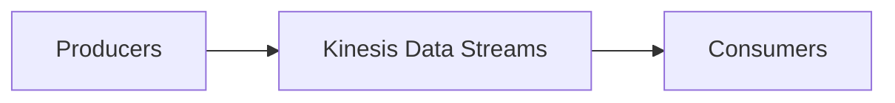

### Kinesis Example

Imagine thousands of users clicking a website:

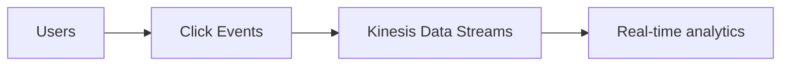

Or IoT:

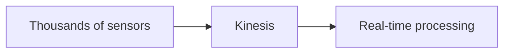

!!! warning "Exam Trigger"
    If the question repeatedly says **real-time streaming**, think **Kinesis Data Streams**.

### Kinesis Data Retention / Replay

Unlike [SNS](../messaging/decoupling-sqs-sns.md), Kinesis Data Streams stores stream records for a retention period — up to **365 days**. Because records remain available, consumers can replay/reprocess old data.

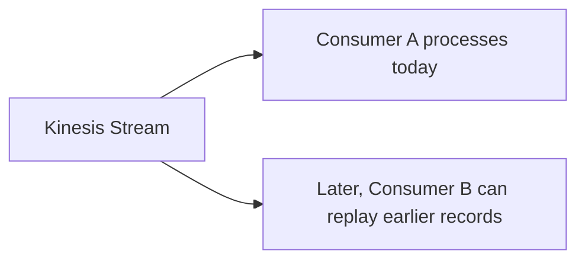

!!! tip "Exam Tip"
    "Need real-time data and ability to replay/reprocess events" → **Kinesis Data Streams**

### Kinesis Shards

With provisioned capacity, a stream is divided into **Shards**. Think: more shards = more throughput.

Per shard:

- Write → 1 MB/s
- Read → 2 MB/s

Do not spend too much time memorizing calculations — understand the architectural meaning.

### Kinesis Capacity Modes

#### Provisioned

You decide the number of shards. You manage capacity. Useful when throughput is predictable.

#### On-Demand

AWS manages stream capacity — as traffic changes, Kinesis automatically scales. Useful for unpredictable workloads.

!!! tip "Exam Tip"
    Unpredictable real-time stream and don't want to manage shards → **Kinesis On-Demand**

### Kinesis Partition Key

Records use a **Partition Key**. It determines the shard used for the record. Records sharing the same partition key are routed consistently, which is important when related events need ordering.

Example: `customer-123` events with the same partition key route to the same shard/order context. You don't need deeper partition mathematics for SAA.

## Amazon Data Firehose

Formerly commonly called **Kinesis Data Firehose**, now **Amazon Data Firehose**. Its purpose is different from Kinesis Data Streams — Firehose **takes streaming data and delivers it to destinations.**

### Architecture

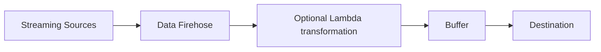

Important destinations:

- Amazon [S3](../storage/s3.md)
- Amazon [Redshift](../databases/database-dynamodb.md)
- Amazon OpenSearch
- supported third-party services
- HTTP endpoints

### Why Firehose Is Near Real-Time

Firehose usually buffers records:

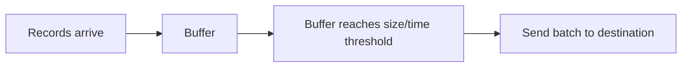

Therefore it is **near real-time**, not strict real-time.

!!! warning "Exam Trigger"
    Streaming data + send automatically to S3 / Redshift / OpenSearch → **Amazon Data Firehose**

### Firehose Transformation

Before delivering records, Firehose can use **Lambda**. Example:

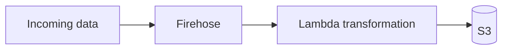

It can also perform supported format conversion/compression. For SAA, understand the capability; don't memorize every format.

## Kinesis Data Streams vs Data Firehose

Very important comparison.

| | Kinesis Data Streams | Data Firehose |
|---|---|---|
| Main purpose | Real-time stream | Deliver streaming data |
| Processing speed | Real-time | Near real-time |
| Data retained | Yes | No stream storage |
| Replay | ✅ | ❌ |
| Consumers | Custom consumers/Lambda/etc. | Managed delivery |
| Capacity | Provisioned or on-demand | Managed/automatic |
| Common use | Real-time processing | S3/Redshift/OpenSearch delivery |

Memory: **Kinesis Data Streams = STREAM + PROCESS.** **Data Firehose = DELIVER.**

This section is mainly about recognizing which analytics service matches the requirement.

## AWS Glue

**Glue = serverless ETL.** (Extract → Transform → Load.)

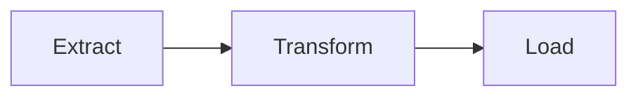

Example — preparing [S3](../storage/s3.md) data for Athena:

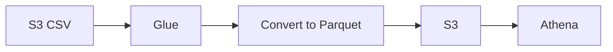

This is a very useful SAA pattern because Parquet makes Athena queries more efficient.

#### Glue Data Catalog

Stores:

- table metadata
- schema
- columns
- data types

Used by services such as:

- Athena
- Redshift Spectrum
- EMR

#### Glue Crawler

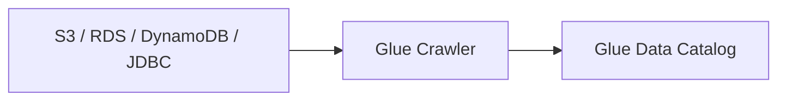

!!! warning "Exam Trigger"
    "Serverless ETL / discover schema / create data catalog." → **AWS Glue**

#### Glue Job Bookmarks

Purpose: prevent processing the same old data again.

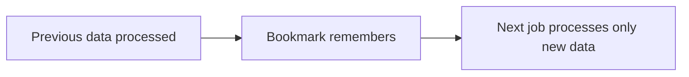

!!! warning "Exam Trigger"
    "ETL job should not reprocess previously processed records." → **Glue Job Bookmark**

## AWS Lake Formation

**Lake Formation = build and govern a data lake on [S3](../storage/s3.md).**

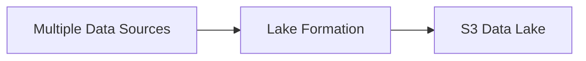

It sits on top of Glue capabilities. The most important SAA feature: **centralized fine-grained permissions**, including:

- row-level access
- column-level access

!!! warning "Exam Trigger"
    "Centralize security for a data lake used by Athena/Redshift/analytics tools." → **Lake Formation**

!!! tip "Memory"
    **Glue** → ETL + Catalog

    **Lake Formation** → Data Lake + centralized governance/security

## Amazon Athena

**Athena = serverless SQL queries directly on S3.**

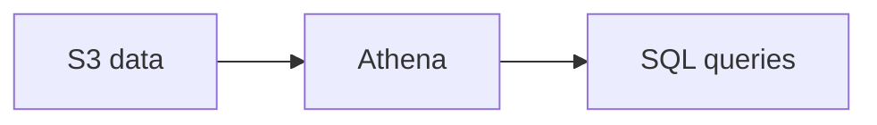

Use for:

- ad-hoc analysis
- logs in S3
- VPC Flow Logs / ELB logs / CloudTrail data
- serverless querying without loading data into a database

#### Performance / Cost

Athena charges based on data scanned, so reduce scanning. Best practices from the lecture:

- **use Parquet / ORC**
- compress files
- partition data
- prefer larger files over many tiny files

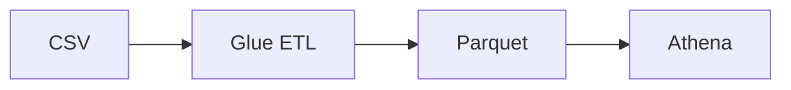

!!! warning "Exam Trigger"
    "Query S3 using SQL without provisioning servers." → **Athena**

## Amazon Redshift

**[Redshift](../databases/database-dynamodb.md) = data warehouse for analytics / OLAP.** Not for normal transactional OLTP workloads.

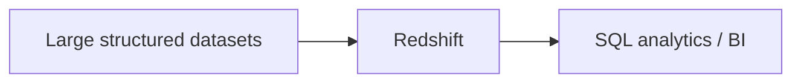

Use for:

- data warehouse
- large analytics workloads
- complex SQL
- joins and aggregations
- BI/reporting

#### Redshift vs Athena

| Athena | Redshift |
|---|---|
| Query files directly in S3 | Data warehouse |
| Serverless | Repeated / heavy analytics |
| Ad-hoc analysis | Faster complex joins / aggregations |

#### Redshift Spectrum

Lets Redshift query data that remains in S3, without first loading all of it into Redshift.

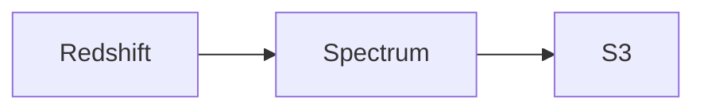

!!! warning "Exam Trigger"
    "Petabyte-scale data warehouse / OLAP." → **Redshift**

## Amazon OpenSearch

**OpenSearch = search and analytics.** Best clue: need to search across many fields, including partial/free-text matches.

Common pattern:

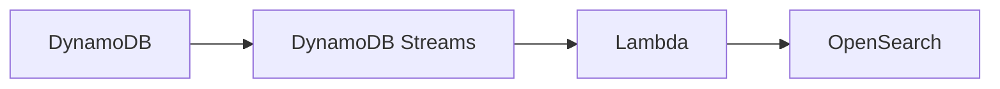

[DynamoDB](../databases/database-dynamodb.md) remains the main data source; OpenSearch provides better search capability.

Use for:

- application search
- log analytics
- full-text search
- partial matching

!!! warning "Exam Trigger"
    "Need full-text / flexible search." → **OpenSearch**

## Amazon EMR

**EMR = managed big-data clusters using Hadoop ecosystem tools.** Think:

- Hadoop
- Spark
- HBase
- Presto
- Flink
- huge-scale data processing

Architecture:

- **EMR Cluster**
    - Master Node
    - Core Nodes
    - Task Nodes

Important exam pattern:

- Master/Core → long-running, reliability important
- Task Nodes → good candidate for [Spot](../compute/ec2.md)

!!! warning "Exam Trigger"
    "Run Hadoop/Spark big-data workloads." → **EMR**

## Managed Service for Apache Flink

Used for: **real-time stream processing**.

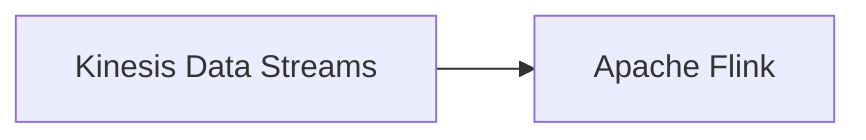

or:

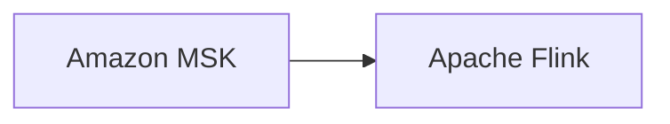

It performs transformations/analytics on streaming data.

!!! info "Important"
    Flink reads Kinesis Data Streams, not Data Firehose.

!!! warning "Exam Trigger"
    "Process/transform streaming data in real time using Apache Flink." → **Managed Service for Apache Flink**

## Amazon MSK

**MSK = Managed Streaming for Apache Kafka.** If a company already uses **Apache Kafka** and wants managed Kafka on AWS → **Amazon MSK**.

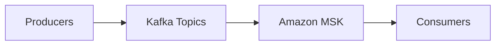

MSK can run across multiple AZs and stores data using [EBS](../compute/ebs.md).

#### MSK Serverless

Use Kafka without managing broker capacity.

!!! warning "Exam Trigger"
    "Existing Apache Kafka workload on AWS." → **Amazon MSK**

## Kinesis vs MSK

| Requirement | Choose |
|---|---|
| AWS-native real-time streaming | Kinesis Data Streams |
| Apache Kafka compatibility | Amazon MSK |

Don't over-study shard/partition differences for SAA unless the question explicitly gives them.

## Amazon QuickSight

**QuickSight = serverless Business Intelligence / dashboards.** It connects to sources such as Athena, Redshift, [RDS](../databases/rds-aurora.md), and S3:

```mermaid
flowchart LR
    A["Athena / Redshift / RDS / S3"] --> B[QuickSight] --> C[Dashboards]
```

Use for:

- dashboards
- business visualization
- BI
- reports

#### SPICE

QuickSight's **in-memory computation engine**, used when data is imported into QuickSight.

!!! warning "Exam Trigger"
    "Build BI dashboards / visualize AWS data." → **QuickSight**

## Complete Data Pipeline

The lecture combines the services into one continuous pipeline:

```mermaid
flowchart TD
    A[IoT Devices] --> B["IoT Core"]
    B --> C["Kinesis Data Streams"]
    C --> D["Data Firehose"]
    D --> E["Optional Lambda transformation"]
    E --> F[S3]
    F --> G[Athena]
    G --> H["S3 reporting data"]
    H --> I[QuickSight]
```

Or for heavier analytics:

```mermaid
flowchart LR
    A[S3] --> B[Redshift] --> C[QuickSight]
```

This teaches one major architecture idea — each stage maps to a specific service:

| Stage | Service |
|---|---|
| COLLECT | Kinesis |
| DELIVER | Firehose |
| STORE | S3 |
| TRANSFORM | Glue / Lambda |
| QUERY | Athena |
| WAREHOUSE | Redshift |
| VISUALIZE | QuickSight |

## SAA Exam Decision Table

| Requirement | Service |
|---|---|
| SQL directly on S3 | Athena |
| Reduce Athena scan cost | Parquet/ORC + partitioning |
| Convert CSV → Parquet | Glue |
| Data warehouse / OLAP | Redshift |
| Query S3 using Redshift engine | Redshift Spectrum |
| Full-text / partial search | OpenSearch |
| Hadoop/Spark cluster | EMR |
| BI dashboards | QuickSight |
| Serverless ETL | Glue |
| Metadata/schema catalog | Glue Data Catalog |
| Data lake governance | Lake Formation |
| Row/column data lake security | Lake Formation |
| Real-time stream processing | Apache Flink |
| Managed Apache Kafka | MSK |

## One-Minute Recall

| Service | Recall |
|---|---|
| Athena | SQL on S3 |
| Redshift | Data warehouse / OLAP |
| Redshift Spectrum | Redshift queries S3 |
| OpenSearch | Search |
| EMR | Hadoop / Spark |
| QuickSight | Dashboards / BI |
| Glue | ETL + Data Catalog |
| Lake Formation | Data Lake + permissions |
| Flink | Real-time stream processing |
| MSK | Managed Kafka |

!!! tip "Memory"
    S3 data → Glue prepares/catalogs → Athena queries → Redshift warehouses → QuickSight visualizes; Kinesis/MSK handles streaming, Flink processes streams, and Lake Formation governs the data lake.
