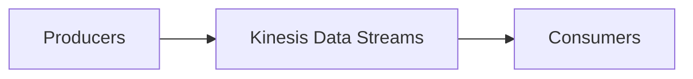
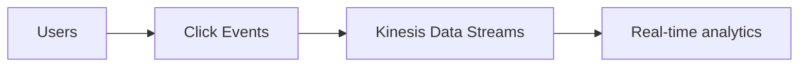
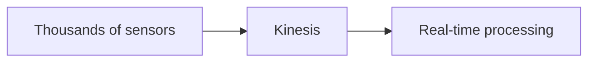
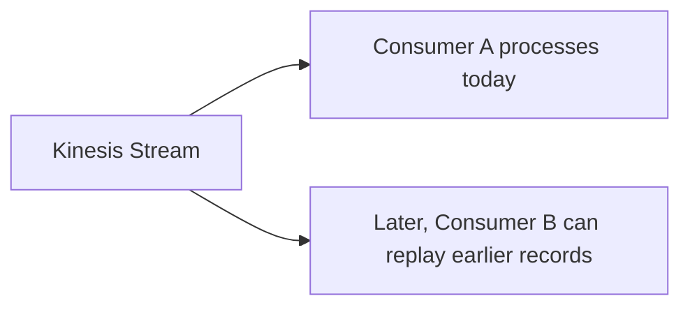
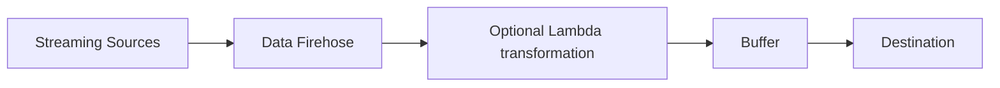
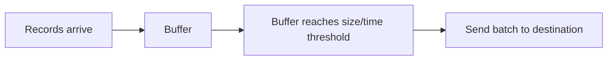
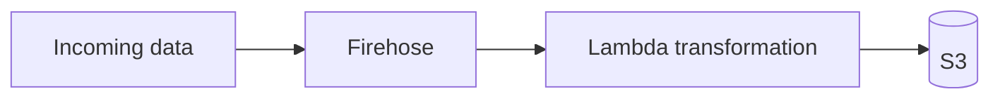

# Data & Analytics

## Kinesis Data Streams

Kinesis Data Streams is for **real-time streaming data**. Examples:

- website clickstream
- IoT data
- application logs
- metrics
- financial transactions
- user activity

### Kinesis Example

Imagine thousands of users clicking a website:

Or IoT:

!!! warning "Exam Trigger"
    If the question repeatedly says **real-time streaming**, think **Kinesis Data Streams**.

### Kinesis Data Retention / Replay

Unlike [SNS](../messaging/decoupling-sqs-sns.md), Kinesis Data Streams stores stream records for a retention period — up to **365 days**. Because records remain available, consumers can replay/reprocess old data.

!!! tip "Exam Tip"
    "Need real-time data and ability to replay/reprocess events" → **Kinesis Data Streams**

### Kinesis Shards

With provisioned capacity, a stream is divided into **Shards**. Think: more shards = more throughput.

Per shard:

- Write → 1 MB/s
- Read → 2 MB/s

Do not spend too much time memorizing calculations — understand the architectural meaning.

### Kinesis Capacity Modes

#### Provisioned

You decide the number of shards. You manage capacity. Useful when throughput is predictable.

#### On-Demand

AWS manages stream capacity — as traffic changes, Kinesis automatically scales. Useful for unpredictable workloads.

!!! tip "Exam Tip"
    Unpredictable real-time stream and don't want to manage shards → **Kinesis On-Demand**

### Kinesis Partition Key

Records use a **Partition Key**. It determines the shard used for the record. Records sharing the same partition key are routed consistently, which is important when related events need ordering.

Example: `customer-123` events with the same partition key route to the same shard/order context. You don't need deeper partition mathematics for SAA.

## Amazon Data Firehose

Formerly commonly called **Kinesis Data Firehose**, now **Amazon Data Firehose**. Its purpose is different from Kinesis Data Streams — Firehose **takes streaming data and delivers it to destinations.**

### Architecture

Important destinations:

- Amazon [S3](../storage/s3.md)
- Amazon [Redshift](../databases/database-dynamodb.md)
- Amazon OpenSearch
- supported third-party services
- HTTP endpoints

### Why Firehose Is Near Real-Time

Firehose usually buffers records:

Therefore it is **near real-time**, not strict real-time.

!!! warning "Exam Trigger"
    Streaming data + send automatically to S3 / Redshift / OpenSearch → **Amazon Data Firehose**

### Firehose Transformation

Before delivering records, Firehose can use **Lambda**. Example:

It can also perform supported format conversion/compression. For SAA, understand the capability; don't memorize every format.

## Kinesis Data Streams vs Data Firehose

Very important comparison.

| | Kinesis Data Streams | Data Firehose |
|---|---|---|
| Main purpose | Real-time stream | Deliver streaming data |
| Processing speed | Real-time | Near real-time |
| Data retained | Yes | No stream storage |
| Replay | ✅ | ❌ |
| Consumers | Custom consumers/Lambda/etc. | Managed delivery |
| Capacity | Provisioned or on-demand | Managed/automatic |
| Common use | Real-time processing | S3/Redshift/OpenSearch delivery |

Memory: **Kinesis Data Streams = STREAM + PROCESS.** **Data Firehose = DELIVER.**
