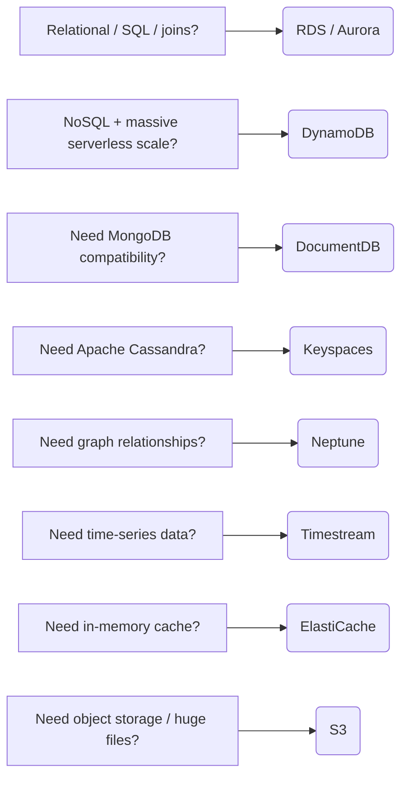
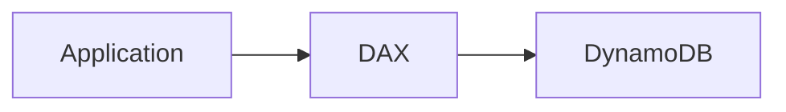
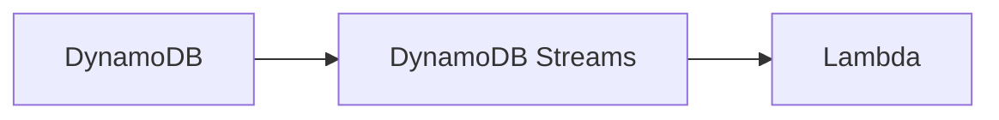
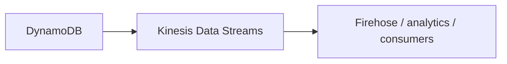
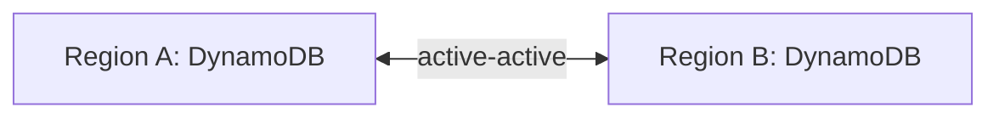
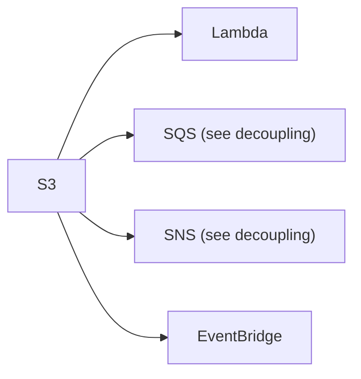
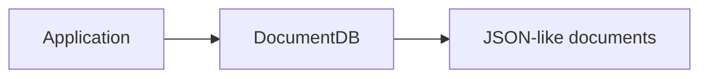
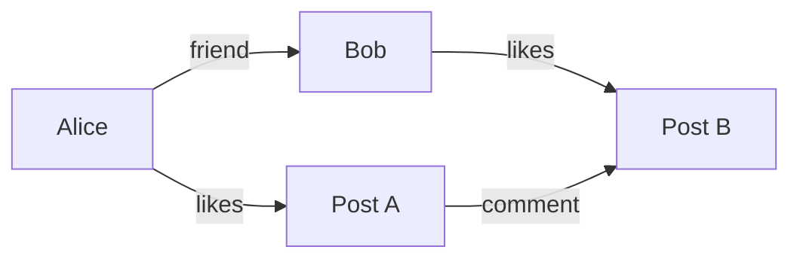
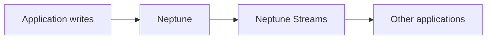
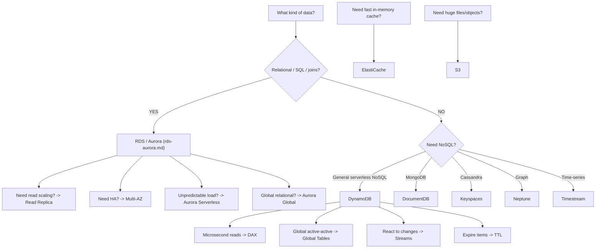

# DynamoDB & Other Databases

This section is mainly about one skill: **given a workload, choose the right database.** You do not need deep DBA knowledge. For SAA, focus on:

- What type of data?
- How is it queried?
- Read-heavy or write-heavy?
- Predictable or spiky traffic?
- Relational or NoSQL?
- Need caching?
- Need global access?
- Need graph / time-series / MongoDB / Cassandra compatibility?

## Database Decision Map



This map is the most useful thing from the whole section. The RDS/Aurora branch (read replicas, Multi-AZ, Aurora Serverless, Aurora Global) is covered in full on [RDS & Aurora](rds-aurora.md).

## Choosing the Right Database

The question may describe:

- read-heavy vs write-heavy
- predictable vs sudden traffic
- relational vs non-relational
- strong schema vs flexible schema
- joins
- object size
- latency
- global users
- analytics/reporting
- search
- graph relationships
- time-series data
- database compatibility requirements

**Your job is to identify the strongest clue.**

| Signal | Answer |
|---|---|
| "Need joins and SQL" | RDS / Aurora |
| "Need flexible schema and massive scale" | DynamoDB |
| "Existing MongoDB workload" | DocumentDB |
| "Social network relationships" | Neptune |

## Amazon DynamoDB

### What Is DynamoDB?

DynamoDB is a fully managed, serverless NoSQL database. Important characteristics:

- highly available
- Multi-AZ
- massive scale
- millisecond latency
- flexible schema
- IAM integrated

!!! warning "Exam Trigger"
    Serverless NoSQL → **DynamoDB**

### When DynamoDB Fits Best

Think:

- web/mobile backend
- serverless application
- massive request scale
- flexible/evolving schema
- key/value/document data
- low latency
- no relational joins required

### DynamoDB Capacity Modes: Provisioned vs On-Demand

Two important modes.

#### Provisioned

You provision **RCU** (Read Capacity Units) and **WCU** (Write Capacity Units). Best for:

- predictable workloads
- smooth traffic
- cost optimization

Auto Scaling can adjust capacity.

#### On-Demand

AWS handles capacity automatically. Best for:

- unpredictable workload
- sudden steep spikes
- unknown demand
- very infrequent access

!!! warning "Exam Rule"
    Predictable → **Provisioned**

    Unpredictable / sudden spikes → **On-Demand**

    This is highly testable.

### DynamoDB TTL

TTL automatically expires items.

!!! example "Example"
    A session item has `expires_at = 10 PM`. Once the item expires, DynamoDB deletes it.

Excellent for:

- web sessions
- temporary data
- expiring records

!!! warning "Exam Trigger"
    "Automatically remove session data after 2 hours." → **DynamoDB TTL**

### DAX — DynamoDB Accelerator

DAX = DynamoDB Accelerator.



Purpose: cache DynamoDB reads. Keyword: **microsecond read latency**.

!!! warning "Exam Trigger"
    "DynamoDB workload needs microsecond cached reads." → **DAX**

### DynamoDB Streams

Tracks changes such as `INSERT`, `UPDATE`, `DELETE`.



!!! example "Example"
    New customer inserted → DynamoDB Stream → [Lambda](../containers-serverless/serverless.md) → send welcome email.

!!! warning "Exam Trigger"
    "React whenever DynamoDB data changes." → **DynamoDB Streams**

### DynamoDB → Kinesis Data Streams

Instead of DynamoDB Streams, changes may be sent into [Kinesis Data Streams](../data-analytics/data-analytics.md). Why? Think:

- longer retention
- more consumers
- richer streaming integrations



### DynamoDB Global Tables

Purpose: multi-Region DynamoDB.



Applications can read/write across Regions.

!!! warning "Exam Keyword"
    **Active-Active multi-Region NoSQL** → **DynamoDB Global Tables**

### DynamoDB Backup & Restore

#### Point-in-Time Recovery

Up to 35 days. Restores to **a new table**.

#### On-Demand Backups

Used for longer-term backup retention. Again, restore creates a new table.

### DynamoDB Export / Import via S3

**Export:** `DynamoDB → S3`. Useful for:

- analytics
- auditing
- ETL

The lecture emphasizes: export doesn't consume DynamoDB read capacity.

**Import:** `S3 → new DynamoDB table` — doesn't consume normal table write capacity in the described import process.

This is lower priority, but worth recognizing.

## Amazon ElastiCache (Quick Reference)

ElastiCache is managed Redis / Memcached — an in-memory data store/cache for extremely fast access to frequently used data. The full architecture (cache-aside/lazy loading, write-through, TTL, session store, Redis vs Memcached, cluster mode, endpoints, networking, security) is already covered in depth on [RDS, Aurora & ElastiCache](rds-aurora.md) — this page only adds one nuance the source material calls out separately:

#### Important ElastiCache Exam Point

The lecture explicitly emphasizes: **your application must be changed to use ElastiCache.** So if the question asks for "add caching **without** modifying application code," ElastiCache may not fit that exact requirement.

## Amazon S3 as a Data Store

S3 stores **objects**: images, videos, backups, logs, static files, large files. From a data-model perspective: `Key → Object`. Remember from previous chapters — serverless, enormous scale, versioning, lifecycle, replication, encryption, event notifications — full [S3](../storage/s3.md) details live on the storage page.

S3 is **not** a relational database — don't choose S3 when the workload needs:

- joins
- transactional row updates
- traditional database queries

Choose S3 when data is naturally stored as objects/files. Events can trigger downstream processing:



See [SQS/SNS decoupling](../messaging/decoupling-sqs-sns.md) and [EventBridge](../containers-serverless/serverless.md) for those integrations.

**Large objects/files → S3. Small structured database records → a database service.** Do not overfocus on exact current object-size limits here; the service choice matters more for SAA.

## Amazon DocumentDB

DocumentDB is AWS's managed document database with **MongoDB compatibility**. It is NoSQL. Use when applications already use MongoDB-style document workloads.

### Data Model

MongoDB-style data commonly looks like JSON documents. You want to store, query, and index document data.



!!! warning "Exam Trigger"
    "MongoDB" → **Amazon DocumentDB**. That's the key thing to memorize.

## Amazon Neptune

Neptune is AWS's managed **graph database**. Graph databases are optimized for relationships.

### Graph Example



Questions may involve:

- who is connected to whom?
- friends-of-friends
- relationship traversal
- recommendation paths

These are graph problems.

### Neptune Use Cases

Strong exam clues:

- social networks
- recommendation engines
- fraud detection
- knowledge graphs
- highly connected datasets

!!! warning "Exam Trigger"
    "Graph database" → **Neptune**. Very strong one-to-one mapping.

### Neptune Streams

Neptune Streams records changes to graph data.



Can be used for:

- notifications
- synchronization
- downstream processing

This is lower priority than simply knowing: **Neptune = graph**.

## Amazon Keyspaces

Amazon Keyspaces is a managed **Apache Cassandra**-compatible database. Cassandra is distributed, NoSQL, and highly scalable — AWS manages it for you.

### Keyspaces Characteristics

Lecture highlights:

- serverless-style management
- scalable
- highly available
- Multi-AZ replication
- CQL — Cassandra Query Language
- low latency
- provisioned/on-demand capacity options

But for SAA, the killer clue is: **Apache Cassandra**.

!!! warning "Exam Trigger"
    Existing Cassandra application → **Amazon Keyspaces**. That's almost all you need.

Potential use cases mentioned: IoT data, time-series-like workloads, large distributed NoSQL workloads. But if the question specifically says Cassandra, stop searching — the answer is **Keyspaces**.

## Amazon Timestream

Amazon Timestream is a **time-series database**. Time-series means data points associated with time.

!!! example "Example"
    ```
    10:00 → CPU 20%
    10:01 → CPU 31%
    10:02 → CPU 42%
    10:03 → CPU 51%
    ```

### Timestream Use Cases

Think:

- IoT sensor metrics
- operational metrics
- monitoring data
- measurements over time
- near-real-time time-series analytics

!!! warning "Exam Trigger"
    "Time-series database" → **Amazon Timestream**. Again, very strong one-to-one mapping.

### Timestream Storage Concept

The lecture explains:

- Recent data → memory-oriented fast tier
- Historical data → cost-optimized storage

Timestream automatically manages this architecture. You don't need to design separate databases yourself.

### Timestream Integrations

Sources such as IoT, [Kinesis](../data-analytics/data-analytics.md), and monitoring systems. Consumers such as QuickSight, SageMaker, Grafana, and SQL/JDBC applications.

For SAA, don't memorize every integration. Remember: **time-stamped data at large scale → Timestream**.

## Highest-Value Database Comparisons

### RDS vs DynamoDB

|  | RDS | DynamoDB |
|---|---|---|
| Model | Relational | NoSQL |
| SQL | ✅ | Not traditional relational SQL |
| Joins | ✅ | ❌ |
| Schema | Structured | Flexible |
| Serverless-style | Not normally | ✅ |
| Massive sudden scale | Less natural | Excellent |
| Main trigger | SQL/relational | Serverless NoSQL |

### Quick Comparisons

| Comparison | Answer |
|---|---|
| Need traditional managed relational database | RDS (full detail: [RDS & Aurora](rds-aurora.md)) |
| Need AWS-native MySQL/PostgreSQL with more built-in scaling/HA features | Aurora (full detail: [RDS & Aurora](rds-aurora.md)) |
| AWS-native serverless NoSQL key/value/document | DynamoDB |
| MongoDB-compatible workload | DocumentDB |
| General AWS-native NoSQL | DynamoDB |
| Apache Cassandra compatibility | Keyspaces |
| General NoSQL app data | DynamoDB |
| Data is fundamentally measurements over time | Timestream |
| Key/value or document data | DynamoDB |
| Relationships/graph traversal | Neptune |
| Need more SQL read capacity | Read Replica (see [RDS & Aurora](rds-aurora.md)) |
| Same data repeatedly requested | ElastiCache |

### DynamoDB vs DAX

**DAX is not another database.**

- DynamoDB = database.
- DAX = cache in front of DynamoDB.

Architecture: `App → DAX → DynamoDB`

## SAA Database Trigger Table

| Question wording | Think |
|---|---|
| SQL / relational / joins | RDS / Aurora |
| Read-heavy RDS | Read Replica |
| RDS high availability | Multi-AZ |
| AWS-native MySQL/PostgreSQL | Aurora |
| Unpredictable relational workload | Aurora Serverless |
| Global relational database | Aurora Global |
| Cache repeated DB queries | ElastiCache |
| Session store | ElastiCache or DynamoDB depending scenario |
| Serverless NoSQL | DynamoDB |
| Sudden unpredictable DynamoDB load | On-Demand |
| Predictable DynamoDB load | Provisioned |
| DynamoDB microsecond reads | DAX |
| React to DynamoDB changes | DynamoDB Streams |
| Multi-Region active-active NoSQL | DynamoDB Global Tables |
| Expiring session data | DynamoDB TTL |
| MongoDB | DocumentDB |
| Graph relationships | Neptune |
| Apache Cassandra | Keyspaces |
| Time-series metrics | Timestream |
| Huge objects/files | S3 |

## What NOT to Over-Memorize

For this SAA section, don't burn time on:

- exact number of Neptune read replicas
- exact DocumentDB storage growth increments
- every Keyspaces backup detail
- every Timestream integration
- every supported RDS engine version
- exact S3 object-size trivia
- exact database throughput numbers

Spend your memory on: **DATABASE TYPE + CORE USE CASE + HA / SCALING FEATURE + EXAM KEYWORD.**

## Complete Database Decision Tree



!!! tip "One-Minute Recall"
    RDS → relational SQL · Read Replica → read scaling · Multi-AZ → high availability

    Aurora → AWS-native MySQL/PostgreSQL · Aurora Serverless → unpredictable relational workload · Aurora Global → global relational database

    ElastiCache → in-memory cache / sessions

    DynamoDB → serverless NoSQL · Provisioned → predictable · On-Demand → unpredictable/spiky · DAX → microsecond DynamoDB cache · Streams → react to changes · Global Tables → multi-Region active-active · TTL → expire items

    DocumentDB → MongoDB · Neptune → Graph · Keyspaces → Cassandra · Timestream → Time-series · S3 → huge objects/files

**The highest-value SAA skill from this section is being able to look at a question and immediately classify the data model:** SQL → RDS/Aurora | NoSQL → DynamoDB | MongoDB → DocumentDB | Graph → Neptune | Cassandra → Keyspaces | Time-series → Timestream | Cache → ElastiCache | Files/objects → S3.
