# RDS, Aurora & ElastiCache

This is the chapter-level revision sheet. The most important skill for the exam is deciding:

**Do I need availability, read scaling, connection scaling, caching, global reads, unpredictable compute, or database-level customization?**

## Big Picture — Start Here

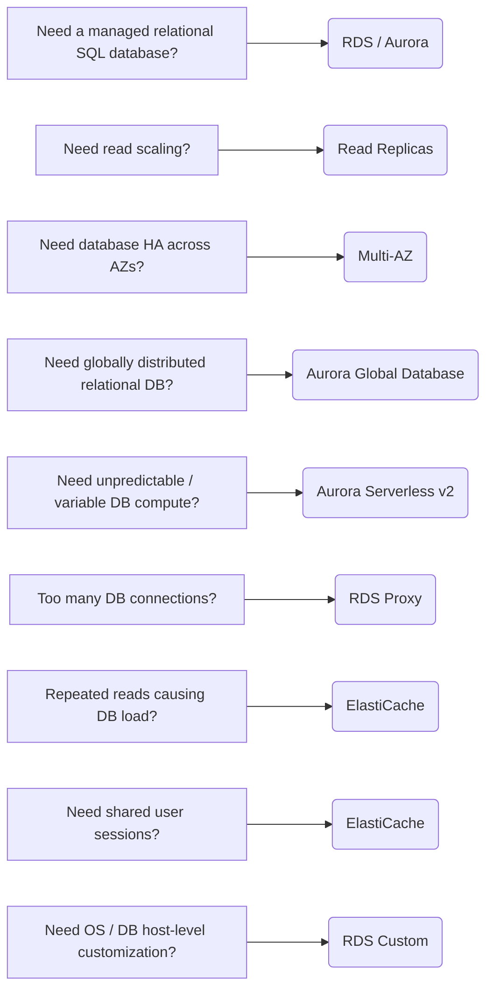

The four memory anchors:

- **Read Replica = SCALE**
- **Multi-AZ = SURVIVE**
- **ElastiCache = CACHE**
- **RDS Proxy = CONNECTIONS**

## Amazon RDS — Core Idea

**RDS = managed relational database service.**

Important engines include:

- PostgreSQL
- MySQL
- MariaDB
- Oracle
- Microsoft SQL Server
- IBM Db2
- Amazon Aurora

AWS manages much of the infrastructure work:

- database provisioning
- OS maintenance/patching
- backups
- monitoring
- recovery
- Multi-AZ capabilities
- read replicas

!!! info "Important"
    With normal RDS, you do not SSH into the underlying database host. If the exam requires underlying OS/database host access → think **RDS Custom**.

## RDS Storage Auto Scaling

RDS can automatically increase storage when available storage becomes low. You configure a **Maximum Storage Threshold**, and RDS can then grow storage automatically up to that limit.

!!! example "Example"
    Database starts at `100 GB`. Application continues growing. Instead of manually modifying storage every time, `RDS Storage Auto Scaling → automatically increases storage`.

!!! warning "Exam Trigger"
    "Database storage requirements are unpredictable and administrators don't want to manually resize storage." → **RDS Storage Auto Scaling**

Important: **it scales storage, not CPU/database instance size.**

## RDS Read Replicas

### Purpose & Architecture

Purpose: **READ SCALING**

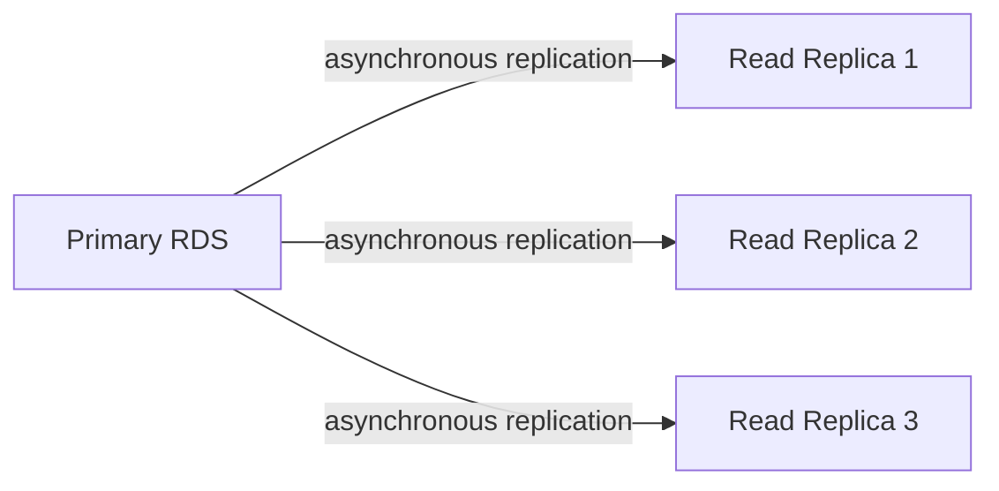

Applications send **writes → primary** and **reads → replicas**.

### Example — Offloading Reporting Queries

Suppose your database handles application transactions and large reporting queries, and the reporting queries overload the primary. Solution:

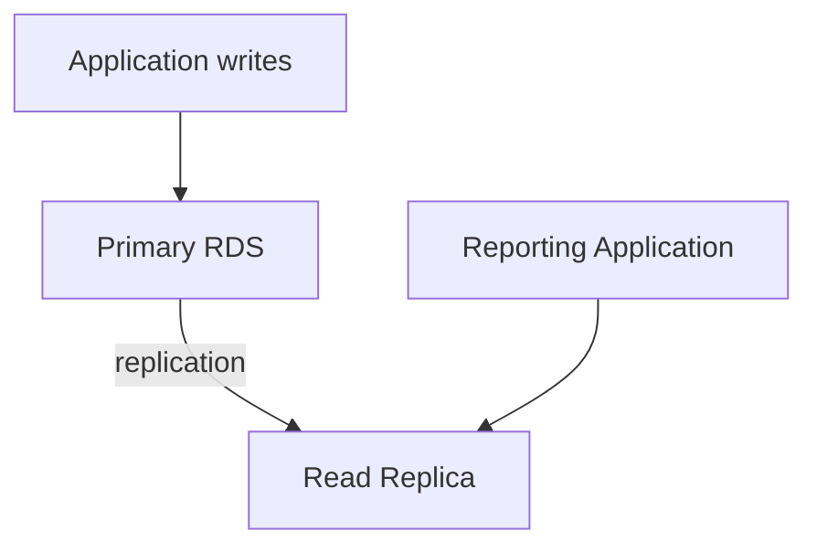

Now reporting queries don't overload the primary.

!!! warning "Exam Trigger"
    "Read-heavy database" → **Read Replicas**

    "Reporting/analytics workload is slowing production database." → create a **Read Replica** and run reports there.

### Replication Properties

Replication is generally **asynchronous**, so replicas can have **replication lag / eventual consistency** — a write to primary may not immediately appear on the replica.

!!! info "Important"
    Each replica has its own endpoint. Your application needs to know where to send read queries — standard RDS doesn't automatically distribute every read across replicas like an ALB.

### Promotion

A Read Replica can be **promoted into an independent database**:

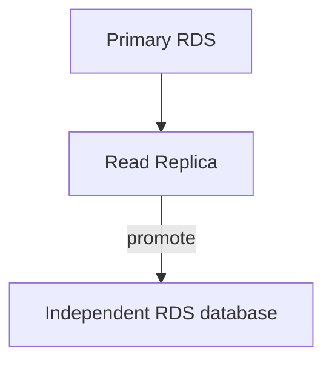

Useful for:

- DR scenarios (see [Disaster Recovery](../resilience/disaster-recovery.md))
- creating independent environments
- migration/change scenarios

But remember: **Read Replica's primary purpose = read scaling**, not high availability.

### Cross-Region Read Replicas

Read replicas can exist in the:

- same AZ
- different AZ
- different Region

A Cross-Region Read Replica can provide:

- local reads in another Region
- regional DR possibilities

But replication across Regions incurs networking considerations/cost and remains asynchronous.

## RDS Multi-AZ

### Core Idea

Purpose: **HIGH AVAILABILITY / DISASTER RECOVERY**

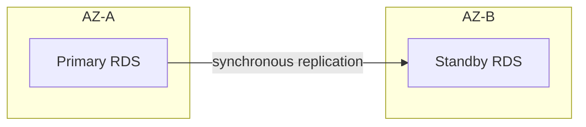

If the primary fails:

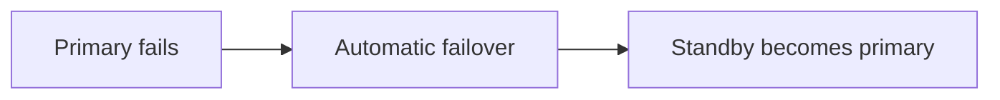

### Classic Multi-AZ DB Instance

Very important exam characteristics:

- one primary
- one synchronous standby in another AZ
- automatic failover
- same database DNS endpoint
- **standby is not used for read scaling**

!!! warning "Exam Trigger"
    "Database must survive AZ failure." → **Multi-AZ**

    "Need automatic database failover." → **Multi-AZ**

### Read Replica vs Multi-AZ

This comparison is essential.

| Requirement | Read Replica | Multi-AZ |
|---|---|---|
| Read scaling | ✅ | ❌ classic Multi-AZ |
| High availability | Not primary purpose | ✅ |
| Replication | Asynchronous | Synchronous |
| Read from secondary | ✅ | ❌ classic standby |
| Separate endpoint | ✅ | Same DB endpoint/failover |
| Automatic failover | Not its primary mechanism | ✅ |
| Reporting workload | ✅ | ❌ |
| AZ failure protection | Not primary purpose | ✅ |

!!! tip "Memory"
    **Read Replica = PERFORMANCE**

    **Multi-AZ = AVAILABILITY**

### Multi-AZ DB Instance vs Multi-AZ DB Cluster

**Do not confuse the classic Multi-AZ DB instance with an RDS Multi-AZ DB cluster.**

#### Classic Multi-AZ DB Instance

1 Writer + 1 Standby. Standby is not for reads.

#### Multi-AZ DB Cluster

Architecture can provide 1 Writer + 2 readable DB instances across 3 AZs.

So if an exam explicitly says **Multi-AZ DB cluster**, don't automatically apply the classic "standby cannot serve reads" rule.

### Converting Single-AZ → Multi-AZ

You can modify an existing RDS database and enable **Multi-AZ** — you don't need to manually recreate everything. Behind the scenes AWS can create the standby and establish replication.

!!! warning "Exam Trigger"
    Existing production RDS needs HA with minimal application redesign. → **enable Multi-AZ**

## RDS Custom

Use when you need more control than standard RDS provides. Primarily relevant to:

- Oracle
- Microsoft SQL Server

RDS Custom gives access to the underlying environment for customization. Examples:

- custom OS settings
- special database configuration
- legacy software dependency
- administrator-level customization

!!! info "Important"
    Before making customizations, automation may need to be paused where required, and a snapshot/backup is wise before changes.

!!! warning "Exam Trigger"
    "Managed database is desired, but administrators require OS access/custom database software configuration." → **RDS Custom**

!!! tip "Memory"
    **RDS = AWS manages host**

    **RDS Custom = I need host-level control**

## Amazon Aurora — Core Idea

Aurora is AWS's cloud-optimized relational database. Compatible with:

- MySQL
- PostgreSQL

Think: **AWS-native managed relational database designed for high availability, scalability and performance.**

## Aurora Storage Architecture

One of the famous Aurora architecture facts: **6 copies of data across 3 AZs**

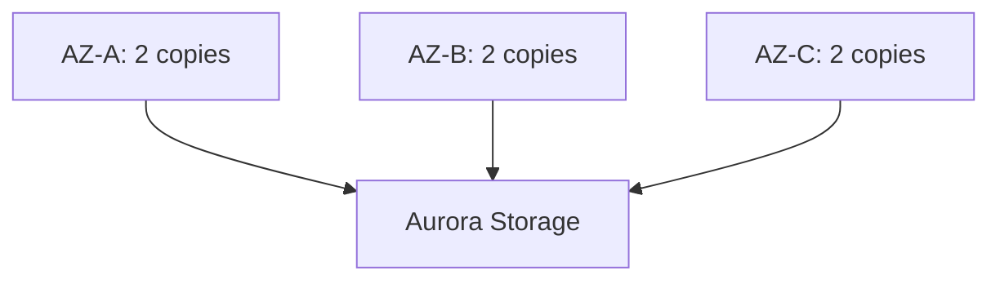

Quorum behavior:

- **4/6 copies needed for writes**
- **3/6 copies needed for reads**

Storage is:

- distributed
- replicated
- self-healing

This gives Aurora strong fault tolerance.

## Aurora Writer + Readers

Typical Aurora cluster:

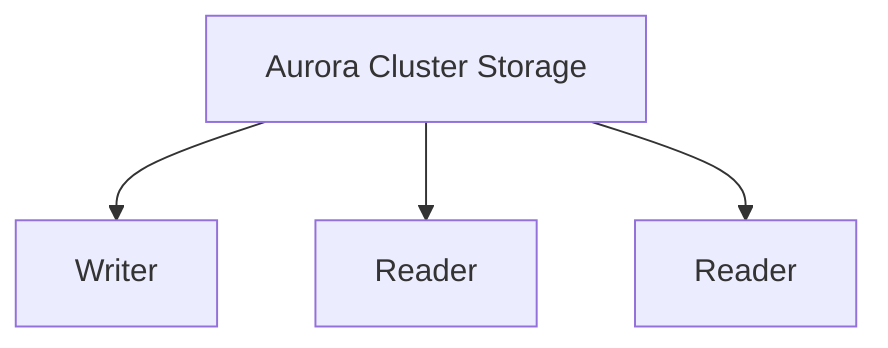

There is:

- **1 writer**
- **up to 15 Aurora Replicas**

Readers scale read traffic.

## Aurora Endpoints

### Writer Endpoint

Use for: `INSERT` / `UPDATE` / `DELETE`. **The Writer Endpoint points to the current writer.**

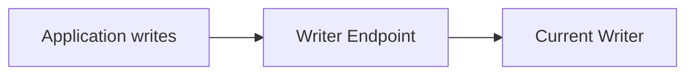

If failover occurs, the endpoint can point to the new writer.

!!! tip "Memory"
    **Writer Endpoint = WRITES**

### Reader Endpoint

Used for: read scaling.

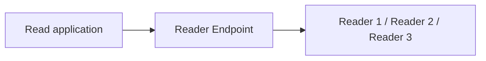

#### Critical Exam Nuance

Reader Endpoint performs **connection-level load balancing**. **It does not inspect every SQL query and distribute individual queries.** If an application opens one long-lived connection, all queries on that connection remain associated with that selected DB instance.

!!! tip "Memory"
    **Reader Endpoint = balance connections across readers**

### Instance Endpoint

Every DB instance also has its own **Instance Endpoint**. Use when you intentionally need to connect to a specific Aurora instance — example: `Application → specific reporting replica`.

### Custom Endpoints

A Custom Endpoint points to a chosen subset of Aurora instances. Example: Reader 1 = normal application, Reader 2 = large instance, Reader 3 = large instance. Create an `Analytics Custom Endpoint` that points to Reader 2 + Reader 3, so analytical applications can use the dedicated subset.

## Aurora Replica Auto Scaling

**Aurora can automatically adjust the number of Aurora Replicas based on read workload.**

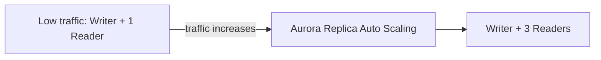

#### What scales?

**Number of reader instances.** This becomes important when comparing it with Serverless.

## Aurora Serverless v2

Designed for:

- unpredictable workloads
- intermittent workloads
- highly variable database compute requirements

Instead of choosing one fixed DB instance capacity, compute can scale using **Aurora Capacity Units — ACUs**. You define minimum/maximum capacity ranges.

!!! example "Example"
    Night: low DB demand → small ACU capacity. Business hours: traffic spikes → larger ACU capacity.

!!! warning "Exam Trigger"
    "Database workload is unpredictable and automatically varying compute capacity is desired." → **Aurora Serverless v2**

## Aurora Replica Auto Scaling vs Serverless v2

This is an excellent exam distinction.

#### Aurora Replica Auto Scaling

Changes: **number of read replicas**

#### Aurora Serverless v2

Changes: **database compute capacity**

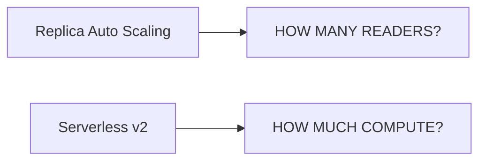

## Aurora Global Database

Designed for:

- globally distributed applications
- low-latency reads
- cross-Region disaster recovery (see [Disaster Recovery](../resilience/disaster-recovery.md))

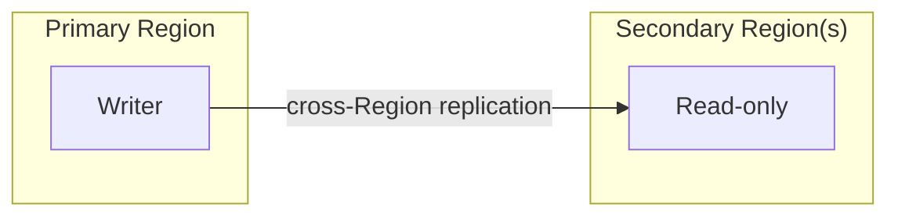

**Typical cross-Region replication latency is often under 1 second.**

#### Normal Operation

Writes → primary Region. Reads → secondary Regions can serve local users.

### Regional Failure

If the primary Region fails: **a secondary Region can be promoted.**

!!! warning "Exam Trigger"
    "Relational application needs low-latency reads across multiple AWS Regions." → **Aurora Global Database**

    "Need cross-Region relational database DR." → strongly consider **Aurora Global Database**

!!! tip "Memory"
    **Multi-AZ = AZ failure**

    **Aurora Global = Region-level architecture**

## Aurora Machine Learning

Aurora can integrate with ML services such as:

- Amazon SageMaker AI
- Amazon Comprehend

This allows applications/database queries to incorporate ML predictions without manually moving large amounts of data outside the database workflow. Use cases:

- fraud detection
- recommendations
- sentiment analysis

This is lower priority than Multi-AZ/endpoints/Global/Serverless, but recognize the feature name.

## Babelfish for Aurora PostgreSQL

Babelfish helps applications designed for **Microsoft SQL Server** work with **Aurora PostgreSQL**. It provides compatibility with SQL Server's **T-SQL**.

#### Scenario

Existing application: `SQL Server application → (T-SQL) → Microsoft SQL Server`

Migration target:

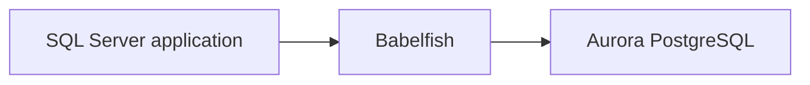

Purpose: → reduce the amount of application code that must be rewritten.

!!! warning "Exam Trigger"
    "Migrate SQL Server application to Aurora PostgreSQL with minimal T-SQL application changes." → **Babelfish**

For broader database migration work, also remember: **AWS SCT + AWS DMS**.

## Backups, Snapshots & Restore

### RDS Automated Backups

Automated backups support **Point-in-Time Recovery — PITR**. RDS automated backup retention: **1–35 days**. For RDS, setting retention to **0** can disable automated backups.

#### PITR

Lets you restore the database to a specific point within the backup retention window.

### Aurora Automated Backups

Aurora also supports automated backups and PITR. Retention: **1–35 days**. Important difference: **Aurora automated backups cannot simply be disabled in the same way as RDS automated backups.**

### Manual DB Snapshots

Manual snapshot:

- created manually
- retained until you explicitly delete it

Good for:

- long-term retention
- major upgrades
- pre-change backups
- keeping database state beyond normal automated retention

!!! tip "Memory"
    **Automated Backup = PITR / retention window**

    **Manual Snapshot = keep until delete**

### Restore Creates a New Database — Not an In-Place Rewind

Extremely useful exam concept. When restoring:

- RDS snapshot
- automated backup/PITR
- Aurora snapshot

AWS normally creates a **NEW database / cluster**. It does not magically overwrite the existing running database in place.

!!! example "Example"
    ```mermaid
    flowchart LR
        A[Production DB] -->|restore snapshot| B[NEW RDS DB]
    ```
    Then your application can be redirected to the restored database if required.

### Restoring from S3 — MySQL Patterns

The section also covered database backups stored in S3. Patterns included:

#### MySQL → RDS MySQL

Existing MySQL backup can be restored into RDS MySQL through supported S3-based migration/restore workflows.

#### Percona XtraBackup → Aurora MySQL

A MySQL backup created using **Percona XtraBackup** can be used to initialize/restore an Aurora MySQL cluster from S3. This is a more niche SAA detail, but recognize it when presented explicitly.

### Aurora Cloning (Copy-on-Write)

Aurora supports very fast database cloning. Key mechanism: **Copy-on-Write**.

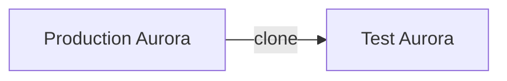

Initially both reference the same underlying storage pages. When data changes → changed blocks/pages are copied.

#### Benefits

- fast
- storage efficient
- excellent for development/testing

!!! warning "Exam Trigger"
    "Create a development/test copy of a very large Aurora production database quickly and efficiently." → **Aurora Clone**

!!! tip "Memory"
    **Backup/Restore = recovery**

    **Clone = fast copy for dev/test**

## Encryption

RDS and Aurora support encryption at rest using [AWS KMS](../security/security.md). Encryption covers relevant database storage and related protected resources.

#### Important Replica Rule

If the source database is encrypted → replicas are encrypted. A key exam-style limitation: you don't simply create an encrypted read replica directly from an unencrypted primary in the usual pattern.

### Encrypting an Existing Unencrypted Database

Typical migration pattern:

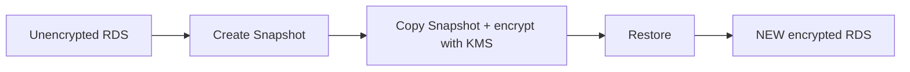

!!! warning "Exam Trigger"
    "Existing RDS database is unencrypted and must become encrypted." → **Snapshot → encrypted copy → restore.** Not: "enable encryption checkbox on existing DB".

### Encryption in Transit

For data moving between application and database → use **TLS/SSL**.

!!! tip "Memory"
    **At rest = KMS**

    **In transit = TLS**

## Authentication & Network Security

### RDS Authentication

Database authentication options include:

- traditional database username/password
- IAM database authentication for supported engines/configurations

Credentials/secrets can be securely managed rather than hard-coded into application code.

### RDS Network Security

RDS lives inside a VPC. Use **Security Groups** to control which clients can connect. (See [VPC](../networking/vpc.md) for subnet/security-group networking fundamentals, and [EC2](../compute/ec2.md) for compute-side security groups.)

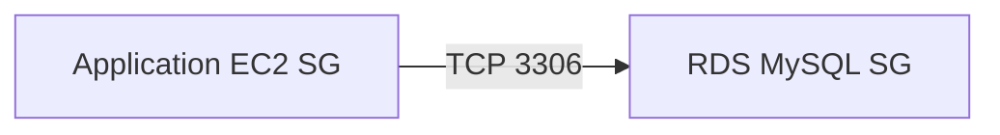

Better rule: `RDS inbound 3306 from Application-SG` instead of `0.0.0.0/0`.

#### Common Ports

- MySQL/Aurora MySQL → 3306
- PostgreSQL/Aurora PostgreSQL → 5432
- SQL Server → 1433
- Oracle commonly → 1521

Know especially MySQL/PostgreSQL.

### RDS Audit / Database Logs

Database logs can be integrated/exported to services such as **CloudWatch Logs**. Useful for:

- monitoring
- auditing
- troubleshooting

## RDS Proxy

### Core Idea

RDS Proxy solves **DATABASE CONNECTION PROBLEMS**. Not query caching.

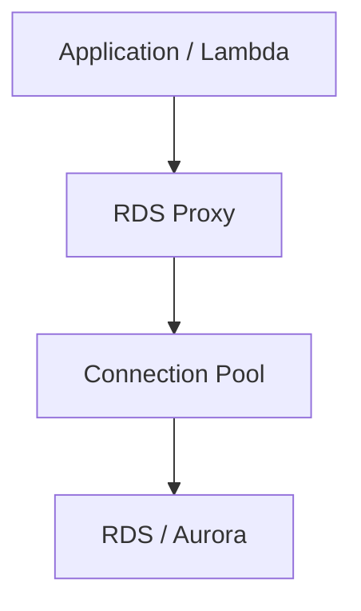

Proxy pools and reuses existing database connections.

### Why RDS Proxy Matters

Opening thousands of database connections can consume DB memory, CPU, and connection slots. This is especially common with [AWS Lambda](../containers-serverless/serverless.md).

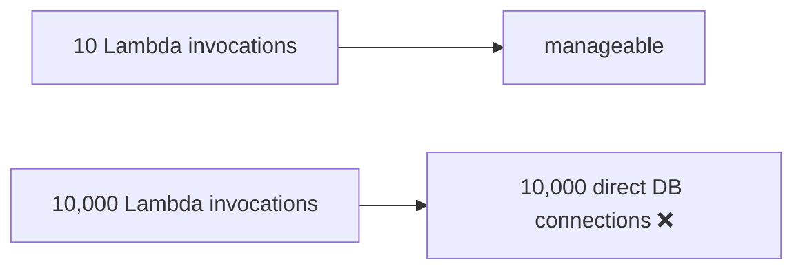

With RDS Proxy:

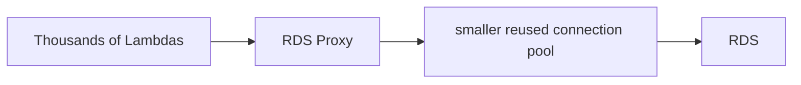

### Advantages

Important properties:

- fully managed
- connection pooling
- reduces stress from connection storms
- improves application resiliency
- can improve database failover behavior
- **failover time can be reduced by up to about 66%**
- **integrates with AWS Secrets Manager**
- **supports IAM authentication**
- accessed inside VPC networking

!!! warning "Exam Trigger"
    "Lambda functions are exhausting RDS connections." → **RDS Proxy**

### Supported Database Families

Recognize RDS Proxy with commonly supported engines such as:

- MySQL
- PostgreSQL
- MariaDB
- SQL Server
- Aurora MySQL
- Aurora PostgreSQL

Exact engine/version compatibility can vary, but the architectural exam concept is more important.

### RDS Proxy vs ElastiCache

This may be the single most important distinction in this chapter.

#### RDS Proxy

Problem: **Too many connections**. Solution: → connection pooling.

#### ElastiCache

Problem: **Too many repeated queries / reads**. Solution: → cache results in memory.

!!! tip "Memory"
    "Too many DB connections" → **RDS Proxy**

    "Same data queried repeatedly" → **ElastiCache**

## Amazon ElastiCache

### Core Idea

Managed in-memory data store/cache. Main engine families:

- **Valkey**
- **Redis OSS**
- **Memcached**

Memory is much faster than repeatedly reading data from disk-backed databases. For DynamoDB and other database services, see [DynamoDB & Other Databases](database-dynamodb.md).

```mermaid
flowchart LR
    A[Application] --> B[ElastiCache] -->|cache miss| C[Database]
```

### Why Use ElastiCache?

Without caching:

```mermaid
flowchart LR
    A["100,000 repeated requests"] --> B[RDS]
```

Database repeatedly calculates/reads the same information. With cache:

```mermaid
flowchart TD
    A[Request] --> B[ElastiCache]
    B -->|HIT| C[return immediately]
    B -->|MISS| D[query RDS] --> E[store result]
```

Benefits:

- lower latency
- lower database load
- better application scalability

### Cache-Aside / Lazy Loading

Very important caching pattern.

```mermaid
flowchart TD
    A[Application] --> B[Check cache]
    B -->|HIT| C[return cached value]
    B -->|MISS| D[Database] --> E[retrieve data] --> F[write cache] --> G[return result]
```

#### Advantage

Only requested data gets cached.

#### Risk

Cached data may become **stale**, because database data can change before cache expires/updates.

### Write-Through Pattern

When application writes data:

```mermaid
flowchart LR
    A[Application] --> B["Database + Cache updated"]
```

The cache is updated when data is written. Benefit: → cache stays more current. Tradeoff: → additional write work.

### TTL in ElastiCache

Cache entries can have **TTL / expiration**. Example: `product:123 → expires after 5 minutes`. TTL helps:

- limit stale data
- free memory
- refresh data periodically

Do not confuse **Route 53 TTL = DNS caching** with **ElastiCache TTL = cached application object expiration**. (See [Route 53](../networking/route53.md).)

### Session Store

Very common SAA use case. Suppose:

```mermaid
flowchart LR
    U[User] --> ALB --> A["EC2-A"]
```

User logs in. Next request:

```mermaid
flowchart LR
    U[User] --> ALB --> B["EC2-B"]
```

If session existed only on EC2-A → session may be lost. Solution:

```mermaid
flowchart LR
    A["EC2-A"] --> S["ElastiCache Session Store"]
    B["EC2-B"] --> S
    C["EC2-C"] --> S
```

Now all application servers share session state.

#### Benefit

Application servers become more **stateless**, which makes horizontal scaling easier.

!!! warning "Exam Trigger"
    "Users lose sessions when traffic moves between EC2 instances." → shared session store such as **ElastiCache**

### Redis / Valkey vs Memcached

High-value comparison.

| Feature | Redis / Valkey | Memcached |
|---|---|---|
| Replication | ✅ | Classic exam model: limited/no replication |
| Multi-AZ/failover | ✅ | Not its main model |
| Read replicas | ✅ | ❌ traditional model |
| Backup/persistence | ✅ capabilities | Primarily simple cache |
| Complex data structures | ✅ | Simpler key/value |
| Sorted Sets | ✅ | ❌ |
| Simple distributed cache | ✅ | ✅ very strong use case |
| Multi-threaded architecture | Different model | ✅ |
| Sharding | ✅ | ✅ |

!!! tip "Memory"
    **Redis/Valkey = richer features + HA**

    **Memcached = simple distributed memory cache**

### Redis / Valkey High Availability

Typical architecture:

```mermaid
flowchart TD
    P[Primary] --> R1[Replica]
    P --> R2[Replica]
```

With Multi-AZ/failover capabilities: if primary fails → a replica can become primary. Use this when cache availability matters.

### ElastiCache Cluster Mode

The hands-on section distinguished:

#### Cluster Mode Disabled

Conceptually: 1 shard → 1 primary + replicas. Useful when you don't need data partitioned across many shards.

#### Cluster Mode Enabled

Shard 1, Shard 2, Shard 3, ... — data distributed across multiple shards. Purpose: → horizontal scaling for larger workloads/datasets.

### ElastiCache Endpoints

In Redis/Valkey-style deployments you may encounter:

#### Primary Endpoint

Used for: **writes**

#### Reader Endpoint

Used for: **reads across replicas**

Again remember: endpoint semantics matter just like Aurora writer/reader endpoints.

### ElastiCache Deployment Networking

ElastiCache is placed in your **VPC**. You configure:

- subnet groups
- security groups
- networking access

Typical architecture:

```mermaid
flowchart LR
    A["Application EC2/ECS/Lambda"] --> B["VPC network"] --> C[ElastiCache]
```

It should not normally be exposed openly to the internet.

### ElastiCache Security

Important controls include:

#### Encryption at rest

Protects stored cache data where supported.

#### Encryption in transit

Use TLS where supported/configured.

#### Security Groups

Control network access.

#### Redis/Valkey Authentication

Can use authentication/user mechanisms; IAM authentication is available for supported Redis/Valkey configurations.

#### Memcached

SASL authentication is a relevant authentication mechanism. For SAA, prioritize architecture over memorizing every auth-engine version combination.

### Redis Sorted Sets

One distinctive exam feature: **Sorted Sets**. Great for:

- rankings
- scores
- real-time leaderboards

Example: `Player A → 9500`, `Player B → 8200`, `Player C → 7300`. Need a real-time leaderboard → **Redis/Valkey Sorted Set**.

## Most Important Comparisons

### RDS vs ElastiCache

Do not treat ElastiCache as the permanent source of truth.

#### RDS/Aurora

Persistent relational database.

#### ElastiCache

Fast in-memory layer.

```mermaid
flowchart LR
    A[Application] --> B[ElastiCache] -->|cache miss| C["RDS / Aurora"]
```

The database remains the durable system of record.

### Multi-AZ vs Read Replica vs ElastiCache vs RDS Proxy

This table should be memorized.

| Problem | Solution |
|---|---|
| Database must survive AZ failure | Multi-AZ |
| Too many read queries | Read Replica |
| Repeated identical/frequent reads | ElastiCache |
| Too many database connections | RDS Proxy |
| Need global Aurora reads/DR | Aurora Global Database |
| Variable Aurora compute | Aurora Serverless v2 |

### RDS Read Replica vs ElastiCache

They both reduce pressure on the primary DB, but differently.

#### Read Replica

Still runs the SQL query against a database: `SELECT * FROM orders...` → Read Replica executes query. Best for:

- reporting
- read scaling
- queries requiring current relational data

#### ElastiCache

Avoids executing the DB query at all when data is cached: `Request → Cache HIT → no DB query`. Best for:

- frequently accessed/repeated data
- ultra-low latency

### Multi-AZ vs Aurora Global Database

#### Multi-AZ

Protects primarily against **AZ-level failure**, usually within one Region.

#### Aurora Global Database

Designed for **multi-Region architecture**. Provides:

- global reads
- regional DR

!!! tip "Memory"
    **AZ problem → Multi-AZ**

    **Region/global problem → Aurora Global**

### Backup vs Read Replica

Common exam trap.

#### Backup

Purpose: → restore old state. Example: "Recover database as it existed at 10:32 AM yesterday." → **PITR**

#### Read Replica

Contains replicated current-ish database state. Purpose: → read scaling. It is not a substitute for historical backups.

### Snapshot vs Aurora Clone

#### Snapshot

Good for:

- backup
- long-term retention
- recovery
- creating a completely restored DB

#### Aurora Clone

Good for:

- quickly copying Aurora
- development
- testing
- staging

**Uses copy-on-write.**

!!! warning "Exam Trigger"
    "Quickly create test environment from 20-TB Aurora production database." → **Aurora Clone**, not full export/import.

### Aurora Serverless v2 vs RDS Proxy

Another useful distinction.

#### Aurora Serverless v2

Scales: **database compute**

#### RDS Proxy

Scales/manages: **connections**

Example: traffic spike causes a **DB CPU/capacity problem** → Serverless may help. Traffic spike causes a **connection storm** → Proxy.

### Aurora Reader Endpoint vs RDS Proxy

#### Reader Endpoint

**Distributes read connections across Aurora replicas.** Question it answers: → which reader receives connection?

#### RDS Proxy

Pools/reuses database connections from applications. Question it answers: → how many backend DB connections are actually needed?

Different problems.

## Architecture Scenarios

#### Scenario — Read-Heavy App

Requirement: SQL database, high read traffic, writes are moderate.

```mermaid
flowchart TD
    A[Application] -->|writes| B[RDS Primary]
    A -->|reads| C[Read Replicas]
```

If repeated common queries are still excessive, add:

```mermaid
flowchart LR
    A[Application] --> B[ElastiCache] -->|miss| C["Read Replica / Primary"]
```

#### Scenario — Highly Available Database

Requirement: database must survive AZ outage.

```mermaid
flowchart LR
    subgraph "AZ-A"
    P[Primary RDS]
    end
    subgraph "AZ-B"
    S[Standby]
    end
    P -->|sync| S
```

→ **Multi-AZ**. Do not choose Read Replica merely because there is "another database."

#### Scenario — Lambda + RDS

Problem: large number of Lambda invocations.

```mermaid
flowchart LR
    A["Lambda × thousands"] --> B["RDS connections explode"]
```

Solution:

```mermaid
flowchart LR
    L[Lambda] --> P[RDS Proxy] --> R["RDS / Aurora"]
```

This is a classic exam pattern.

#### Scenario — Global SaaS

Users: USA, Europe, Asia. Need: single relational database architecture, low-latency global reads, regional disaster recovery. Think: **Aurora Global Database**.

```mermaid
flowchart TD
    A["Primary Region"] -->|Aurora Global replication| B["EU Readers"]
    A -->|Aurora Global replication| C["Asia Readers"]
```

#### Scenario — Unpredictable Workload

Database used heavily during some hours, almost nothing during others, load difficult to predict. Think: **Aurora Serverless v2**, because compute capacity can scale according to demand.

#### Scenario — Stateless Web Tier

```mermaid
flowchart TD
    ALB --> E1[EC2]
    ALB --> E2[EC2]
    ALB --> E3[EC2]
    E1 --> S["ElastiCache Session Store"]
    E2 --> S
    E3 --> S
```

Any instance can serve any user because session data is shared.

## Memory Maps

### Encryption Memory Map

- **RDS / Aurora Security**
    - At Rest → KMS
    - In Transit → TLS
    - Network → Security Groups
    - Authentication
        - DB username/password
        - IAM DB authentication
    - Existing unencrypted DB → Snapshot → Encrypted snapshot copy → Restore NEW encrypted DB

### Backup Memory Map

```mermaid
flowchart LR
    Q1["Need point in time?"] --> A1["Automated Backups / PITR"]
    Q2["Need long-term retained backup?"] --> A2["Manual Snapshot"]
    Q3["Need to restore?"] --> A3["Creates NEW DB"]
    Q4["Need fast Aurora prod → test copy?"] --> A4["Aurora Clone"]
```

### ElastiCache Memory Map

- **ElastiCache**
    - Cache Reads → Cache Aside / Lazy Loading
    - Keep cache updated → Write Through
    - Remove stale entries → TTL
    - Shared login/session state → Session Store
    - HA / rich structures → Redis / Valkey
    - Simple distributed cache → Memcached

## Main SAA Trigger Words

| Question says... | Think... |
|---|---|
| Read-heavy relational DB | Read Replica |
| Reporting queries hurting production | Read Replica |
| Survive AZ failure | Multi-AZ |
| Automatic DB failover | Multi-AZ |
| Global relational reads | Aurora Global Database |
| Region-level Aurora DR | Aurora Global Database |
| Variable/unpredictable DB capacity | Aurora Serverless v2 |
| Too many connections | RDS Proxy |
| Lambda connection storm | RDS Proxy |
| Frequently repeated queries | ElastiCache |
| Microsecond/very low-latency cache | ElastiCache |
| Shared application sessions | ElastiCache |
| Leaderboard | Redis/Valkey Sorted Sets |
| Need OS/database host access | RDS Custom |
| SQL Server → Aurora PostgreSQL | Babelfish |
| Old database state | PITR / Snapshot |
| Fast Aurora prod copy for testing | Aurora Clone |

## Most Dangerous Exam Traps

!!! danger "Trap 1"
    Myth: another database in another AZ automatically means Read Replica. Reality: first determine whether the requirement is HA (**Multi-AZ**) or read performance (**Read Replica**).

!!! danger "Trap 2"
    Myth: "improve database performance" has one universal answer. Reality: identify the actual bottleneck — too many reads → Read Replica; same reads repeated → ElastiCache; too many connections → RDS Proxy; compute capacity changing wildly → Aurora Serverless.

!!! danger "Trap 3"
    Myth: the classic Multi-AZ standby can serve reporting queries. Reality: for a classic Multi-AZ DB instance, the standby exists only for failover — use a Read Replica for reporting.

!!! danger "Trap 4"
    Myth: a Read Replica can serve as a backup. Reality: it continuously replicates changes — if data is deleted on the primary, that deletion replicates too. For historical recovery, use backup / snapshot / PITR.

!!! danger "Trap 5"
    Myth: RDS Proxy caches database query results. Reality: RDS Proxy caches/reuses connections; ElastiCache caches data/results.

!!! danger "Trap 6"
    Myth: ElastiCache can be treated as the durable primary database. Reality: ElastiCache is normally the fast cache/session layer; RDS/Aurora remains the durable relational system of record.

!!! danger "Trap 7"
    Myth: you can just enable encryption directly on an existing unencrypted RDS database. Reality: Snapshot → encrypt snapshot copy → restore into a new encrypted database.

!!! danger "Trap 8"
    Myth: restoring a backup overwrites the existing production database in place. Reality: restore generally creates a new database.

!!! danger "Trap 9"
    Myth: the Aurora Reader Endpoint distributes every individual SQL statement. Reality: it distributes connections among Aurora readers (connection-level load balancing), not per-query.

!!! danger "Trap 10"
    Myth: Aurora Replica Auto Scaling and Aurora Serverless v2 are the same thing. Reality: Replica Auto Scaling changes the number of readers; Serverless v2 changes compute capacity.

## Final Decision Tree

- **DATABASE QUESTION**
    - Need relational SQL? → RDS / Aurora
    - Need more READ capacity? → Read Replica
    - Need AZ HIGH AVAILABILITY? → Multi-AZ
    - Need GLOBAL relational architecture? → Aurora Global Database
    - Need AUTO-SCALING COMPUTE? → Aurora Serverless v2
    - Need host/OS customization? → RDS Custom
    - Too many CONNECTIONS? → RDS Proxy
    - Too many repeated READS? → ElastiCache
    - Need shared SESSION state? → ElastiCache
    - Need historical recovery? → PITR / Snapshot
    - Need fast Aurora copy for TEST? → Aurora Clone

!!! tip "One-Minute Pre-Exam Recall"
    - RDS = managed relational database
    - Read Replica = READ SCALE
    - Multi-AZ = HA / FAILOVER
    - Classic Multi-AZ standby ≠ read replica
    - Aurora = 6 copies / 3 AZs / 1 writer / up to 15 readers
    - Aurora Writer Endpoint = writes
    - Aurora Reader Endpoint = load-balances reader connections
    - Replica Auto Scaling = number of readers
    - Aurora Serverless v2 = ACU compute scaling
    - Aurora Global = cross-Region reads + DR
    - RDS Proxy = CONNECTION POOLING
    - ElastiCache = DATA CACHE
    - Lazy Loading = cache miss → DB → cache
    - Session Store = stateless application servers
    - Redis/Valkey = HA + richer data structures
    - Memcached = simple distributed cache
    - Sorted Sets = leaderboard
    - Automated Backups = PITR
    - Manual Snapshot = retained until deleted
    - Restore = NEW database
    - Aurora Clone = copy-on-write fast dev/test
    - At rest = KMS
    - In transit = TLS
    - Private access = Security Groups

    And the most important four-way exam decision:

    - READ problem? → Read Replica
    - REPEATED DATA problem? → ElastiCache
    - CONNECTION problem? → RDS Proxy
    - AVAILABILITY problem? → Multi-AZ

    That is the core RDS + Aurora + ElastiCache SAA memory map I would revise immediately before doing practice questions.
