# SAA Discussion Scenarios

This section is different from every earlier chapter. Before, you learned individual services one at a time: [EC2](../compute/ec2.md), ELB, ASG, [Route 53](../networking/route53.md), [RDS](../databases/rds-aurora.md), Aurora, ElastiCache, [EBS](../compute/ebs.md), [EFS](../storage/storage-efs-fsx.md). Now the exam asks a harder question:

**Which combination of these services solves the business requirement?**

So the goal here is not memorizing another service. It is learning the decision-making sequence of a Solutions Architect — how a real architecture *evolves*, one requirement at a time, from a single EC2 instance into a multi-AZ, cached, database-backed, auto-scaled system.

## The Master Architecture Idea

Most scalable AWS web applications gradually become something like this:

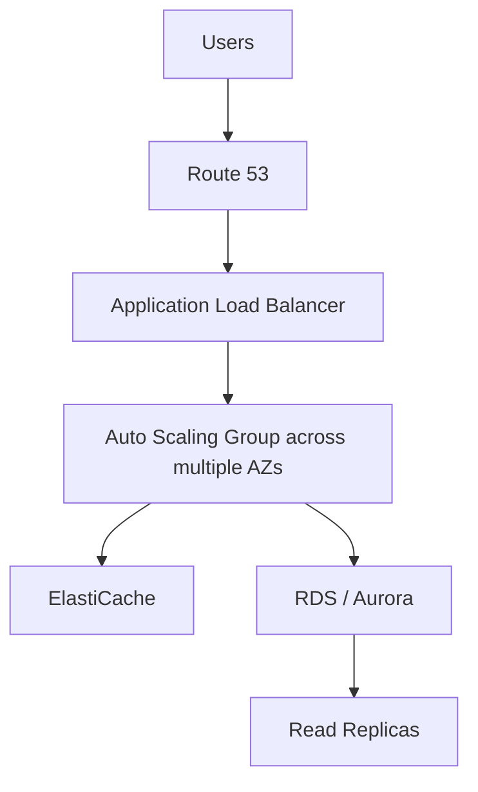

And if the application servers need shared files:

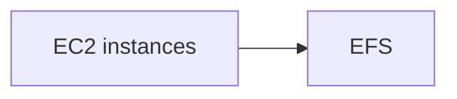

The exam changes one requirement at a time:

- traffic increases
- downtime isn't acceptable
- sessions must survive
- reads increase
- AZ failure must be tolerated
- files must be shared
- startup must be faster
- infrastructure deployment should be managed

**Your job is to recognize which component solves which problem.** The rest of this page walks through five case studies — WhatIsTheTime.com, MyClothes.com, MyWordPress.com, a "launch things quickly" scenario, and Elastic Beanstalk — each introducing its architecture stage by stage, in the same order the requirements appear on the exam.

## PART A — WhatIsTheTime.com

This first architecture is intentionally simple: a stateless web application that tells users the current time. **It does not need a database, because each server can answer the request independently.** That makes it perfect for learning scaling.

### Stage 1 — One EC2 Instance

Start simple — a user hits an [EC2](../compute/ec2.md) instance directly:

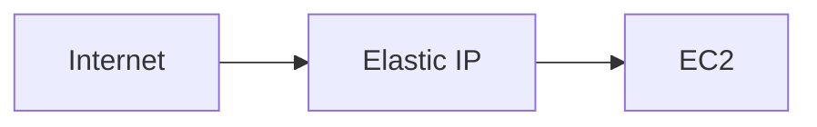

The EC2 instance has:

- a public IP
- an Elastic IP for a fixed public address

This is fine for:

- proof of concept
- tiny workloads
- downtime being acceptable

The original example starts with one small EC2 and attaches an Elastic IP so the public address remains stable.

### Traffic Increases → Vertical Scaling

Suppose the EC2 becomes overloaded. The first option: make the EC2 instance bigger — `t2.micro` → `m5.large`. This is **Vertical Scaling**, also called **Scale Up**. You increase CPU, RAM, and instance size.

But changing an EC2 instance type requires `Stop → Resize → Start`, so downtime can occur. The case study explicitly uses this as the limitation of vertical scaling.

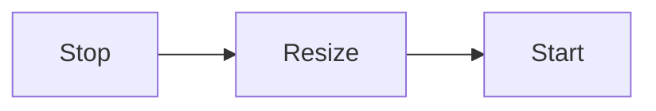

!!! warning "Exam Trigger"
    "Application needs more CPU/RAM and can tolerate downtime." → **Scale vertically**

### Vertical Scaling vs Horizontal Scaling

#### Vertical

`1 small EC2 → 1 powerful EC2`

#### Horizontal

`1 EC2 → EC2 + EC2 + EC2`

Horizontal scaling means adding more servers rather than making one server bigger.

### Stage 2 — Multiple EC2 + Elastic IPs

You could do this:

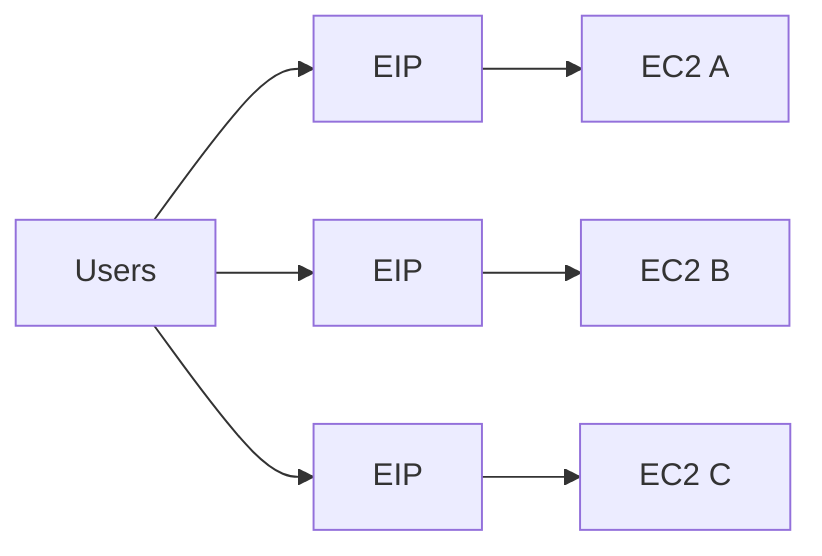

This technically scales. But now users/application configuration must know many IP addresses. That's operationally ugly. The case study uses this to demonstrate why directly managing EC2 public addresses does not scale well.

### Stage 3 — Route 53

Instead of users remembering IP addresses:

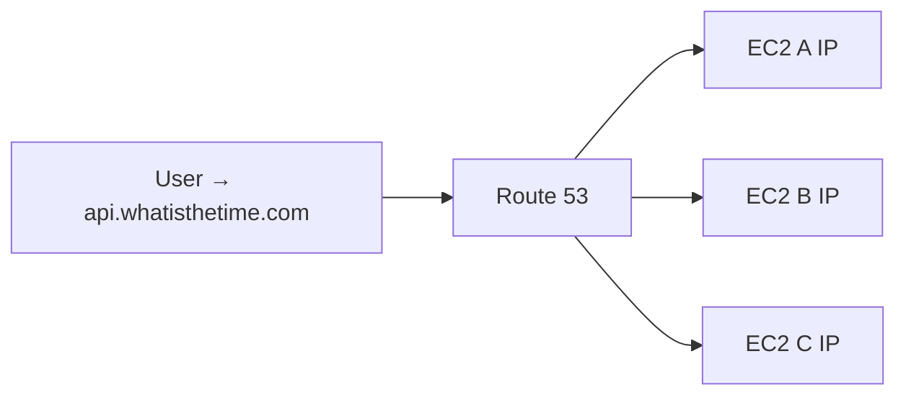

Now DNS hides the individual IP addresses. The course example uses an [A Record](../networking/route53.md), because an A record can return IPv4 addresses.

### But DNS Alone Has a Problem — TTL

Suppose [Route 53](../networking/route53.md) returns EC2 A, EC2 B, and EC2 C, with **TTL = 1 hour**. A client caches that DNS result. Then EC2 B is removed:

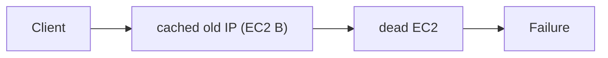

The user's computer may still remember EC2 B's IP until the TTL expires. The case study uses exactly this problem to show why Route 53 alone is not enough for rapidly changing backend fleets.

!!! tip "Memory"
    DNS = name resolution. ELB = real-time traffic distribution.

### Stage 4 — Add a Load Balancer

Better:

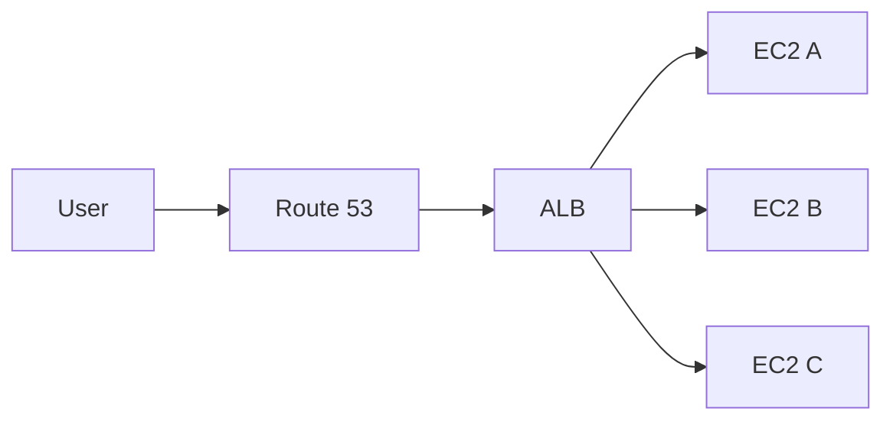

Now users don't need to know backend IP addresses at all. The [ALB](../compute/load-balancing-asg.md) becomes the frontend entry point. Backends can now become **private EC2 instances** — the course architecture specifically moves the EC2 servers behind a public ELB and recommends security-group-to-security-group restriction between them.

### Route 53 → Load Balancer

Important architecture pattern: don't build architectures around the load balancer's individual IP addresses — use a **Route 53 Alias Record** pointing at the ALB.

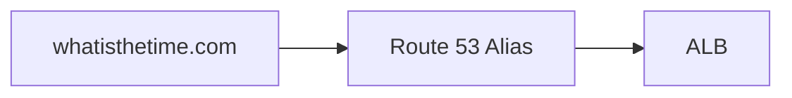

The source explicitly changes from EC2 A-record targets to an Alias pointing at the ELB.

!!! warning "Exam Trigger"
    "Route custom domain to AWS load balancer." → **Route 53 Alias → ELB**

### ELB Health Checks

Suppose EC2 A ✅, EC2 B ❌, EC2 C ✅. Load Balancer health checks detect EC2 B is unhealthy:

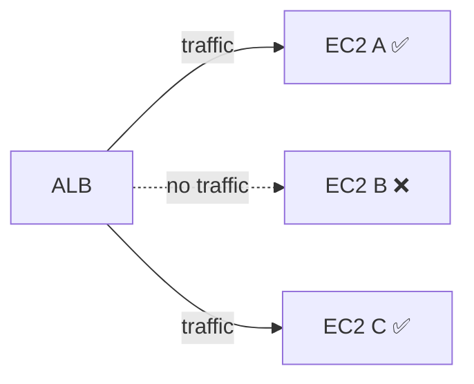

This removes unhealthy servers from request routing.

!!! warning "Trigger"
    "Stop sending traffic to unhealthy EC2 instances." → **ELB Health Checks**

### Security Group Pattern

Public access should normally hit the ALB, not the EC2 instances directly.

- **ALB security group** — inbound 80/443 from the Internet.
- **EC2 security group** — inbound on the application port, source = ALB security group.

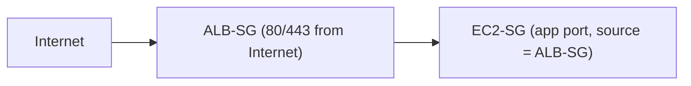

The case study explicitly recommends restricting EC2 traffic to traffic coming through the [load balancer's security group](../networking/vpc.md).

### Stage 5 — Auto Scaling Group

Problem: manually creating/removing EC2 instances is operationally painful. Solution: an [Auto Scaling Group](../compute/load-balancing-asg.md).

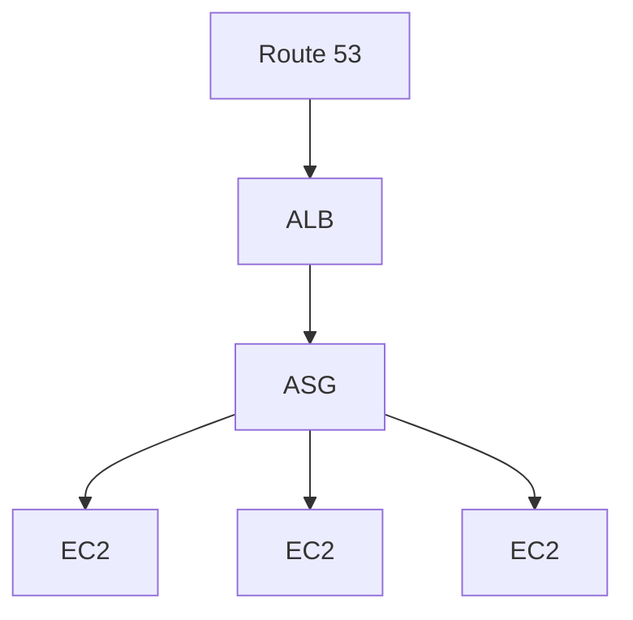

ASG automatically:

- adds instances when load increases
- removes instances when load decreases
- maintains desired capacity
- replaces unhealthy instances

The progression from manual EC2 management to ASG is central to this case study.

### Horizontal Scaling Pattern

Traffic ↑ → ASG scale out → more EC2. Traffic ↓ → ASG scale in → fewer EC2. Benefit: pay for roughly the amount of compute you need.

### Still One Problem — Single AZ

Suppose everything — ALB, ASG, and all EC2 instances — lives in a single AZ. You have load balancing, scaling, and health checks, but:

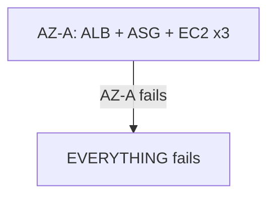

The source intentionally creates this failure to motivate Multi-AZ design.

### Stage 6 — Multi-AZ

Correct architecture:

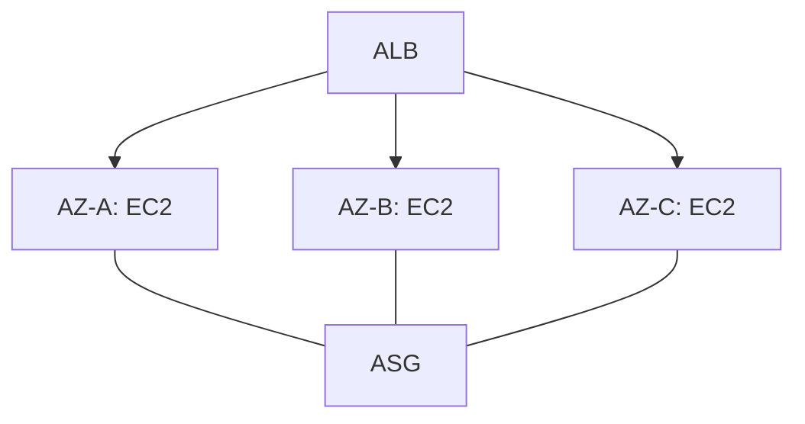

Now if AZ-A ❌, traffic continues through AZ-B ✅ and AZ-C ✅. The example spreads both the ELB and ASG across multiple AZs specifically for this reason.

!!! warning "SAA Trigger"
    "Application must survive an Availability Zone failure." → **Multi-AZ architecture**

### Final WhatIsTheTime.com Architecture

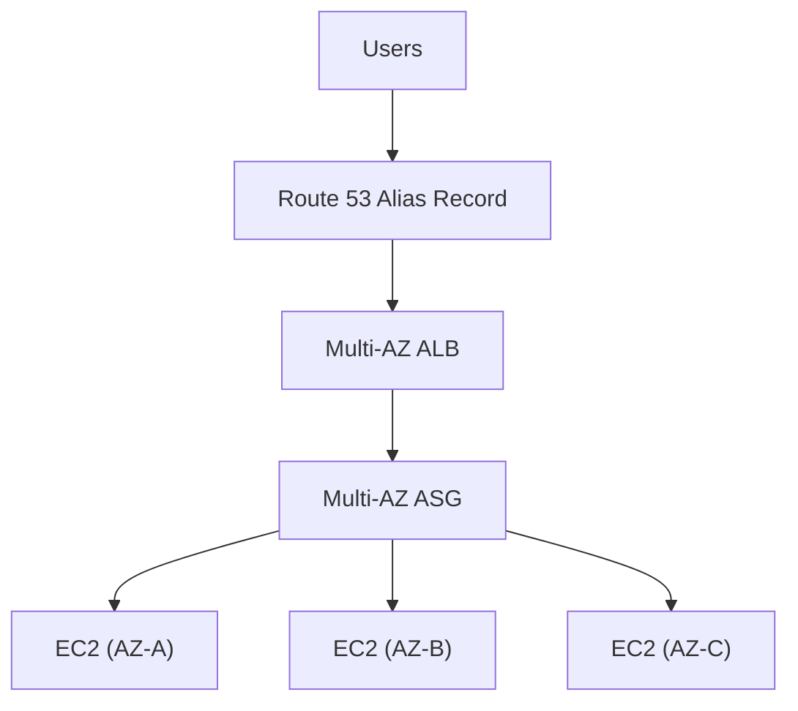

Characteristics:

- scalable
- highly available
- health checked
- private backend servers
- no individual EC2 public IP dependency

### Cost Optimization

Suppose ASG configuration is `Min = 2`, `Max = 10`. You know at least 2 instances will always run — so you may obtain long-term discounts covering the baseline capacity. Extra temporary capacity can use On-Demand, or potentially Spot if the workload tolerates interruptions. The course case study describes reserving the predictable baseline and using flexible pricing for additional scaling capacity.

#### Architecture Principle

- Predictable baseline → commitment discount (Reserved/Savings Plan)
- Variable traffic → On-Demand
- Interruptible flexible capacity → Spot

## PART B — MyClothes.com

Now the application changes from **Stateless** to **Stateful**. Users now have shopping carts. The requirement is: scale horizontally without losing user session state.

### Stateful Problem

Existing architecture: `User → ALB → EC2 A`. The user puts a Shirt into the cart — the shopping cart exists inside EC2 A. Next request: `User → ALB → EC2 B`. EC2 B knows nothing about the cart. Result: shopping cart = empty. This is exactly the problem demonstrated in the MyClothes case study.

### Solution 1 — Sticky Sessions

Enable **ELB Stickiness / Session Affinity**: the load balancer tries to keep the same user on the same backend across requests.

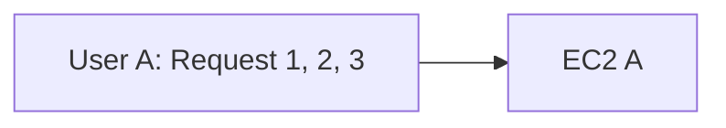

The case study uses stickiness as the first solution.

- **Advantage** — easy.
- **Problem** — if EC2 A dies, the session is lost. So it doesn't truly make the application stateless.

### Better Goal — Stateless Web Servers

Ideal architecture: EC2 A, EC2 B, EC2 C should not care which server receives the user's next request. Meaning: **session state must exist outside individual EC2 instances.** This is one of the biggest architecture principles in SAA.

### Solution 2 — Store State in Client Cookies

Instead of EC2 storing the entire cart, the client cookie contains cart/session information. Each request sends it:

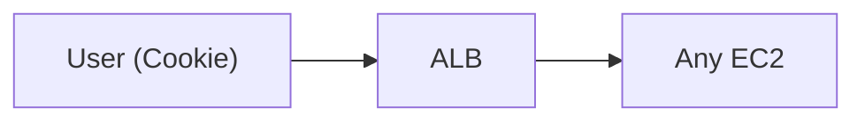

Now any EC2 can understand the session. The course describes this as achieving statelessness, but warns that cookies increase request size and must be validated because clients can modify them.

### Cookie Drawbacks

The transcript emphasizes:

- cookie size is limited
- requests become larger
- user-controlled data may be modified
- server must validate it

Therefore cookies are useful for relatively small state.

### Solution 3 — Store Sessions in ElastiCache

This is the stronger architecture. The user keeps only a `session_id` (e.g. `ABC123`):

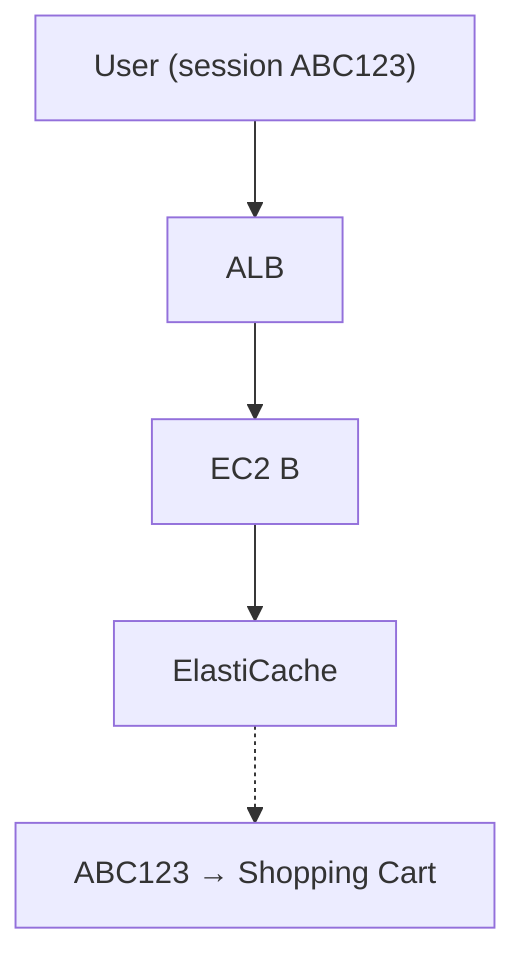

Now any EC2 can retrieve the cart. The source recommends this shared session-store model and notes [DynamoDB](../databases/database-dynamodb.md) as another possible session store.

#### Architecture

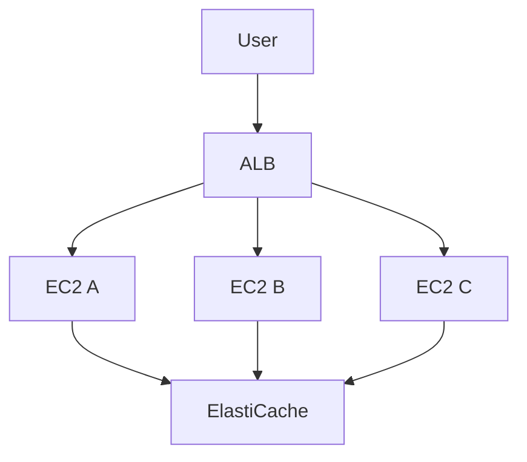

### Why This Is Better

If EC2 A disappears, session data remains in [ElastiCache](../databases/database-dynamodb.md) ✅ — EC2 B can retrieve it. Therefore the web tier becomes **Stateless**.

!!! warning "Major Exam Trigger"
    "Horizontally scalable application must maintain user sessions." → Think: **ElastiCache**, **DynamoDB**, or an external session store — rather than storing sessions on EC2 local memory.

### Long-Term User Data → RDS

Shopping cart/session data may be temporary, but things like name, address, orders, and customer details need durable storage. Use **RDS**:

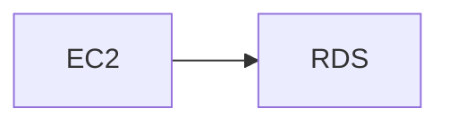

The case study uses [RDS](../databases/rds-aurora.md) for persistent user information while keeping the web servers stateless.

### Session vs Database

Important distinction:

- Session state → ElastiCache / DynamoDB
- Durable relational business data → RDS

Example: a shopping cart currently being edited → ElastiCache. A customer's billing address → RDS.

### Website Becomes Read Heavy

Suppose customers constantly browse products, descriptions, prices, and categories. Most database traffic becomes **READS**. How do we scale? Two major answers: RDS Read Replicas, and ElastiCache.

### Option 1 — RDS Read Replicas

```mermaid
flowchart TD
    W[Writes] --> P["Primary RDS"]
    P -->|replication| R1["Read Replica"]
    P -->|replication| R2["Read Replica"]
    R1 --> Reads[Reads]
    R2 --> Reads
```

Primary handles writes. Read Replicas handle reads. The case study introduces [Read Replicas](../databases/rds-aurora.md) precisely to scale growing read traffic.

!!! warning "Trigger"
    "Relational database read traffic is overwhelming the primary." → **Read Replicas**

### Option 2 — ElastiCache Lazy Loading

```mermaid
flowchart TD
    App["Application needs Product 123"] --> EC{ElastiCache}
    EC -->|HIT| Return[Return immediately]
    EC -->|MISS| RDS[Query RDS]
    RDS --> Store["Store result in cache"]
```

First request: cache miss → RDS → put value into cache. Later request: cache hit → return immediately. The source explains this as a way to reduce RDS load and improve application performance.

### Read Replica vs Cache

They solve related but different problems.

#### RDS Read Replica

Actually executes database read queries. Use when many SQL/database reads must scale.

#### ElastiCache

Stores previously retrieved results. Use when the same data is requested repeatedly.

!!! tip "Memory"
    Read Replica = more database READ capacity. ElastiCache = avoid database reads.

### Make the Entire Application Multi-AZ

Now make every important layer resilient:

```mermaid
flowchart TD
    R53[Route 53] --> ALB["Multi-AZ ALB"] --> ASG["Multi-AZ ASG"]
    ASG --> EC["Multi-AZ ElastiCache"]
    ASG --> RDS["RDS Multi-AZ"]
```

The case study explicitly makes ALB, ASG, RDS, and Redis-based ElastiCache resilient across AZs.

### RDS Multi-AZ vs Read Replica

This distinction is absolutely critical.

- RDS Multi-AZ → **HIGH AVAILABILITY**
- RDS Read Replica → **READ SCALING**

#### Don't Mix Them

- "Survive database AZ failure." → **Multi-AZ**
- "Database has too many reads." → **Read Replica**

### Layered Security Groups

Use security-group references between tiers:

- **ALB** — inbound 80/443, source = Internet
- **EC2** — inbound application port, source = ALB-SG
- **ElastiCache** — inbound cache port, source = EC2-SG
- **RDS** — inbound DB port, source = EC2-SG

```mermaid
flowchart TD
    I[Internet] --> ALBSG["ALB-SG"] --> EC2SG["EC2-SG"]
    EC2SG --> CacheSG["Cache-SG"]
    EC2SG --> RDSSG["RDS-SG"]
```

The source concludes MyClothes with this SG-chain design.

### MyClothes.com Final Architecture

```mermaid
flowchart TD
    U[Users] --> R53[Route 53] --> ALB["Multi-AZ ALB"] --> ASG["Multi-AZ ASG"]
    ASG --> A[EC2]
    ASG --> B[EC2]
    ASG --> C[EC2]
    A --> EC["ElastiCache (session + cache)"]
    B --> EC
    C --> EC
    A --> RDS["RDS (Multi-AZ + Read Replicas)"]
    B --> RDS
    C --> RDS
```

This gives:

- horizontal scalability
- stateless application servers
- session persistence
- caching
- durable DB storage
- read scaling
- Multi-AZ availability

## PART C — MyWordPress.com

WordPress introduces another state problem: **Shared Files** — examples: uploaded images, media, themes/content files.

### WordPress Database

Long-term WordPress structured data goes into MySQL. Possible architecture: `EC2 → RDS MySQL`, or the course chooses **Aurora MySQL**, because Aurora offers strong scalability and managed relational database capabilities. See [RDS & Aurora](../databases/rds-aurora.md).

### The EBS Problem

One instance:

```mermaid
flowchart LR
    U[User] --> A[EC2 A] --> EBSA["EBS A"]
```

The user uploads `photo.jpg` — works perfectly. But now scale:

```mermaid
flowchart TD
    ALB[ALB] --> A[EC2 A] --> EBSA["EBS A"]
    ALB --> B[EC2 B] --> EBSB["EBS B"]
```

The image is uploaded through EC2 A (`photo.jpg → EBS A`). A later request goes to EC2 B (`EC2 B → EBS B`) — the image isn't there. This happens because each [EBS](../compute/ebs.md) volume is separate storage. This is exactly why EBS is problematic for shared WordPress uploads across horizontally scaled EC2 instances.

### Solution — EFS

Replace independent application file disks with shared filesystem storage:

```mermaid
flowchart TD
    ALB[ALB] --> A[EC2 A]
    ALB --> B[EC2 B]
    A --> EFS[EFS]
    B --> EFS
```

Now EC2 A uploads an image → EFS. Later, EC2 B reads the image → EFS ✅. Any instance can see the same file.

!!! warning "SAA Trigger"
    "Multiple Linux EC2 instances across AZs need access to the same files." → **Amazon EFS**

### EBS vs EFS in Solution Architecture

- One EC2 needs persistent block storage → [EBS](../compute/ebs.md)
- Many Linux EC2 instances need a shared filesystem → [EFS](../storage/storage-efs-fsx.md)

This is one of the most useful exam distinctions.

### MyWordPress Final Architecture

```mermaid
flowchart TD
    U[Users] --> R53[Route 53] --> ALB[ALB] --> ASG["ASG across AZs"]
    ASG --> A[EC2 A]
    ASG --> B[EC2 B]
    ASG --> C[EC2 C]
    A --> EFS[EFS]
    B --> EFS
    C --> EFS
    A --> Aurora["Aurora MySQL"]
    B --> Aurora
    C --> Aurora
```

Think: WordPress structured data → Aurora/RDS. WordPress shared uploads → EFS.

## PART D — Instantiate Applications Quickly

Now the question changes: "How can we create infrastructure/application instances quickly?" There are several solutions depending on what must be restored.

### Golden AMI

Instead of launching a blank EC2 and installing everything every time:

```mermaid
flowchart LR
    L["Launch EC2"] --> I["Install OS dependencies"] --> AP["Install application"] --> C["Configure software"] --> AMI["Create AMI"]
```

This becomes a **Golden AMI**. Then:

```mermaid
flowchart TD
    G["Golden AMI"] --> A[EC2 A]
    G --> B[EC2 B]
    G --> C[EC2 C]
```

Everything is already installed. **Benefit** — much faster startup.

!!! warning "Trigger"
    "EC2 instances must launch quickly with software already installed." → **Golden AMI**

### Golden AMI vs User Data

Don't think one replaces the other — the best architecture can use both.

#### Golden AMI

For things that rarely change: OS packages, security agent, web server, runtime, application dependencies.

#### User Data

For startup-specific/dynamic configuration: database endpoint, environment settings, secrets reference, current configuration.

```mermaid
flowchart LR
    G["Golden AMI"] --> Plus(( + )) --> UD["User Data"] --> CE["Configured EC2"]
```

!!! tip "Memory"
    AMI = bake static things beforehand. User Data = configure dynamic things at launch.

### Fast Database Creation

Instead of `Create empty RDS → Create schema → Load massive dataset → Wait`, you can:

```mermaid
flowchart LR
    S["RDS Snapshot"] --> R["Restore"] --> D["Database already contains data/schema"]
```

!!! warning "Trigger"
    "Quickly recreate database containing existing data." → **Restore RDS snapshot**

### Fast EBS Creation

Instead of `Empty EBS → format → copy data`, use:

```mermaid
flowchart LR
    S["EBS Snapshot"] --> R["Restore Volume"]
```

!!! tip "Quick Memory"
    EC2 quickly → Golden AMI. Dynamic EC2 config → User Data. Database quickly → RDS Snapshot. Disk quickly → EBS Snapshot.

## PART E — Elastic Beanstalk

Now imagine your developers repeatedly deploy this architecture: `ALB → ASG → EC2 → RDS`. Every project requires configuring the load balancer, Auto Scaling, EC2, health monitoring, deployment, and infrastructure configuration. Developers may not want to manage all of this. Enter **AWS Elastic Beanstalk**.

### What Is Elastic Beanstalk?

Elastic Beanstalk is a **developer-centric application deployment service**. You provide application code; Beanstalk manages much of the deployment orchestration using AWS resources.

```mermaid
flowchart TD
    D["Developer (uploads application)"] --> EB["Elastic Beanstalk"]
    EB --> E1[EC2]
    EB --> A2[ASG]
    EB --> E3[ELB]
    EB --> M[Monitoring]
    EB --> C[Environment configuration]
```

### Beanstalk Doesn't Replace EC2 / ELB / ASG

Beanstalk uses those services underneath. Think: Beanstalk = orchestration / managed deployment layer — not a new compute platform replacing EC2. You still pay for the underlying AWS resources.

### Beanstalk Responsibility Split

AWS/Beanstalk handles much of:

- capacity provisioning
- load balancing
- Auto Scaling
- instance deployment
- monitoring
- application version deployment

The developer focuses primarily on **code**.

### Beanstalk Components

Important terminology:

```mermaid
flowchart TD
    App[Application] --> V[Application Versions]
    App --> Env[Environments]
```

#### Application

Logical container for your Beanstalk project. Example: `MyShop`.

#### Application Version

A specific version of code: `v1`, `v2`, `v3`.

#### Environment

Infrastructure running one application version. Example: `MyShop-dev`, `MyShop-test`, `MyShop-prod`.

So an application can map versions to environments independently — e.g. Dev Environment → v4, Test Environment → v5, Prod Environment → v3.

### Beanstalk Deployment Flow

```mermaid
flowchart LR
    A["Create Application"] --> B["Upload Application Version"] --> C["Create Environment"] --> D["Deploy Version"] --> E[Monitor] --> F["Upload New Version"] --> G["Deploy Update"]
```

### Beanstalk Web Server Tier

Normal web application: `Users → Load Balancer → Auto Scaling Group → EC2 x3`. Use a **Web Server Environment**.

!!! warning "Trigger"
    "Users directly access a web application." → **Beanstalk Web Server tier**

### Beanstalk Worker Tier

For background processing:

```mermaid
flowchart LR
    App[Application] --> Q["SQS Queue"] --> W1["Worker EC2"]
    Q --> W2["Worker EC2"]
    Q --> W3["Worker EC2"]
```

Workers pull tasks from [SQS](../messaging/decoupling-sqs-sns.md). Scaling can be related to queue workload.

!!! warning "Trigger"
    "Application needs asynchronous background job processing." → **Beanstalk Worker Environment**

### Web + Worker Together

Common architecture:

```mermaid
flowchart LR
    U[Users] --> Web["Web Environment"] -->|asynchronous task| SQS --> Worker["Worker Environment"]
```

Example: user uploads a video. Web server accepts the upload → SQS job → worker transcodes the video. This prevents long-running tasks from blocking web requests.

### Beanstalk Deployment Modes

The course highlights two major environment designs.

#### Single Instance

`User → EC2`. Good for development, testing, low-cost environments. Not HA.

#### High Availability

```mermaid
flowchart TD
    U[Users] --> LB["Load Balancer"] --> ASG[ASG]
    ASG --> A["EC2 AZ-A"]
    ASG --> B["EC2 AZ-B"]
    ASG --> C["EC2 AZ-C"]
```

Good for **Production**.

!!! warning "Trigger"
    "Elastic Beanstalk production application requiring high availability." → **Load-balanced / highly available environment**

### Beanstalk vs CloudFormation

Important distinction.

#### Elastic Beanstalk

Focus: **deploy applications easily**. Developer-centric. `Code → Beanstalk → Application infrastructure`.

#### CloudFormation

Focus: **define arbitrary AWS infrastructure as code**. `Template → CloudFormation → Any AWS infrastructure`.

!!! tip "Memory"
    Beanstalk = deploy my APP. CloudFormation = deploy my INFRASTRUCTURE.

## Complete Solution Architecture Evolution

This is the most important map from this batch — the whole progression, one problem at a time:

| Step | Architecture | Problem it fixes next |
|---|---|---|
| 1 | `User → EC2` | Not enough power |
| 2 | Bigger EC2 = Vertical scaling | Still one server |
| 3 | Multiple EC2 = Horizontal scaling | Many IP addresses |
| 4 | Route 53 | DNS TTL + changing instances |
| 5 | `Route 53 → ALB → EC2 fleet` | Manual fleet management |
| 6 | `Route 53 → ALB → ASG` | One AZ can fail |
| 7 | `Route 53 → Multi-AZ ALB → Multi-AZ ASG` | Stateful application appears |

Once the stateful application appears, the remaining requirements map like this:

- Session State → ElastiCache / DynamoDB
- Persistent User Data → RDS
- Read Scaling → Read Replicas
- Repeated Reads → ElastiCache
- Shared files → EFS

Final common architecture:

```mermaid
flowchart TD
    U[USERS] --> R53["Route 53"] --> ALB["Multi-AZ ALB"] --> ASG["Auto Scaling Group"]
    ASG --> A[EC2]
    ASG --> B[EC2]
    ASG --> C[EC2]
    A --> EC[ElastiCache]
    B --> EC
    C --> EC
    A --> EFS[EFS]
    B --> EFS
    C --> EFS
    EC --> RDS["RDS / Aurora"]
    RDS --> RR["Read Replicas"]
```

## SAA Scenario → Answer Map

| Question wording | Think |
|---|---|
| Need more CPU/RAM on one EC2 | Vertical scaling |
| Need more servers | Horizontal scaling |
| Automatically add/remove EC2 | ASG |
| Distribute HTTP requests | ALB |
| Avoid unhealthy EC2 | ELB health checks |
| Custom DNS → ALB | Route 53 Alias |
| Survive AZ failure | Multi-AZ |
| User always sent to same EC2 | Stickiness |
| Make web tier stateless | Externalize session state |
| Fast session store | ElastiCache |
| Durable relational user data | RDS/Aurora |
| Too many DB reads | Read Replicas |
| Repeated DB reads | ElastiCache |
| Shared Linux files | EFS |
| One server's persistent disk | EBS |
| EC2 must launch quickly | Golden AMI |
| Dynamic startup configuration | User Data |
| Quickly recreate database | RDS snapshot |
| Quickly recreate disk | EBS snapshot |
| Developers want easy managed deployment | Elastic Beanstalk |
| Background jobs | Beanstalk Worker + SQS |
| Infrastructure as code | CloudFormation |

## Highest-Value Exam Traps

!!! danger "Trap 1 — Route 53 replaces ALB"
    Myth: Route 53 can replace the ALB. Reality: Route 53 = DNS, ALB = distribute requests. They are normally used together.

!!! danger "Trap 2 — Make every EC2 public"
    Usually a poorly scalable architecture. Prefer `Internet → Public ALB → Private EC2`.

!!! danger "Trap 3 — Sticky Sessions make app stateless"
    Myth: enabling stickiness makes the application stateless. Reality: stickiness still depends on a particular EC2. A better stateless design is `EC2 → Shared session store`.

!!! danger "Trap 4 — Store sessions permanently in EC2 memory"
    Bad for horizontal scaling. If the EC2 disappears, the session disappears. Externalize it.

!!! danger "Trap 5 — RDS Multi-AZ for read scaling"
    Myth: RDS Multi-AZ scales reads. Reality: Multi-AZ = HA, Read Replica = read scaling.

!!! danger "Trap 6 — Read Replica and ElastiCache do the same thing"
    No. Read Replica → performs more DB reads. ElastiCache → avoids DB reads.

!!! danger "Trap 7 — EBS for shared WordPress uploads across AZs"
    Wrong architecture. Use EFS.

!!! danger "Trap 8 — Install everything with User Data every time"
    It works, but if startup speed matters, Golden AMI + small User Data is better.

!!! danger "Trap 9 — Beanstalk is a new VM service"
    No. It orchestrates services such as EC2, ASG, and ELB.

!!! danger "Trap 10 — Beanstalk Worker receives browser requests directly"
    No. Worker architecture is `SQS → Workers` — the web tier receives the browser requests, not the worker tier.

## One-Minute Memory Sheet

| Trigger | Answer |
|---|---|
| More power? | Scale Up |
| More servers? | Scale Out |
| Distribute traffic? | ELB |
| Automatic EC2 count? | ASG |
| Survive AZ failure? | Multi-AZ |
| DNS? | Route 53 |
| Route 53 → ELB? | Alias |
| Session sticks to EC2? | Sticky Session |
| Better stateless session? | ElastiCache / DynamoDB |
| Long-term user data? | RDS / Aurora |
| More database reads? | Read Replicas |
| Same data read again and again? | ElastiCache |
| One EC2 disk? | EBS |
| Shared files across EC2/AZ? | EFS |
| Fast EC2 start? | Golden AMI |
| Dynamic start config? | User Data |
| Fast database restore? | RDS Snapshot |
| Fast disk restore? | EBS Snapshot |
| Easy application deployment? | Elastic Beanstalk |
| Web traffic? | Beanstalk Web Tier |
| Background job? | Beanstalk Worker + SQS |
| Arbitrary infrastructure as code? | CloudFormation |

### The core Solutions Architect thinking pattern

Whenever you get a long SAA scenario, don't read it as one huge problem. Break it into requirements:

1. Where do users enter? → Route 53 / ELB
2. How does compute scale? → ASG
3. How do we survive failure? → Multi-AZ
4. Where is temporary state? → ElastiCache / DynamoDB
5. Where is durable data? → RDS / Aurora
6. Is the database read-heavy? → Read Replicas / Cache
7. Do servers share files? → EFS
8. How do instances launch quickly? → Golden AMI + User Data
9. Do developers want infrastructure abstracted? → Elastic Beanstalk

**That is the main skill this section is trying to teach: identify each requirement separately, then map each requirement to the AWS service that solves it.**
