# Decoupling: SQS & SNS

Use this as your revision sheet for AWS application decoupling and messaging — Amazon SQS, Amazon SNS, and the streaming/broker services that round out the picture (Kinesis Data Streams, Amazon Data Firehose, Amazon MQ).

## Why Do We Need Messaging?

When an application becomes larger, different components need to communicate. There are two main communication patterns.

#### Synchronous Communication

One application directly calls another application.

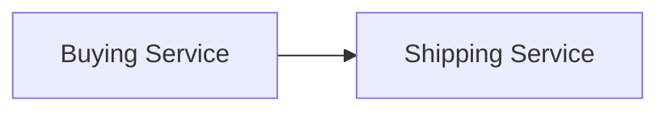

Example:

- Customer buys an item.
- Buying service immediately calls shipping service.
- Shipping service must be available at that moment.

#### Problem

If the buying service suddenly receives 50,000 orders:

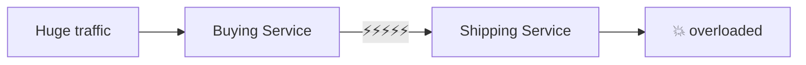

**The applications are tightly coupled.**

#### Asynchronous Communication

Put middleware between the applications.

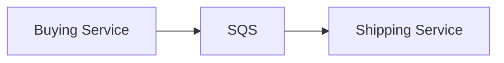

Buying service does not wait for shipping service. It simply says: "Here is a new job." The shipping service processes it when ready.

#### Why This Is Useful

The two applications can:

- scale independently
- fail independently
- operate at different speeds
- survive sudden traffic spikes

!!! tip "Memory"
    Need to decouple applications? Think **SQS / SNS / Kinesis** — but they solve different problems:

    - Queue / work processing → **SQS**
    - One event → many receivers → **SNS**
    - Real-time streaming data → **Kinesis**

## Amazon SQS

**SQS = Simple Queue Service.** **SQS provides a managed message queue.**

### Architecture

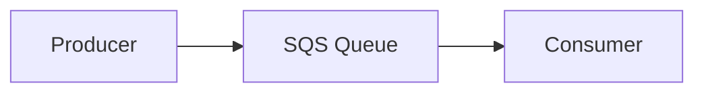

#### Producer

Creates messages. Example: `"Process order 9182"`, `"Resize image 123"`, `"Encode video XYZ"`.

#### Consumer

Polls SQS and processes messages. After successfully processing a message: **consumer deletes it from the queue.**

### Basic Flow

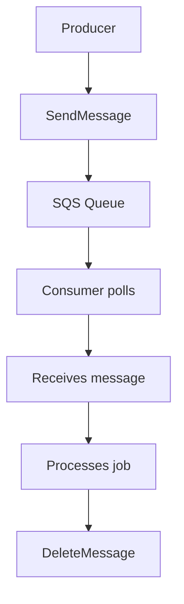

!!! info "Important"
    SQS doesn't perform the work. It only **stores and delivers the message**. Your [EC2](../compute/ec2.md), [Lambda](../containers-serverless/serverless.md), containers, etc. perform the actual work.

## Why SQS Is Important

The main use case is **decoupling applications**.

Example without SQS: `Web Server → Video Processor`. If 10 videos normally arrive but suddenly 10,000 arrive, the video processor becomes overloaded:

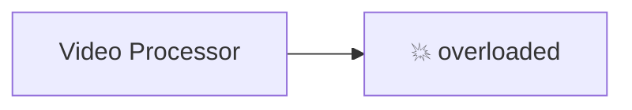

With SQS:

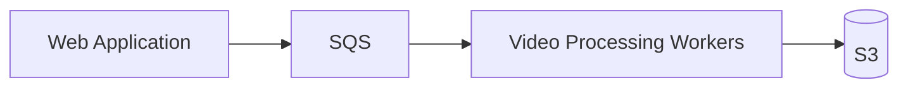

**SQS acts as a buffer.** The workers process jobs at the rate they can handle. Finished output lands in [S3](../storage/s3.md).

### Example: Video Processing

Frontend receives "Please process this video." Instead of processing it itself:

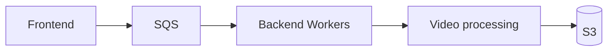

This allows different EC2 types for each tier, for example:

- frontend → normal/general-purpose [EC2](../compute/ec2.md)
- video workers → GPU/compute-optimized EC2

!!! tip "Exam Tip"
    Words such as **decouple, buffer, sudden spike, asynchronous processing** usually point toward **Amazon SQS**.

## SQS Standard Queue

Standard is the normal/default SQS queue.

#### Key Points

- extremely scalable
- very high throughput
- multiple producers supported
- multiple consumers supported
- messages retained temporarily
- **default retention in lecture: 4 days**
- **maximum retention: 14 days**
- low latency

But two important characteristics:

#### At-least-once Delivery

**A message may occasionally be delivered more than once.** Therefore your application should tolerate duplicates.

#### Best-effort Ordering

Messages are not guaranteed to arrive exactly in the order they were sent.

Example — Sent: `1 → 2 → 3 → 4`. Could receive: `1 → 3 → 2 → 4`.

If exact order matters: **use SQS FIFO** (see [SQS FIFO Queue](#sqs-fifo-queue) below).

## Multiple Consumers

You can run many consumers simultaneously.

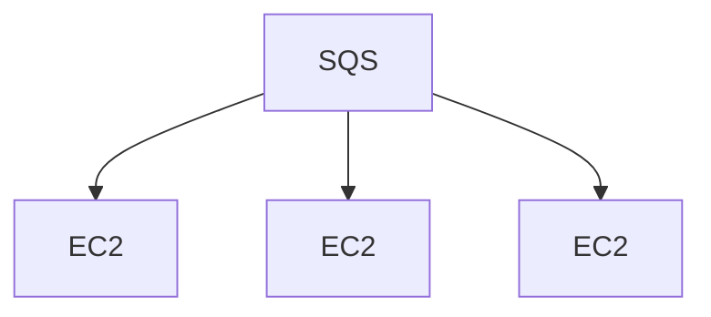

Each consumer takes messages and processes them. This allows horizontal scaling. More messages? Add more consumers.

## SQS + Auto Scaling Group

This is an important architecture combination.

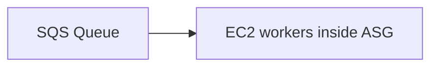

The EC2 workers poll SQS. AWS provides CloudWatch metrics such as approximately how many messages are waiting.

Scale-out architecture:

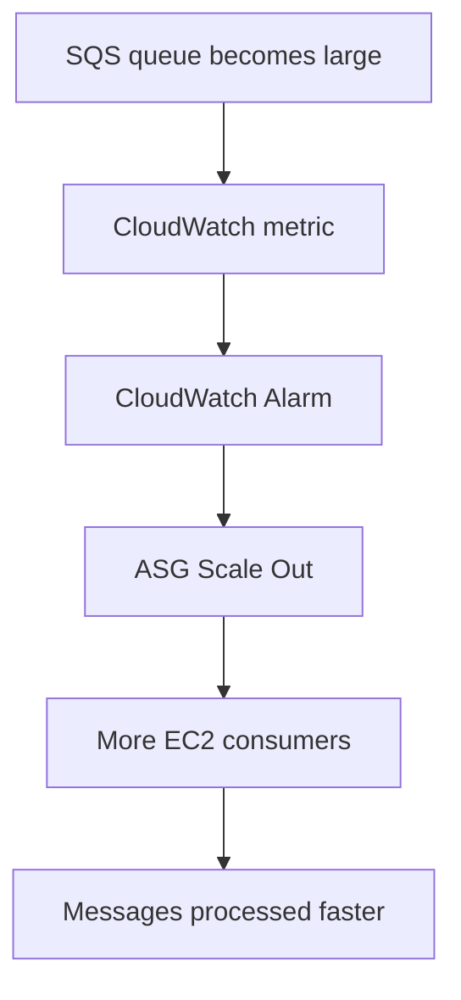

Then when the queue becomes small again:

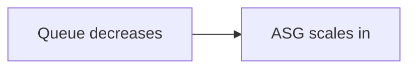

!!! example "Example"
    Normally: 100 jobs → 2 EC2 workers. Black Friday: 20,000 jobs → SQS grows → CloudWatch alarm → [ASG](../compute/load-balancing-asg.md) launches more EC2.

!!! tip "Exam Tip"
    "Automatically scale workers according to number of pending jobs" → Think: **SQS queue depth + CloudWatch + Auto Scaling**

## SQS as a Database Buffer

Another common architecture.

Bad design:

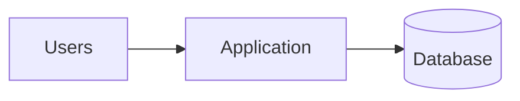

Huge traffic spike:

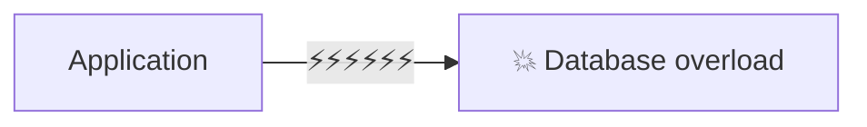

Better:

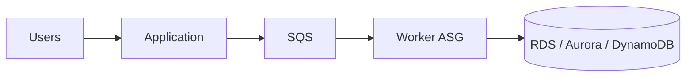

SQS absorbs the spike. The database receives writes at a manageable rate. See [RDS & Aurora](../databases/rds-aurora.md) and [DynamoDB & Other Databases](../databases/database-dynamodb.md).

!!! info "Important"
    This is asynchronous. So use it when the user does not need immediate confirmation that the database write has completed.

## SQS Visibility Timeout

This is one of the most important SQS concepts.

When Consumer A receives a message, SQS temporarily hides the message from other consumers. This period is the **Visibility Timeout**. Lecture default: **30 seconds**.

!!! example "Example"
    Message X → Consumer A receives it → visibility timeout starts → message X is invisible to Consumer B and C. If Consumer A finishes: process → delete message → done.

### What If Consumer A Doesn't Finish?

If the visibility timeout expires:

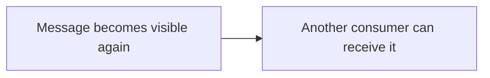

This is one reason duplicate processing can happen.

### ChangeMessageVisibility

Suppose processing normally takes 30 seconds, but one job will take 2 minutes. Consumer can call **ChangeMessageVisibility**, meaning: "I am still processing this. Keep it hidden longer."

### Timeout Too Short vs Too Long

#### Too Short

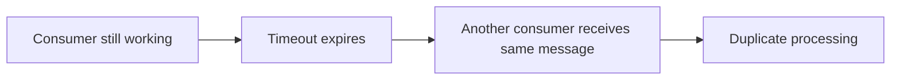

#### Too Long

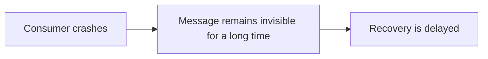

!!! tip "Exam Tip"
    Consumer needs more time than visibility timeout → **Increase visibility timeout / use ChangeMessageVisibility.**

## SQS Long Polling

Consumers normally poll SQS. Without long polling — i.e. short polling, the default — the consumer keeps asking and mostly gets empty answers:

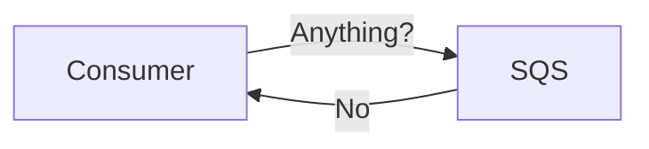

This repeats over and over. Lots of useless requests.

### Long Polling

Consumer asks SQS to "wait for a message for a while."

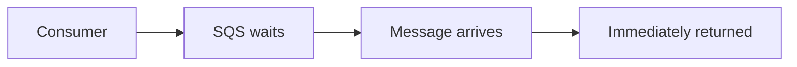

Lecture maximum wait: **20 seconds**.

#### Benefits

- fewer empty responses
- fewer API calls
- lower cost
- efficient message retrieval

!!! tip "Exam Tip"
    "Reduce empty SQS responses/API calls" → **Long Polling**. Prefer long polling over short polling in normal cases.

## SQS FIFO Queue

FIFO: **First In, First Out**. Used when ordering matters.

Sent: `1 → 2 → 3 → 4`. Received: `1 → 2 → 3 → 4`. Unlike Standard SQS, FIFO gives stronger ordering guarantees.

### Important FIFO Concepts

#### Message Group ID

**Ordering is maintained within a message group.** Example: Group A: `1 → 2 → 3`; Group B: `A → B → C`. Each group maintains its own ordering.

#### Deduplication ID

FIFO supports message deduplication. If duplicate messages use the same deduplication identity during the deduplication window, SQS can remove the duplicate. The lecture uses a **5-minute deduplication window**.

FIFO queue names end with `.fifo` — example: `orders.fifo`.

### Standard vs FIFO

| Feature | Standard | FIFO |
|---|---|---|
| Throughput | Very high | More limited |
| Ordering | Best effort | Ordered within message group |
| Duplicates | Possible | Deduplication support |
| Typical use | General workloads | Ordering-critical workloads |

!!! example "Exam Example"
    Bank transactions must be processed in order → **SQS FIFO**. Video-processing jobs where order doesn't matter → **SQS Standard**.

## SQS Security

Keep this simple.

#### Encryption in Transit

Use: HTTPS.

#### Encryption at Rest

Can use server-side encryption / [KMS](../security/security.md).

#### Permissions

Use: [IAM policies](../security/iam.md). But SQS also supports **Queue Access Policies** — resource-based policies, similar in idea to S3 bucket policies. Useful for:

- cross-account access
- SNS → SQS
- AWS services writing to SQS

Example:

```mermaid
flowchart LR
    A[SNS Topic] --> B[SQS Queue]
```

The SQS queue policy must allow the SNS topic to send messages.

## Amazon SNS

**SNS = Simple Notification Service**

SQS asks: "Who should process this job?" SNS asks: "Who needs to know that this event happened?" SNS uses **Publish / Subscribe**.

### Architecture

```mermaid
flowchart LR
    A[Publisher] --> B[SNS Topic]
    B --> C[SQS]
    B --> D[Lambda]
    B --> E[Email]
```

**Publisher sends the message once.** SNS distributes it to subscribers.

## SNS Use Case

Suppose a customer buys something. You need:

- shipping service
- fraud service
- email notification
- analytics

Bad design — the buying service calls every downstream system directly:

```mermaid
flowchart LR
    A[Buying Service] --> B[Shipping]
    A --> C[Fraud]
    A --> D[Email]
    A --> E[Analytics]
```

Buying service now knows about every other system.

Better:

```mermaid
flowchart LR
    A[Buying Service] --> B[SNS Topic]
    B --> C[Fraud]
    B --> D[Shipping]
    B --> E[Email]
    B --> F[Analytics]
```

Now systems are loosely coupled.

!!! tip "Exam Tip"
    Words: **broadcast, publish/subscribe, multiple subscribers, one event to many systems** → **SNS**

## SNS Subscribers

SNS can deliver notifications to things such as:

- SQS
- Lambda
- HTTP/HTTPS endpoints
- Email
- SMS
- mobile notifications
- Data Firehose

You don't need to memorize every integration. Understand: **SNS sends one event to multiple subscribers.**

## SNS + SQS Fan-Out

This is one of the most important messaging architectures.

Suppose one order must be processed independently by:

- fraud service
- shipping service

Instead of the application writing directly to two separate queues (`Application → Queue 1`, `Application → Queue 2`), use:

```mermaid
flowchart TD
    A[SNS] --> B[SQS] --> D[Fraud]
    A --> C[SQS] --> E[Shipping]
```

This is called **Fan-Out**.

### Why Combine SNS and SQS?

SNS gives **message distribution**. SQS gives **durable independent queues + buffering + retries**. Therefore:

- SNS = distribute
- SQS = store/process independently

Example:

```mermaid
flowchart TD
    A["Order Created"] --> B[SNS]
    B --> C[SQS] --> F[Fraud]
    B --> D[SQS] --> G[Ship]
    B --> E[SQS] --> H[Analytics]
```

Each service can process the event at its own speed.

!!! tip "Exam Tip"
    "One event must be reliably processed by multiple independent applications." → **SNS + multiple SQS queues**

## SNS Message Filtering

Normally every subscriber receives every message. But you can attach a **Subscription Filter Policy**.

Example — SNS receives `PLACED`, `CANCELLED`, `DECLINED` events. Create:

```mermaid
flowchart TD
    A[SNS] --> B["Placed Queue (filter: state = placed)"]
    A --> C["Cancel Queue (filter: state = cancelled)"]
    A --> D["All Queue (no filter — receives everything)"]
```

!!! tip "Exam Tip"
    "Subscribers need only certain events from the same SNS topic." → **SNS Subscription Filter Policy**

## SNS FIFO

SNS also has FIFO capability for workloads requiring:

- ordering
- deduplication
- fan-out

Conceptually:

```mermaid
flowchart LR
    A[Producer] --> B["SNS FIFO"] --> C["FIFO queues / compatible subscribers"]
```

This allows ordered fan-out architectures. You do not need to memorize detailed throughput limits here.

Now we move away from normal job queues, to real-time streaming data — [Kinesis Data Streams and Amazon Data Firehose](../data-analytics/data-analytics.md) are covered on the Data & Analytics page, since they feed the analytics pipeline (Athena, Glue, EMR, QuickSight) more than they act as a decoupling queue.

## SQS vs SNS vs Kinesis

This is the core comparison for the whole section.

| Requirement | Service |
|---|---|
| Queue jobs | SQS |
| Decouple two application tiers | SQS |
| Buffer sudden traffic | SQS |
| One event → many subscribers | SNS |
| Broadcast notification | SNS |
| Reliable one-to-many processing | SNS + SQS |
| Real-time streaming | Kinesis Data Streams |
| Replay streaming records | Kinesis Data Streams |
| Stream → S3/Redshift/OpenSearch | Data Firehose |

Simple memory:

- **SQS** → ONE job waiting to be processed
- **SNS** → ONE event sent to MANY
- **Kinesis** → CONTINUOUS real-time data

## Amazon MQ

Amazon MQ solves a different problem. AWS-native messaging — SQS, SNS — uses AWS APIs. But older/on-premises applications may already use traditional brokers and protocols.

Examples from the lecture include protocols such as AMQP, MQTT, STOMP, OpenWire, WSS, and brokers such as **RabbitMQ** and **ActiveMQ**.

Instead of rewriting the application to use SQS/SNS, **use Amazon MQ.**

### Example

Existing company:

```mermaid
flowchart LR
    A[Application] --> B[RabbitMQ]
```

Migrating to AWS. They don't want to rewrite application messaging code. Use:

```mermaid
flowchart LR
    A[Application] --> B["Amazon MQ"] --> C["Managed RabbitMQ / ActiveMQ"]
```

!!! info "Important"
    Amazon MQ doesn't have the same cloud-native massive scaling model as SQS/SNS. It is mainly about **compatibility with existing messaging systems.**

!!! tip "Exam Tip"
    Existing RabbitMQ/ActiveMQ application + migrate to AWS + minimal code changes → **Amazon MQ**

## Complete Architecture Memory Map

Applications need to communicate. A direct connection causes tight coupling / overload, so you decouple with one of:

- **SQS** — Queue
    - Jobs / Buffer / Workers
    - Need strict ordering? → SQS FIFO
- **SNS** — Pub/Sub
    - Broadcast / Fan-out
    - Need each subscriber to process independently? → SNS → multiple SQS queues
- **Kinesis** — Streaming
    - Real-time Events
    - Deliver stream to S3 / Redshift / OpenSearch? → Data Firehose
- Existing RabbitMQ / ActiveMQ? → **Amazon MQ**

```mermaid
flowchart TD
    A["Applications need to communicate"] --> B["Direct connection causes tight coupling / overload"]
    B --> C[DECOUPLE]
    C --> D["SQS — Queue"]
    C --> E["SNS — Pub/Sub"]
    C --> F["Kinesis — Streaming"]
    D --> D1["Jobs / Buffer / Workers"]
    E --> E1["Broadcast / Fan-out"]
    F --> F1["Real-time Events"]
    D --> G{"Need strict ordering?"}
    G -->|Yes| G1["SQS FIFO"]
    E --> H{"Need each subscriber to process independently?"}
    H -->|Yes| H1["SNS → multiple SQS queues"]
    F --> I{"Deliver stream to S3 / Redshift / OpenSearch?"}
    I -->|Yes| I1["Data Firehose"]
    J["Existing RabbitMQ / ActiveMQ?"] --> J1["Amazon MQ"]
```

## Exam Decision Flow

When you see a messaging question, ask:

| Question | Answer |
|---|---|
| Is this a JOB that must wait for processing? | SQS |
| Does ONE event need to reach MANY receivers? | SNS |
| Need both broadcast + durable queues? | SNS + SQS fan-out |
| Is it continuous REAL-TIME data? | Kinesis Data Streams |
| Is the requirement mainly to DELIVER stream into S3 / Redshift / OpenSearch? | Data Firehose |
| Existing RabbitMQ / ActiveMQ and don't want rewrite? | Amazon MQ |

## Final Exam Triggers

| Scenario | Answer |
|---|---|
| Decouple applications | SQS |
| Absorb sudden traffic spike | SQS |
| Scale workers based on queue size | SQS + ASG + CloudWatch |
| Message temporarily hidden while being processed | Visibility Timeout |
| Consumer requires more processing time | ChangeMessageVisibility |
| Reduce empty polling/API calls | Long Polling |
| Strict message ordering | SQS FIFO |
| One message → many receivers | SNS |
| One event → many durable independent consumers | SNS + SQS Fan-Out |
| Different subscribers need different events | SNS Filter Policy |
| Real-time streaming | Kinesis Data Streams |
| Replay streaming data | Kinesis Data Streams |
| Near-real-time delivery to S3/Redshift/OpenSearch | Data Firehose |
| Existing RabbitMQ/ActiveMQ | Amazon MQ |
