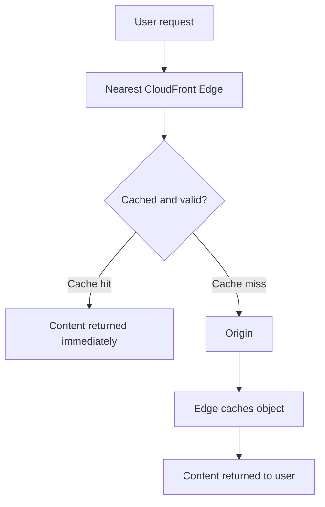
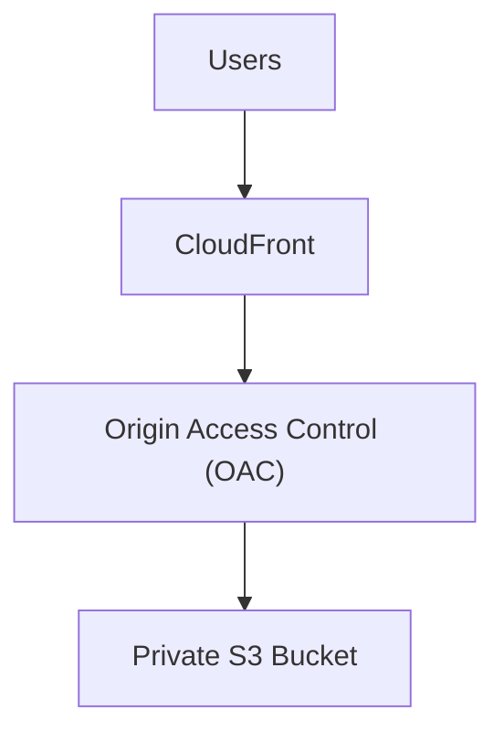
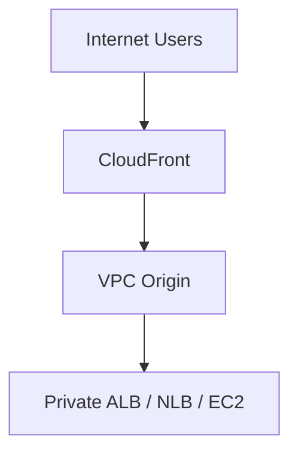
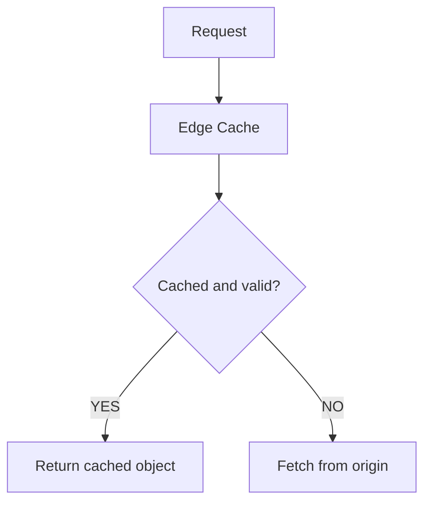
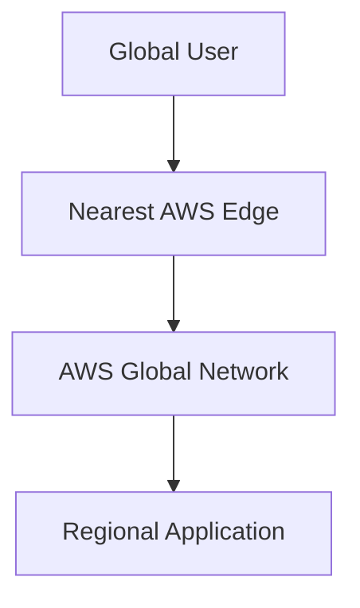
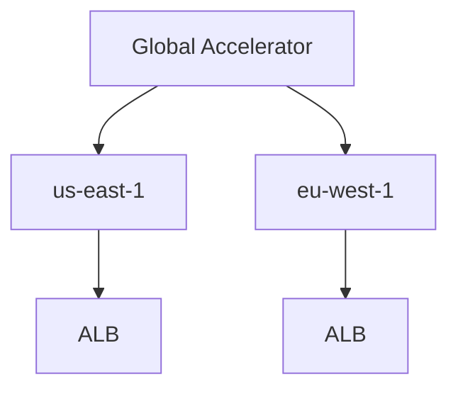

# CloudFront & Global Accelerator

## Amazon CloudFront — Core Idea

**CloudFront = AWS Content Delivery Network (CDN).**

It improves performance by caching content at AWS edge locations / Points of Presence (PoPs) close to users.

!!! warning "Exam Trigger"
    "CDN", "cache content globally", "reduce latency for global users" → **CloudFront**

CloudFront also integrates with [AWS Shield and AWS WAF](../security/security.md) for DDoS/application protection.

## CloudFront Origins

An origin = backend where CloudFront gets content.

Important origins:

- [S3 bucket](../storage/s3.md)
- [ALB](../compute/load-balancing-asg.md)
- [NLB](../compute/load-balancing-asg.md)
- [EC2](../compute/ec2.md) / HTTP server
- API Gateway
- other public HTTP(S) origins
- **private ALB/NLB/EC2 using VPC Origins**

## CloudFront + Private S3 — OAC

Best-practice architecture:

**The S3 bucket does not need to be public.**

CloudFront:

- authenticates requests to S3
- S3 bucket policy allows the CloudFront distribution
- users access objects through CloudFront

**OAC (Origin Access Control) is the recommended modern mechanism; older OAI is legacy.**

!!! warning "Exam Trigger"
    "Serve private S3 content through CloudFront without making the bucket public." → **CloudFront + OAC + S3 Bucket Policy**

!!! danger "Exam Trap"
    If S3 is configured using the S3 static website endpoint, CloudFront treats it as a custom origin and **OAC cannot be used**.

## CloudFront VPC Origins

**CloudFront can directly access applications in private subnets using VPC Origins.**

Supported private origin resources include:

- private ALB
- private NLB
- private EC2 instance

Architecture:

#### Why Important?

Backend remains private. CloudFront becomes the public entry point.

!!! warning "Exam Trigger"
    "Globally distribute an application while keeping its ALB/EC2 origin private." → **CloudFront VPC Origin**

## CloudFront vs S3 Cross-Region Replication

Do not confuse them.

| CloudFront | S3 CRR |
|---|---|
| CDN/cache | Data replication |
| Uses global edge locations | Copies between selected AWS Regions |
| Cache copies expire based on TTL | Creates durable replicated S3 objects |
| Best for global content delivery | Best for DR/compliance/regional copies |
| Edge retrieves origin content when needed | Replication happens asynchronously |

!!! tip "Memory"
    CloudFront = **CACHE** globally. CRR = **COPY** to another Region.

## CloudFront Geo Restriction

CloudFront can restrict content based on the viewer's country.

Two models:

- **Allow list** → only selected countries
- **Block list** → deny selected countries

!!! example "Example"
    Video licensing allows viewing only in USA and Canada. → CloudFront geographic restriction.

!!! tip "Memory"
    Geo Restriction = country-based content control

## CloudFront Cache TTL

Cached objects stay at an edge until their cache lifetime expires.

Longer TTL:

- higher cache-hit ratio
- less origin load
- potentially older/stale content

Shorter TTL:

- fresher content
- more origin requests

## CloudFront Cache Invalidation

Problem: you update `index.html` in S3, but CloudFront still has the old cached copy. You don't want to wait for TTL expiration.

Solution: **CloudFront Invalidation**

Examples:

- `/index.html` → invalidate one file
- `/images/*` → invalidate a path
- `/*` → invalidate everything

After invalidation, the next viewer request causes CloudFront to fetch the newest version from the origin.

!!! warning "Exam Trigger"
    "Content was updated at the origin and users must see it immediately." → **CloudFront Cache Invalidation**

## AWS Global Accelerator — Core Idea

**Global Accelerator improves global application performance by moving user traffic onto the AWS global network as quickly as possible.**

Unlike CloudFront: **Global Accelerator does not cache application content.**

## Anycast IP — Important Concept

Normally — **Unicast**: `1 IP → 1 destination`.

**Global Accelerator uses Anycast.** The same static IP is advertised from multiple AWS edge locations, and users enter AWS through a nearby edge.

**For IPv4, a standard accelerator provides two static Anycast IPv4 addresses.**

!!! warning "Exam Trigger"
    "Application needs fixed global IP addresses." → **AWS Global Accelerator**

## Global Accelerator Endpoints

Standard accelerator endpoints can include:

- Application Load Balancer
- Network Load Balancer
- EC2 instance
- Elastic IP

Can span multiple Regions. Example:

## Global Accelerator Health Checks

Global Accelerator monitors endpoint health and sends traffic toward healthy endpoints.

This gives fast failover without waiting for clients to refresh DNS records.

!!! warning "Exam Trigger"
    "Need global traffic routing with quick regional failover and static IPs." → **Global Accelerator**

## CloudFront vs Global Accelerator — Very Important

| CloudFront | Global Accelerator |
|---|---|
| CDN | Network accelerator |
| Mainly HTTP/HTTPS content delivery | TCP/UDP application traffic |
| Caches content | No caching |
| Content may be served from edge | Edge forwards traffic to regional endpoint |
| Static/dynamic web delivery | Gaming, VoIP, IoT, APIs, applications |
| No main requirement for static client-facing IP | Provides static Anycast IPs |
| Optimize content delivery | Optimize network path |

Both use:

- AWS global edge infrastructure
- AWS global network
- AWS Shield integration

#### Exam Examples

| Scenario | Answer |
|---|---|
| Global users downloading images/videos | CloudFront |
| Global gaming application using UDP | Global Accelerator |
| Application requires two fixed global IPs | Global Accelerator |
| S3 static content must be cached worldwide | CloudFront |

## CloudFront vs S3 Transfer Acceleration vs Global Accelerator

This is a useful cross-topic comparison:

| Requirement | Service |
|---|---|
| Cache/download content globally | CloudFront |
| Speed uploads/downloads to one S3 bucket | [S3 Transfer Acceleration](../storage/s3.md) |
| Accelerate TCP/UDP application traffic | Global Accelerator |
| Need global static Anycast IPs | Global Accelerator |

## SAA Quick Memory Map

- **CloudFront**
    - CDN
    - Edge caching
    - Global low latency
    - S3 Origin → OAC → Private S3
    - Private ALB/NLB/EC2 → VPC Origin
    - Country blocking → Geo Restriction
    - Updated origin but stale cache → Invalidation
- **Global Accelerator**
    - AWS global network
    - Anycast
    - Static global IPs
    - TCP / UDP
    - ALB / NLB / EC2 / EIP
    - Health checks
    - Fast regional failover

!!! tip "Must Remember"
    - CDN → CloudFront
    - CloudFront → caches at edge
    - Private S3 + CloudFront → OAC
    - Private ALB/NLB/EC2 → CloudFront VPC Origin
    - Country restriction → CloudFront Geo Restriction
    - Origin changed but edge still serves old file → Invalidation
    - Global static IPs → Global Accelerator
    - TCP/UDP global acceleration → Global Accelerator
    - CloudFront = caching
    - Global Accelerator = network acceleration, no caching
    - CloudFront ≠ S3 CRR: cache vs replication
