# Route 53

Use this as your chapter-end revision sheet. The goal is to recognize the correct Route 53 answer quickly from an exam scenario.

## Route 53 — Big Picture

**Amazon Route 53 = managed DNS + domain registration + health checks + traffic routing**

Main jobs:

- Register domains.
- Create DNS records.
- Route users to AWS/non-AWS resources.
- Route users based on:
    - percentage
    - latency
    - location
    - proximity
    - IP range
    - health
- Perform DNS failover.
- Support hybrid DNS between AWS and on-premises.

#### Mental Flow

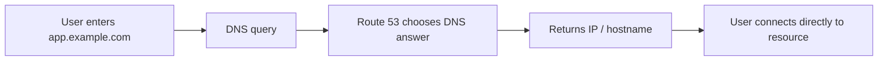

**Important:** Route 53 is not a proxy and does not carry application traffic.

## DNS Basics You Must Know

#### DNS hierarchy

`www.example.com`

- `.com` → TLD
- `example.com` → domain
- `www.example.com` → subdomain/FQDN

#### Important Record Types

| Record | Meaning | Example |
|---|---|---|
| A | hostname → IPv4 | `app.com → 1.2.3.4` |
| AAAA | hostname → IPv6 | `app.com → IPv6` |
| CNAME | hostname → another hostname | `www.app.com → xyz.com` |
| NS | authoritative DNS servers | identifies Route 53 name servers |

## Hosted Zones

### Public Hosted Zone

DNS records accessible from the internet.

Example: `www.example.com → public` [ALB](../compute/load-balancing-asg.md)

### Private Hosted Zone

DNS records resolvable only from associated VPCs.

Example: `database.internal.example.com → private IP`

!!! warning "Exam Recognition"
    "Internal DNS names for resources inside VPC" → **Route 53 Private Hosted Zone**

## TTL

TTL = how long DNS responses are cached.

#### High TTL

- fewer DNS queries
- lower Route 53 query cost
- slower changes/failover propagation

#### Low TTL

- more DNS queries
- faster DNS changes
- higher query volume

!!! example "Example"
    If `app.com → Server A` with TTL = 1 hour, and you change it to Server B, some users may still reach Server A until their cached TTL expires.

!!! danger "Exam Trap"
    "DNS record was changed, but users still reach old server." → Think: **DNS cache / TTL**

## CNAME vs Alias

One of the most important Route 53 exam topics.

### CNAME

Maps: `hostname → hostname`

Example: `www.example.com → my-alb.amazonaws.com`

But: ❌ Cannot normally be used at the zone apex/root, so this is **not** valid as a normal CNAME: `example.com → my-alb.amazonaws.com`

### Alias Record

Route 53-specific feature.

Example: `example.com → Alias A → ALB`

#### Alias advantages

- Works at root domain.
- Maps directly to supported AWS resources.
- No manually configured TTL for many Alias targets.
- Can evaluate target health.

#### Common Alias Targets

- [ALB](../compute/load-balancing-asg.md)
- [NLB](../compute/load-balancing-asg.md)
- [CloudFront](cloudfront-global-accelerator.md)
- API Gateway
- [S3 static website](../storage/s3.md)
- Elastic Beanstalk
- [Global Accelerator](cloudfront-global-accelerator.md)
- VPC Interface Endpoint
- another Route 53 record

!!! danger "Important Trap"
    You generally cannot Alias directly to an EC2 public DNS hostname.

!!! tip "Memory Rule"
    AWS resource? Prefer **Alias** — especially `example.com → ALB`.

## Routing Policies — Master Decision Map

This is the most important section. What is the requirement?

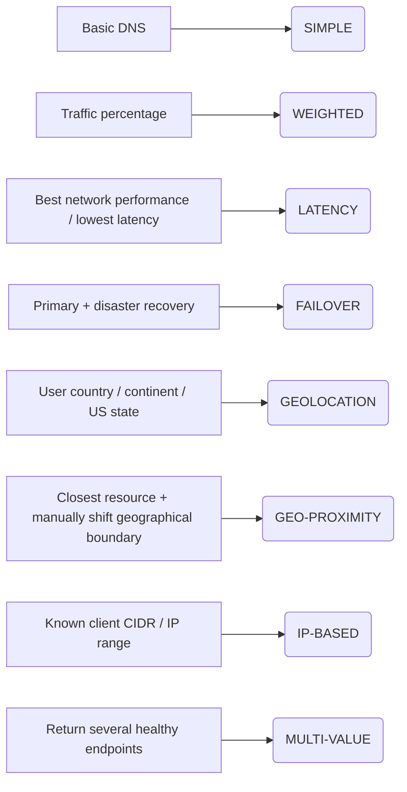

## Simple Routing

#### Use

Basic DNS mapping. Example: `app.example.com → 1.2.3.4`

Can also return multiple IP values, e.g. `app.example.com → 1.1.1.1, 2.2.2.2` — but the client chooses one.

!!! info "Important"
    ❌ No Route 53 health-check association for Simple routing.

!!! warning "Exam Trigger"
    "Just map hostname to resource." → **Simple**

## Weighted Routing

Controls the relative percentage of DNS responses.

Example: Version A → weight 90, Version B → weight 10 — approximately `90% → A`, `10% → B`.

#### Formula

`record weight / total weight`

Weights do not need to total 100. Example: `9 + 1` works like `90 + 10`.

#### Use Cases

- Canary deployment
- A/B testing
- gradual migration
- controlled traffic distribution

#### Health Checks

✅ Supported.

!!! warning "Exam Trigger"
    "Send 10% of users to new application version." → **Weighted**

!!! tip "Memory"
    Weighted = percentage

## Latency-Based Routing

Routes users to the AWS Region providing the lowest network latency.

Example: application exists in Virginia, Frankfurt, Singapore. A European user may get Frankfurt if it has the lowest latency.

!!! danger "Important Trap"
    Latency ≠ geographic distance. The physically closest Region may not always provide the lowest network latency.

#### Health Checks

✅ Supported.

!!! warning "Exam Trigger"
    "Improve global application performance by routing users to the Region with lowest latency." → **Latency**

!!! tip "Memory"
    Latency = fastest

## Failover Routing

Very important for SAA. Used for **Active-Passive disaster recovery**. Create a Primary record and a Secondary record.

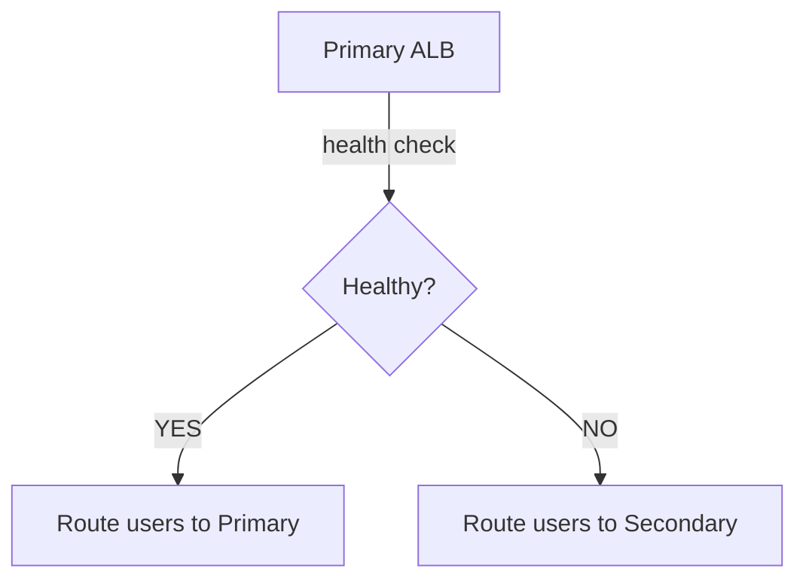

!!! example "Example"
    Primary: `us-east-1`. Secondary: `us-west-2`. If the primary health check fails, Route 53 returns the secondary.

!!! warning "Exam Trigger"
    "Primary site should serve traffic normally, but automatically switch to DR site if primary fails." → **Failover Routing**

!!! tip "Memory"
    Failover = Active / Passive

## Geolocation Routing

Routes based on where the user is located. Can match: continent, country, or U.S. state.

!!! example "Example"
    Germany → German website; France → French website; everything else → English website.

#### Default Record

Recommended for users who do not match any location rule.

#### Most Specific Rule Wins

If rules exist for Europe and Germany, a German user matches Germany, because it is more specific.

#### Use Cases

- localization
- content restrictions
- regional compliance
- language-specific websites

!!! warning "Exam Trigger"
    "French customers must receive the French website." → **Geolocation**

!!! tip "Memory"
    Geolocation = WHERE USER IS

## Geoproximity Routing

Routes based on geographic distance between users ↔ resources, but allows you to modify routing using **bias**.

#### Bias

- Positive bias (`+`) → expands geographic area → more traffic
- Negative bias (`-`) → shrinks geographic area → less traffic

!!! example "Example"
    Resources in `us-west-1` and `us-east-1` normally divide traffic based on distance. Set `us-east-1 bias = +50` and Route 53 attracts users from a larger geographic area toward `us-east-1`.

#### Resource Location

- AWS resource → specify Region
- Non-AWS resource → latitude + longitude

!!! warning "Exam Trigger"
    "Route based on proximity but shift more users toward one Region." → **Geoproximity + Bias**

!!! tip "Memory"
    Geoproximity = WHERE USER + RESOURCE ARE. Bias = SHIFT THE BORDER

## Geolocation vs Geoproximity

Very common confusion.

| Geolocation | Geoproximity |
|---|---|
| Based on user location | User + resource location |
| Explicit location rules | Geographic distance |
| Country / continent / US state | Closest resource |
| Localization | Geographic traffic distribution |
| No bias | Bias supported |

!!! tip "Shortcut"
    "German users → Germany-specific site" → **Geolocation**. "Move more North American users toward us-east-1" → **Geoproximity**.

## IP-Based Routing

Routes based on known client IP/CIDR ranges.

!!! example "Example"
    `203.0.113.0/24 → Server A`, `200.10.0.0/16 → Server B`

#### Use Cases

- known ISP networks
- corporate networks
- known customer CIDRs
- optimize network cost/performance

!!! warning "Exam Trigger"
    "Traffic from this specific CIDR must go to this endpoint." → **IP-Based Routing**

!!! tip "Memory"
    IP-Based = CLIENT CIDR

## Multi-Value Answer Routing

Returns multiple healthy records. Route 53 can return up to **8 healthy records** per DNS response.

!!! example "Example"
    `app.example.com` → Server A ✅, Server B ✅, Server C ❌. Route 53 returns Server A + Server B, but not C.

!!! info "Important"
    ✅ Health checks supported.

!!! info "But"
    ❌ Multi-Value is not an ELB replacement — the DNS client chooses which returned endpoint to use.

!!! warning "Exam Trigger"
    "Return several healthy endpoints through DNS." → **Multi-Value**

!!! tip "Memory"
    Multi-Value = many HEALTHY answers

## Simple vs Multi-Value

| Simple | Multi-Value |
|---|---|
| Can return multiple values | Can return multiple values |
| ❌ Health checks | ✅ Health checks |
| May return unhealthy endpoint | Filters unhealthy endpoints |
| Basic DNS | Health-aware client-side distribution |
| No 8-record health-aware behavior | Up to 8 healthy answers |

## Weighted vs Multi-Value vs ELB

Do not confuse them.

**Weighted** — Route 53 chooses based on **percentage**. Example: `90% / 10%`.

**Multi-Value** — Route 53 returns **multiple healthy endpoints**; the client chooses.

**ELB** — actually receives application traffic and distributes it to targets. Example: `User → ALB → EC2`. See [Load Balancing & Auto Scaling](../compute/load-balancing-asg.md).

!!! tip "Memory"
    Weighted = percentage · Multi-Value = multiple DNS answers · ELB = actual traffic load balancing

## Route 53 Health Checks

Primary purpose: **DNS failover**. Route 53 can avoid unhealthy resources.

### Health Check Type 1 — Endpoint

Directly monitors public endpoint. Supports HTTP, HTTPS, TCP.

Typical check interval: **30 seconds** standard, **10 seconds** fast / higher cost.

HTTP/HTTPS typically expects **2xx / 3xx**. Can optionally search the first **5,120 bytes** for specific text.

### Health Check Networking

Route 53 health checkers must reach the resource.

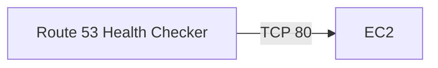

If the EC2 [security group](../networking/vpc.md#security-groups) blocks port 80 → connection timeout → health check becomes unhealthy.

!!! warning "Exam Pattern"
    Healthy application + Route 53 says unhealthy? Check: **Security Group / Firewall**

## Calculated Health Checks

Combines multiple child health checks. Can use logic such as AND, OR, NOT. Up to **256 child health checks**.

!!! example "Example"
    3 regional servers, require **2 out of 3 healthy**. The parent becomes healthy if the requirement is satisfied.

!!! warning "Exam Trigger"
    "Combine health status of multiple resources." → **Calculated Health Check**

## Health Check for Private Resources

Important. Route 53 public health checkers cannot directly access private EC2, private IPs, or internal VPC resources.

Typical pattern:

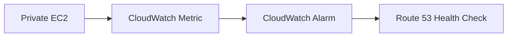

!!! warning "Exam Trigger"
    "Route 53 health check for private resource." → Think: **CloudWatch Alarm**

## Health Check Memory Map

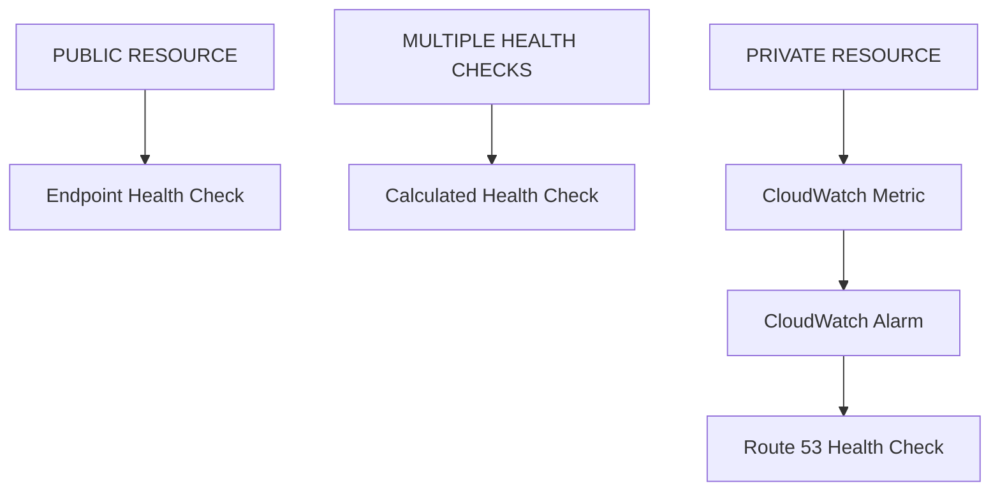

## Domain Registrar vs DNS Provider

They are different.

#### Registrar

Where you buy/register `example.com`. Examples: Route 53 Domains, GoDaddy, other registrars.

#### DNS Provider

Where DNS records are managed. Example: Route 53 Hosted Zone.

### Third-Party Registrar + Route 53

Completely valid.

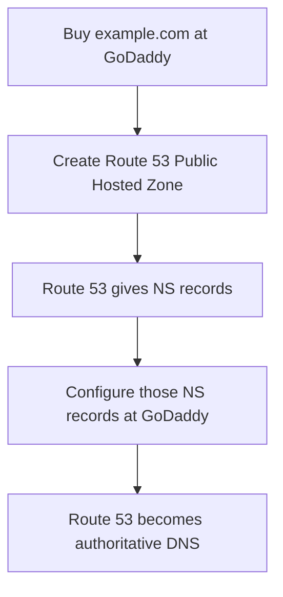

!!! warning "Exam Trigger"
    "Domain registered outside AWS but wants Route 53 DNS." → No domain transfer required. Just **update name servers**.

## Route 53 Resolver

Provides DNS resolution inside AWS VPCs. It can resolve EC2 DNS names, Private Hosted Zone records, and public DNS names.

Critical exam area: **Hybrid DNS**

## Resolver Inbound Endpoint

Direction: **On-Premises → AWS DNS**. Use when on-premises resources need to resolve AWS private DNS.

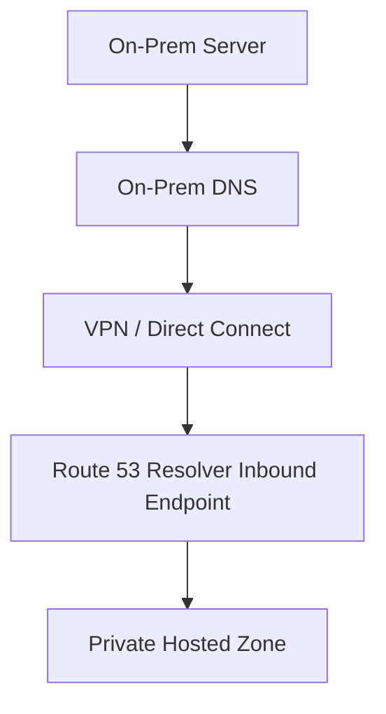

!!! tip "Memory"
    Inbound = DNS queries entering AWS

## Resolver Outbound Endpoint

Direction: **AWS → On-Premises DNS**. Example: EC2 needs to resolve `database.corporate.local`.

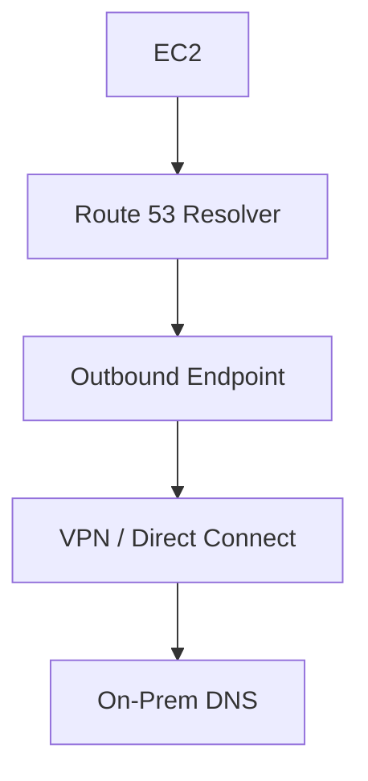

Resolver rules determine which domains should be forwarded.

!!! tip "Memory"
    Outbound = DNS queries leaving AWS

## Hybrid DNS Exam Pattern

- "On-premises servers must resolve AWS private hosted zone names." → **Inbound Endpoint**
- "AWS EC2 must resolve on-premises domains." → **Outbound Endpoint**
- "Both sides must resolve each other's domains." → **Inbound + Outbound**

And you still need network connectivity — **Site-to-Site VPN / Direct Connect**. Resolver endpoints do not replace network connectivity.

## Routing Policy Ultra-Fast Cheat Sheet

| Requirement | Choose |
|---|---|
| Basic DNS | Simple |
| 90% / 10% traffic | Weighted |
| Lowest network latency | Latency |
| Primary + secondary DR | Failover |
| Country / continent / state | Geolocation |
| Closest resource + bias | Geoproximity |
| Specific client CIDR | IP-Based |
| Several healthy DNS answers | Multi-Value |

This table alone is worth memorizing.

## Important Numbers

Keep these in memory:

#### Health Checks

- Standard interval → 30 sec
- Fast interval → 10 sec
- Content search → first 5,120 bytes
- Calculated check → up to 256 child checks

#### Multi-Value

- Up to 8 healthy records returned

These are the Route 53 numbers most worth recognizing for SAA.

## Most Important Exam Comparisons

| Scenario | Answer |
|---|---|
| Lowest response time? | Latency |
| Country-specific routing? | Geolocation |
| German users → German site | Geolocation |
| Shift geographic boundary toward Frankfurt | Geoproximity |
| 90% primary / 10% new app | Weighted |
| Primary normally 100%, secondary only when primary fails | Failover |
| You control distribution | Weighted |
| AWS chooses fastest Region | Latency |
| Multiple values without health awareness | Simple |
| Multiple healthy resources | Multi-Value |
| `www.example.com → another hostname` | CNAME possible |
| `example.com → ALB` | Alias |

## Route 53 Architecture Scenarios

#### Scenario 1 — Global low-latency application

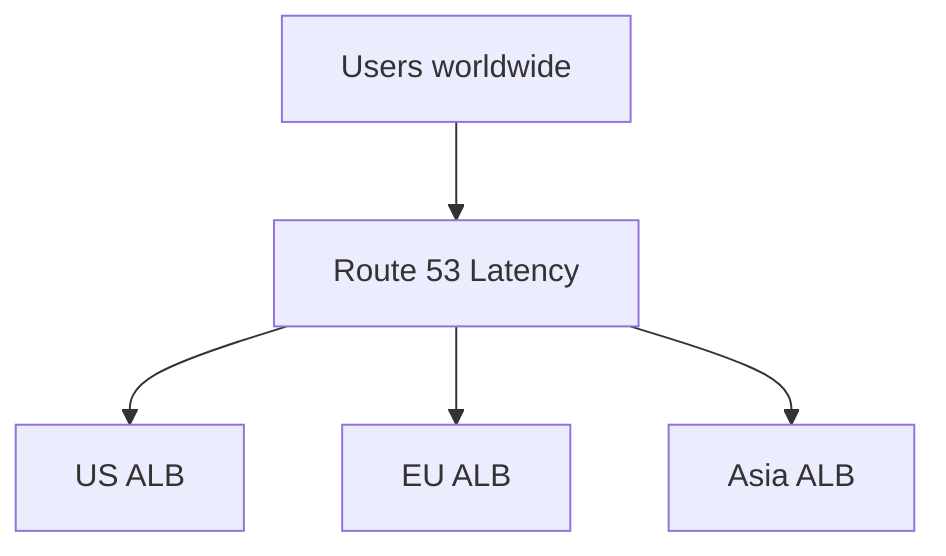

Add health checks for regional failover.

#### Scenario 2 — Active/Passive DR

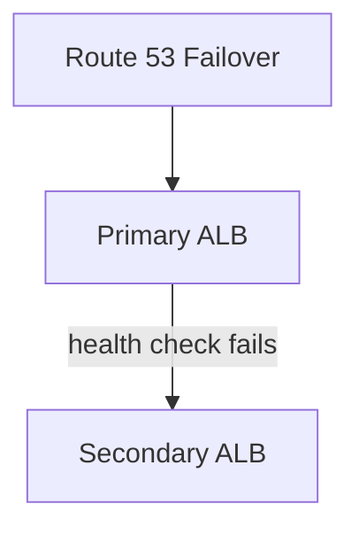

#### Scenario 3 — Canary Deployment

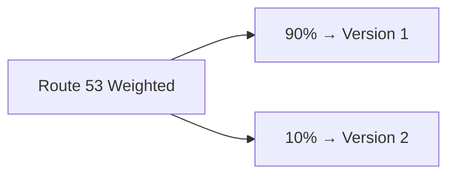

#### Scenario 4 — Localization

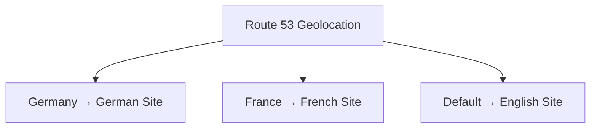

#### Scenario 5 — Hybrid DNS

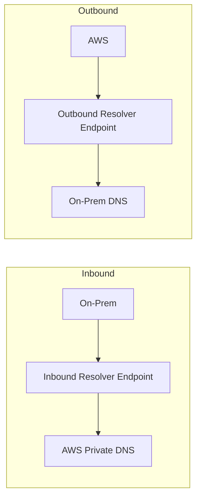

## Common SAA Traps

!!! danger "Trap 1"
    Myth: Route 53 "redirects traffic." Reality: Route 53 returns a DNS answer — application traffic then goes directly to the endpoint.

!!! danger "Trap 2"
    Myth: Latency routing sends to the physically closest Region. Reality: it sends to the Region with the lowest **measured network latency**.

!!! danger "Trap 3"
    Myth: Multi-Value is an ELB. Reality: Multi-Value = DNS-level client-side distribution.

!!! danger "Trap 4"
    Myth: Weighted records must add to 100. Reality: weights are relative — `7:2:1 = 70:20:10`.

!!! danger "Trap 5"
    Myth: CNAME works at the root domain. Reality: normally no — use **Alias**.

!!! danger "Trap 6"
    Myth: Route 53 directly health-checks private EC2. Reality: public Route 53 health checkers cannot directly reach private resources — use a **CloudWatch Alarm-based health check**.

!!! danger "Trap 7"
    Myth: registering a domain with GoDaddy means you must use GoDaddy DNS. Reality: point the registrar's NS records to Route 53.

!!! danger "Trap 8"
    Myth: Route 53 Resolver endpoints replace VPN. Reality: hybrid DNS still requires network connectivity such as VPN or Direct Connect.

## Final Memory Tree

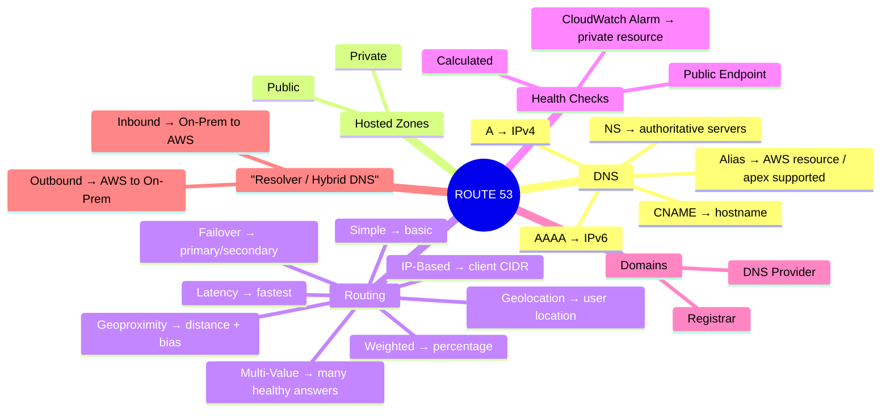

!!! tip "One-Minute Pre-Exam Recall"
    Simple = basic · Weighted = percentage · Latency = fastest · Failover = active/passive · Geolocation = user's location · Geoproximity = location + bias · IP-Based = CIDR · Multi-Value = multiple healthy answers

    Alias = AWS resources + root domain · TTL = DNS cache · Health Check = DNS failover · Inbound Resolver = on-prem → AWS · Outbound Resolver = AWS → on-prem · Private health = CloudWatch Alarm · Third-party registrar + Route 53 = update NS records

    That covers the Route 53 dimensions you should be able to recognize for SAA scenario questions.
