# VPC & Networking

This is the chapter-end version: concise enough to revise, but explanatory enough to learn directly from it.

The most important idea is:

**VPC questions are usually about four things: addressing, routing, security, and connectivity.**

- **Addressing** — CIDR → VPC → Subnets
- **Routing** — Route Tables → IGW / NAT / Peering / Endpoint / VPN / TGW
- **Security** — Security Groups → NACL → Network Firewall
- **Connectivity** — Internet / AWS Services / Other VPCs / On-Premises

## VPC — Big Picture

**VPC = Virtual Private Cloud** — a logically isolated network inside an AWS Region.

Example layout across two Availability Zones:

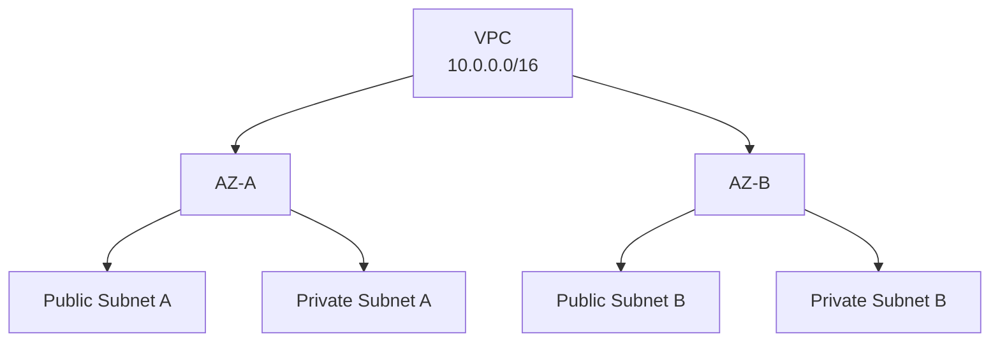

A VPC spans:

- an AWS Region
- multiple Availability Zones

A subnet belongs to:

- exactly one AZ

#### SAA Architecture Pattern

The typical highly available VPC layout:

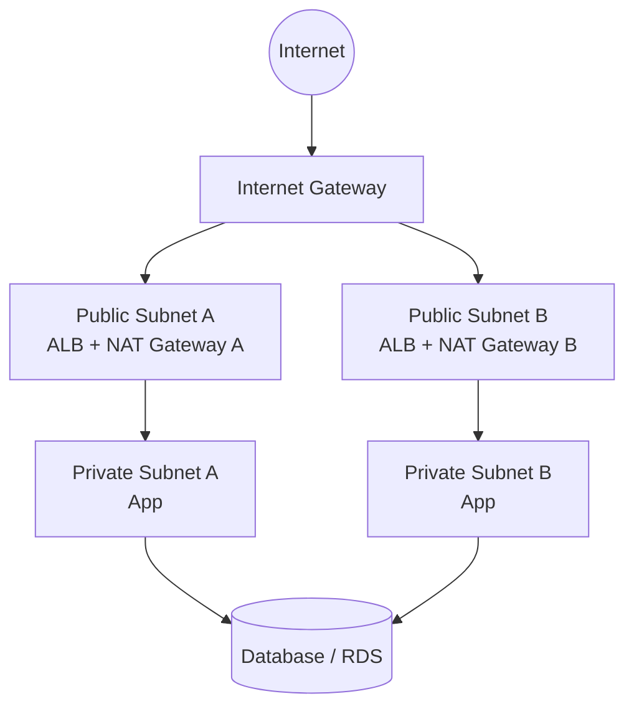

This is the typical highly available VPC layout.

## CIDR — IP Address Ranges

CIDR defines an IP range. Examples: `10.0.0.0/16`, `10.0.1.0/24`, `203.0.113.10/32`, `0.0.0.0/0`.

Important sizes:

| CIDR | IPv4 addresses |
|---|---|
| /32 | 1 |
| /28 | 16 |
| /27 | 32 |
| /26 | 64 |
| /24 | 256 |
| /16 | 65,536 |

!!! tip "Memory"
    - `/32` → one IP
    - `/24` → last octet changes
    - `/16` → last two octets change
    - `0.0.0.0/0` → all IPv4 addresses

## Private IPv4 Ranges

Recognize these RFC1918 ranges:

- `10.0.0.0/8`
- `172.16.0.0/12`
- `192.168.0.0/16`

For most VPC designs, you use private address ranges.

#### Critical Design Rule

Avoid overlapping CIDRs if networks may later connect.

Bad example: VPC A `10.0.0.0/16` and VPC B `10.0.0.0/16` — both use the same CIDR.

This creates connectivity problems for:

- VPC Peering
- Transit Gateway
- VPN
- Direct Connect

!!! warning "Exam Trigger"
    "VPCs must be connected later." → **Choose non-overlapping CIDRs.**

## Subnets

**A subnet is a smaller network inside a VPC.**

Example, inside VPC `10.0.0.0/16`:

| Subnet | CIDR |
|---|---|
| Public A | 10.0.0.0/24 |
| Public B | 10.0.1.0/24 |
| Private A | 10.0.16.0/20 |
| Private B | 10.0.32.0/20 |

!!! info "Important"
    A subnet:

    - belongs to one AZ
    - has its own CIDR
    - uses a route table
    - is associated with a NACL

## AWS Reserves 5 IPv4 Addresses per Subnet

For `10.0.0.0/24`, AWS reserves:

| Address | Purpose |
|---|---|
| 10.0.0.0 | Network address |
| 10.0.0.1 | VPC router |
| 10.0.0.2 | DNS |
| 10.0.0.3 | Reserved |
| 10.0.0.255 | Reserved broadcast address |

So for a `/24` (256 total): `256 - 5 = 251` usable.

!!! example "Example"
    Need 29 usable IPs.

    - `/27` → `32 - 5 = 27` ❌ (too small)
    - `/26` → `64 - 5 = 59` ✅

## Default VPC

AWS creates a default VPC so you can launch EC2 easily. Typical characteristics:

- default subnet in each AZ
- Internet Gateway attached
- route to Internet Gateway
- default subnets auto-assign public IPv4
- permissive default NACL

This is why early EC2 labs had internet connectivity without building networking manually.

!!! tip "Memory"
    **Default VPC** = networking already configured

    **Custom VPC** = you design everything

## Route Tables

**The most important VPC concept.** A route table answers: **"Where should this packet go?"**

| Destination | Target |
|---|---|
| 10.0.0.0/16 | local |
| 0.0.0.0/0 | IGW |

Meaning:

- Destination inside VPC → local
- Everything else → Internet Gateway

Every subnet must use a route table. If no explicit route table is associated, **the subnet uses the main route table.**

## Public vs Private Subnet

This is one of the most important exam concepts.

### Public Subnet

Has a route: `0.0.0.0/0 → Internet Gateway`

**A subnet becomes public because of its routing** — not simply because an instance has a public IP.

### Private Subnet

Does not route directly to an Internet Gateway. Typical private subnet:

- `10.0.0.0/16 → local`
- `0.0.0.0/0 → NAT Gateway`

!!! tip "Memory"
    Public subnet → `0.0.0.0/0 → IGW`

    Private subnet → no direct IGW route

## Internet Gateway

An Internet Gateway (IGW) provides internet connectivity for a VPC. It is:

- AWS managed
- horizontally scalable
- highly available

But IGW attached ≠ automatic internet. You also need:

- a route table entry `0.0.0.0/0 → IGW`
- for IPv4 public internet access, the instance also needs a public IPv4 or Elastic IP
- SG/NACL must permit the traffic

## Bastion Host

A bastion host provides administrative access to private [EC2](../compute/ec2.md) instances.

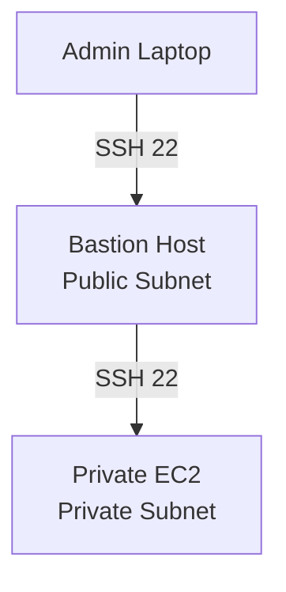

#### Bastion SG

Inbound: TCP 22, source = trusted admin/corporate IP.

#### Private EC2 SG

Inbound: TCP 22, source = Bastion SG.

!!! warning "Exam Trigger"
    "Administrators need SSH access to EC2 instances in private subnets." → **Bastion Host**

    Modern architectures may instead use **Systems Manager Session Manager**.

## NAT — Why We Need It

Problem: private EC2 should not be directly internet-accessible, but it still needs:

- software updates
- package downloads
- external APIs

Solution: NAT.

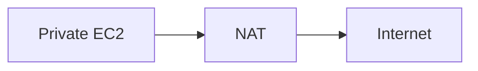

The private instance initiates the connection. The internet cannot directly initiate connections back through NAT.

!!! tip "Memory"
    Private → Internet ✅

    Internet → Private initiate ❌

## NAT Instance

Legacy solution. A NAT Instance is an [EC2](../compute/ec2.md) instance configured as a NAT device.

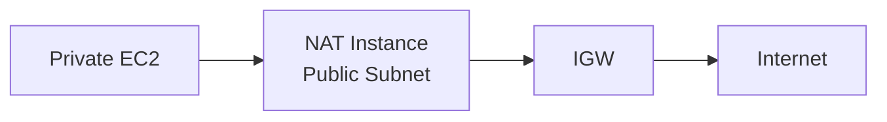

Requirements:

- public subnet
- public/Elastic IP
- Security Group
- private route points to NAT instance
- disable Source/Destination Check

#### Why Disable Source/Destination Check?

A normal EC2 instance expects itself to be the source or destination of its traffic. A NAT Instance forwards traffic for other EC2 instances — therefore you must disable source/destination check.

## NAT Gateway

Preferred SAA solution.

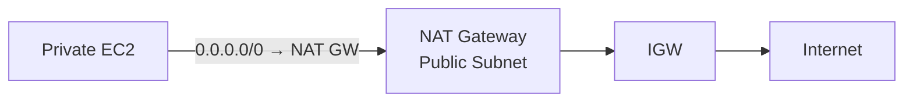

Advantages:

- managed
- scalable
- no patching
- no source/destination check configuration
- no SG attached
- higher availability than a NAT instance

!!! warning "Exam Trigger"
    "Private EC2 requires outbound IPv4 internet." → **NAT Gateway**

## NAT Gateway High Availability

**Traditional zonal NAT Gateway is highly available within one AZ.** Highly available multi-AZ architecture:

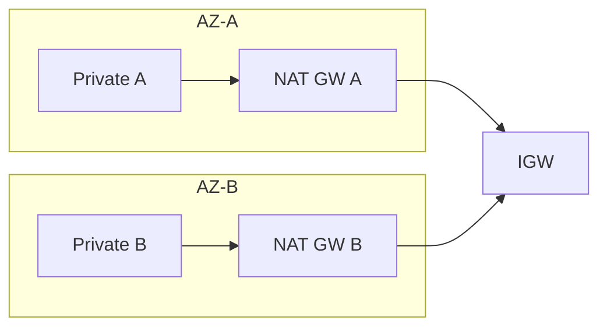

Each private subnet should normally use the NAT Gateway in its own AZ. This:

- improves resilience
- avoids unnecessary cross-AZ traffic

AWS also now has a **Regional NAT Gateway**, which simplifies multi-AZ NAT by providing a regional model. For classic SAA architecture questions, still recognize the traditional one-zonal-NAT-Gateway-per-AZ pattern.

## NAT Gateway vs NAT Instance

| | NAT Gateway | NAT Instance |
|---|---|---|
| AWS managed | ✅ | ❌ |
| EC2 | ❌ | ✅ |
| SG required | ❌ | ✅ |
| Disable source/dest check | ❌ | ✅ |
| Patch OS | ❌ | ✅ |
| Bandwidth | Managed/scales | Depends on instance |
| Preferred | ✅ | Legacy |

## Security Groups

**Security Group = firewall at the resource/ENI level.**

Important:

- stateful
- allow rules only
- attached to resources
- all rules considered

Example — EC2 SG inbound: `HTTPS 443 from 0.0.0.0/0`, `SSH 22 from admin IP`.

#### Stateful Means

If an inbound connection is allowed (Client → EC2 ✅), the response traffic (EC2 → Client) is automatically allowed ✅ — no separate return rule is required.

!!! tip "Memory"
    **SG remembers connections.**

## Network ACL (NACL)

**NACL = firewall at the subnet level.**

Important:

- stateless
- allow + deny rules
- numbered rules
- lowest-number matching rule wins
- applies to every resource in the associated subnet

!!! tip "Memory"
    **NACL forgets connections.** Both directions must be explicitly allowed.

## Default vs Custom NACL

### Default NACL

Allows: Inbound → ALL, Outbound → ALL.

### New Custom NACL

Starts essentially: Inbound → DENY, Outbound → DENY, until rules are added.

## NACL Rule Evaluation

Example:

- `100 ALLOW HTTP`
- `200 DENY HTTP`

Result → **ALLOW**, because rule 100 matches first. This is different from IAM.

!!! info "Important"
    For NACL: **first matching rule wins.** Do not apply "explicit deny always wins" to NACL rule ordering.

## Ephemeral Ports

Clients use temporary high-numbered ports for connections.

Example — Web EC2 (source port 50105) → MySQL (destination port 3306):

- Request: `50105 → 3306`
- Response: `3306 → 50105`

Port `50105` is an ephemeral port. Because NACLs are stateless, restrictive NACLs often need explicit ephemeral return-port rules.

!!! warning "Exam Trigger"
    Service port looks correct but traffic still times out after NACL changes. → **Check ephemeral ports / return path.**

## Security Group vs NACL

| | Security Group | NACL |
|---|---|---|
| Level | Resource/ENI | Subnet |
| Stateful | Yes | No |
| Allow | ✅ | ✅ |
| Deny | ❌ | ✅ |
| Return traffic | automatic | explicit |
| Rule evaluation | all applicable | first match |
| Block one malicious IP | difficult/not explicit deny | excellent use case |

!!! tip "Memory"
    SG = stateful resource firewall

    NACL = stateless subnet firewall

## VPC Peering

Connects two VPCs privately, e.g. VPC A `10.0.0.0/16` ↔ VPC B `172.31.0.0/16`.

Can work:

- same account
- different accounts
- same Region
- different Regions

#### Requirement

CIDRs must not overlap.

## Peering Requires Routes

Peering alone is insufficient. Both sides need a route pointing to the peering connection, e.g.:

- VPC A (`172.31.0.0/16`) → Peering Connection
- VPC B (`10.0.0.0/16`) → Peering Connection

And SG/NACL must allow the traffic.

## VPC Peering Is Not Transitive

`A ↔ B ↔ C` does **not** give you `A → C` ❌.

Need `A ↔ C` directly, or use a more scalable architecture such as Transit Gateway.

!!! tip "Memory"
    Peering = one-to-one = non-transitive

## VPC Endpoints

Problem: private EC2 needs an AWS service such as [S3](../storage/s3.md).

Without an endpoint: Private EC2 → NAT Gateway → AWS public endpoint.

Better: Private EC2 → VPC Endpoint → AWS Service.

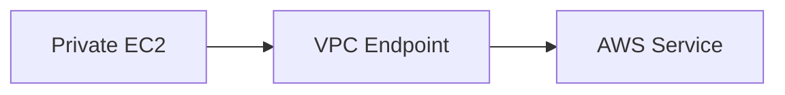

Benefits:

- private connectivity
- NAT not required for that service path
- lower NAT processing cost
- simplified networking

## Gateway Endpoint

For [S3](../storage/s3.md) and [DynamoDB](../databases/database-dynamodb.md).

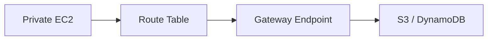

Important:

- route-table based
- no ENI
- no SG
- no endpoint hourly charge
- not PrivateLink

!!! warning "Exam Trigger"
    "Private EC2 needs cheapest private access to S3." → **S3 Gateway Endpoint**

## Interface Endpoint

Powered by **AWS PrivateLink**. Creates:

- ENI
- private IP
- Security Group

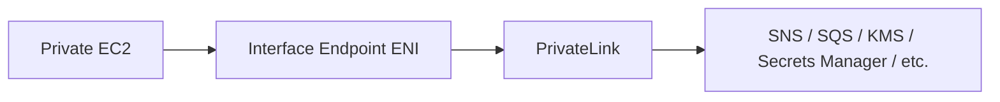

Commonly reaches services such as [SNS/SQS](../messaging/decoupling-sqs-sns.md) or [KMS/Secrets Manager](../security/security.md).

!!! tip "Memory"
    Gateway Endpoint → route table → S3/DynamoDB

    Interface Endpoint → ENI + SG → PrivateLink → many AWS services

## Endpoint Does Not Grant Permission

- VPC Endpoint → solves network **connectivity**
- [IAM](../security/iam.md)/resource policies → solve **authorization**

Example: EC2 → S3 Gateway Endpoint → S3 — still needs permissions such as `s3:GetObject`.

!!! tip "Memory"
    Network path ≠ permission

## VPC Flow Logs

Used to capture network-flow metadata. Can be enabled at:

- VPC level
- subnet level
- ENI level

Contains information such as: source IP, destination IP, ports, protocol, packets/bytes, ACCEPT, REJECT.

**Does not contain full application payloads.**

## Flow Log Destinations

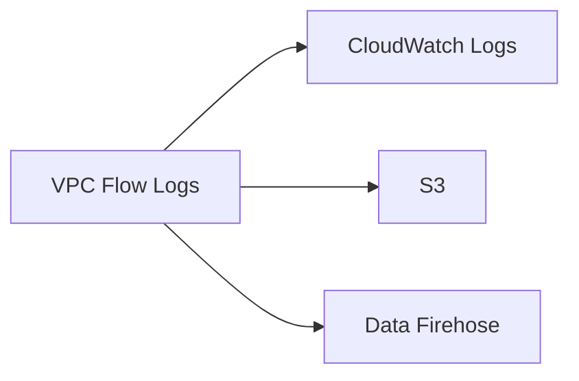

#### CloudWatch Logs

Good for: recent troubleshooting, Logs Insights, alarms.

#### S3

Good for: long-term storage, [Athena](../data-analytics/data-analytics.md) SQL queries.

!!! warning "Exam Trigger"
    "Analyze months of network-flow logs using SQL." → **S3 + Athena**

## Flow Logs + SG/NACL Troubleshooting

Because SG = stateful and NACL = stateless, patterns can reveal the problem. For example: Inbound ACCEPT, Outbound REJECT strongly suggests → **NACL issue on the return path.**

!!! tip "Memory"
    Routes decide WHERE.

    SG/NACL decide ALLOW/DENY.

    Flow Logs show WHAT HAPPENED.

## Site-to-Site VPN

Connects On-Premises ↔ AWS using an encrypted IPsec VPN over the public internet.

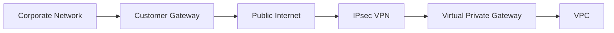

#### Components

- **CGW** = customer/on-prem side
- **VGW** = AWS/VPC side

#### Key Characteristics

Encrypted ✅, public internet transport ✅.

## VPN Routing

VPN alone is not enough. You also need correct:

- route tables
- route propagation
- SG
- NACL

#### Route Propagation

VGW-learned routes can propagate into VPC route tables.

!!! warning "Exam Trigger"
    VPN tunnel is up but VPC cannot reach on-premises. → **Check route propagation/routes.**

## VPN CloudHub

Connects multiple branch/customer networks through VPN using a hub-and-spoke design.

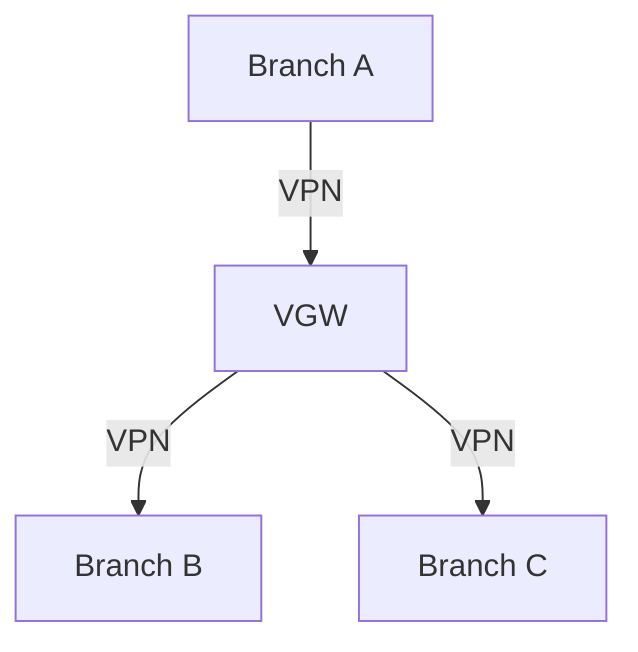

Useful for:

- branch offices
- relatively low-cost VPN-based connectivity

## Direct Connect

Provides a dedicated/private connection between On-Premises ↔ AWS. Does not rely on normal public internet routing.

Use for:

- large data transfers
- consistent network performance
- hybrid workloads
- predictable bandwidth/latency

!!! info "Important"
    Direct Connect takes time to provision. So:

    - need a connection quickly → **VPN**
    - need long-term dedicated connectivity → **DX**

## Direct Connect Is Not Encrypted by Default

Critical trap: Direct Connect is:

- Private/dedicated ✅
- Encrypted by default ❌

Need encryption? → **Direct Connect + VPN/IPsec**

!!! tip "Memory"
    VPN = internet + encrypted

    DX = dedicated/private + not encrypted by default

## Direct Connect VIFs

### Private VIF

Access private VPC resources: On-Prem → DX → Private VIF → Private EC2.

### Public VIF

Access AWS public service endpoints.

### Transit VIF

Used with:

- Direct Connect Gateway
- Transit Gateway

## Direct Connect Gateway

Used when Direct Connect must reach multiple VPCs, including across Regions.

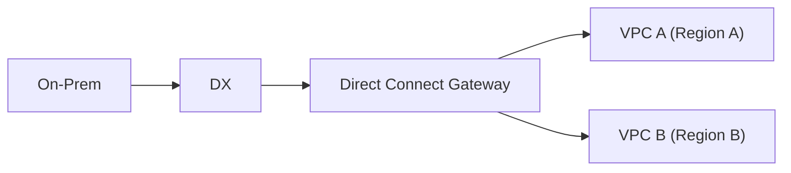

## DX + VPN Backup

Classic resilient design:

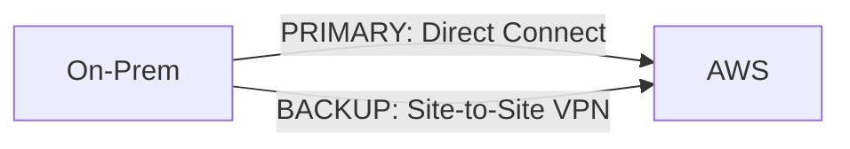

!!! warning "Exam Trigger"
    "Cost-effective backup for Direct Connect." → **Site-to-Site VPN**

## Transit Gateway

Transit Gateway solves large networking topologies. Instead of a full mesh (`A↔B`, `A↔C`, `A↔D`, `B↔C`, ...), use a central hub:

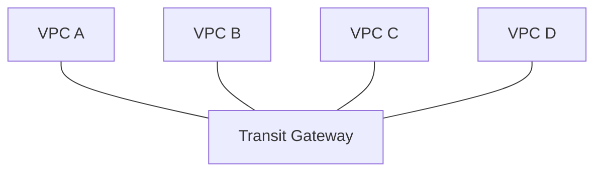

Think: **Transit Gateway = central network router/hub.**

## Peering vs Transit Gateway

### Peering

`A ↔ B` — direct, simple, non-transitive.

### Transit Gateway

Hub-and-spoke (see diagram above) — transitive routing, scales to many networks.

#### Exam Decision

- Few VPCs → **Peering**
- Many VPCs/accounts/hybrid connections → **Transit Gateway**

## TGW Can Connect

Transit Gateway can integrate:

- VPCs
- Site-to-Site VPN
- Direct Connect Gateway
- other TGWs through peering

This makes it useful for enterprise networking.

## Transit Gateway Route Tables

TGW has its own routing. Example:

- Production → Shared Services ✅
- Development → Shared Services ✅
- Development → Production ❌

TGW route tables create segmentation.

!!! info "Important"
    TGW being attached does not mean every network must talk to every other network.

## TGW Across Accounts

Transit Gateway can be shared using **AWS Resource Access Manager (RAM)**.

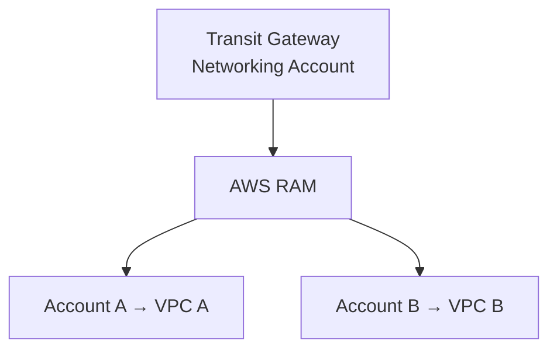

!!! warning "Exam Trigger"
    Central networking across many AWS accounts. → **TGW + RAM**

## TGW Across Regions

Transit Gateway is regional. Cross-region connectivity uses TGW Peering:

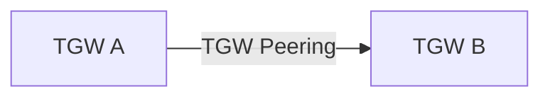

## ECMP

ECMP = Equal-Cost Multi-Path routing. Used to distribute traffic over multiple equal-cost network paths.

Important SAA use case: increase aggregate Site-to-Site VPN throughput.

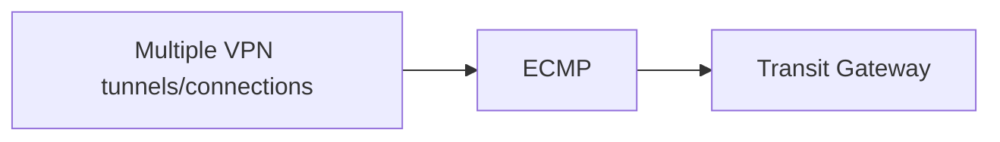

!!! warning "Exam Trigger"
    "Need higher VPN bandwidth." → **TGW + ECMP**

## IP Multicast

Strong keyword trigger:

**IP Multicast → Transit Gateway**

Keep this association.

## IPv6

IPv6 solves IPv4 address exhaustion. Important default routes:

- `0.0.0.0/0` → all IPv4
- `::/0` → all IPv6

A VPC can use:

- IPv4
- dual-stack IPv4 + IPv6
- modern architectures may include IPv6-only subnets

## Dual-Stack

Dual-stack resources can communicate using both IPv4 and IPv6. Example route table:

| Destination | Target |
|---|---|
| VPC IPv4 CIDR | local |
| VPC IPv6 CIDR | local |
| 0.0.0.0/0 | IGW |
| ::/0 | IGW |

## Egress-Only Internet Gateway

For IPv6 outbound-only internet.

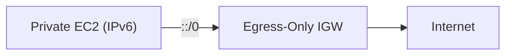

Allows: Private → Internet ✅. Blocks unsolicited: Internet → Private ❌.

!!! tip "Memory"
    Private IPv4 outbound → NAT Gateway

    Private IPv6 outbound → Egress-Only IGW

## Complete IPv4 vs IPv6 Routing

### Public Subnet

- IPv4: `0.0.0.0/0 → IGW`
- IPv6: `::/0 → IGW`

### Private Subnet

- IPv4: `0.0.0.0/0 → NAT Gateway`
- IPv6: `::/0 → Egress-Only IGW`

This is a very useful SAA diagram.

## AWS Network Firewall

Managed advanced firewall for VPC network traffic. Can provide:

- stateless filtering
- stateful filtering
- IPS
- IP filtering
- port/protocol filtering
- domain filtering
- deep traffic inspection

Traffic must be routed through firewall endpoints.

#### Use Cases

- inbound/outbound internet inspection
- VPC-to-VPC inspection
- VPN/DX traffic inspection
- centralized security architecture

## Security Group vs NACL vs Network Firewall vs WAF vs Shield

| Service | Main Job |
|---|---|
| Security Group | Resource firewall |
| NACL | Subnet firewall |
| Network Firewall | Advanced VPC network inspection |
| [WAF](../security/security.md) | HTTP/HTTPS application attacks |
| [Shield](../security/security.md) | DDoS protection |

!!! tip "Memory"
    EC2-level firewall → SG

    Subnet-level firewall → NACL

    Deep VPC traffic inspection → Network Firewall

    SQLi/XSS → WAF

    DDoS → Shield

## Traffic Mirroring

Copies network traffic from ENIs to security/inspection systems.

```mermaid
flowchart LR
    EC2["EC2"] --> Normal["Normal Traffic"] --> Dest["Destination"]
    EC2 --> Copy["Copy"] --> TM["Traffic Mirroring"] --> SA["Security Appliance"]
```

Components:

- **Source** → which ENI?
- **Filter** → which traffic?
- **Target** → where should the copy go?

Uses include:

- IDS
- threat monitoring
- packet analysis
- troubleshooting

## Flow Logs vs Traffic Mirroring vs Network Firewall

| | Purpose |
|---|---|
| VPC Flow Logs | Metadata about traffic |
| Traffic Mirroring | Copy packets |
| Network Firewall | Inline inspect/block |

!!! tip "Memory"
    Need logs? → Flow Logs

    Need packet copy? → Traffic Mirroring

    Need to stop traffic inline? → Network Firewall

## Networking Cost — SAA Principles

Don't memorize old exact dollar values. Remember architecture patterns.

- **Incoming traffic** — usually cheaper/free compared with internet egress.
- **Outbound internet traffic** — usually charged.
- **Same AZ** — often cheapest.
- **Cross-AZ** — can incur data-transfer charges.
- **Cross-Region** — typically charged.

## Cost Optimization Patterns

#### Use private networking where possible

EC2 → private IP → EC2, instead of routing internal communication unnecessarily through public paths.

#### Process data near the data

Better: Database → EC2 processing inside AWS → small result to user, instead of exporting massive datasets to on-prem for processing.

#### Avoid NAT for heavy S3/DynamoDB traffic

Bad: Private EC2 → NAT Gateway → S3

Better: Private EC2 → Gateway Endpoint → S3

!!! warning "Exam Trigger"
    "Reduce NAT Gateway processing costs." → **Gateway Endpoint**

## The Master Routing Map

This is probably the single most useful diagram in the entire VPC chapter — the packet leaves EC2, and the route table asks "where is the destination?":

```mermaid
flowchart TD
    A["Packet Leaves EC2"] --> B{"Where is the destination?"}
    B -->|"Inside this VPC"| C["local"]
    B -->|"Internet from public subnet"| D["IGW"]
    B -->|"Internet from private IPv4"| E["NAT Gateway"]
    B -->|"Internet from private IPv6"| F["Egress-Only IGW"]
    B -->|"Another VPC"| G["Peering / TGW"]
    B -->|"AWS service privately"| H["VPC Endpoint"]
    B -->|"On-Prem via internet"| I["VPN"]
    B -->|"On-Prem dedicated"| J["Direct Connect"]
```

Then ask:

- Is traffic allowed? → SG + NACL
- Need deep inspection? → Network Firewall
- Need troubleshooting? → Flow Logs

## Master SAA Decision Table

| Scenario | Answer |
|---|---|
| Create isolated AWS network | VPC |
| Allocate IP range | CIDR |
| Divide network by AZ/workload | Subnet |
| Decide destination path | Route Table |
| Public internet connectivity | IGW |
| Private IPv4 outbound internet | NAT Gateway |
| IPv6 outbound-only internet | Egress-Only IGW |
| SSH to private EC2 | Bastion / SSM |
| Resource firewall | Security Group |
| Subnet firewall / explicit deny | NACL |
| Connect two VPCs | VPC Peering |
| Many VPCs centrally | Transit Gateway |
| Private S3/DynamoDB | Gateway Endpoint |
| Private SNS/SQS/KMS/etc. | Interface Endpoint |
| On-prem encrypted over internet | Site-to-Site VPN |
| Dedicated hybrid connection | Direct Connect |
| Dedicated + encrypted hybrid | DX + VPN |
| Cost-effective DX backup | VPN |
| Share TGW across accounts | AWS RAM |
| Increase VPN throughput | TGW + ECMP |
| IP multicast | Transit Gateway |
| Network metadata | VPC Flow Logs |
| Copy packets | Traffic Mirroring |
| Advanced VPC inspection | Network Firewall |

## Highest-Value Exam Traps

!!! danger "Trap 1"
    Public IP ≠ public subnet. A public subnet requires the route `0.0.0.0/0 → IGW`.

!!! danger "Trap 2"
    IGW alone doesn't give internet. You need: IGW + route + public IP for IPv4 + security rules.

!!! danger "Trap 3"
    Private EC2 internet: Private IPv4 → NAT Gateway. Private IPv6 → Egress-Only IGW.

!!! danger "Trap 4"
    NAT Gateway does not use a Security Group. NAT Instance does.

!!! danger "Trap 5"
    NAT Instance requires source/destination check disabled.

!!! danger "Trap 6"
    SG vs NACL: SG = stateful + allow only. NACL = stateless + allow/deny.

!!! danger "Trap 7"
    NACL first match wins — not "explicit deny always wins."

!!! danger "Trap 8"
    Restrictive NACL? Think about **ephemeral ports**.

!!! danger "Trap 9"
    Peering is non-transitive: `A ↔ B ↔ C` does not mean `A → C` ❌.

!!! danger "Trap 10"
    Endpoint ≠ IAM authorization. Endpoint → connectivity. IAM → permissions.

!!! danger "Trap 11"
    S3/DynamoDB Gateway Endpoint is preferred for ordinary private VPC access.

!!! danger "Trap 12"
    VPN vs Direct Connect: VPN = encrypted over internet. DX = dedicated/private but not encrypted by default.

!!! danger "Trap 13"
    Need network quickly → VPN. Not a brand-new Direct Connect.

!!! danger "Trap 14"
    Many VPCs → Transit Gateway, not huge full-mesh peering.

!!! danger "Trap 15"
    Flow Logs vs Mirroring: Flow Logs = metadata. Traffic Mirroring = packet copies.

## Complete Revision Memory Map

- **Addressing** — CIDR, IPv4, IPv6
- **Subnets** — Public, Private, one AZ each, AWS reserves 5 IPv4 addresses
- **Routing** — Route Tables, local, IGW, NAT Gateway, Egress-Only IGW, Peering, Endpoints, VPN, TGW
- **Security** — Security Groups (stateful), NACL (stateless), Network Firewall
- **VPC to VPC** — Peering, Transit Gateway
- **VPC to AWS Services** — Gateway Endpoint (S3 / DynamoDB), Interface Endpoint (PrivateLink)
- **AWS to On-Prem** — Site-to-Site VPN (Internet + IPsec), Direct Connect (Dedicated/private), DX Gateway, TGW
- **Observability** — Flow Logs, Traffic Mirroring

## One-Minute Recall

| Term | Meaning |
|---|---|
| CIDR | IP range |
| VPC | regional private network |
| Subnet | one AZ |
| 5 IPv4 addresses | reserved per subnet |
| Route Table | where packets go |
| Public subnet | route to IGW |
| Private IPv4 internet | NAT Gateway |
| Private IPv6 internet | Egress-Only IGW |
| SG | stateful, resource level, allow only |
| NACL | stateless, subnet level, allow + deny |
| Peering | VPC ↔ VPC, non-transitive |
| Gateway Endpoint | S3/DynamoDB |
| Interface Endpoint | PrivateLink + ENI + SG |
| Flow Logs | network metadata |
| VPN | encrypted over public internet |
| Direct Connect | dedicated/private, not encrypted by default |
| Transit Gateway | transitive hub for many networks |
| ECMP | more aggregate VPN bandwidth |
| Traffic Mirroring | copy packets |
| Network Firewall | inline advanced traffic inspection |

### Final SAA Mental Shortcut

When you see a VPC question, ask in this order:

1. WHAT needs to communicate?
2. WHERE is the destination?
3. WHICH route/gateway connects them?
4. IS traffic allowed by SG/NACL?
5. Does it need private access, encryption, HA or lowest cost?
6. If broken: what do Flow Logs show?

If you use that order instead of trying to remember 30 isolated AWS networking services, most VPC architecture questions become much easier to reason through.
