# Disaster Recovery & Migration

This section is really about two related questions:

1. **If something breaks, how do we recover?** → Disaster Recovery
2. **If workloads are outside AWS, how do we move them into AWS?** → Migration

The exam mainly tests whether you can match the business requirement to the right recovery or migration strategy.

## RPO vs RTO — Know This First

These two terms drive almost every DR question.

### RPO — Recovery Point Objective

Think: **how much data can I afford to lose?**

If backups occur every hour:

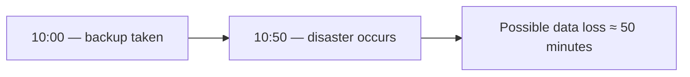

So your RPO is roughly the maximum acceptable data-loss window.

!!! tip "Memory"
    RPO = DATA loss = How far back?

### RTO — Recovery Time Objective

Think: **how long can the application remain unavailable after the disaster?**

Example:

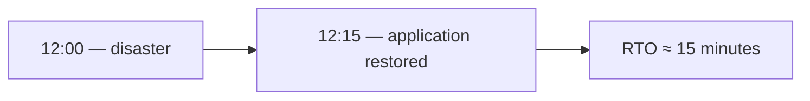

RTO is about downtime/recovery speed.

!!! tip "Memory"
    RPO = DATA

    RTO = TIME

And generally:

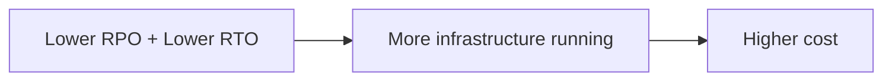

## The 4 Disaster Recovery Strategies

Think of these as a ladder:

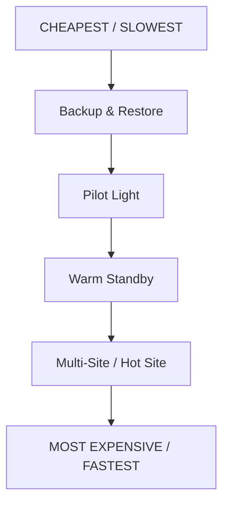

Cost increases as you move toward faster recovery and lower downtime.

## Backup & Restore

Nothing significant is kept running for DR. You mainly maintain:

- backups
- snapshots
- AMIs
- archived data

Example:

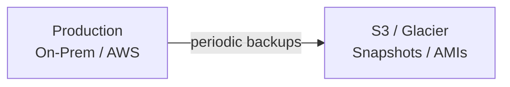

Backups, snapshots, and AMIs land in [S3](../storage/s3.md) / Glacier and as [EBS](../compute/ebs.md) snapshots. When disaster happens:

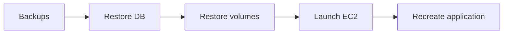

Because infrastructure must be rebuilt, recovery takes longer.

#### Characteristics

- Cost → Lowest
- RTO → High
- RPO → High / depends on backup frequency
- Infra alive → Almost none

The lecture specifically describes Backup & Restore as inexpensive because you mostly pay for stored backups, but recovery and data restoration take time.

!!! example "Example"
    Backup every 24 hours: potential loss → up to 24 hours.

    Backup every hour: potential loss → up to 1 hour.

!!! warning "Exam Trigger"
    "Lowest-cost DR, long recovery time acceptable." → **Backup and Restore**

## Pilot Light

Pilot Light means: **keep only the critical core running.** The best analogy is an actual gas pilot light — a tiny flame stays on all the time, and when needed, you turn everything else on.

Example:

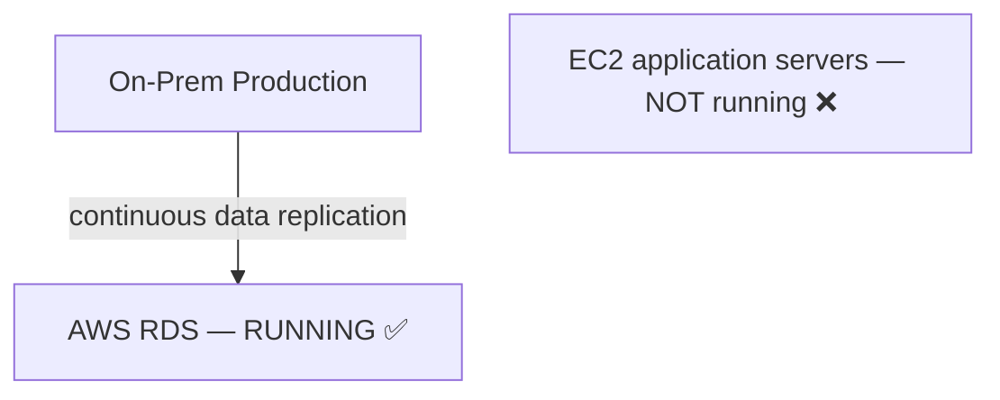

When disaster occurs:

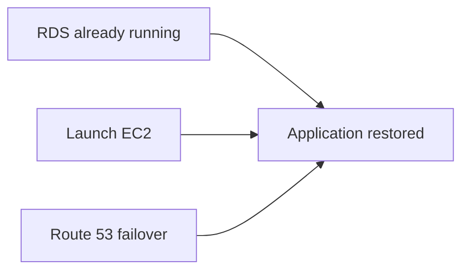

The lecture's example keeps the replicated [RDS](../databases/rds-aurora.md) database running while creating the application servers only when [Route 53 failover](../networking/route53.md) is required.

#### Characteristics

- Cost → Low–Medium
- RTO → Lower than Backup/Restore
- RPO → Lower due to replication
- Infra alive → Critical core only

!!! warning "Exam Trigger"
    "Critical database must always be replicated, but application servers may be launched after a disaster." → **Pilot Light**

## Warm Standby

This is the one students often confuse with Pilot Light. Warm Standby means: **the entire application exists and is running, but at reduced capacity.**

Example:

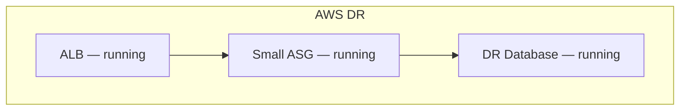

Everything needed is already there. But maybe production handles 20 EC2 instances while DR has only 2 EC2 instances. When disaster happens:

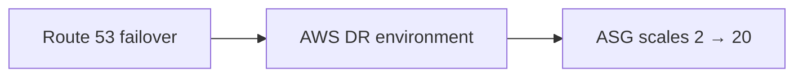

The source describes Warm Standby as a full system running at minimum size, then scaling to production load after failover, via the [Auto Scaling Group](../compute/load-balancing-asg.md).

#### Characteristics

- Cost → Medium–High
- RTO → Low
- RPO → Low
- Infra alive → Entire application, reduced capacity

!!! warning "Exam Trigger"
    "Complete DR environment is already running, but at minimal capacity." → **Warm Standby**

## Pilot Light vs Warm Standby

This difference is critical.

### Pilot Light

Critical CORE running:

- Database ✅
- Application servers ❌
- ALB maybe not active

**Need to create/start missing infrastructure.**

### Warm Standby

Entire STACK running, but smaller:

- Database ✅
- Application ✅
- Load balancer ✅

**Need mainly to scale up.**

!!! tip "Memory"
    Pilot Light = CORE alive

    Warm Standby = EVERYTHING alive, but SMALL

## Multi-Site / Hot Site (Active-Active)

The fastest and most expensive strategy. Both environments operate at production scale.

Example:

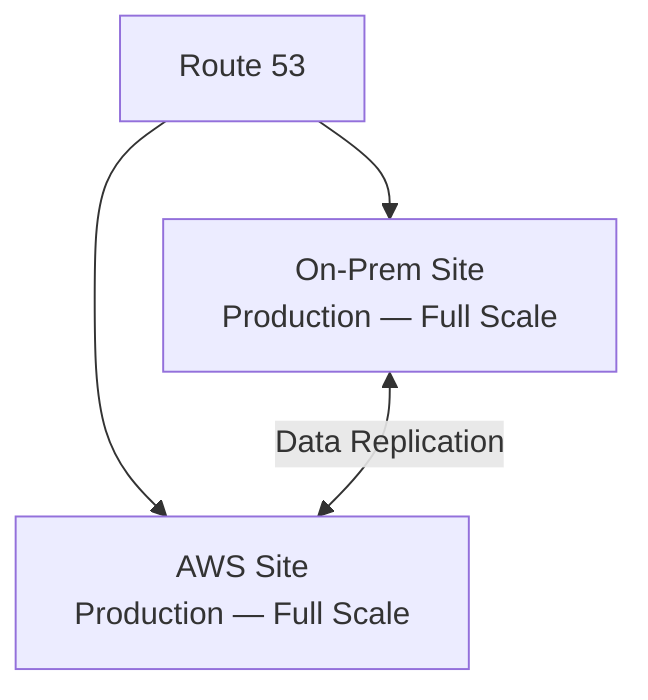

This can operate as:

### Active-Active

Both environments serve traffic. If one fails:

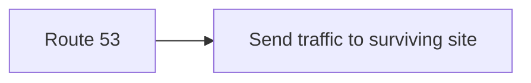

The source describes full production capacity on both sides, with very low RTO but high cost.

#### Cloud-only version

Could be:

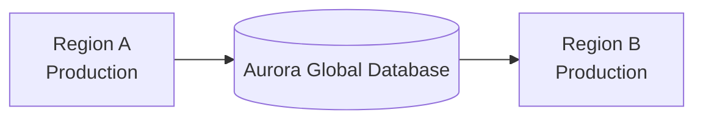

The source gives a multi-Region/[Aurora Global Database](../databases/rds-aurora.md) example for cloud-only DR.

#### Characteristics

- Cost → Highest
- RTO → Lowest
- RPO → Very low
- Infra alive → Full production

!!! warning "Exam Trigger"
    "Near-zero downtime and very small data loss are required; cost is secondary." → **Multi-Site / Hot Site**

## Master DR Comparison

| Strategy | What is running? | Cost | RTO | RPO |
|---|---|---|---|---|
| Backup & Restore | Backups only | $ | High | High |
| Pilot Light | Critical core | $$ | Medium | Medium/Low |
| Warm Standby | Full app, small | $$$ | Low | Low |
| Multi-Site | Full production | $$$$ | Very Low | Very Low |

!!! tip "Memory"
    Backup → RESTORE

    Pilot Light → START missing pieces

    Warm Standby → SCALE UP

    Hot Site → ALREADY READY

## DR Building Blocks

The lecture connects DR strategies to services you already know.

### Backups

- [EBS snapshots](../compute/ebs.md)
- RDS backups/snapshots
- [S3](../storage/s3.md)
- Glacier
- lifecycle policies
- cross-Region copies

### Replication

- [RDS cross-Region replication](../databases/rds-aurora.md)
- Aurora Global Database
- database replication
- [Storage Gateway](../storage/storage-efs-fsx.md)

### Failover

- [Route 53](../networking/route53.md)

### Infrastructure Recreation

- CloudFormation
- Elastic Beanstalk
- [Lambda](../containers-serverless/serverless.md) automation

### Network Backup

- Primary: [Direct Connect](../networking/vpc.md)
- Backup: Site-to-Site VPN

These patterns are explicitly called out in the source's DR tips.

## Chaos Testing

A DR plan should actually be tested. Concept:

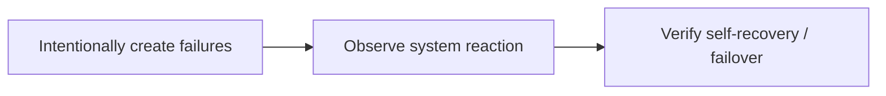

The source uses Netflix's chaos-testing approach as an example of deliberately terminating resources to verify resilience.

#### SAA Concept

Don't just design for failure — test the failure scenario.

## AWS Elastic Disaster Recovery — DRS

DRS is specifically for: **recovering servers into AWS after a disaster.**

Typical source servers:

- physical servers
- virtual machines
- cloud servers

Architecture:

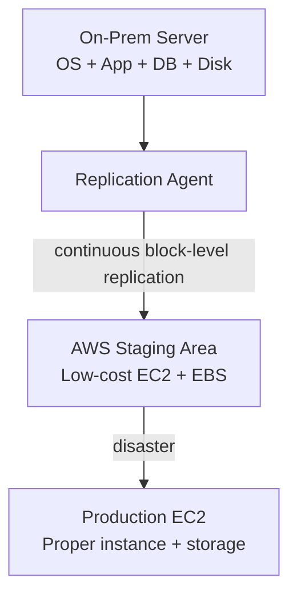

The source describes continuous block-level replication into a low-cost AWS staging environment, then launching production [EC2](../compute/ec2.md) resources during recovery.

!!! info "Important"
    During normal operation: cheap staging resources.

    During disaster: launch full production resources.

#### Failback

When your original environment returns:

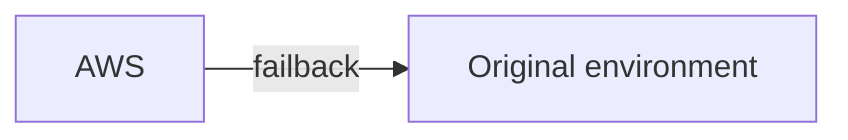

!!! warning "Exam Trigger"
    "Continuously replicate physical/virtual servers to AWS for rapid disaster recovery." → **AWS Elastic Disaster Recovery (DRS)**

## DRS vs Application Migration Service — MGN

They look very similar because both use replication agents. Think about the goal.

### DRS

Goal: **DISASTER RECOVERY.** Primary workload remains elsewhere. AWS is the recovery environment.

### MGN

Goal: **MIGRATION.** Move the server permanently to AWS.

!!! tip "Memory"
    DRS → Recover

    MGN → Migrate

## Database Migration Service — DMS

DMS is for: **moving/replicating database data.**

Architecture:

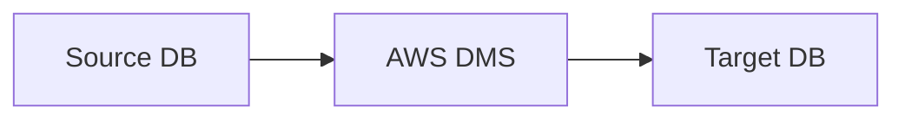

Important advantage: the source database can remain available during migration.

## DMS Migration Types

### Homogeneous Migration

Same database engine: `Oracle → Oracle` or `PostgreSQL → RDS PostgreSQL`. Schema is already compatible.

### Heterogeneous Migration

Different engine: `Oracle → PostgreSQL` or `SQL Server → Aurora`. Now schema structures may differ. This introduces **AWS SCT (Schema Conversion Tool)**.

## DMS vs SCT

This is extremely important.

### DMS

Moves: **DATA**

### SCT

Converts: **SCHEMA**

!!! example "Example"
    ```mermaid
    flowchart LR
        O1["Oracle schema"] -->|SCT| P1["PostgreSQL-compatible schema"]
        O2["Oracle data"] -->|DMS| P2["PostgreSQL data"]
    ```

!!! tip "Memory"
    DMS = Move DATA

    SCT = Convert STRUCTURE

## When Is SCT Needed?

Same engine: `On-Prem PostgreSQL → RDS PostgreSQL` — **no SCT.**

Different engine: `Oracle → Aurora PostgreSQL` — **use SCT.**

!!! warning "Exam Trigger"
    "Migrate Oracle to PostgreSQL." → **DMS + SCT**

    "Migrate PostgreSQL to RDS PostgreSQL." → **DMS; no SCT**

## DMS Full Load vs CDC

DMS can perform:

#### Full Load

Copy existing database. All existing records: `Source → Target`.

#### CDC — Change Data Capture

After full load, new changes are replicated continuously:

- New UPDATE
- New INSERT
- New DELETE

This enables low-downtime migration.

#### Typical pattern

1. Full load
2. CDC keeps target synchronized
3. Wait until caught up
4. Cut over application

## DMS Provisioned vs Serverless

The source shows two execution models:

### Provisioned

You select replication capacity/server. Useful when:

- sizing is predictable
- you want explicit control

### Serverless

DMS manages replication compute capacity automatically.

!!! tip "Memory"
    Know that both models exist; the main exam concept remains: **DMS migrates/replicates database data.**

## DMS Multi-AZ

DMS replication can use Multi-AZ for higher availability. Concept:

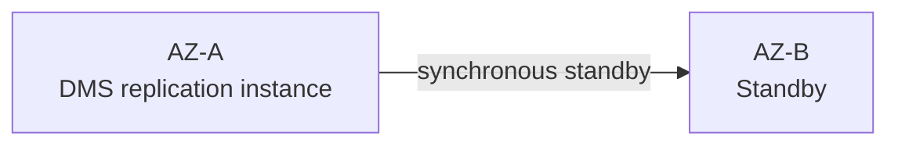

Use when migration/replication itself must remain highly available.

## RDS MySQL → Aurora MySQL Migration

Several options appear in the course.

### Option 1 — Snapshot

`RDS MySQL → (snapshot) → Aurora MySQL`. Simple. Potential downtime during cutover.

### Option 2 — Aurora Read Replica

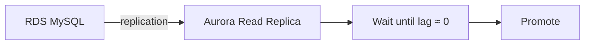

Better when minimizing downtime.

!!! warning "Exam Trigger"
    "Migrate RDS MySQL to Aurora with minimal downtime." → **Aurora Read Replica + promote**

## External MySQL → Aurora

Course options include:

#### Percona XtraBackup

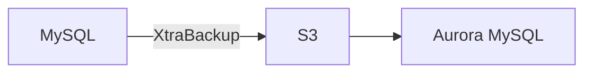

#### MySQL dump

`MySQL → (mysqldump) → Aurora`

#### DMS

For continuous migration/replication. Low priority relative to the main DMS concepts.

## PostgreSQL → Aurora

Similar idea:

#### RDS PostgreSQL

`Snapshot: RDS PostgreSQL → Aurora PostgreSQL`, or `Aurora Read Replica → catch up → promote`.

#### External PostgreSQL

Backup/import or DMS. For SAA, recognize the pattern rather than memorizing every CLI/tool detail.

## AWS Application Discovery Service

Before migrating hundreds of servers, you need to know: **what do I actually have?** Application Discovery Service gathers information about on-premises infrastructure. Examples:

- server configuration
- CPU usage
- memory
- disk
- processes
- network connections
- dependencies

#### Why dependencies matter

```mermaid
flowchart LR
    A["App Server"] --> B[Database] --> C["Authentication server"]
```

You cannot blindly migrate only the app server. Discovery helps determine what depends on what.

## Agentless vs Agent-Based Discovery

### Agentless

Collects things such as:

- VM configuration
- utilization
- performance history

Less invasive.

### Agent-Based

Installed inside servers. Provides deeper information such as:

- running processes
- system details
- network connections
- dependency mapping

!!! warning "Exam Trigger"
    "Discover application dependencies before migration." → **Application Discovery Service**

## AWS Migration Hub

Migration Hub provides a central place to **track migration progress.** Think:

```mermaid
flowchart TD
    A["Application Discovery"] --> B["Find workloads / dependencies"]
    C["MGN / DMS / other migration tools"] --> D["Perform migration"]
    B --> E["Migration Hub"]
    D --> E
    E --> F["Track everything"]
```

!!! tip "Memory"
    Discovery Service = DISCOVER

    Migration Hub = TRACK

## AWS Application Migration Service — MGN

MGN is for **Rehosting / Lift-and-Shift** — meaning: move an existing server into AWS with minimal application redesign.

Architecture:

```mermaid
flowchart TD
    A["On-Prem Server<br/>OS + Apps + DB"] --> B[Replication Agent]
    B -->|continuous disk replication| C["AWS Staging<br/>Low-cost EC2/EBS"]
    C -->|cutover| D["Production EC2"]
```

!!! info "Important"
    MGN performs ongoing replication before cutover, so downtime is minimized.

!!! warning "Exam Trigger"
    "Move hundreds of physical/virtual servers to EC2 with minimal modification." → **Application Migration Service (MGN)**

## MGN vs DMS

Very important.

- Whole SERVER (OS + apps + disks) → **MGN**
- DATABASE DATA → **DMS**

!!! example "Example"
    Move an entire legacy application VM → **MGN**.

    Move only Oracle DB into RDS → **DMS**.

## VM Import/Export

Used to import existing virtual machine images into EC2, or export supported EC2 VMs back. Concept:

```mermaid
flowchart LR
    A["On-Prem VM"] -->|VM Import| B[EC2]
    B -->|VM Export| A
```

!!! warning "Exam Trigger"
    "Import an existing VM image into EC2." → **VM Import/Export**

## AWS Backup

AWS Backup solves: "We have backups scattered across EC2, EBS, RDS, DynamoDB, EFS, etc. How do we centrally manage them?" Answer: **AWS Backup.** It provides centralized:

- backup policies
- scheduling
- retention
- cross-Region copies
- cross-account copies
- lifecycle/cold storage
- resource assignments

## AWS Backup Plan

A Backup Plan defines things like:

- **Frequency** → daily / weekly / monthly
- **Backup Window** → when backup runs
- **Lifecycle** → move to cold storage
- **Retention** → how long to keep it
- **Copy** → another Region/account

Then assign resources. Example:

- **Backup Plan**
    - EBS
    - RDS
    - DynamoDB
    - EFS

## Tag-Based Backups

Very useful pattern. Suppose resources have `Environment = Production`. Backup Plan can automatically select them.

```mermaid
flowchart LR
    A["Tag: Environment=Production"] --> B[AWS Backup] --> C["Automatically protected"]
```

!!! warning "Exam Trigger"
    "Automatically back up all resources tagged Production." → **AWS Backup tag-based resource assignment**

## AWS Backup Vault Lock

Very important security feature. Vault Lock implements **WORM (Write Once Read Many).** The goal: protect backups from deletion or malicious retention changes. Useful against:

- accidental deletion
- malicious admin actions
- ransomware-related deletion

!!! tip "Memory"
    AWS Backup = centralized backups

    Vault Lock = immutable/WORM protection

## Large Data Transfer — Which Method?

Suppose you need to move hundreds of TB into AWS. Decision depends on:

- amount of data
- available bandwidth
- deadline
- whether transfer is one-time or continuous

## Internet / Site-to-Site VPN

Advantage: available quickly. Problem: large datasets can take forever.

Example from course: `200 TB + 100 Mbps → months`.

So public internet/VPN may work for:

- smaller transfer
- ongoing incremental transfer

but not huge urgent bulk migration.

## Direct Connect for Migration

Good when:

- DX already exists
- large continuous transfer
- predictable throughput required

But a new Direct Connect takes time to provision. So don't choose "Need to transfer 200 TB next week" → create new Direct Connect. Not a good fit.

## Snowball

For very large one-time/offline data transfer:

```mermaid
flowchart LR
    A["Data Center"] --> B["Snowball device"]
    B -->|ship| C[AWS]
    C --> D["Import data"]
```

Excellent when:

- bandwidth is limited
- dataset is huge
- one-time bulk migration

!!! tip "Memory"
    Huge ONE-TIME data → Snowball

## Snowball + DMS

Interesting combined pattern. Suppose a database contains a huge initial dataset:

- Initial bulk data → Snowball
- Changes after initial copy → DMS CDC

This gives: Snowball = initial bulk, DMS = ongoing delta/change replication. Useful exam combination.

## Ongoing Data Transfer

For continuous transfer, think about:

- Site-to-Site VPN
- Direct Connect
- DMS
- DataSync

depending on the data/workload.

#### Basic distinction

- Database replication → DMS
- Files/object transfer → DataSync
- Network connectivity → VPN / DX

## VMware Cloud on AWS

This is a high-level recognition topic. Use case: an organization already heavily uses VMware and wants to extend/migrate that VMware environment to AWS without immediately redesigning everything.

```mermaid
flowchart LR
    A["On-Prem VMware<br/>vSphere / VMs"] --> B["VMware Cloud on AWS"]
```

Benefits include:

- extend VMware capacity into AWS
- migrate VMware workloads
- hybrid environment
- DR
- keep familiar VMware tools
- access AWS services

!!! warning "Exam Trigger"
    "Company wants to migrate/extend existing VMware workloads while continuing to use VMware tooling." → **VMware Cloud on AWS**

## Migration Service Decision Map

This is the important part.

| Requirement | Service |
|---|---|
| Discover on-prem servers/dependencies | Application Discovery Service |
| Track migrations centrally | Migration Hub |
| Lift-and-shift whole servers | MGN |
| Disaster recovery for servers | DRS |
| Migrate database data | DMS |
| Different DB engines | DMS + SCT |
| Import/export VM images | VM Import/Export |
| Centrally manage AWS backups | AWS Backup |
| Immutable backups | Backup Vault Lock |
| Huge offline data transfer | Snowball |
| Existing VMware estate | VMware Cloud on AWS |

## DRS vs MGN vs DMS — Must Know

These names are easy to mix up.

### DRS

`Server → (continuous replication) → AWS waits for DISASTER`. Goal: **RECOVERY**

### MGN

`Server → (continuous replication) → AWS CUTOVER`. Goal: **MIGRATION**

### DMS

`Database → (replication) → Target Database`. Goal: **DATABASE MIGRATION**

!!! tip "Memory"
    DRS = Disaster

    MGN = Machine/server Migration

    DMS = Database

## DR Strategy Exam Decision Map

```mermaid
flowchart TD
    Q1["What should our DR architecture be?"] --> Q2{"How much downtime can we tolerate?"}
    Q2 -->|Lots| A["Backup & Restore"]
    Q2 -->|Some| B["Pilot Light / Warm Standby"]
    Q2 -->|"Almost none"| C["Hot Site"]
```

Then ask: how much can we spend?

| Requirement | Strategy |
|---|---|
| Lowest budget | Backup & Restore |
| Critical core only running | Pilot Light |
| Full app running small | Warm Standby |
| Full production everywhere | Multi-Site |

## Most Important Exam Traps

!!! danger "Trap 1"
    Myth: it's about picking a service. Reality: RPO = data loss, RTO = downtime — the two must never be swapped.

!!! danger "Trap 2"
    Myth: Pilot Light and Warm Standby are the same thing. Reality: Pilot Light = only CORE running; Warm Standby = FULL APP running small.

!!! danger "Trap 3"
    Myth: Hot Site means backups only. Reality: ❌ — Hot Site is full production capacity.

!!! danger "Trap 4"
    Myth: DMS converts database schemas. Reality: not by itself — DMS = move data, SCT = convert schema.

!!! danger "Trap 5"
    Myth: same DB engine still needs SCT. Reality: usually no. `PostgreSQL → PostgreSQL` → DMS only. Different engine, `Oracle → PostgreSQL` → SCT + DMS.

!!! danger "Trap 6"
    Myth: MGN is for database-only migration. Reality: ❌ — MGN moves the entire server/workload; DMS moves the database.

!!! danger "Trap 7"
    Myth: DRS and MGN have the same goal. Reality: the technology is conceptually similar, but the goal differs — DRS → DR/failover; MGN → permanent migration/cutover.

!!! danger "Trap 8"
    Myth: Direct Connect is always best for urgent bulk migration. Reality: ❌ — if no DX already exists and the deadline is short, provisioning time matters. For a huge one-time transfer, Snowball may be better.

!!! danger "Trap 9"
    Myth: Snowball is good for ongoing replication. Reality: usually ❌ — Snowball is strongest for large offline/bulk transfer. For ongoing transfer, use DMS/DataSync/VPN/DX depending on the workload.

!!! danger "Trap 10"
    Myth: AWS Backup is just another EBS snapshot feature. Reality: no — AWS Backup is centralized backup management across many AWS services.

## Complete Chapter Memory Map

- **Disaster Recovery & Migration**
    - **DR Fundamentals**
        - RPO = acceptable data loss
        - RTO = acceptable downtime
    - **DR Strategies**
        - Backup & Restore — cheapest / slowest
        - Pilot Light — critical core running
        - Warm Standby — full stack running small
        - Multi-Site — full production / fastest
    - **Server DR**
        - Elastic Disaster Recovery (DRS)
    - **Server Migration**
        - Application Discovery Service
        - Migration Hub
        - Application Migration Service (MGN)
        - VM Import/Export
    - **Database Migration**
        - DMS — data migration / CDC
        - SCT — heterogeneous schema conversion
    - **Backup**
        - AWS Backup
        - Backup Plans
        - Cross-Region
        - Cross-Account
        - Vault Lock / WORM
    - **Large Data Migration**
        - Internet / VPN
        - Direct Connect
        - Snowball
        - DataSync
        - DMS

## One-Minute Recall

!!! tip "One-Minute Recall"
    RPO = data loss · RTO = downtime

    Backup & Restore = restore everything later · Pilot Light = core running · Warm Standby = whole app running small · Multi-Site = full production everywhere

    DRS = server disaster recovery · MGN = lift-and-shift server migration · DMS = database data migration · SCT = schema conversion

    Discovery Service = discover dependencies · Migration Hub = track migrations

    AWS Backup = centralized backup management · Vault Lock = immutable WORM backup

    Huge one-time data transfer = Snowball · Ongoing DB changes = DMS CDC · Existing VMware environment = VMware Cloud on AWS

The most important decision chain for this chapter:

| Scenario | Answer |
|---|---|
| Something failed? | DR strategy / DRS |
| Moving whole servers? | MGN |
| Moving databases? | DMS |
| Different DB engine? | add SCT |
| Need to discover what exists first? | Application Discovery Service |
| Need huge offline transfer? | Snowball |
| Need centralized backup? | AWS Backup |
