# IAM, Organizations, Identity Center & Directory Services

This section is really about who can access AWS, what they can do, and how access is controlled across one or many AWS accounts.

## Big Picture

A useful way to connect everything in this section:

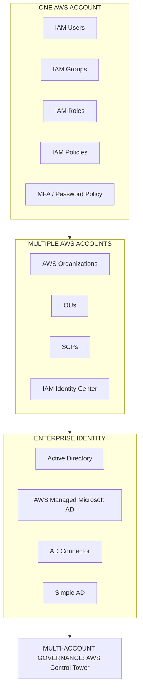

## IAM — Identity and Access Management

IAM controls **who can access AWS and what actions they are allowed to perform**.

**IAM is a global service.**

Main IAM building blocks:

- Users
- Groups
- Roles
- Policies

## Root User

The root user is created when the AWS account is created. It has complete control of the account.

#### Best Practice

Use root only for tasks that specifically require it. For normal administration:

- Root ❌
- IAM user / federated identity ✅

Also protect root with a strong password and MFA.

!!! warning "Exam Trigger"
    "How should the AWS root account be used?" → Only for account-level/root-only tasks; don't use it for everyday work.

## IAM Users

An IAM user represents a person or workload identity inside an AWS account (course model: Alice, Bob, Charles, David).

Each user may have:

- console password
- permissions
- access keys

#### Important

**One IAM user should normally represent one person.** Don't share IAM credentials.

## IAM Groups

Groups simplify permission management.

Example: a **Developers Group** containing Alice, Bob, and Charles. Attaching the `EC2ReadOnly` policy to the group means all members inherit it.

#### Important Rules

Groups:

- contain users only
- cannot contain other groups
- users don't have to belong to a group
- one user can belong to multiple groups

Example: Charles belongs to both **Developers** and **Audit**, so he receives permissions from both.

### Why Groups Matter

Suppose 30 developers need the same access.

- **Bad:** attach the same policy to 30 individual users.
- **Better:** attach the policy once to a **Developers Group**, and let the 30 users inherit it.

This is much easier to maintain.

## IAM Policies

Policies define **what actions are allowed or denied on which AWS resources**. They are JSON documents.

Example concept:

```json
{
  "Effect": "Allow",
  "Action": "s3:GetObject",
  "Resource": "..."
}
```

For SAA, focus on the meaning, not writing complex JSON from memory.

### IAM Policy Structure

Important fields:

- `Version`
- `Statement`
    - `Sid`
    - `Effect`
    - `Principal`
    - `Action`
    - `Resource`
    - `Condition`

#### Effect

`Allow` or `Deny`.

#### Action

What API operation? Example: `s3:GetObject`, `ec2:DescribeInstances`.

#### Resource

Which AWS resource? Example: a specific S3 bucket/object, a specific EC2 resource.

#### Principal

Who is allowed/denied? Examples:

- AWS account
- IAM user
- IAM role
- AWS service

#### Condition

Apply the permission only when something is true. Example: source IP, MFA present, specific Region, resource tag.

## Policy Evaluation Logic — Explicit Deny Wins

The single most important IAM rule.

Suppose a policy has `Allow: sqs:DeleteQueue` and another policy has `Deny: sqs:*`. Can the user delete the queue?

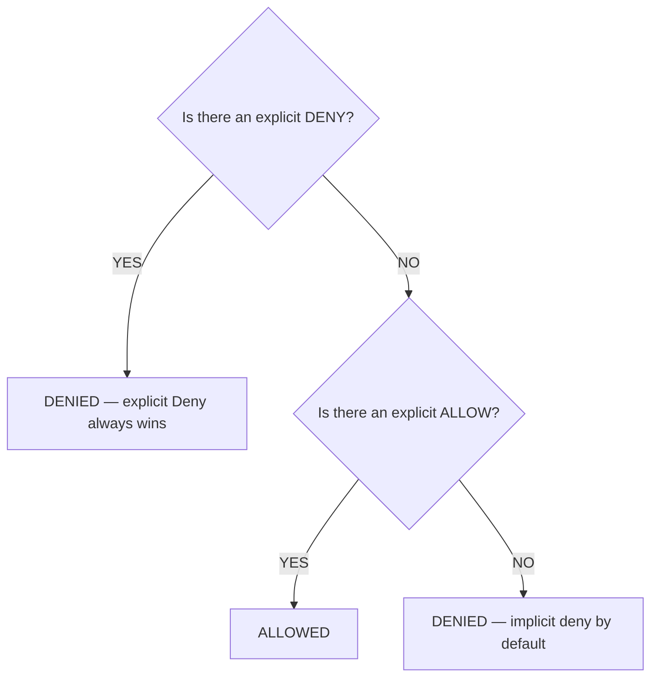

**No** — because explicit **DENY** beats **ALLOW**.

!!! tip "Memory"
    Explicit Deny > Explicit Allow > Implicit Deny.

    If nothing allows an action → denied by default.

## Principle of Least Privilege

One of the most important AWS security principles: give only the permissions required to perform the job.

Example: a developer only needs to read S3, read CloudWatch, and restart [EC2](../compute/ec2.md) — don't give `AdministratorAccess`.

!!! warning "Exam Trigger"
    "Reduce unnecessary access / follow security best practices." → **Least privilege**

## Managed vs Inline Policies

You can attach policies in different ways.

#### Group Policy

Policy → Group → Users inherit.

#### User-Attached Managed Policy

Policy → User.

#### Inline Policy

Embedded directly into one user/role/group.

- **Managed policy** → reusable
- **Inline policy** → tightly tied to one identity

## Wildcards

AWS policy syntax uses `*` to mean "everything" or "anything matching."

Example: `Action: "*"`, `Resource: "*"` means all actions on all resources — essentially extremely broad administrator-level access.

Another example: `iam:Get*` matches actions beginning with `Get`.

## IAM Password Policy

Used to improve password security. Can define:

- minimum length
- uppercase/lowercase
- number
- special character
- password expiration
- password reuse prevention
- whether users can change their own passwords

#### SAA Focus

Password policy strengthens password-based IAM user authentication.

## MFA — Multi-Factor Authentication

MFA combines something you **KNOW** (password) with something you **HAVE** (MFA device), so a stolen password alone isn't enough.

#### High Priority

Enable MFA especially for the root user, administrators, and privileged users.

#### MFA Device Types

The course discusses virtual authenticator apps, security keys, and hardware MFA devices. For SAA, don't overfocus on vendor names — just remember: **MFA adds a second authentication factor.**

## Accessing AWS: Console, CLI & SDK

There are three ways to access AWS:

- Management Console
- CLI
- SDK

#### Management Console

Web interface. Typically authenticated using identity, password, and MFA.

#### AWS CLI

Command Line Interface. Example: `aws s3 ls`. CLI calls AWS APIs from a terminal. Useful for automation, scripts, and repeatable administration.

#### AWS SDK

Used from application code (Python, Java, JavaScript, Go, .NET, Ruby, …).

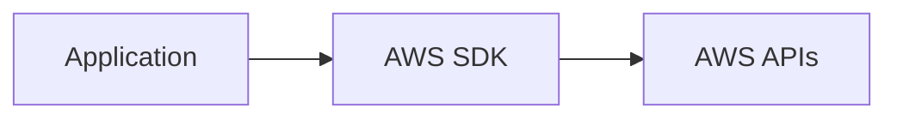

Example: Python commonly uses **Boto3**.

## Access Keys

Traditional programmatic IAM credentials contain an **Access Key ID** + **Secret Access Key**. Treat them like a username (Access Key ID) and a password (Secret Access Key). Never share the secret.

#### Critical Architecture Rule

**If code runs inside AWS, prefer IAM roles rather than hard-coded access keys.**

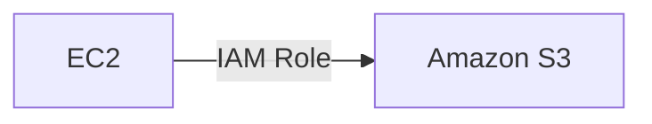

Not: an [EC2](../compute/ec2.md) application containing a hard-coded access key. See [S3](../storage/s3.md) for the resource side of this pattern.

## IAM Roles

**A role is an AWS identity with permissions, but unlike a traditional IAM user, it's designed to be assumed temporarily.**

Common examples: EC2 Role, [Lambda](../containers-serverless/serverless.md) Role, CloudFormation Role, Cross-account Role.

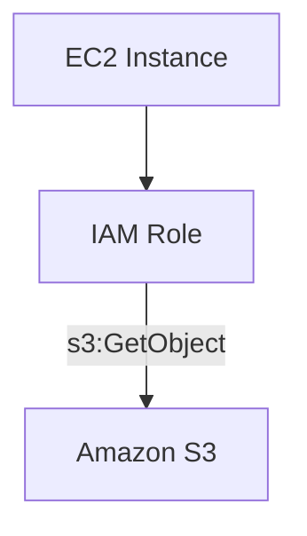

#### Why Roles Are Better

The workload gets temporary credentials automatically. You don't hard-code long-term credentials.

### Role Trust Policy vs Permission Policy

A role has two important parts:

- **Trust Policy** — *who can assume me?* Example: the EC2 service can assume this role.
- **Permission Policy** — *what can I do?* Example: read S3.

This distinction becomes very important for cross-account access.

## CloudShell

AWS CloudShell is a browser-based terminal inside AWS. Useful because:

- AWS CLI already available
- credentials come from your logged-in AWS identity
- files can persist in the environment
- no local CLI setup needed for simple work

#### SAA Priority

Low. Recognize: browser terminal for AWS CLI → **CloudShell**.

## IAM Credential Report

Account-level security report. Shows information such as: users, password status, password age, MFA enabled?, access keys, access key age/use.

#### Memory

Credential Report = **ACCOUNT-WIDE** credential audit.

## IAM Access Advisor

Shows which AWS services a user has permissions for and when they were last accessed. Useful for removing unused permissions.

Example: a user has EC2 ✅ recently used, S3 ✅ recently used, Redshift ❌ never used — maybe remove the Redshift permission.

#### Memory

Access Advisor = what did this **USER** actually use?

### Credential Report vs Access Advisor

| Tool | Scope | Main Question |
|---|---|---|
| Credential Report | Account | Are credentials secure/current? |
| Access Advisor | User/role | Which permissions/services are actually used? |

## IAM Conditions

Conditions make IAM policies more specific. Important examples from the course: `aws:SourceIp`, `aws:RequestedRegion`, `ec2:ResourceTag`, `aws:PrincipalTag`, `aws:MultiFactorAuthPresent`, `aws:PrincipalOrgID`.

### aws:SourceIp

Restrict API calls based on source IP. Example: only permit requests from corporate CIDR `203.0.113.0/24`.

!!! warning "Trigger"
    "Users may call AWS APIs only from the corporate network." → `aws:SourceIp`

### aws:RequestedRegion

Restricts actions based on AWS Region. Example: allow workloads only in `eu-west-1` / `eu-central-1`. Useful in IAM policies or organization governance.

!!! warning "Trigger"
    "Prevent resources from being launched outside approved Regions." → Region condition / SCP.

### Resource Tags vs Principal Tags

**Resource Tag** — condition based on the resource. Example: an EC2 tag `Project=Analytics` means the user may only stop instances with that tag.

**Principal Tag** — condition based on identity. Example: a user tag `Department=Data` means only Data department users get certain access. This leads into **ABAC — Attribute-Based Access Control** (see [Identity Center → ABAC](#abac-attribute-based-access-control) below).

### MFA Condition

Example requirement: a user can stop EC2 normally, but terminating EC2 requires MFA. Use `aws:MultiFactorAuthPresent`.

### S3 Bucket vs Object ARN

Important S3/IAM trap. A bucket-level operation like `s3:ListBucket` uses the **bucket ARN** (`arn:aws:s3:::my-bucket`). Object-level operations like `s3:GetObject` / `s3:PutObject` need the **object ARN** (`arn:aws:s3:::my-bucket/*`).

!!! tip "Memory"
    Bucket action → bucket ARN. Object action → `bucket/*`.

### aws:PrincipalOrgID

Restricts a resource policy to identities belonging to a particular AWS Organization. Example: an S3 bucket accessible only by accounts inside Organization `o-xxxx`.

!!! warning "Trigger"
    "Allow all accounts in our Organization, but nobody outside it." → `aws:PrincipalOrgID`

## Cross-Account Access & STS AssumeRole

Cross-account access can often be done in two ways.

### Option 1 — Assume Role (STS AssumeRole)

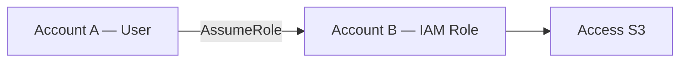

When the principal assumes the role, it operates with the role's session permissions.

### Option 2 — Resource-Based Policy

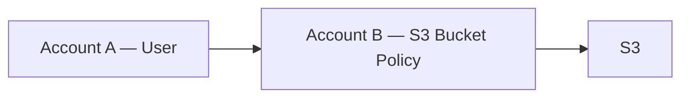

Example: the principal can be granted direct access by the resource policy.

#### Important Course Distinction

Resource-based access can let the identity continue using its original identity permissions while also accessing the remote resource.

### Resource Policies — Common Services

Examples include:

- [S3](../storage/s3.md) bucket
- [SNS](../messaging/decoupling-sqs-sns.md) topic
- [SQS](../messaging/decoupling-sqs-sns.md) queue
- [Lambda](../containers-serverless/serverless.md) function

You'll see resource policies throughout the course.

## Permission Boundaries

Advanced but important. A permission boundary defines the **maximum permissions a user or role may receive**.

Supported for: Users ✅, Roles ✅, Groups ❌.

Example: identity policy = `AdministratorAccess`, boundary = `S3FullAccess` only. Effective result: only S3 actions allowed within the boundary.

#### Important

**A boundary does not grant permissions.** It limits permissions that other policies may grant.

!!! warning "Exam Trigger"
    "Developer may create/manage permissions but must never exceed predefined maximum privileges." → **Permission Boundary**

## Effective Permissions — Combining Policies

Conceptually, the effective permission is the intersection of every layer:

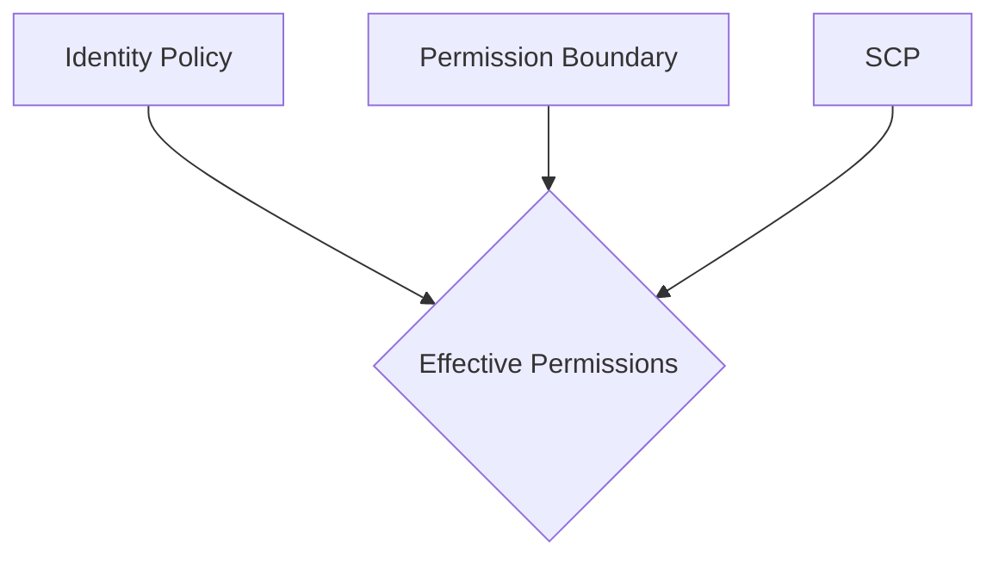

Identity Policy ∩ Permission Boundary ∩ SCP → Effective Permissions.

**And any explicit deny still wins**, at any layer.

## AWS Organizations

AWS Organizations manages **multiple AWS accounts centrally**. It's a global service.

Structure: Organization → Management Account + Member Accounts. One AWS account can belong to only one organization.

### Why Multiple Accounts?

Separate AWS accounts provide stronger isolation than simply putting everything into different [VPCs](../networking/vpc.md).

Example: Organization → Production Account, Development Account, Security Account, Logging Account.

Benefits: isolation, centralized billing, governance, centralized logging, easier security boundaries.

### Consolidated Billing

One management account can pay for member accounts. Benefits include aggregated usage and cost optimization. The course also highlights sharing eligible **Reserved Instance discounts** and **Savings Plans benefits** across the organization.

!!! warning "Exam Trigger"
    "Company wants centralized billing for dozens of AWS accounts." → **AWS Organizations**

### Organizational Units — OUs

OUs group AWS accounts logically. Example:

- Root
    - Production OU
        - Finance Account
        - HR Account
    - Development OU
    - Testing OU

You can organize by environment, business unit, project, or department. OUs can also be nested.

## Service Control Policies (SCPs)

SCPs define **the maximum available permissions for accounts/OUs in an Organization**. They can restrict member account root users, IAM users, and IAM roles.

#### Critical

**SCPs do not grant permissions.** They set guardrails.

Example: IAM policy = `Allow S3`, SCP = `Deny S3` → result: S3 denied.

### Management Account and SCPs

The course emphasizes: **SCPs do not restrict the management account itself.** This is a key exam distinction. Member accounts are governed by applicable SCPs.

### SCP Inheritance

If an SCP restriction is attached to an OU, it flows down the hierarchy: Root → Production OU → Finance OU → Account A. Account A inherits restrictions from the hierarchy.

Example: Production OU = `Deny S3`, Finance account identity policy = `AdministratorAccess`. Can Finance use S3? **No** — the SCP deny wins.

### SCP Allow-List vs Deny-List

Two conceptual models:

- **Deny-list** — broadly allow everything, then deny specific services. Example: `Allow *`, `Deny DynamoDB`.
- **Allow-list** — allow only selected services. Example: `Allow EC2`, `Allow CloudWatch` — everything else remains outside the allowed scope.

### SCP vs IAM Policy vs Permission Boundary

This is extremely important.

| Control | Applies To | Main Job |
|---|---|---|
| IAM Policy | User/group/role | Grant/deny permissions |
| Permission Boundary | User/role | Maximum identity permissions |
| SCP | Account/OU | Maximum account-level permissions |

Think of it as three layered ceilings:

- SCP → organization ceiling
- Permission Boundary → identity ceiling
- IAM Policy → actual permissions granted

## IAM Identity Center

Formerly **AWS Single Sign-On (AWS SSO)**.

Purpose: one login to access multiple AWS accounts and applications.

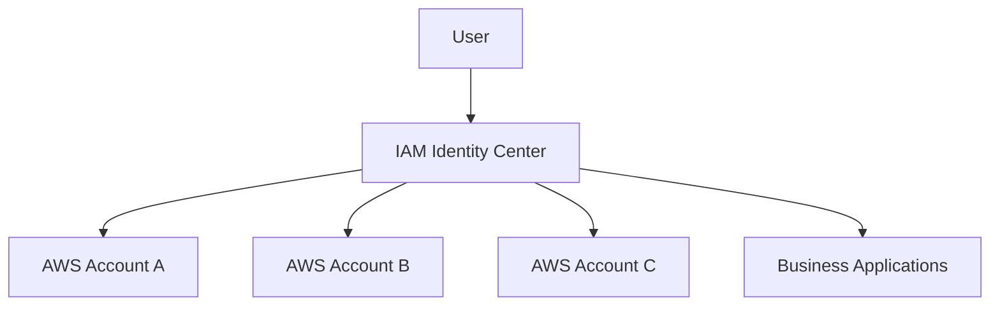

!!! warning "Exam Trigger"
    "Employees need one login for many AWS accounts." → **IAM Identity Center**

### Identity Center Identity Sources

Users can come from the built-in identity store (IAM Identity Center manages users/groups directly), or external identity sources such as Active Directory or an external identity provider.

### Permission Sets

A Permission Set defines what access a user/group gets in an AWS account.

Example: a Developers Group gets an **Admin** Permission Set in the Dev Account, but only a **ReadOnly** Permission Set in the Prod Account — so the same user can have different privileges in different accounts.

#### Behind the Scenes

Identity Center creates/uses IAM roles in target accounts.

### IAM vs IAM Identity Center

- **IAM User** — usually an identity inside one AWS account.
- **IAM Identity Center** — central workforce access across many AWS accounts + applications.

!!! info "Exam Direction"
    For large multi-account workforce access → **IAM Identity Center**

### ABAC — Attribute-Based Access Control

Identity Center can use user attributes such as department, cost center, job title, and location to determine access.

Example: a user with `Department=Finance` can be allowed access to Finance resources based on matching attributes.

!!! tip "Memory"
    RBAC = role/group-based access. ABAC = attribute/tag-based access.

## Active Directory Basics

Active Directory centralizes enterprise identities. Contains objects such as users, computers, printers, file shares, and groups.

**A Domain Controller authenticates users/computers.**


## AWS Directory Service

The course focuses on three options:

- AWS Managed Microsoft AD
- AD Connector
- Simple AD

Know the distinction.

### AWS Managed Microsoft AD

AWS runs a real managed Microsoft Active Directory. Can manage users inside AWS, integrate Windows workloads, and support trust relationships with on-prem AD.

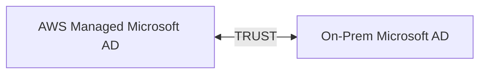

!!! warning "Exam Trigger"
    "Need actual Microsoft AD in AWS and integration/trust with existing AD." → **AWS Managed Microsoft AD**

### AD Connector

AD Connector is essentially a proxy/gateway. **It does not create another full user directory.**

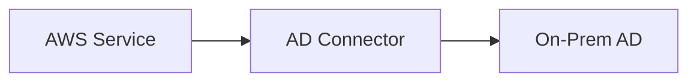

Users remain managed on-premises.

!!! warning "Exam Trigger"
    "AWS applications must authenticate against the existing on-prem AD without creating another directory." → **AD Connector**

!!! tip "Memory"
    Connector = forwards/proxies authentication.

### Simple AD

Standalone AD-compatible directory. Important course distinction:

- simpler
- not full Microsoft AD
- cannot establish the same on-premises AD integration/trust model

!!! warning "Trigger"
    "Need a simple standalone directory in AWS and don't need on-prem AD integration." → **Simple AD**

### Directory Service Comparison

| Requirement | Service |
|---|---|
| Real managed Microsoft AD in AWS | AWS Managed Microsoft AD |
| Trust/integrate with on-prem AD | AWS Managed Microsoft AD |
| Proxy authentication to existing on-prem AD | AD Connector |
| Simple standalone AWS directory | Simple AD |

!!! tip "Memory"
    Managed Microsoft AD = REAL AD in AWS. AD Connector = PROXY to existing AD. Simple AD = SIMPLE standalone directory.

### Identity Center + Active Directory

If identities already live in Active Directory, IAM Identity Center can integrate with them.

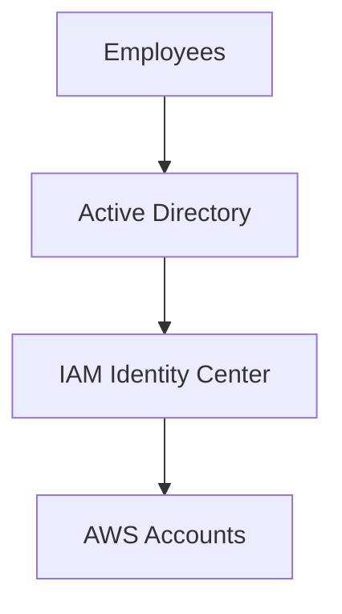

Depending on architecture, the course describes **AWS Managed Microsoft AD** and **AD Connector** as ways to connect AD identities into AWS access.

## AWS Control Tower

Control Tower helps **set up and govern a secure multi-account AWS environment**. It builds on **AWS Organizations**.

- AWS Organizations = underlying multi-account structure
- Control Tower = automated landing zone + governance

### Control Tower — Why It Exists

Suppose you need 50 AWS accounts. Every account needs standard configuration, security rules, logging, compliance checks, and governance. Doing this manually is difficult — Control Tower automates much of it.

### Guardrails / Controls

The course describes two major types.

#### Preventive

Prevent something from happening. Uses **SCPs**.

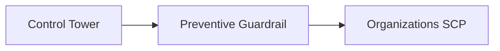

Example: prevent workloads from being launched outside approved Regions.

#### Detective

Detect something that is non-compliant. Uses **AWS Config**.

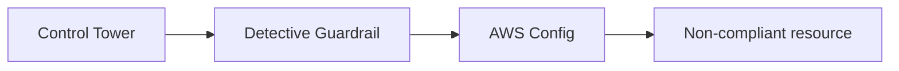

Example: find resources missing mandatory tags. Then notify/remediate using SNS / Lambda.

### Preventive vs Detective

This distinction is excellent exam material.

- **PREVENTIVE** → stop a bad action before/while it happens → SCP
- **DETECTIVE** → detect that something is non-compliant → AWS Config

!!! tip "Memory"
    Preventive = PREVENT. Detective = DETECT.

## Organizations vs Identity Center vs Control Tower

These three are frequently confused.

- **AWS Organizations** — manage accounts, OUs, billing, SCPs.
- **IAM Identity Center** — manage workforce LOGIN to many accounts/apps.
- **Control Tower** — create/govern a secure multi-account environment.

!!! tip "Quick Memory"
    Organizations = ACCOUNT STRUCTURE. Identity Center = USER ACCESS. Control Tower = GOVERNANCE.

## Master SAA Decision Table

| Scenario | Think |
|---|---|
| Person needs identity in account | IAM User |
| Many users need same permissions | IAM Group |
| EC2 needs S3 permissions | IAM Role |
| Define AWS permissions | IAM Policy |
| Maximum permissions for one user/role | Permission Boundary |
| Restrict whole AWS account/OU | SCP |
| Password stolen but account must remain protected | MFA |
| Audit credential status account-wide | Credential Report |
| Find unused user permissions | Access Advisor |
| Restrict requests to corporate IP | aws:SourceIp |
| Require MFA for sensitive API | aws:MultiFactorAuthPresent |
| Restrict service use by Region | aws:RequestedRegion |
| Allow only Organization members | aws:PrincipalOrgID |
| Manage many AWS accounts | AWS Organizations |
| Group accounts | OU |
| Central billing | Organizations |
| Single login for many AWS accounts | IAM Identity Center |
| Real Microsoft AD in AWS | AWS Managed Microsoft AD |
| Proxy to on-prem AD | AD Connector |
| Standalone lightweight directory | Simple AD |
| Automated multi-account governance | Control Tower |
| Prevent policy violation | Preventive control / SCP |
| Detect policy violation | Detective control / Config |

This table alone is worth memorizing.

## Highest-Value Exam Traps

!!! danger "Trap 1 — IAM Group Can Contain Another Group"
    Myth: an IAM group can contain another group. Reality: ❌ groups contain **users only**.

!!! danger "Trap 2 — Role = User With a Password"
    Myth: a role is just a user with a password. Reality: ❌ a role is normally **assumed** and provides **temporary credentials**.

!!! danger "Trap 3 — Permission Boundary Grants Permissions"
    Myth: a permission boundary grants permissions. Reality: ❌ a boundary only **limits maximum permissions** — you still need an identity policy to grant access.

!!! danger "Trap 4 — SCP Grants EC2 Permissions"
    Myth: an SCP grants EC2 permissions. Reality: ❌ SCP does not grant permissions — it creates the account/OU permission ceiling.

!!! danger "Trap 5 — AdministratorAccess Defeats SCP"
    Myth: `AdministratorAccess` overrides an SCP. Reality: ❌ example — IAM: `AdministratorAccess`, SCP: `Deny S3` → result: S3 ❌.

!!! danger "Trap 6 — Explicit Allow Beats Explicit Deny"
    Myth: an explicit Allow beats an explicit Deny. Reality: ❌ **explicit Deny wins.**

!!! danger "Trap 7 — s3:GetObject Uses Only the Bucket ARN"
    Myth: `s3:GetObject` only needs the bucket ARN. Reality: ❌ it needs the object path — `bucket/*`.

!!! danger "Trap 8 — Hard-Code Access Keys in EC2"
    Bad architecture. Use an **IAM Role** instead.

!!! danger "Trap 9 — IAM Users Are Best for Company-Wide Multi-Account SSO"
    Usually not. Use **IAM Identity Center**.

!!! danger "Trap 10 — Organizations and Identity Center Are the Same"
    Myth: Organizations and Identity Center are the same thing. Reality: ❌ Organizations = accounts. Identity Center = people accessing accounts.

!!! danger "Trap 11 — Organizations and Control Tower Are the Same"
    Myth: Organizations and Control Tower are the same thing. Reality: ❌ **Control Tower builds governance automation on top of Organizations.**

!!! danger "Trap 12 — AD Connector Stores AWS Copies of All Users"
    Course model: ❌ it **proxies authentication** to the existing directory — it does not copy the directory into AWS.

## Complete Revision Memory Map

- **IDENTITY & ACCESS**
    - **IAM**
        - Users — human identity
        - Groups — users only
        - Roles — assumable identity
        - Policies — permissions
        - MFA
        - Password Policy
        - Credential Report
        - Access Advisor
    - **POLICY CONTROLS**
        - Identity Policy
        - Resource Policy
        - Permission Boundary
        - Conditions
        - Explicit Deny wins
    - **AWS ORGANIZATIONS**
        - Management Account
        - Member Accounts
        - OUs
        - Consolidated Billing
        - SCPs
    - **IAM IDENTITY CENTER**
        - Single Sign-On
        - Multiple AWS Accounts
        - Permission Sets
        - AD / external IdP
        - ABAC
    - **DIRECTORY SERVICES**
        - Managed Microsoft AD
        - AD Connector
        - Simple AD
    - **CONTROL TOWER**
        - Multi-account setup
        - Governance
        - Preventive → SCP
        - Detective → AWS Config

!!! tip "One-Minute Recall"
    - **IAM** = identity + permissions
    - **User** = person
    - **Group** = users with shared permissions
    - **Role** = assumed identity / AWS workload access
    - **Policy** = allow/deny actions
    - **Explicit Deny** = always wins
    - **Least Privilege** = only required permissions
    - **MFA** = password + second factor
    - **Access Key** = programmatic credential
    - **EC2 needing AWS access** = IAM Role, not hard-coded keys
    - **Credential Report** = account-wide credentials
    - **Access Advisor** = services last used
    - **Permission Boundary** = max for user/role
    - **SCP** = max for account/OU
    - **Organizations** = multi-account management
    - **OU** = group AWS accounts
    - **Identity Center** = one login to many accounts
    - **Permission Set** = access level in target accounts
    - **Managed Microsoft AD** = real AD in AWS
    - **AD Connector** = proxy to on-prem AD
    - **Simple AD** = standalone simple directory
    - **Control Tower** = multi-account governance
    - **Preventive** = SCP
    - **Detective** = Config

The most useful overall exam shortcut:

| Question | Answer |
|---|---|
| WHO are you? | User / Role / Identity Center |
| WHAT can you do? | IAM Policy |
| WHAT is your maximum? | Permission Boundary / SCP |
| WHICH accounts? | Organizations / OU |
| HOW do employees log into many accounts? | IAM Identity Center |
| HOW do we govern those accounts? | Control Tower |
