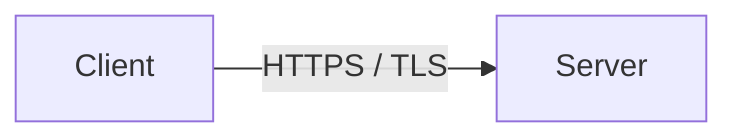
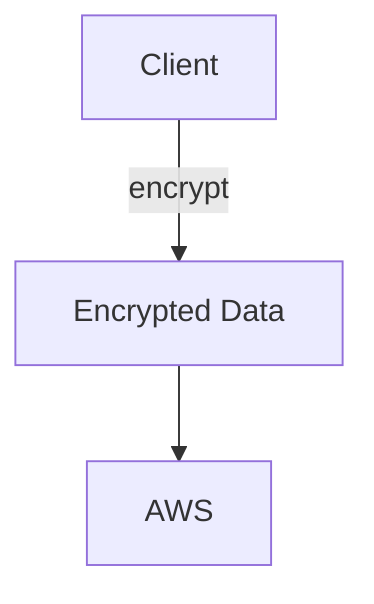
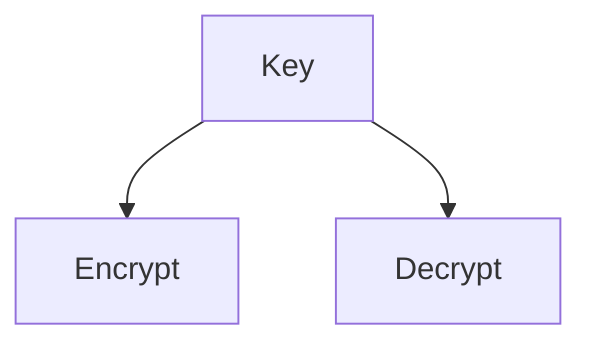
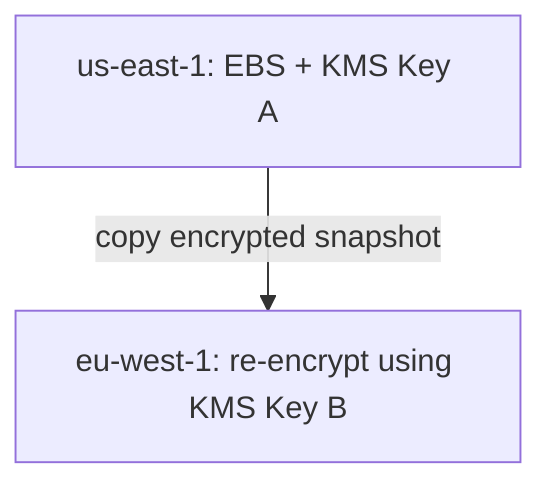
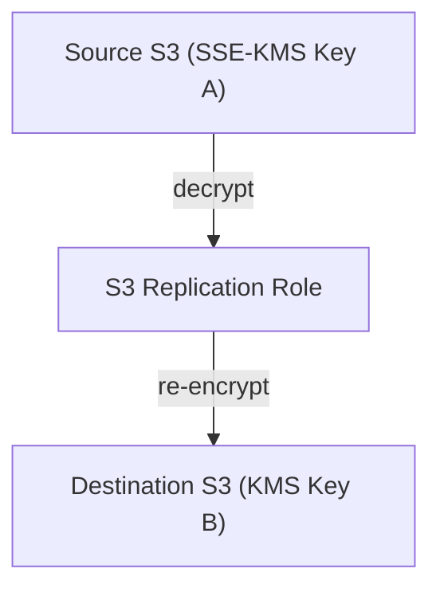
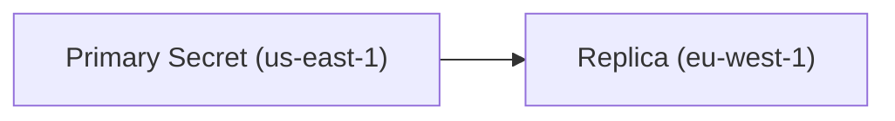
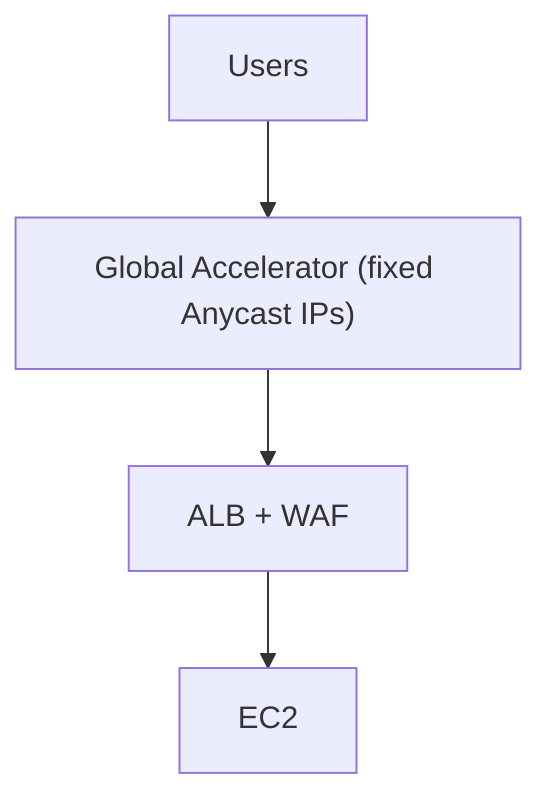
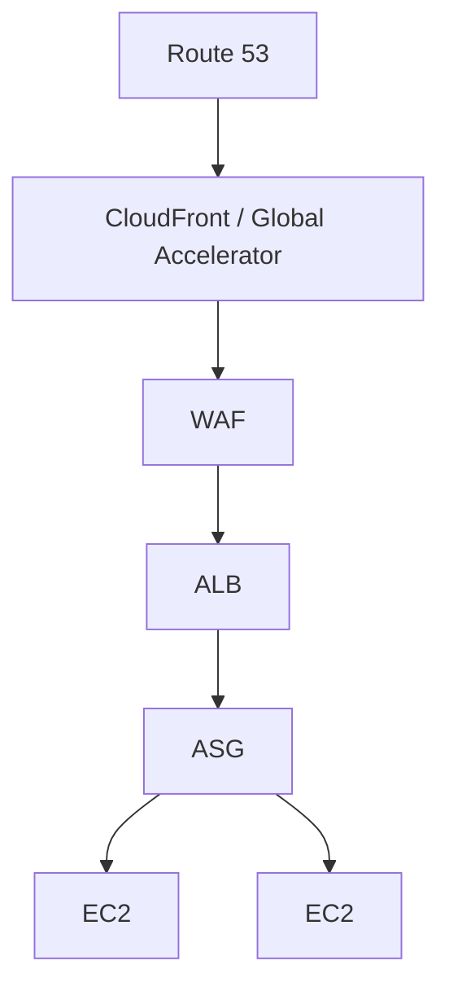
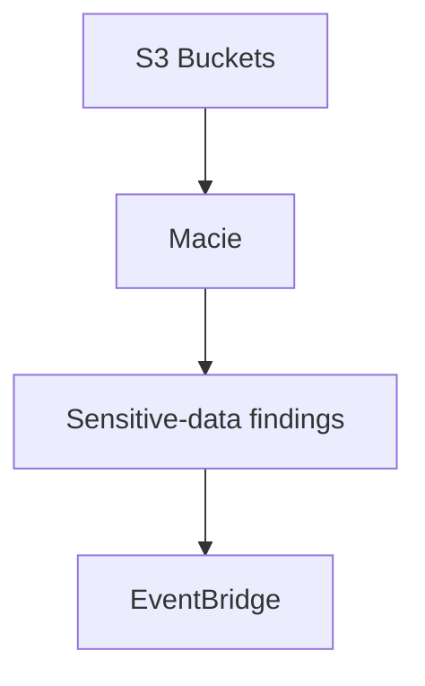
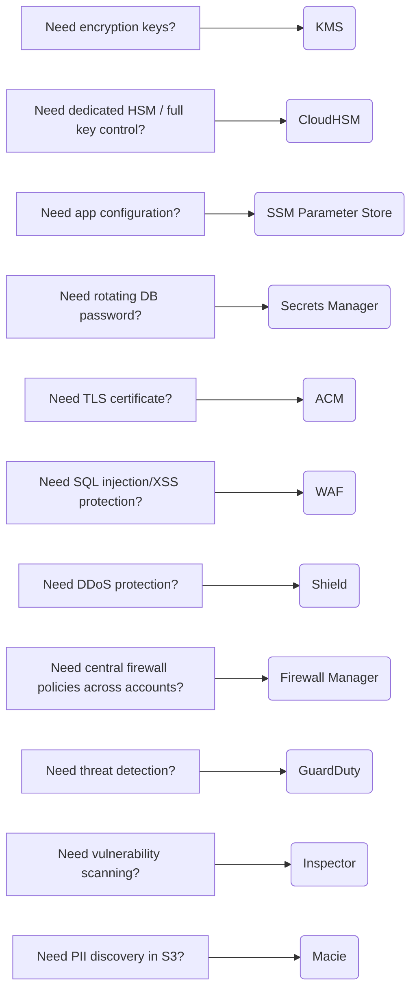

# Security

**AWS Security — KMS, Secrets, ACM, WAF, Shield & Threat Detection**

This section is high priority for SAA. Focus on recognizing which security service solves which problem.

## Encryption Basics

#### Encryption in Transit

Data encrypted while moving across the network.



- Uses TLS/SSL certificates.
- Protects against interception / man-in-the-middle attacks.
- `HTTPS = HTTP over TLS`

#### Encryption at Rest — Server Side

AWS service receives the data, then encrypts it before storing.

Example: `Client → HTTPS → S3 → encrypt at rest → storage`

AWS/service has access to the encryption mechanism/key.

#### Client-Side Encryption



- Client encrypts before sending.
- AWS stores ciphertext.
- Client manages encryption/decryption keys.

!!! tip "Memory"
    - Transit → TLS
    - Server-side → AWS encrypts after receiving
    - Client-side → encrypt before AWS sees data

## AWS KMS — Very High Exam Importance

**KMS = managed encryption key service.**

Integrates with services such as:

- [S3](../storage/s3.md)
- [EBS](../compute/ebs.md)
- [RDS](../databases/rds-aurora.md)
- [DynamoDB](../databases/database-dynamodb.md)
- [SQS](../messaging/decoupling-sqs-sns.md)
- Systems Manager

Major benefits:

- centralized key management
- [IAM](../security/iam.md) integration
- key policies
- **CloudTrail auditing of KMS API usage**

!!! warning "Exam Trigger"
    "Need to control and audit encryption-key usage." → **AWS KMS**

## Symmetric vs Asymmetric KMS Keys

#### Symmetric

Same cryptographic key for encryption/decryption.



- Most AWS service integrations use symmetric KMS keys.
- You never download the actual secret key material from KMS.

#### Asymmetric

Uses:

- public key
- private key

Can support:

- encrypt/decrypt
- sign/verify

Public key can be downloaded. Private key remains protected inside KMS.

!!! warning "Exam Pattern"
    Encryption must happen outside AWS without calling KMS. → consider **asymmetric KMS key + public key**

## KMS Key Ownership Types

### AWS-Owned Keys

- AWS service owns/manages them completely.
- You don't manage or normally see them.

### AWS-Managed KMS Keys

Usually named: `aws/service-name`

Examples: `aws/ebs`, `aws/s3`

- AWS manages lifecycle/rotation.
- Limited customization.

### Customer-Managed KMS Keys

You control:

- permissions
- key policy
- rotation
- aliases
- enabling/disabling/deletion

!!! tip "Memory"
    Need maximum control over KMS key → **Customer-Managed Key**

## KMS Key Rotation

#### AWS-Managed Keys

AWS manages their rotation.

#### Customer-Managed Keys

Can support:

- automatic rotation
- on-demand rotation

#### Imported Key Material

You are responsible for rotation/replacement.

For SAA, understand the ownership difference rather than memorizing pricing or every rotation interval.

## KMS Keys & Regions

Normal KMS keys are: **Regional**



!!! warning "Exam Trigger"
    Copy KMS-encrypted data to another Region. → Expect use of a KMS key in the destination Region.

## KMS Key Policies — Very Important

A KMS key has a **Key Policy**. It controls who can administer/use the key.

Think: **IAM Permission + KMS Key Policy** — both can matter.

#### Cross-Account

To allow Account B to use a customer-managed key owned by Account A:

- Account A key policy permits Account B.
- Account B IAM principal receives permission to use the key.

!!! tip "Memory"
    Cross-account encrypted resource → resource sharing + KMS key access

## KMS Multi-Region Keys

A Multi-Region KMS key has:

- one primary
- replicas in other Regions
- same key ID/key material

Allows `Encrypt Region A → Decrypt Region B` without re-encrypting with unrelated key material.

#### Use Cases

- multi-Region client-side encryption
- globally replicated applications
- encrypted fields used by applications in multiple Regions

!!! info "Important"
    Multi-Region KMS keys are not one global key service. Each regional key:

    - exists in its Region
    - has its own key policy
    - is administered regionally

!!! tip "Exam Memory"
    Multi-Region KMS key = same cryptographic material across Regions

## S3 Replication + SSE-KMS

For KMS-encrypted [S3](../storage/s3.md) objects, replication requires extra configuration. Conceptually:



Need permissions to:

- decrypt using source KMS key
- encrypt using destination KMS key

!!! danger "Exam Trap"
    SSE-KMS replication can increase KMS API usage and potentially hit KMS quotas.

## Sharing an Encrypted AMI Across Accounts

Low-volume topic, but recognize the pattern.

Account A has: `Encrypted AMI + Customer-Managed KMS Key`

For Account B to launch it:

- **Share the AMI launch permission with Account B.**
- **Allow Account B to use the KMS key.**
- Give Account B's IAM principal the required [EC2](../compute/ec2.md)/KMS permissions.
- Optionally copy/re-encrypt using Account B's own KMS key.

!!! tip "Memory"
    Encrypted AMI sharing = share AMI + share KMS key

## SSM Parameter Store

Stores:

- configuration
- parameters
- secrets

Parameter types include: `String`, `StringList`, `SecureString`

`SecureString` → **encrypted with KMS**

#### Hierarchy

Example:

```
/my-app/dev/db-url
/my-app/dev/db-password

/my-app/prod/db-url
/my-app/prod/db-password
```

This allows IAM permissions based on paths.

#### Important Features

- serverless
- IAM access control
- parameter version history
- hierarchical names
- KMS integration
- CloudFormation integration
- AWS public parameters available

!!! warning "Exam Trigger"
    "Store application configuration centrally and optionally encrypt sensitive values." → **SSM Parameter Store**

## Parameter Store: Standard vs Advanced

For SAA, only remember the broad difference:

#### Standard

- lower/basic limits
- free/basic use

#### Advanced

- larger parameters
- more parameters/features
- **supports parameter policies**

Parameter policies can support things such as:

- expiration
- expiration notifications
- no-change notifications

!!! tip "Memory"
    Advanced Parameter Store → policies / larger-scale requirements

## Secrets Manager — Very High Exam Importance

Designed specifically for: **secrets lifecycle management**

Examples:

- database passwords
- API keys
- credentials

Major advantage over Parameter Store: **automatic secret rotation**

Especially integrated with:

- [RDS](../databases/rds-aurora.md)
- Aurora
- [Redshift](../databases/database-dynamodb.md)
- other databases

!!! example "Example"
    ```mermaid
    flowchart TD
        A[Application] --> B[Secrets Manager]
        B --> C["DB username / password"]
        C -->|rotation| D[RDS / Aurora]
    ```
    Rotation can use Lambda where required.

!!! warning "Exam Trigger"
    "Automatically rotate an RDS database password." → **AWS Secrets Manager**

## Parameter Store vs Secrets Manager

| Requirement | Parameter Store | Secrets Manager |
|---|---|---|
| App configuration | ✅ Best fit | Possible |
| Hierarchical parameters | ✅ | Not main feature |
| SecureString + KMS | ✅ | ✅ |
| Database credential storage | ✅ possible | ✅ Best fit |
| Automatic credential rotation | Limited/custom | ✅ Core feature |
| RDS/Aurora secret integration | Possible | ✅ Strong integration |
| Lower-cost basic config storage | ✅ | ❌ comparatively |

!!! tip "Memory"
    - Configuration → Parameter Store
    - Rotating secrets/passwords → Secrets Manager

## Multi-Region Secrets

Secrets Manager can replicate a secret across Regions.



Useful for:

- multi-Region applications
- [disaster recovery](../resilience/disaster-recovery.md)
- multi-Region databases

Replica can be promoted if required.

## AWS Certificate Manager — ACM

**ACM = manage TLS certificates**

Used for HTTPS/in-flight encryption. Integrates with:

- [ALB](../compute/load-balancing-asg.md)
- NLB TLS listeners
- [CloudFront](../networking/cloudfront-global-accelerator.md)
- [API Gateway](../containers-serverless/serverless.md)

!!! example "Example"
    ```mermaid
    flowchart TD
        A[User] -->|HTTPS :443| B[ALB]
        C[ACM Certificate] --> B
    ```

!!! warning "Exam Trigger"
    "Provision and automatically renew an SSL/TLS certificate for an ALB." → **ACM**

## ACM Certificate Validation

Public certificate ownership can be validated through:

#### DNS Validation

Preferred for automation. ACM asks you to create a DNS record. [Route 53](../networking/route53.md) integrates easily.

#### Email Validation

Validation email sent to domain contacts.

!!! tip "Memory"
    Automated ACM management → DNS validation preferred

## ACM Renewal

#### ACM-Issued Public Certificate

→ automatic renewal when requirements remain satisfied.

#### Imported Certificate

→ **you must renew/re-import it yourself**

!!! danger "Exam Trap"
    "Imported certificate is about to expire." ACM doesn't automatically replace it as an ACM-issued certificate.

## CloudFront Certificate Region — Important

For CloudFront custom-domain certificates: **`ACM certificate must be in us-east-1`**

!!! tip "Memory"
    CloudFront certificate → ACM us-east-1

This is a classic exam fact.

## API Gateway + ACM

#### Edge-Optimized API Gateway

Uses CloudFront infrastructure. Certificate: `→ us-east-1`

#### Regional API Gateway

Certificate: → same Region as the regional API endpoint.

## CloudHSM

**CloudHSM = dedicated hardware security modules where YOU control the keys.**

AWS manages:

- HSM infrastructure/hardware availability

Customer manages:

- users
- keys
- cryptographic operations

Supports:

- symmetric keys
- asymmetric keys

#### Main Difference

KMS → AWS-managed key service → multi-tenant managed service

CloudHSM → dedicated HSM → single-tenant key control

!!! warning "Exam Trigger"
    "Company must have exclusive control of encryption keys on dedicated hardware." → **CloudHSM**

## KMS vs CloudHSM

| KMS | CloudHSM |
|---|---|
| Managed key service | Dedicated hardware HSM |
| Easy AWS service integration | More operational responsibility |
| IAM + key policies | HSM's own users/permissions |
| Multi-tenant managed service | Single-tenant HSM |
| AWS manages service | Customer controls cryptographic keys fully |

#### KMS Custom Key Store

KMS can use: **CloudHSM as a custom key store**

This combines:

- KMS API/service integration
- CloudHSM-controlled key material

## AWS WAF — Very High Exam Importance

**WAF = Web Application Firewall**

Operates at: **Layer 7 — HTTP/HTTPS**

Protects from common web attacks such as:

- SQL injection
- Cross-Site Scripting (XSS)
- malicious IP addresses
- bad countries/locations
- excessive request rates

## WAF Web ACL

WAF rules are grouped in a: **Web ACL**

Rules can inspect:

- IP address
- HTTP headers
- request body
- URI
- query components
- geography
- request rate

#### Rate-Based Rule

Example: one IP sends excessive HTTP requests. → WAF rate-based rule can block/throttle abusive sources.

## Where Can WAF Be Attached?

Important SAA targets include:

- CloudFront
- [Application Load Balancer](../compute/load-balancing-asg.md)
- API Gateway
- AppSync
- Cognito User Pools

!!! danger "Exam Trap"
    ❌ WAF cannot be attached directly to NLB. Why? **WAF = Layer 7**, **NLB = Layer 4**.

## Fixed IP + WAF Scenario

Requirement:

- fixed global IPs
- Layer 7 WAF protection



!!! warning "Exam Pattern"
    Static IP + HTTP WAF protection → **Global Accelerator + ALB + WAF**

## AWS Shield

Protects against: **DDoS attacks**

Two levels:

#### Shield Standard

- automatically available
- no extra charge
- common Layer 3/4 DDoS protection

Examples:

- SYN floods
- UDP reflection attacks

#### Shield Advanced

Provides stronger protection plus:

- advanced DDoS mitigation
- AWS DDoS Response Team support
- DDoS cost protection
- enhanced visibility
- additional application-layer mitigation capabilities

!!! tip "Memory"
    DDoS → Shield

## WAF vs Shield

#### WAF

Filters: **HTTP/HTTPS application requests**

Think:

- SQL injection
- XSS
- malicious IP
- HTTP rate limits

#### Shield

Protects from: **DDoS**

!!! tip "Memory"
    - Web exploit → WAF
    - DDoS → Shield

## AWS Firewall Manager

Used to centrally manage security policies across: **AWS Organizations / multiple accounts**

Can centrally deploy/manage policies involving:

- WAF
- Shield Advanced
- [Security Groups](../networking/vpc.md)
- [AWS Network Firewall](../networking/vpc.md)
- [Route 53](../networking/route53.md) Resolver DNS Firewall

!!! example "Example"
    ```mermaid
    flowchart TD
        F[Firewall Manager] --> O{AWS Organization}
        O --> A[Account A]
        O --> B[Account B]
        O --> C[Account C]
    ```
    If a new matching resource is created: → Firewall Manager can automatically apply the organization security policy.

!!! warning "Exam Trigger"
    "Enforce the same WAF rules across hundreds of accounts." → **AWS Firewall Manager**

## WAF vs Shield vs Firewall Manager

| Requirement | Service |
|---|---|
| SQL injection / XSS | WAF |
| DDoS | Shield |
| Centrally deploy security policies across accounts | Firewall Manager |

!!! tip "Memory"
    - WAF = rules
    - Shield = DDoS
    - Firewall Manager = organization-wide management

## DDoS-Resilient Architecture



Why each helps:

#### Route 53

Globally resilient [DNS](../networking/route53.md).

#### CloudFront

Absorbs/caches traffic at edge — see [CloudFront & Global Accelerator](../networking/cloudfront-global-accelerator.md).

#### Global Accelerator

Brings traffic onto AWS's global network quickly.

#### Shield

DDoS protection.

#### WAF

Filters malicious Layer 7 traffic.

#### ELB

Distributes load — see [Load Balancing & Auto Scaling](../compute/load-balancing-asg.md).

#### ASG

Scales compute capacity.

!!! tip "Exam Principle"
    Protect at the edge + hide backends + distribute/scale remaining traffic.

## Amazon GuardDuty

**GuardDuty = threat detection**

Uses:

- machine learning
- anomaly detection
- threat intelligence

It analyzes signals such as:

- CloudTrail activity
- [VPC](../networking/vpc.md) network activity
- DNS activity
- [S3](../storage/s3.md) activity
- optional workload protection signals

Produces: **security findings**

Findings can trigger: `GuardDuty → EventBridge → SNS/Lambda/automation`

!!! warning "Exam Trigger"
    "Detect compromised instances, unusual API calls, suspicious network activity, crypto-mining behavior." → **GuardDuty**

!!! tip "Memory"
    GuardDuty = DETECT threats

## Amazon Inspector

**Inspector = vulnerability management/scanning**

Main resources to remember:

- [EC2](../compute/ec2.md) instances
- [ECR container images](../containers-serverless/ecs-eks-k8s.md)
- [Lambda functions](../containers-serverless/serverless.md)

Checks for:

- known software vulnerabilities/CVEs
- vulnerable packages/dependencies
- EC2 network exposure/reachability

!!! warning "Exam Trigger"
    "Continuously scan EC2 instances or container images for known CVEs." → **Amazon Inspector**

!!! tip "Memory"
    Inspector = VULNERABILITIES

## Amazon Macie

**Macie = discover sensitive data in S3**

Uses:

- machine learning
- pattern matching

Finds data such as: **PII — Personally Identifiable Information**



!!! warning "Exam Trigger"
    "Identify which S3 objects contain sensitive customer information / PII." → **Amazon Macie**

!!! tip "Memory"
    Macie = S3 sensitive data

## GuardDuty vs Inspector vs Macie

This comparison is very exam-important.

| Service | Main Job |
|---|---|
| GuardDuty | Detect threats / compromised behavior |
| Inspector | Find software vulnerabilities |
| Macie | Find sensitive data/PII in S3 |

!!! example "Example"
    EC2 communicates with known malicious IP. → **GuardDuty**

    EC2 contains vulnerable OpenSSL package. → **Inspector**

    S3 bucket contains credit-card/PII data. → **Macie**

## Security Service Decision Map



## Most Important SAA Traps

!!! danger "Trap 1"
    Myth: it's fine to store a database password in a plain-text environment variable. Reality: use **Secrets Manager** or **Parameter Store SecureString**.

!!! danger "Trap 2"
    Myth: any store can handle automatic RDS password rotation. Reality: think **Secrets Manager**, not plain Parameter Store.

!!! danger "Trap 3"
    Myth: WAF can be attached to an NLB. Reality: WAF is Layer 7 — use WAF with an appropriate Layer 7 resource such as an ALB.

!!! danger "Trap 4"
    Myth: GuardDuty scans packages for CVEs. Reality: that's **Inspector**.

!!! danger "Trap 5"
    Myth: Inspector detects suspicious cryptocurrency-mining behavior from account activity. Reality: think **GuardDuty**.

!!! danger "Trap 6"
    Myth: Macie scans EC2 operating systems. Reality: Macie focuses on **sensitive data in S3**.

!!! danger "Trap 7"
    Myth: KMS and CloudHSM provide the same key ownership. Reality: **KMS** = managed; **CloudHSM** = customer controls HSM keys.

!!! danger "Trap 8"
    Myth: an ACM imported certificate automatically renews. Reality: imported certificates require external renewal/re-import.

!!! danger "Trap 9"
    Myth: a CloudFront ACM certificate can live in any Region. Reality: the CloudFront certificate must be in **ACM us-east-1**.

!!! danger "Trap 10"
    Myth: a cross-account encrypted resource only needs resource sharing. Reality: also consider **KMS key permissions**.

## One-Minute Recall

!!! tip "One-Minute Recall"
    TLS = encryption in transit · KMS = managed encryption keys · CloudTrail = audit KMS usage · Customer-managed KMS key = maximum KMS control · KMS key policy = who can use/administer key · Multi-Region KMS = same key material across Regions

    Parameter Store = configuration + SecureString · Secrets Manager = secrets + automatic rotation · ACM = TLS certificates · CloudFront ACM cert = us-east-1 · CloudHSM = dedicated HSM + customer key control

    WAF = Layer 7 web attacks · WAF ≠ NLB · Shield = DDoS · Firewall Manager = central security policies across AWS Organizations · GuardDuty = threat detection · Inspector = vulnerability scanning · Macie = PII/sensitive data in S3

    And the critical three-way exam distinction:

    Suspicious BEHAVIOR? → **GuardDuty**

    Known software VULNERABILITY? → **Inspector**

    Sensitive S3 DATA? → **Macie**
