# S3

Use this as your chapter-end revision sheet. The exam skill is mainly recognizing: what type of S3 storage, security, replication, lifecycle, performance, or access pattern does the scenario require?

## S3 — Big Picture

**Amazon S3 = highly scalable object storage.**

Typical uses:

- backups
- archives
- static websites
- media/files
- application assets
- data lakes
- disaster recovery
- software distribution

#### Core Structure

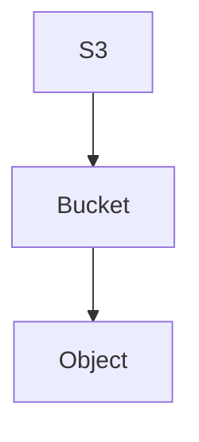

!!! tip "Memory"
    S3 = Object Storage. Not a normal block/file filesystem.

## Buckets & Objects

### Bucket

- Created in a specific AWS Region.
- General Purpose bucket = normal S3 bucket for most workloads.
- Classic bucket namespace requires a globally unique bucket name.
- A newer Account Regional Namespace exists, but traditional global uniqueness remains the main SAA pattern.

### Object

An object contains:

- key
- value/data
- metadata
- tags
- version ID when versioning is enabled

## Object Key & Prefix

Example: `s3://my-bucket/images/2026/photo.jpg`

- Object key: `images/2026/photo.jpg`
- Prefix: `images/2026/`

#### Important

S3 doesn't fundamentally have real filesystem folders. The console makes a key like `images/2026/photo.jpg` *look* like nested directories (`images/` → `2026/` → `photo.jpg`), but technically it's an object key containing `/`.

!!! tip "Memory"
    S3 folders = prefixes

## Object Size & Multipart Upload

For large objects:

- **Multipart Upload** is recommended around 100 MB+
- Required when uploading an object larger than 5 GB

Concept:

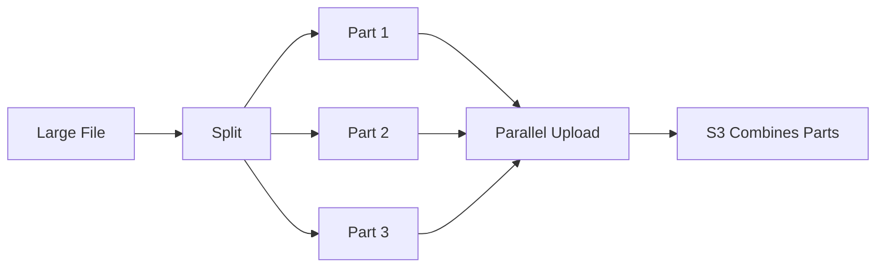

!!! warning "Exam Trigger"
    Large file upload must be faster and more resilient. → **Multipart Upload**

## S3 Basic Security Model

Main access controls:

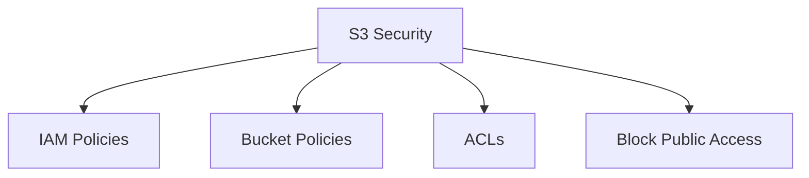

## IAM Policy vs Bucket Policy

### IAM Policy

Identity-based. Attached to:

- IAM user
- IAM group
- IAM role

Example:

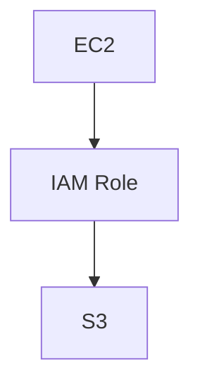

!!! warning "Exam Trigger"
    EC2 instance needs access to S3. → **[IAM Role](../security/iam.md)**. Do not store IAM user credentials on EC2.

### Bucket Policy

Resource-based. Attached directly to the bucket.

Common uses:

- public access
- cross-account access
- enforce encryption
- deny insecure transport
- restrict access conditions

!!! tip "Memory"
    IAM Policy = WHO can do something. Bucket Policy = WHO can access THIS bucket/resource.

## Explicit Deny

Permission evaluation rule: **Explicit Deny overrides Allow.** This applies across IAM and resource policies.

## S3 ACLs

ACLs provide older/fine-grained object/bucket permissions. Modern recommendation: `ACLs disabled + policies`.

For SAA: bucket policies and IAM policies matter much more than ACLs.

## Block Public Access

Critical S3 security feature. Even if someone accidentally writes a public bucket policy, Block Public Access can prevent the bucket from becoming public.

Can be configured:

- per bucket
- per account

!!! warning "Exam Trigger"
    Ensure company buckets can never accidentally be publicly exposed. → **S3 Block Public Access**

## Public Bucket Pattern

To make objects publicly readable:

- Bucket Policy
- `Principal = *`
- `Action = s3:GetObject`
- `Resource = bucket/*`

But Block Public Access must also allow this.

#### Resource Difference

- `arn:aws:s3:::my-bucket` → bucket
- `arn:aws:s3:::my-bucket/*` → objects inside bucket

## Static Website Hosting

S3 can host: HTML, CSS, JavaScript, images.

Architecture:

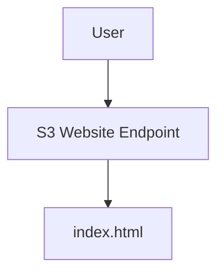

Requirements:

- enable Static Website Hosting
- specify index document
- make content publicly readable

A static site on S3 is commonly paired with a [Route 53 Alias record](../networking/route53.md) pointing at the S3 website endpoint.

!!! danger "Exam Trap"
    S3 static website hosting cannot run server-side application code such as: PHP, Django, Java backend.

!!! info "Important"
    Native S3 website endpoints are HTTP-oriented. For HTTPS/global delivery → think [CloudFront](../networking/cloudfront-global-accelerator.md).

!!! warning "Exam Trigger"
    Cheap static HTML website. → **S3 Static Website Hosting**

## S3 Versioning — High Importance

Enabled at the bucket level. Uploading the same key again creates `photo.jpg v1`, `photo.jpg v2`, `photo.jpg v3`, ...

Benefits:

- protect against overwrites
- protect against accidental deletes
- rollback

## Delete Marker

In a versioned bucket, a normal delete does not remove the object — it adds a **Delete Marker**:

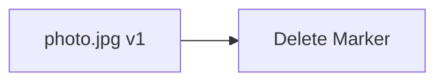

The object appears deleted, but previous versions remain. Remove the delete marker → the previous object version becomes visible again.

!!! info "Important"
    Deleting a specific Version ID → permanent deletion.

!!! tip "Memory"
    Normal delete = delete marker. Specific version delete = permanent.

## Versioning Nuances

Objects uploaded before enabling versioning: `→ Version ID = null`.

Suspending versioning → does not delete previous versions.

## S3 Replication

Two types:

#### CRR

Cross-Region Replication.

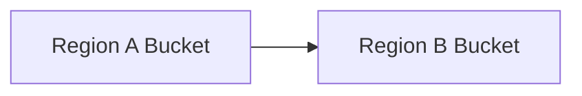

#### SRR

Same-Region Replication.

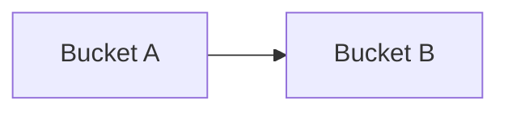

Bucket A and Bucket B are in the same Region.

## Replication Requirements

Replication requires:

- Versioning enabled on source
- Versioning enabled on destination
- proper IAM permissions
- asynchronous replication

Destination can also be another AWS account.

!!! tip "Memory"
    Replication = Versioning on both sides

## CRR vs SRR

| Requirement | Choose |
|---|---|
| Cross-Region DR/compliance | CRR |
| Lower-latency copy in another Region | CRR |
| Cross-account copy in another Region | CRR |
| Log aggregation in same Region | SRR |
| Prod → test copy in same Region | SRR |

## Existing Objects & Batch Replication

Normal replication rule mainly applies to objects created after the rule is enabled. Existing objects → **S3 Batch Replication**.

!!! warning "Exam Trigger"
    Replication enabled today, but millions of old objects also need replication. → **S3 Batch Replication**

## Delete Replication Behavior

Delete markers → can optionally be replicated.

Permanent deletion of a specific Version ID → **not** replicated. Reason: prevent destructive deletes from automatically propagating.

## No Replication Chaining

Suppose `Bucket A → Bucket B → Bucket C`. Objects replicated from A to B do not automatically continue:

- `A → B` ✅
- `A-origin object via B → C` ❌

!!! tip "Memory"
    S3 replication is not transitive

## Storage Classes — Master Decision Map

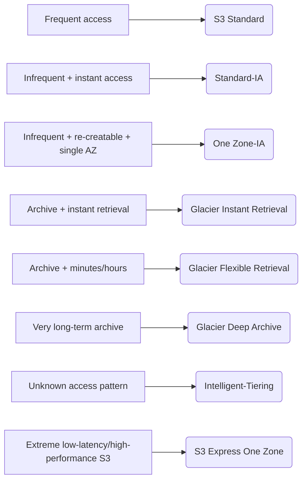

## Durability vs Availability

### Durability

Probability data is not lost. Major S3 classes provide **11 nines durability** (`99.999999999%`).

### Availability

Probability the service can currently serve requests. Availability differs by storage class.

!!! tip "Memory"
    Durability = DATA survives. Availability = SERVICE reachable.

## S3 Standard

Use for: frequently accessed data, websites, applications, big data, content distribution.

Characteristics: low latency, high throughput, multi-AZ.

!!! tip "Memory"
    Standard = frequent access

## Standard-IA

IA = Infrequent Access. Use when data isn't accessed often but must still be retrieved immediately.

Examples: backups, DR data.

Characteristics: lower storage price, retrieval fee, minimum storage duration around 30 days.

!!! tip "Memory"
    Standard-IA = rarely accessed, instantly needed

## One Zone-IA

Stores data in one AZ. Use when data is: infrequently accessed, re-creatable, secondary copy.

Example: derived thumbnails.

!!! danger "Exam Trap"
    If the AZ is destroyed → data can be lost.

!!! tip "Memory"
    One Zone-IA = cheap + re-creatable

## Glacier Instant Retrieval

Archive storage with millisecond retrieval. Minimum storage: 90 days.

!!! warning "Exam Trigger"
    Archive is rarely accessed but must be immediately retrievable. → **Glacier Instant Retrieval**

## Glacier Flexible Retrieval

Archive where waiting is acceptable. Retrieval options roughly:

- Expedited → minutes
- Standard → hours
- Bulk → several hours

Minimum: 90 days.

!!! tip "Memory"
    Flexible = archive + wait minutes/hours

## Glacier Deep Archive

For long-term archival. Examples: regulatory records, compliance archives, data kept for years.

Retrieval → hours. Minimum: 180 days.

!!! warning "Exam Trigger"
    Cheapest long-term storage where retrieval can wait many hours. → **Glacier Deep Archive**

## Intelligent-Tiering

Best when access pattern is unknown or changing. S3 automatically moves objects among access tiers. A small monitoring/automation fee applies.

!!! tip "Memory"
    Don't know access pattern → Intelligent-Tiering

## S3 Express One Zone

Special high-performance S3 storage using **Directory Buckets**. Stored in one AZ.

Designed for: single-digit millisecond latency, very high request rates, AI/ML training, analytics/HPC, latency-sensitive workloads.

**One Zone-IA vs Express One Zone:** One Zone-IA → cheap infrequent data. Express One Zone → extreme performance.

## Lifecycle Rules — High Importance

Lifecycle automates:

#### Transition

Move objects to cheaper storage classes.

#### Expiration

Delete objects after a period.

Example:

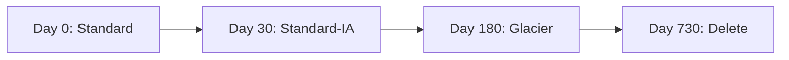

## Lifecycle with Versioning

Can separately manage current versions and noncurrent versions.

Example:

- Current object → Standard
- Old versions → Glacier after 90 days → delete after 365 days

## Lifecycle Filters

Rules can target: whole bucket, prefix, object tags.

Example: `thumbnails/*` → One Zone-IA → delete after 60 days, while originals stay longer.

## Incomplete Multipart Upload Cleanup

Multipart uploads that never finish consume storage. Lifecycle rules can automatically abort incomplete multipart uploads.

!!! warning "Exam Trigger"
    Reduce costs from abandoned multipart uploads. → **Lifecycle Rule**

## S3 Storage Class Analysis

Helps analyze access patterns to decide a Standard → Standard-IA transition.

!!! tip "Memory"
    Storage Class Analysis = recommendation. Lifecycle = action.

## Requester Pays

Normally the bucket owner pays: storage, requests, data transfer.

With Requester Pays, the requester pays: requests, download/data transfer. The bucket owner still pays: storage. The requester must be authenticated.

!!! warning "Exam Trigger"
    Large public/shared dataset; owner doesn't want to pay everybody's download costs. → **Requester Pays**

## S3 Event Notifications — High Importance

S3 can react to events such as: `ObjectCreated`, `ObjectRemoved`, `ObjectRestore`, replication/lifecycle events.

Direct destinations:

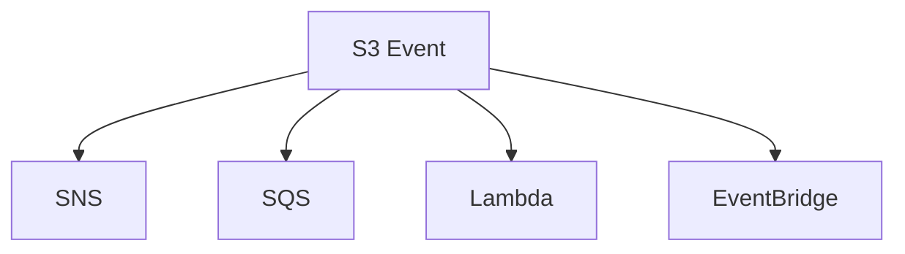

[SNS and SQS](../messaging/decoupling-sqs-sns.md) are common direct destinations alongside [Lambda](../containers-serverless/serverless.md).

## Event Notification Example

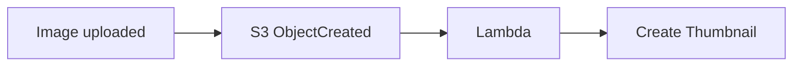

Classic SAA scenario.

## Event Notification Permissions

Destination must allow S3:

- SNS → SNS resource policy
- SQS → queue policy
- Lambda → Lambda resource-based policy

!!! tip "Memory"
    S3 does not simply assume permission to publish/invoke.

## EventBridge with S3

Use EventBridge when you need: advanced filtering, many destination types, event routing, replay/archive capabilities, SQS FIFO integration.

!!! danger "Important Trap"
    Direct S3 Event Notification → SQS Standard. Need SQS FIFO:

    ```mermaid
    flowchart LR
        A[S3] --> B[EventBridge] --> C[SQS FIFO]
    ```

## Event Delivery Behavior

S3 event notifications are **at least once**. Therefore: duplicates may occur, ordering isn't guaranteed.

#### Exam Design

Consumers should ideally be idempotent.

## S3 Performance Baseline

S3 automatically scales. Important classic limits per prefix:

- 3,500 PUT/COPY/POST/DELETE per second
- 5,500 GET/HEAD per second

Multiple prefixes can scale independently. For SAA, remember the concept more than the math: parallelize requests and prefixes for more throughput.

## Multipart Upload — Performance

Again: split large files and upload the pieces in parallel.

Benefits: faster upload, retry only failed parts, maximize bandwidth.

!!! tip "Memory"
    Large object upload → Multipart

## S3 Transfer Acceleration

Useful for long-distance S3 transfers.

Architecture:

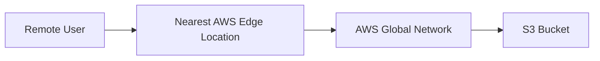

!!! warning "Exam Trigger"
    Users worldwide upload large files to an S3 bucket far away. → **S3 Transfer Acceleration**

!!! tip "Memory"
    Multipart = parallel file pieces. Transfer Acceleration = faster network path.

## Byte-Range Fetch

Retrieve only part of an object.

Example — Large File split into:

- bytes 0–999
- bytes 1000–1999
- ...

Can: parallelize downloads, retrieve only needed portion, retry smaller failed ranges.

!!! warning "Exam Trigger"
    Need only the header/part of a huge object. → **Byte-Range Fetch**

## S3 Batch Operations

Used to perform one action across huge numbers of existing objects.

Examples: change tags, change ACLs, copy objects, restore Glacier objects, invoke Lambda, update encryption.

!!! example "Example"
    ```mermaid
    flowchart LR
        A[Millions of unencrypted objects] --> B[S3 Inventory] --> C[S3 Batch Operations] --> D[Encrypt them]
    ```

!!! tip "Memory"
    Lifecycle = over time. Batch Operations = bulk action now.

## S3 Inventory

Generates reports about objects in a bucket. Useful with: [Athena](../data-analytics/data-analytics.md), Batch Operations, audits, identifying objects with specific properties.

!!! tip "Memory"
    Inventory = object list/report

## S3 Storage Lens

Provides centralized visibility across: Organizations, accounts, Regions, buckets, prefixes.

Helps identify: storage growth, cost optimization, incomplete multipart uploads, data-protection gaps, versioning status, activity/access patterns.

!!! warning "Exam Trigger"
    Organization-wide S3 analytics and optimization dashboard. → **S3 Storage Lens**

## S3 Encryption — Master Decision Map

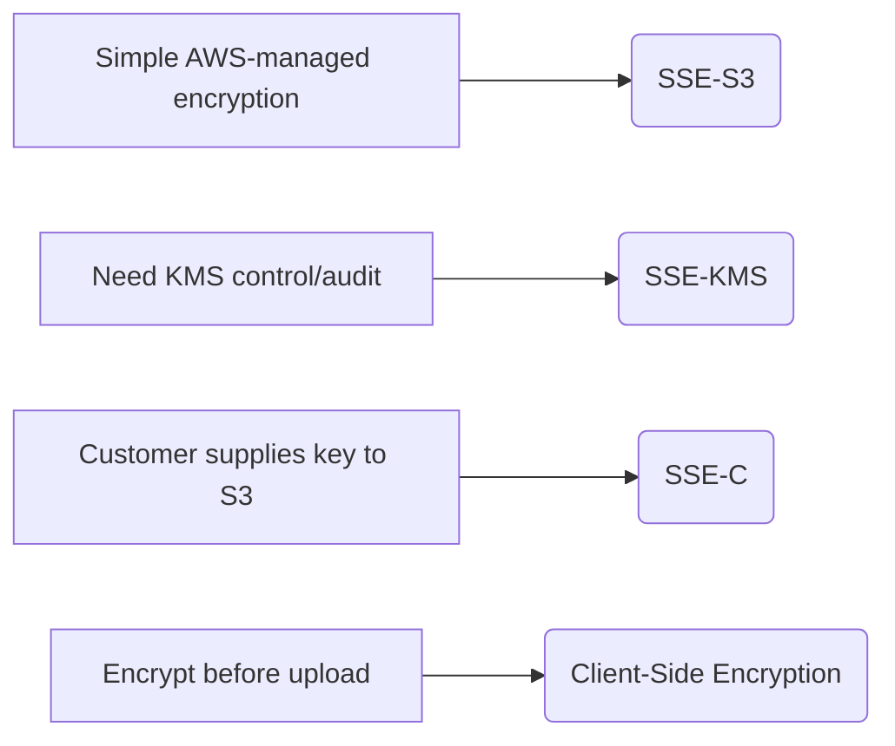

See [Security Services](../security/security.md) for [KMS](../security/security.md) key management details.

## SSE-S3

Server-side encryption using S3-managed keys.

Characteristics: AES-256, AWS handles key management, default S3 encryption.

!!! tip "Memory"
    SSE-S3 = AWS handles everything

## SSE-KMS

Uses [AWS KMS](../security/security.md).

Benefits: key control, permissions, CloudTrail auditing, customer-managed keys possible.

To access the object: `S3 permission + KMS permission`.

!!! warning "Exam Trigger"
    Need auditing/control of encryption key usage. → **SSE-KMS**

## SSE-KMS Performance Consideration

SSE-KMS invokes KMS APIs. High-throughput S3 workload can encounter KMS request quotas / throttling.

#### S3 Bucket Key

Reduces KMS calls and cost.

!!! warning "Exam Trigger"
    Large SSE-KMS S3 workload has high KMS request cost. → **S3 Bucket Key**

## SSE-C

Server-side encryption where the customer provides the encryption key. S3: uses the key, doesn't store the key.

Requirement: HTTPS. You must provide the key again when retrieving the object.

!!! tip "Memory"
    SSE-C = customer brings key every request

## Client-Side Encryption

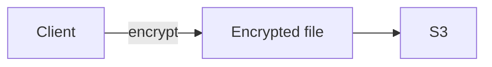

S3 stores the already-encrypted object. Client manages: keys, encryption, decryption.

## Encryption in Transit

Use HTTPS / TLS. To force HTTPS, a bucket policy can deny `aws:SecureTransport = false`.

!!! warning "Exam Trigger"
    Prevent all HTTP access to S3. → **Bucket Policy with SecureTransport condition**

## Default Encryption vs Enforced Encryption

Default encryption → automatically encrypts accepted uploads.

Bucket policy → can deny uploads that don't use the required encryption type.

!!! example "Example"
    Requirement: every object must use SSE-KMS. → Bucket policy denying PUT unless SSE-KMS is specified.

## CORS

Cross-Origin Resource Sharing. Browser security mechanism.

Example:

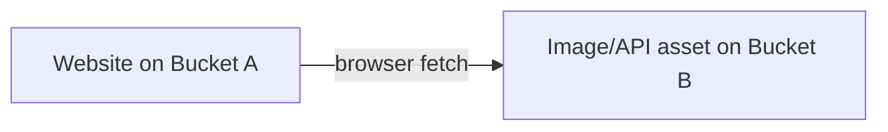

If Bucket B is a different origin → Bucket B must allow Bucket A using CORS configuration.

!!! danger "Critical Trap"
    CORS does not grant IAM/S3 access. It only controls browser cross-origin behavior.

!!! warning "Exam Trigger"
    Browser blocks resources from another S3 domain/origin. → **CORS**

## MFA Delete

Adds protection to a versioned bucket. MFA required for important destructive operations such as: permanently deleting object versions, changing protected versioning state.

Requirements: Versioning enabled, root/bucket owner needed to configure MFA Delete.

!!! tip "Memory"
    Versioning + MFA Delete = stronger delete protection

## S3 Server Access Logging

Records requests made to S3.

Architecture:

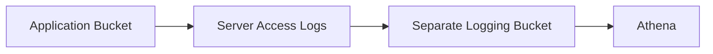

!!! danger "Critical Trap"
    Do not send logs to the same bucket being monitored. Otherwise → **logging loop**.

!!! warning "Exam Trigger"
    Need request-level access auditing for S3. → **S3 Server Access Logging**

## Pre-Signed URLs — High Importance

Temporary access to a private object.

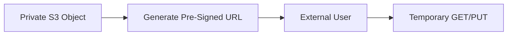

Benefits: bucket stays private, URL expires, user doesn't need AWS credentials.

!!! warning "Exam Triggers"
    Let customer download a private object for 15 minutes. → **Pre-Signed URL**

    Allow temporary direct upload to private S3. → **Pre-Signed PUT URL**

!!! tip "Memory"
    Private + temporary access = Pre-Signed URL

## Object Lock — WORM

WORM = Write Once Read Many. Used for: compliance, records retention, legal/regulatory protection.

Requires: Versioning.

## Object Lock Compliance Mode

Very strict. Protected object version cannot be deleted/overwritten by: users, administrators, even root.

Retention period cannot be shortened.

!!! tip "Memory"
    Compliance = nobody can bypass

## Object Lock Governance Mode

Most users cannot delete/change protected objects. But specially authorized administrators can bypass/change protection.

!!! tip "Memory"
    Governance = admin can override

## Legal Hold

Protects object indefinitely. No fixed retention expiration. Remains until an authorized user removes it.

**Difference:** Retention period → protect until a date. Legal Hold → protect until manually removed.

## Glacier Vault Lock

Also provides WORM-style compliance for Glacier vaults. Once a Vault Lock policy is locked → cannot be changed.

!!! tip "Memory"
    Vault Lock = Glacier compliance lock. Object Lock = S3 object-version WORM.

## S3 Object Lambda — Low Priority / Legacy Recognition

Concept: transform object during retrieval.

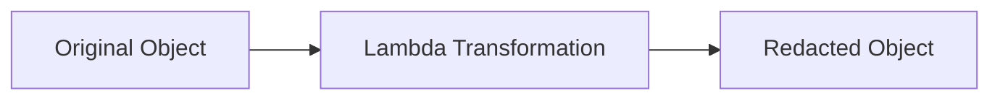

Possible uses: redact PII, XML → JSON, watermark images, enrich data.

For current SAA study: recognize the concept, but prioritize encryption, Object Lock, pre-signed URLs, lifecycle, replication, and storage classes much more heavily.

## Most Important SAA Comparisons

### Versioning vs Replication

**Versioning** protects previous versions in the same bucket. **Replication** copies objects to another bucket.

!!! tip "Memory"
    Versioning = recover previous object. Replication = copy elsewhere.

### Standard-IA vs One Zone-IA

**Standard-IA** — multi-AZ resilience. **One Zone-IA** — single AZ and cheaper. Use only when data can be recreated.

### Glacier Instant vs Flexible vs Deep Archive

- Need milliseconds → **Glacier Instant**
- Can wait minutes/hours → **Glacier Flexible**
- Can wait many hours + cheapest → **Deep Archive**

### Lifecycle vs Intelligent-Tiering

**Lifecycle** — you define: after X days, move object to Y class. **Intelligent-Tiering** — AWS observes access pattern and automatically tiers.

!!! tip "Memory"
    Known pattern → Lifecycle. Unknown pattern → Intelligent-Tiering.

### Lifecycle vs Batch Operations

**Lifecycle** — automatic over time. **Batch Operations** — bulk action on existing objects now.

- Move/archive old objects based on age. → **Lifecycle**
- Change encryption on 10 million existing objects. → **Batch Operations**

### IAM Policy vs Bucket Policy — Cross-Account Recap

**IAM Policy** — identity permission. **Bucket Policy** — resource permission. Cross-account S3 access commonly needs → **Bucket Policy**.

### Public Bucket vs Pre-Signed URL

**Public Bucket** — anyone can access allowed objects. **Pre-Signed URL** — only someone with temporary URL can access.

!!! warning "Exam Pattern"
    One user needs temporary access. → Do not make the bucket public → use **Pre-Signed URL**

### CORS vs Bucket Policy

**Bucket Policy** — determines whether access is authorized. **CORS** — determines whether a browser allows a cross-origin request.

!!! tip "Memory"
    Permission problem → Policy. Browser cross-origin problem → CORS.

## Encryption Decision Table

| Requirement | Choose |
|---|---|
| AWS manages encryption completely | SSE-S3 |
| Control/audit keys | SSE-KMS |
| Customer retains key externally | SSE-C |
| Encrypt before AWS receives data | Client-Side |
| Reduce SSE-KMS API calls | S3 Bucket Key |
| Force HTTPS | SecureTransport bucket policy |

## Storage Decision Table

| Scenario | Choose |
|---|---|
| Frequently accessed | Standard |
| Rare access, instant retrieval | Standard-IA |
| Re-creatable rare data | One Zone-IA |
| Archive, instant retrieval | Glacier Instant |
| Archive, minutes/hours | Glacier Flexible |
| Long-term cheapest archive | Deep Archive |
| Unknown access | Intelligent-Tiering |
| Extreme low-latency S3 | Express One Zone |

## Security Decision Table

| Scenario | Answer |
|---|---|
| Prevent public exposure | Block Public Access |
| EC2 needs S3 access | IAM Role |
| Cross-account access | Bucket Policy |
| Temporary private access | Pre-Signed URL |
| Prevent permanent deletes | Versioning + MFA Delete |
| Compliance retention | Object Lock |
| Browser cross-origin issue | CORS |
| Audit bucket requests | Server Access Logging |
| Enforce HTTPS | Bucket Policy |

## Automation / Event Decision Table

| Requirement | Answer |
|---|---|
| React to object upload | S3 Event Notification |
| Send event to worker queue | SQS |
| Invoke code immediately | Lambda |
| Fan-out notification | SNS |
| Advanced filtering / FIFO target | EventBridge |
| Bulk-update existing objects | Batch Operations |
| Old object transitions | Lifecycle |

## Performance Decision Table

| Requirement | Answer |
|---|---|
| Large upload | Multipart Upload |
| Global long-distance upload | Transfer Acceleration |
| Retrieve only part of object | Byte-Range Fetch |
| Higher throughput | Parallel requests / multiple prefixes |
| Extreme single-AZ S3 performance | S3 Express One Zone |

## Most Dangerous Exam Traps

!!! danger "Trap 1"
    Myth: S3 folders are real directories. Reality: they are prefixes/object keys.

!!! danger "Trap 2"
    Myth: Versioning permanently deletes the object on a normal delete. Reality: a normal delete creates a **Delete Marker**.

!!! danger "Trap 3"
    Myth: S3 replication behaves like synchronous read-replica replication. Reality: replication is **asynchronous**.

!!! danger "Trap 4"
    Myth: replication automatically copies old objects. Reality: not by default — use **S3 Batch Replication**.

!!! danger "Trap 5"
    Myth: replication chains `A → B → C`. Reality: replication isn't transitive.

!!! danger "Trap 6"
    Myth: One Zone-IA is best for the only copy of critical data. Reality: use it for re-creatable/secondary data.

!!! danger "Trap 7"
    Myth: Glacier always means slow retrieval. Reality: not anymore — Glacier Instant Retrieval → milliseconds.

!!! danger "Trap 8"
    Myth: Intelligent-Tiering and Lifecycle are the same. Reality: Intelligent-Tiering = AWS observes usage; Lifecycle = you define age-based transitions.

!!! danger "Trap 9"
    Myth: CORS grants S3 access. Reality: CORS only affects browser cross-origin behavior.

!!! danger "Trap 10"
    Myth: a pre-signed URL makes the object public. Reality: the bucket/object remains private.

!!! danger "Trap 11"
    Myth: SSE-KMS permission only requires S3 access. Reality: you also need appropriate **KMS key permission**.

!!! danger "Trap 12"
    Myth: SSE-C means the client encrypts before upload. Reality: SSE-C is still server-side encryption — you merely provide the key.

!!! danger "Trap 13"
    Myth: MFA Delete protects simple delete markers only. Reality: its important protection is against **permanent version deletion**.

!!! danger "Trap 14"
    Myth: Object Lock Governance mode cannot be bypassed. Reality: it can be bypassed by specially authorized principals. Compliance mode is the strict one.

!!! danger "Trap 15"
    Myth: S3 access logs should be written back into the same source bucket. Reality: never — that can create a **logging loop**.

## Final S3 Decision Tree

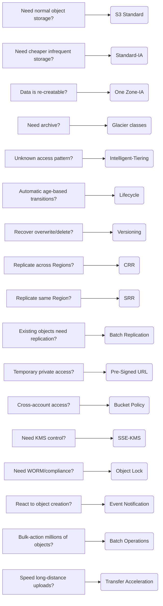

## One-Minute Pre-Exam Recall

!!! tip "One-Minute Pre-Exam Recall"
    S3 = object storage · Bucket = Region · Object key = full object path · Folders = prefixes · >5 GB upload → Multipart Upload

    Versioning = recover overwrite/delete · Normal delete → Delete Marker · CRR = cross-Region · SRR = same Region · Replication = async + versioning required · Old objects → Batch Replication

    Standard = frequent · Standard-IA = rare + instant · One Zone-IA = re-creatable · Glacier Instant = archive + milliseconds · Glacier Flexible = minutes/hours · Deep Archive = cheapest long-term · Unknown pattern = Intelligent-Tiering · Lifecycle = transition + expiration

    Requester Pays = downloader pays request/transfer · S3 Event → SNS/SQS/Lambda/EventBridge · Large upload = Multipart · Far-away upload = Transfer Acceleration · Partial download = Byte-Range Fetch · Bulk changes = Batch Operations

    SSE-S3 = AWS-managed key · SSE-KMS = KMS control + audit · SSE-C = customer supplies key · HTTPS = encryption in transit · CORS = browser cross-origin · Pre-Signed URL = temporary private access · MFA Delete = protect permanent deletes · Object Lock Compliance = nobody can bypass · Object Lock Governance = privileged admin can bypass · Legal Hold = indefinite until removed

    And the most important exam split:

    ACCESS problem? → IAM / Bucket Policy / Pre-Signed URL

    COST problem? → Storage Class / Lifecycle / Intelligent-Tiering

    RECOVERY problem? → Versioning / Replication

    SECURITY problem? → Encryption / Block Public Access / Object Lock

    EVENT problem? → S3 Event Notifications

    PERFORMANCE problem? → Multipart / Transfer Acceleration / Byte-Range Fetch

    This is the S3 chapter memory map I would revise before doing SAA practice questions.
