# AWS Storage, Migration & Hybrid Storage — Complete Summary

This is the complete SAA-C03 summary for the AWS storage, data-transfer, and hybrid-storage lectures — it covers the whole area, not just Snowball: Snowball, FSx, Storage Gateway, Transfer Family, and DataSync, plus how they compare against S3, EBS, and EFS.

## Master Mental Map

When you see a storage/data-transfer question, first ask:

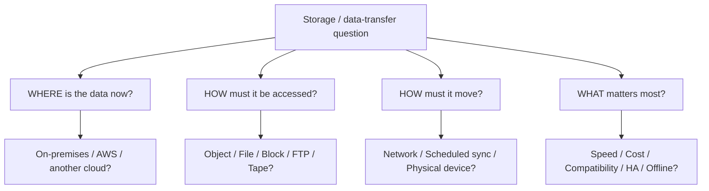

Then map it:

| Requirement | Service |
|---|---|
| Huge offline migration | Snowball |
| Scheduled file/data synchronization | DataSync |
| FTP / FTPS / SFTP access to S3/EFS | Transfer Family |
| On-premises storage connected to AWS | Storage Gateway |
| Managed Windows filesystem | FSx for Windows |
| High-performance HPC filesystem | FSx for Lustre |
| Existing NetApp workloads | FSx for NetApp ONTAP |
| Existing ZFS workloads | FSx for OpenZFS |

## AWS Snowball

### What Is Snowball?

Snowball is a secure physical device used to move very large amounts of data into or out of AWS.


Main use cases:

- huge data migration
- limited bandwidth
- unstable network
- expensive network transfer
- edge computing

### When Should You Think Snowball?

If transferring over the network would take a very long time.

**Course shortcut:** if transfer would take roughly more than a week, consider Snowball.

Typical SAA wording: "Company needs to migrate hundreds of TB or PB with limited bandwidth." → **Snowball**

### Snowball Edge Storage Optimized

Focus: maximum storage capacity.

Good for:

- large-scale migrations
- petabytes of data
- bulk data transfer

**Memory:** Lots of STORAGE → Snowball Edge Storage Optimized.

Don't obsess over exact device capacity because AWS updates hardware.

### Snowball Edge Compute Optimized

Focus: local computing at the edge.

Use when the location has:

- no internet
- slow internet
- unreliable connectivity

Examples: ships, factories, mines, remote sites, trucks.

Can process data locally before sending it to AWS.

**Memory:** Remote location + need compute → Snowball Edge Compute Optimized.

### Snowball Edge Computing

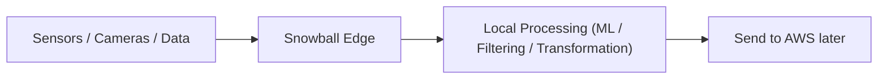

Useful when raw data should be processed before transfer.

### Snowball Import vs Export

#### Import

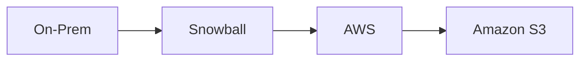

#### Export

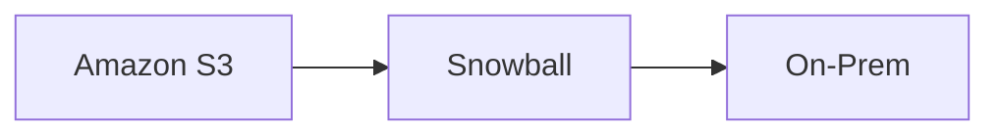

### Snowball → Glacier Trap

!!! danger "Exam Trap"
    Myth: Snowball imports data directly into Amazon Glacier. Reality: Snowball does **not** directly import into Glacier — it lands in S3 first.


!!! warning "Exam Trigger"
    "Use Snowball to archive data directly into Glacier." → Correct answer: **Snowball → S3 → Lifecycle → Glacier**.

## Amazon EFS

Switch mental models: [EBS](../compute/ebs.md) is a block device, attached to one EC2 instance. EFS is a **managed shared network file system**, using NFS.

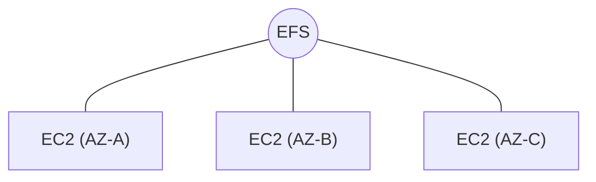

Multiple machines can access the same files.

### Why EFS?

Imagine a web application running on EC2 A, EC2 B, and EC2 C — all needing the same `/uploads`, `/images`, `/shared-content`.

With separate EBS volumes (`EC2 A → EBS A`, `EC2 B → EBS B`, `EC2 C → EBS C`), files aren't naturally shared.

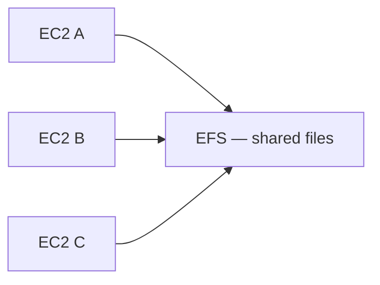

### EFS Works Across AZs

A huge distinction from EBS: EBS is AZ-bound, but EFS is regional — accessible from EC2 instances in AZ-A, AZ-B, and AZ-C simultaneously. Therefore excellent for highly available applications across multiple AZs.

#### EFS Use Cases

- content management
- web serving
- shared application data
- WordPress
- shared file systems

!!! warning "Exam Trigger"
    "Multiple EC2 instances across AZs need the same filesystem." → **EFS**

### EFS Is for Linux

Linux ✅ / Windows ❌ — because EFS uses NFS and POSIX-style filesystem behavior. For Windows shared file storage, use [FSx](#amazon-fsx) instead.

### EFS Security

EFS mount targets use Security Groups. NFS uses **TCP 2049**.

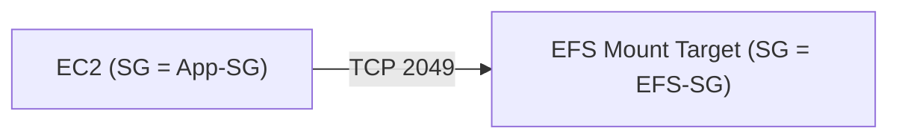

EFS SG inbound rule: NFS TCP 2049, source = App-SG — the same [Security Group referencing pattern](../networking/vpc.md#security-groups) used elsewhere.

### EFS Automatically Scales Storage

EBS requires you to provision disk size. EFS grows automatically as you write files — you pay based on storage used.

!!! tip "Memory"
    EBS = provision capacity · EFS = elastic capacity

### EFS Regional vs One Zone

#### Regional

Stores data across multiple AZs. Best for production, high availability, resilience.

#### One Zone

Uses one AZ. Advantage: cheaper. Trade-off: less resilient to an AZ failure. Use cases: development, workloads where lower cost matters more than multi-AZ resilience.

!!! warning "Exam Trigger"
    "Production shared filesystem requiring multi-AZ HA." → **Regional EFS**. "Development workload, minimize EFS cost." → **One Zone**

### EFS Storage Tiers

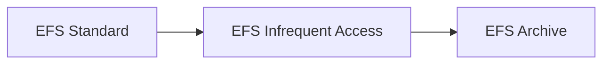

- **EFS Standard** — for frequently accessed files. Hot data → Standard.
- **EFS Infrequent Access (IA)** — for less frequently accessed files. Trade-off: cheaper storage, but a retrieval/access charge. Less frequently used → EFS-IA.
- **EFS Archive** — for files accessed very rarely (e.g. a few times per year) → Archive.

### EFS Lifecycle Management

Automatically transitions files according to access patterns:

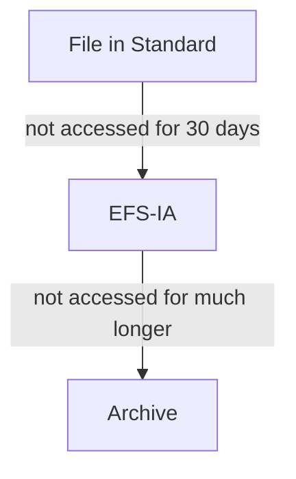

Can also transition accessed files back to Standard depending on policy.

!!! warning "Exam Trigger"
    "Reduce EFS cost automatically based on file access frequency." → **EFS Lifecycle Management**

### EFS Throughput Modes

Three main choices: Bursting, Provisioned, Elastic.

- **Bursting** — throughput scales with filesystem size/usage. More data stored → more baseline throughput; can temporarily burst.
- **Provisioned** — choose throughput independently from storage size. Small EFS but high throughput required → provision throughput.
- **Elastic** — automatically scales throughput according to workload. Best when traffic/I/O is unpredictable.

!!! tip "Memory"
    Bursting = storage-related throughput · Provisioned = choose throughput · Elastic = AWS automatically scales throughput

### EFS Performance Modes

#### General Purpose

Low latency. Good for websites, CMS, normal applications.

#### Max I/O

Designed for highly parallel workloads and higher aggregate throughput, with higher latency trade-offs. Good for big data, media processing.

For SAA, the important idea is simply: latency-sensitive → General Purpose; highly parallel / throughput-focused → Max I/O.

### EFS Mount Targets

Regional EFS exposes mount targets into your VPC/AZs:

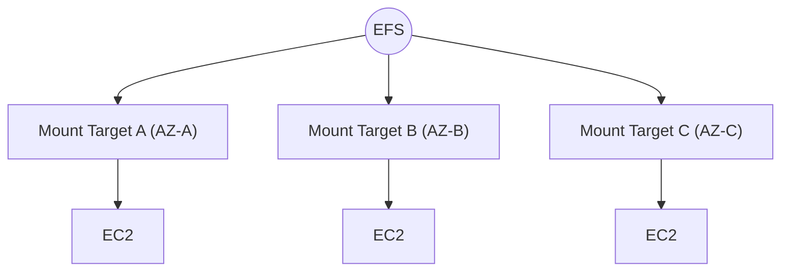

This is how different AZs access the shared filesystem. See [EBS vs EFS](../compute/ebs.md#ebs-vs-efs-most-important-comparison) for the full block-vs-file comparison.

## Amazon FSx

### What Is FSx?

Amazon FSx provides fully managed third-party / specialized file systems on AWS.

Easy analogy: [RDS](../databases/rds-aurora.md) = managed database engines. FSx = managed file system engines.

Four important ones:

- FSx
    - Windows File Server
    - Lustre
    - NetApp ONTAP
    - OpenZFS

### FSx for Windows File Server

Use when you need a managed Windows shared filesystem.

Key features:

- SMB protocol
- NTFS
- Microsoft Active Directory integration
- Windows ACLs
- user quotas
- can be Multi-AZ
- backups
- SSD or HDD
- accessible from on-premises

#### Protocol

SMB

#### Authentication

Microsoft Active Directory

!!! danger "Exam Trap"
    Myth: only Windows clients can mount FSx for Windows File Server. Reality: Linux EC2 instances can also mount it, using SMB-compatible clients.

#### FSx for Windows Use Cases

Think:

- Windows home directories
- enterprise Windows applications
- Active Directory environments
- shared SMB files
- CMS
- Windows-based corporate storage

!!! warning "Exam Trigger"
    "Windows shared filesystem + SMB + Active Directory" → **FSx for Windows File Server**

#### FSx for Windows + On-Premises

Can be accessed from on-premises over private connectivity such as [VPN or Direct Connect](../networking/vpc.md). Can also integrate with existing Windows file environments.

### FSx for Lustre

Lustre is designed for **High Performance Computing (HPC)**.

Memory trick: Lustre ≈ Linux + Cluster.

Think:

- machine learning
- HPC
- video processing
- financial modeling
- electronic design automation
- huge parallel workloads

!!! warning "Exam Trigger"
    "High-performance parallel filesystem for HPC" → **FSx for Lustre**

#### FSx for Lustre Performance

Designed for:

- huge throughput
- very high IOPS
- sub-millisecond latency
- parallel access

Don't memorize exact maximum numbers. Know: **Lustre = extreme filesystem performance.**

#### FSx for Lustre + S3

FSx for Lustre integrates with **[Amazon S3](../storage/s3.md)**. Concept:

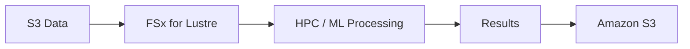

This is a classic exam pattern.

!!! warning "Exam Trigger"
    "Process massive S3 dataset using HPC filesystem." → **FSx for Lustre**

#### Lustre Scratch Filesystem

Scratch = temporary.

Characteristics:

- temporary data
- no data replication
- very high performance
- cheaper
- failure may cause data loss

Use for:

- temporary processing
- short-lived workloads
- data that can be regenerated

**Memory:** Scratch = TEMPORARY + FAST

#### Lustre Persistent Filesystem

Persistent:

- long-term storage
- replicated within the same AZ
- higher durability
- failed storage replaced transparently

Use:

- long-running workloads
- important data
- repeated processing

**Memory:** Persistent = DURABLE Lustre

#### Scratch vs Persistent

| Feature | Scratch | Persistent |
|---|---|---|
| Data durability | Lower | Higher |
| Replication | No | Yes |
| Performance | Very high | High |
| Cost | Lower | Higher |
| Use | Temporary processing | Long-term workloads |

### FSx for NetApp ONTAP

Use when the organization already uses NetApp ONTAP / NAS environments.

Supports:

- NFS
- SMB
- iSCSI

Very broad compatibility. Works with:

- Linux
- Windows
- macOS
- VMware
- [EC2](../compute/ec2.md)
- ECS
- EKS
- WorkSpaces

#### NetApp ONTAP Special Features

Important exam keywords:

- snapshots
- replication
- compression
- deduplication
- automatic storage scaling
- point-in-time cloning

!!! warning "Exam Trigger"
    "Need deduplication." → **FSx for NetApp ONTAP**

#### ONTAP Instant Cloning

You can create fast point-in-time clones.

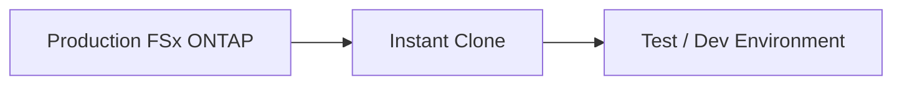

Useful for:

- testing
- staging
- development

### FSx for OpenZFS

Use when migrating workloads already using **ZFS**.

Supports NFS.

Good for:

- Linux
- Windows
- macOS clients
- high-performance ZFS workloads

Features:

- snapshots
- compression
- cloning
- high IOPS
- very low latency

#### OpenZFS vs ONTAP

| Requirement | Service |
|---|---|
| NetApp / NFS + SMB + iSCSI / deduplication | FSx for NetApp ONTAP |
| Managed ZFS / NFS | FSx for OpenZFS |

The lecture specifically notes that OpenZFS does **not** have the same deduplication feature highlighted for ONTAP.

### FSx Master Table

| Requirement | Service |
|---|---|
| Windows SMB filesystem | FSx for Windows |
| Microsoft AD integration | FSx for Windows |
| HPC / ML filesystem | FSx for Lustre |
| S3 + high-performance computation | FSx for Lustre |
| Existing NetApp workloads | FSx for ONTAP |
| NFS + SMB + iSCSI | FSx for ONTAP |
| Deduplication | FSx for ONTAP |
| Existing ZFS workloads | FSx for OpenZFS |
| Managed ZFS | FSx for OpenZFS |

## AWS Storage Gateway

### What Is Storage Gateway?

Storage Gateway connects on-premises storage ↕ AWS storage. It is a hybrid storage bridge between your data center and AWS.

Use when some infrastructure remains on-premises but AWS storage is needed.

### Storage Gateway Types

Main three:

- Storage Gateway
    - S3 File Gateway
    - Volume Gateway
    - Tape Gateway

Remember the access protocol — this alone solves many exam questions:

| Gateway Type | Protocol |
|---|---|
| File Gateway | NFS / SMB |
| Volume Gateway | iSCSI |
| Tape Gateway | iSCSI VTL |

### S3 File Gateway

Allows on-premises applications to access [S3](../storage/s3.md) like a normal file share.

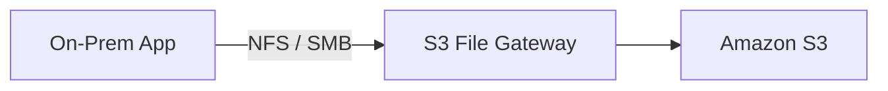

The application thinks it is using a filesystem. Behind the scenes, data is stored as S3 objects.

#### S3 File Gateway Local Cache

Frequently accessed data is cached locally.

- Frequently used files → local cache
- Other files → S3

Benefit: low-latency access to hot files.

#### S3 File Gateway + Glacier

The gateway does not directly expose Glacier as the active filesystem. Use:

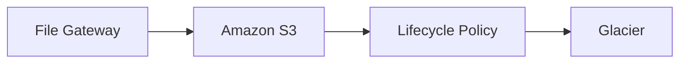

#### S3 File Gateway Protocols

Supports NFS and SMB. If using SMB, it can integrate with Microsoft Active Directory.

### Volume Gateway

Provides **Block Storage** using iSCSI.


Good for:

- backup
- [disaster recovery](../resilience/disaster-recovery.md)
- hybrid block storage

#### Volume Gateway + EBS Snapshots

Volume data can be backed up to AWS as **[EBS](../compute/ebs.md) Snapshots**. This means you can later restore them into Amazon EBS. Useful for disaster recovery.

#### Cached Volumes

Primary data stored in AWS. The local gateway stores frequently accessed data.

- Full Dataset → AWS
- Hot Data → Local Cache

**Memory:** Cached Volume = AWS is PRIMARY

#### Stored Volumes

Opposite architecture.

- Full Dataset → On-Premises
- Backup → AWS

**Memory:** Stored Volume = On-Prem is PRIMARY

#### Cached vs Stored Volumes

| Aspect | Cached | Stored |
|---|---|---|
| Full data | AWS | On-prem |
| Local storage | cache | full dataset |
| Main benefit | reduce local capacity | preserve local access |
| Cloud role | primary | backup |

!!! tip "Memory"
    CACHED → cloud copy is main data. STORED → site copy is main data.

### Tape Gateway

Used when a company still uses traditional tape backup software. Instead of physical tapes:

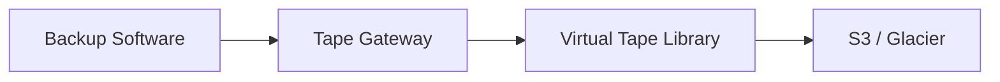

Protocol: **iSCSI VTL** (VTL = Virtual Tape Library).

#### Tape Gateway Use Case

Typical exam wording: "Replace physical tape backup infrastructure while keeping existing tape backup software." → **Tape Gateway**

Can archive virtual tapes to:

- S3
- Glacier
- Glacier Deep Archive

### Storage Gateway Quick Decision

- Need on-prem FILE access to S3? → **S3 File Gateway**
- Need on-prem BLOCK storage backed by AWS? → **Volume Gateway**
- Need virtual tapes in AWS? → **Tape Gateway**

## AWS Transfer Family

### What Is Transfer Family?

Use when users/applications need traditional FTP, FTPS, or SFTP, but storage should live in [S3](../storage/s3.md) or EFS.

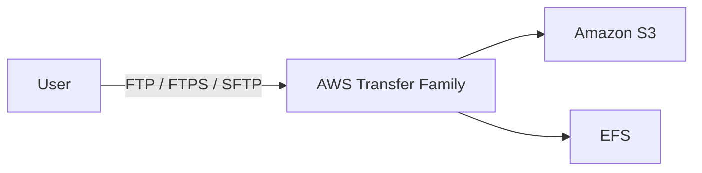

#### Protocols

##### FTP

Unencrypted.

##### FTPS

FTP over TLS/SSL. Encrypted.

##### SFTP

Secure File Transfer over SSH. Encrypted.

Important: FTPS and SFTP are **not** the same protocol.

### Transfer Family Authentication

Can integrate with:

- Active Directory
- LDAP
- Okta
- Cognito
- custom identity providers

Also supports managed users.

!!! warning "Exam Trigger"
    "Company's partners must continue using SFTP, but files must be stored in S3." → **AWS Transfer Family** (not DataSync, not Storage Gateway)

## AWS DataSync

### What Is DataSync?

DataSync is used to move/synchronize large amounts of data between storage locations.

Typical destinations:

- [S3](../storage/s3.md)
- EFS
- FSx

Sources can include:

- on-prem NFS
- on-prem SMB
- HDFS
- other clouds
- AWS storage services

### On-Prem → AWS DataSync

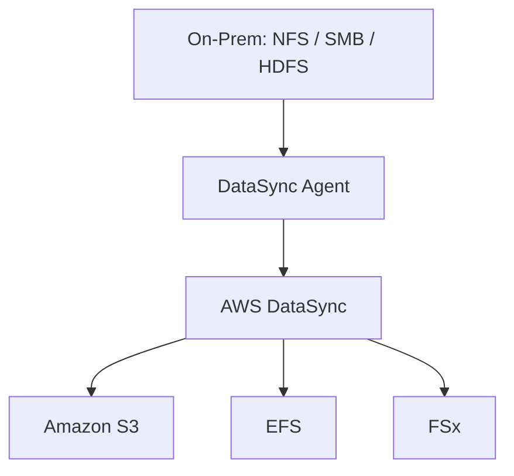

For on-prem or another cloud, a DataSync agent is generally required.

### AWS → AWS DataSync

```mermaid
flowchart LR
    A["Amazon S3"] --> B[DataSync] --> C[EFS]
    D[EFS] --> E[DataSync] --> F[FSx]
```

When both sides are AWS storage services, no on-premises agent is required.

### DataSync Is Scheduled

Important lecture point: DataSync tasks are not continuous real-time replication. They are scheduled:

- hourly
- daily
- weekly
- on demand / scheduled task model

**Memory:** DataSync = scheduled synchronization

### DataSync Preserves Metadata

Very important exam clue. Can preserve:

- file metadata
- POSIX permissions
- timestamps
- SMB permissions

!!! warning "Exam Trigger"
    "Migrate files to AWS and preserve permissions/metadata." → **DataSync** — this is a very strong SAA clue.

### DataSync Bandwidth

Designed for high-speed transfers. You can also configure bandwidth limits — useful when migration must not consume the entire corporate WAN link.

## DataSync vs Snowball

This comparison is very important.

| DataSync | Snowball |
|---|---|
| Network-based transfer | Physical transfer |
| Scheduled | Very large initial datasets |
| Repeatable | Limited network |
| Preserves metadata | One-time/bulk migrations |

!!! example "Example"
    200 TB migration + very slow link → **Snowball**. After the initial 200 TB migration, daily changes are small → **DataSync** (or another network replication service).

### Snowball + DataSync Pattern

A common architecture: initial 500 TB → Snowball, then incremental changes → DataSync.

**Think:** Snowball seeds the data; DataSync keeps it synchronized.

## Transfer Family vs DataSync

Don't confuse them.

**Transfer Family** — users/applications communicate with FTP / FTPS / SFTP.

!!! example "Example"
    An external supplier uploads files every day using SFTP → **Transfer Family**.

**DataSync** — machine-to-machine data migration/synchronization.

!!! example "Example"
    Copy 50 TB from an NFS server to EFS every night and preserve permissions → **DataSync**.

!!! tip "Memory"
    Human/app speaks SFTP → Transfer Family. Storage system needs synchronization → DataSync.

## Storage Gateway vs DataSync

Another common exam trap.

**Storage Gateway** — provides ongoing hybrid access: an on-prem application talks to it, and AWS storage appears locally. **Think: bridge / extension.**

**DataSync** — moves/copies the data: Storage A → copy/sync → Storage B. **Think: migration / synchronization.**

| Scenario | Answer |
|---|---|
| On-prem application must continue using SMB while data is stored in S3 | S3 File Gateway |
| Company must migrate SMB share to S3 while preserving metadata | DataSync |

That distinction is extremely important.

## FSx vs EFS

**EFS** — Linux, NFS, Multi-AZ shared filesystem, general-purpose Linux file sharing.

**FSx** — use when you need a specific filesystem technology:

| Requirement | Service |
|---|---|
| Windows SMB | FSx for Windows |
| HPC | FSx for Lustre |
| NetApp | FSx for ONTAP |
| ZFS | FSx for OpenZFS |

### EFS vs FSx for Windows

| Scenario | Answer |
|---|---|
| Multiple Linux EC2 across AZs need shared files | EFS |
| Windows servers need SMB + Active Directory | FSx for Windows |

## Full AWS Storage Family

Now connect this section to everything you already learned.

### S3

Use for object storage. Examples: images, backups, logs, data lakes, static files. Access through the S3 API — not a normal filesystem. See the full [S3](../storage/s3.md) reference.

### Glacier

Use for archival object storage. Think: rarely accessed + long-term + cheap.

### EBS

Use for block storage typically attached to EC2: EC2 → [EBS](../compute/ebs.md). Persistent. AZ-bound.

### Instance Store

Use for extremely fast local temporary EC2 storage. High performance + ephemeral. Good for: scratch, cache, temporary data.

### EFS

Use for a Linux NFS shared filesystem across multiple EC2/AZs.

```mermaid
flowchart LR
    A["EC2 A"] --> D[EFS]
    B["EC2 B"] --> D
    C["EC2 C"] --> D
```

### Full AWS Storage Family Tree

- AWS STORAGE
    - OBJECT
        - S3
        - S3 Glacier
    - BLOCK
        - EBS
        - Instance Store
    - FILE
        - EFS
        - FSx
            - Windows
            - Lustre
            - ONTAP
            - OpenZFS
    - HYBRID
        - Storage Gateway
    - TRANSFER
        - Transfer Family
        - DataSync
        - Snowball
    - DATABASE
        - separate database services

## Highest-Value Exam Traps

!!! danger "Trap 1 — Snowball directly to Glacier"
    Myth: Snowball imports data directly into Glacier. Reality: **Snowball → S3 → Lifecycle → Glacier.**

!!! danger "Trap 2 — Snowball for normal small transfer"
    Myth: Snowball is a good fit for small, everyday transfers. Reality: Snowball is for huge data + bandwidth constraints — usually wrong for normal-sized transfers.

!!! danger "Trap 3 — FSx for Lustre for Windows file shares"
    Myth: FSx for Lustre can serve Windows file shares. Reality: Windows/SMB → **FSx for Windows**. Lustre → **HPC**.

!!! danger "Trap 4 — EFS for Windows Active Directory filesystem"
    Myth: EFS can provide a Windows Active-Directory-integrated filesystem. Reality: use **FSx for Windows**.

!!! danger "Trap 5 — Storage Gateway = DataSync"
    Myth: Storage Gateway and DataSync are the same thing. Reality: Storage Gateway = hybrid **ACCESS**. DataSync = **COPY/SYNC**.

!!! danger "Trap 6 — Transfer Family = DataSync"
    Myth: Transfer Family and DataSync are the same thing. Reality: Transfer Family = FTP/SFTP/FTPS endpoint. DataSync = storage synchronization.

!!! danger "Trap 7 — File Gateway gives block volumes"
    Myth: File Gateway provides block storage. Reality: File Gateway = NFS/SMB. Volume Gateway = iSCSI block.

!!! danger "Trap 8 — Tape Gateway gives a normal filesystem"
    Myth: Tape Gateway exposes a normal filesystem. Reality: Tape Gateway = iSCSI VTL, for tape backup applications.

!!! danger "Trap 9 — Cached Volume keeps full dataset on-prem"
    Myth: a Cached Volume keeps the full dataset on-premises. Reality: Cached = AWS is primary, only a hot subset is local.

!!! danger "Trap 10 — Stored Volume keeps primary data in AWS"
    Myth: a Stored Volume keeps the primary data in AWS. Reality: Stored = full dataset on-prem, backup in AWS.

!!! danger "Trap 11 — DataSync requires an agent for AWS-to-AWS"
    Myth: DataSync always requires an agent. Reality: the agent is mainly needed when connecting from on-prem or another cloud — AWS-storage-to-AWS-storage does not require that on-prem agent.

!!! danger "Trap 12 — DataSync loses file permissions"
    Myth: DataSync loses file permissions. Reality: the opposite — preserving permissions/metadata is one of the main reasons to choose it.

## Master Exam Decision Table

| Scenario | Answer |
|---|---|
| Hundreds of TB, slow internet | Snowball |
| Process data offline at remote site | Snowball Edge Compute Optimized |
| Bulk physical data migration | Snowball Edge Storage Optimized |
| Snowball data must archive to Glacier | Snowball → S3 → Lifecycle → Glacier |
| Windows SMB share | FSx for Windows |
| Windows + Active Directory | FSx for Windows |
| HPC / ML filesystem | FSx for Lustre |
| HPC processing of S3 data | FSx for Lustre + S3 |
| Temporary ultra-fast Lustre | Scratch |
| Durable Lustre workload | Persistent |
| Existing NetApp workload | FSx for ONTAP |
| NFS + SMB + iSCSI | FSx for ONTAP |
| Deduplication | FSx ONTAP |
| Existing ZFS workload | FSx OpenZFS |
| On-prem files access S3 via NFS/SMB | S3 File Gateway |
| Block volume to on-prem app | Volume Gateway |
| Primary data cloud, local hot cache | Cached Volume |
| Full data local + cloud backup | Stored Volume |
| Replace physical tape system | Tape Gateway |
| SFTP into S3 | Transfer Family |
| FTP/FTPS into EFS | Transfer Family |
| Migrate NFS/SMB to AWS | DataSync |
| Preserve file metadata/permissions | DataSync |
| Scheduled storage synchronization | DataSync |
| Shared Linux filesystem | EFS |
| Persistent EC2 disk | EBS |
| Ultra-fast temporary EC2 disk | Instance Store |
| Object storage | S3 |
| Archive object storage | Glacier |

## One-Minute Recall

!!! tip "One-Minute Recall"
    **Snowball** = HUGE physical data transfer · Storage Optimized = lots of storage · Compute Optimized = edge compute · Snowball → Glacier? = S3 first → Lifecycle → Glacier

    **FSx Windows** = SMB + Active Directory · **FSx Lustre** = HPC + ML + S3 · Lustre Scratch = temporary + fastest · Lustre Persistent = durable · **FSx ONTAP** = NetApp + NFS + SMB + iSCSI + dedupe · **FSx OpenZFS** = managed ZFS + NFS

    **Storage Gateway** = hybrid bridge · File Gateway = NFS/SMB → S3 · Volume Gateway = iSCSI block · Cached Volume = cloud primary + local cache · Stored Volume = on-prem primary + cloud backup · Tape Gateway = virtual tapes → S3/Glacier

    **Transfer Family** = FTP/FTPS/SFTP → S3/EFS · **DataSync** = scheduled data synchronization, preserve metadata, agent needed for on-prem/other cloud

    **S3** = object · **EBS** = block · **EFS** = Linux shared file · **FSx** = specialized managed file systems · **Instance Store** = fast + temporary

## Final Mental Map

- Need to STORE?
    - Object → S3
    - Archive → Glacier
    - EC2 block → EBS
    - Fast temporary EC2 → Instance Store
    - Shared Linux → EFS
    - Specialized filesystem → FSx
- Need to CONNECT ON-PREM TO AWS STORAGE?
    - Storage Gateway
- Need to MOVE/SYNC FILES?
    - DataSync
- Need FTP/SFTP?
    - Transfer Family
- Need to physically MOVE huge data?
    - Snowball

!!! tip "Strongest Shortcut"
    Snowball = PHYSICAL MOVE · DataSync = SYNC/COPY · Transfer Family = FTP/SFTP · Storage Gateway = HYBRID ACCESS · FSx = SPECIALIZED FILESYSTEM

    Those five lines distinguish almost every service from this batch.
